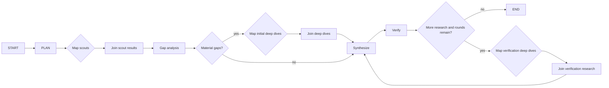

# Graph-backed research orchestration

`research-graph-v1` is the first explicitly versioned research algorithm in this project.

## Topology



The authoritative diagram can be generated from the executable graph:

```bash
research-graph --output research-graph.mmd
```

## State vs dependencies

### `ResearchGraphState`

Small mutable control-plane state:

- `job_id`
- `objective`
- `policy_name`
- `plan`
- `verification_round`
- `max_verification_rounds`
- `phase`

### `ResearchGraphDeps`

Run-scoped services and data-plane handles:

- graph-backed/legacy-compatible loop runtime
- research constraints
- normalized attachment corpus
- append-only evidence ledger
- scout semaphore
- deep-dive semaphore

The distinction is important because mapped graph branches share state. Parallel scout/deep-dive steps do not mutate the ledger or graph state. Their typed outputs are joined first, and a serial step records them afterward.

## Concurrency

`GraphBuilder.map()` expresses **potential parallelism**. `ResearchConfig` remains the authority on **permitted parallelism**:

```text
map scouts
   │
   ├── scout ──┐
   ├── scout ──┤  each waits on scout_semaphore
   └── scout ──┘

max_parallel_scouts = 8
```

The same pattern applies to deep dives with a separate semaphore. A breadth policy can therefore produce 24 research questions without necessarily opening 24 simultaneous model/tool runs.

Every mapped work item carries an explicit ordinal. Joined results are sorted by that ordinal before entering the evidence ledger, so slower/faster providers cannot change evidence ordering merely by finishing in a different order. This preserves the deterministic input-order behavior of the legacy `asyncio.gather` implementation.

## Verification loop semantics

The v4 semantics are preserved:

```text
initial verification
       │
       ├── pass / no followups ──► finish
       │
       └── research requested
                │
         if rounds remain
                │
                ▼
          deep-dive followups
                │
                ▼
            synthesize
                │
                ▼
              verify
```

`max_verification_rounds` limits the number of research-and-resynthesis retries after the first verification.

## Versioning

Topology and model policy are separate experimental dimensions:

```text
research-graph-v1 + quality
research-graph-v1 + breadth
research-graph-v1 + glm-heavy
```

A future critic-loop or multi-team topology should become `research-graph-v2` rather than silently changing `v1`.

That lets Postgres answer questions like:

```text
Was the improvement caused by:
  - a different model?
  - a different role assignment?
  - a different graph topology?
```

## Persistence boundary

Pydantic Graph Builder is used for typed control flow, not durable execution. The graph itself is not treated as a crash-resumable checkpoint store.

Postgres continues to persist:

- job/run identity;
- task attempts;
- effective model configuration;
- structured outputs;
- usage/cost;
- tool calls;
- attachment manifests;
- final report and verification result.

If full in-flight crash recovery later becomes necessary, add a durable execution layer deliberately. Do not infer durability merely because graph nodes and Postgres records exist.

## Parity harness

`LegacyResearchLoop` preserves the v4 plain-async implementation.

`tests/test_parity.py` runs the graph and async implementations with identical deterministic agent behavior and compares:

- decomposed questions;
- all evidence results, order-insensitively;
- escalation attempts;
- final report;
- final verification;
- role/question/attempt call trace.

The synthetic case intentionally exercises a cycle instead of only the happy path.
