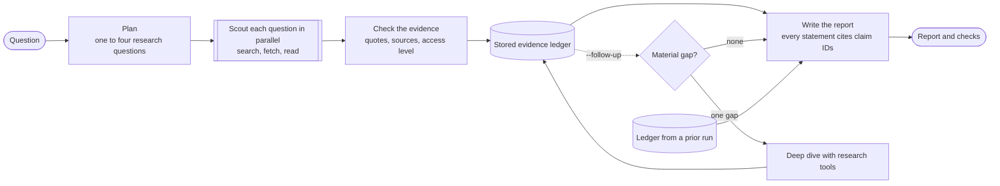

# Research Loop

Research Loop answers a research question with a short report in which every statement cites the evidence behind it. It searches the web and scholarly indexes, reads the pages and papers that matter, and tells you how well each statement is supported: whether its source was read in full, read as an abstract, or only glimpsed in a search result.

It is built on [PydanticAI](https://ai.pydantic.dev). Runs are stored in Postgres and traced in [Logfire](https://logfire.pydantic.dev).

## Setup

You need Python 3.12 or later and Docker for the database.

```bash
make setup && source .venv/bin/activate
cp .env.example .env        # then add your provider keys and LOGFIRE_TOKEN
make postgres-up migrate
research doctor             # checks keys, prices, the database, and the network
research doctor --smoke     # also makes one small paid call per model
```

## Running it

```bash
research scout "Is SWE-bench Verified still a trustworthy measure of coding-agent progress?"
research scout "..." --note "Keep preprints and published papers distinct." --out report/
research scout "Is SWE-bench Verified trustworthy?" --follow-up --study gap-pilot --arm follow-up
research scout --case drb2-task8 --max-usd 5.00 --study drb2-pilot --arm baseline
research scout --case drb2-task68-plus --max-usd 5.00 --follow-up --study drb2-pilot --arm follow-up
research show <run id>      # render a stored run again, as Markdown or --format json
research breakdown <run id> # where its money and time went, call by call, and why each call stopped
research grade <run id> --case drb2-task8 --max-usd 1.00  # expert point rubric (paid)
research assess <run id> --case st07 --max-usd 1.00  # overall quality and source-based fact checks (paid)
research synthesize <run id> --model openai:gpt-6-sol --max-usd 1.00 --study synthesis --arm sol --replicate 1
```

The `scout`, `synthesize`, `grade`, and `assess` commands call paid models. Scout prints its models and limits before it starts. It prints the report when it finishes, and with `--out` it also writes `report.md` and `run.json`. When `DATABASE_URL` is set the run is stored, including every model call's messages. `--study NAME --arm ARM --replicate N` labels a run as part of a study, so runs can be paired later. The dollar amounts in these examples are ceilings, not recommended spending or approval for a study.

The study cases are in `src/research_loop/study_cases.jsonl`. `drb2-task8` and `drb2-task68-plus` preserve the exact English tasks, expert rubrics, and blocked expert-report URLs from the pinned [DeepResearch Bench II](https://github.com/imlrz/DeepResearch-Bench-II) snapshot. `research scout --case` sends only the task to the research agents, applies the blocked URLs as source policy, records the case identity, and requires Postgres and `--max-usd`. It cannot add notes or override blocks. The rubric is supplied later to `research grade`; grading checks the stored task, case digest, notes, and blocked URLs before sending it to the judge. The two cases have 52 and 54 rubric points, respectively.

`research grade` uses the first design's rubric judge, version 2: `gpt-6-sol` at high effort with one verdict per rubric point. The judge prompt and verdict rules remain unchanged. Each grade is stored with its judge and rubric versions, call cost, cap, reservation, and messages, including a grade that failed. `research assess` uses versioned, independently reviewed source summaries in `quality_packets.jsonl` to judge five report-quality dimensions and specific factual targets. It stores dimension reasons, report passages, source IDs, factual verdicts, omissions, full judge messages, and cost in `quality_assessments`. Those source packets currently cover st04 and st07; the expert rubric scores for the new cases are a separate measure of coverage, not an overall quality score. Human review is needed when a model choice turns on a score.

`grade`, `assess`, and `synthesize` require `--max-usd`. Frozen-case Scout runs require it too; ordinary Scout runs may use it. The guarded paths reserve a conservative upper charge before every request and refuse a request that would exceed the command cap. Reservation policy `byte-reserve-v3` uses twice the serialized request bytes plus 16,000 input tokens for framing, and the configured output cap. When a response returns with usage that can be priced, its reservation is replaced by the actual charge. Version 2 kept every reservation, so parallel scouts held most of the cap and synthesis was refused; version 1's four-times-byte estimate falsely refused long scout histories. This includes validation retries and the scouts' timed 429 retries. SDK retries and fallback are disabled; a request that fails, or whose usage cannot be priced, keeps its full reservation. Guarded Scout requests cap planner output at 16,000 tokens, scout output at `RESEARCH_LIMITS__GUARDED_SCOUT_MAX_OUTPUT_TOKENS` (24,000 by default), and synthesis output at `RESEARCH_LIMITS__SYNTHESIS_MAX_OUTPUT_TOKENS` (32,000 by default). The grade judge caps output at 16,000 tokens. Guarded runs record the cap and policy in run configuration and final checks. Run `research db migrate` to add the assessment and grade budget columns before using these commands.

From Python:

```python
from research_loop.scout import scout

run = await scout("How do long-horizon coding agents recover from errors?")
run.status        # complete, partial, or failed
run.report        # title, summary, answer, and the claim IDs behind each statement
run.checks        # how well each statement is supported, what could not be established
run.ledger        # all the evidence, with unique claim IDs such as q2/c3
```

## How a run works



A planner splits the question into one to four research questions. A scout researches each of them at once, with web search, page and PDF fetching, and scholarly search. Each scout returns claims, and each claim carries evidence: a source, a summary, and often an exact quote.

Code then checks every piece of evidence against what the tools actually returned. A quote is verified only if the tools returned those words, and a source is observed only if a tool returned it. Each source also records how much of it the research saw: a search snippet, a scholarly record, an abstract, or the full text. The model cannot set these marks.

With `--follow-up`, a gap analyzer examines the plan and checked ledger after the first scouts. It selects at most one missing piece of evidence that could change the answer. A targeted deep dive uses the same research tools, evidence checks, and per-request budget notes as a scout; its new claims join the ledger under the original question ID. The decision is saved in `checks.gap_analysis`. If analysis fails or the deep dive returns no conclusive evidence, the run is marked partial. This opt-in path is `scout-followup-v1`; ordinary `scout-v1` runs and their prompt fingerprint remain comparable with earlier studies. The mode has not yet been calibrated with paid runs.

A synthesizer writes the report from that evidence, citing claim IDs, with inline citations such as [s3] that name sources. `research synthesize` reads an existing Scout plan and ledger, then uses this same synthesis prompt and validator without planning or retrieval. It records a new child run with the source run ID and ledger digest; its model is set with `--model` and it has the production 90-second synthesis window. A report that cites a claim which does not exist gets one retry. The finished report lists each source with how much of it was read, and it flags statements that rest only on snippets or unverified quotes.

Tool output is treated as untrusted data. The prompts say so, the tools only read public HTTPS sources, and the synthesizer sees only the recorded evidence, never raw pages.

## Limits

A run has a fixed budget, set in `.env` or the environment:

| Limit | Default | Setting |
|---|---|---|
| Total cost | $0.75 | `RESEARCH_LIMITS__COST_USD` |
| Follow-up total cost | $1.25 | `RESEARCH_LIMITS__FOLLOWUP_COST_USD` |
| Gap analysis / deep dive shares | $0.10 / $0.25 | `RESEARCH_LIMITS__GAP_USD`, `...__DEEP_DIVE_USD` |
| Whole run | 6 minutes | `RESEARCH_LIMITS__DEADLINE_SECONDS` |
| Follow-up whole run | 10 minutes | `RESEARCH_LIMITS__FOLLOWUP_DEADLINE_SECONDS` |
| Gap / deep dive windows | 45 / 180 seconds | `RESEARCH_LIMITS__GAP_SECONDS`, `...__DEEP_DIVE_SECONDS` |
| Deep dive calls | 8 requests, 10 useful tool calls, 6 misses | `RESEARCH_LIMITS__DEEP_DIVE_REQUESTS`, `...__DEEP_DIVE_PRODUCTIVE_CALLS`, `...__DEEP_DIVE_MISSES` |
| Research phase | 4.5 minutes | `RESEARCH_LIMITS__RESEARCH_SECONDS` |
| Research questions | 4 | `RESEARCH_LIMITS__MAX_QUESTIONS` |
| Per scout | 12 requests, 16 useful tool calls, 12 failed ones | `RESEARCH_LIMITS__SCOUT_REQUESTS`, `..._PRODUCTIVE_CALLS`, `..._MISSES` |
| Guarded scout output | 24,000 tokens per request | `RESEARCH_LIMITS__GUARDED_SCOUT_MAX_OUTPUT_TOKENS` |

Both time limits count from the start of the run. Planning counts against the research phase and gets at most 90 seconds. The synthesizer gets whatever time is left once research ends, so when a scout runs to the research deadline it has at most 1.5 minutes. Each model request times out after 120 seconds (`RESEARCH_LIMITS__REQUEST_TIMEOUT_SECONDS`). A scout does not retry a request that hits that timeout. The provider client would otherwise send it again twice, and one slow first reply would fill the research window. When a provider returns a token rate limit with an explicit retry time, the scouts share that pause and retry the same request up to twice. An exhausted balance or a 429 without a retry time still fails the call. Scout enables Python fault tracing, so a native parser crash prints its Python call stack to stderr.

The money is divided before the run starts. The planner gets $0.05, the synthesizer $0.40, and the scouts split the rest. In follow-up mode, $0.10 goes to gap analysis and $0.25 is reserved for one deep dive; the first scouts split the remaining $0.45. The deep dive is skipped when gap analysis finds no material gap. Follow-up reserves at least 90 seconds for synthesis. Each call stops before a request that would pass its share, so the total can exceed the cap by at most one request per call; these are soft limits, including in follow-up mode. Each scout is told on every request how much of its budget is left, and loses its tools on its last request, so it returns what it found instead of being cut off. It also loses them when less than one request timeout remains before the research deadline, so that last request can write the claims it has before the deadline discards them.

When something runs out, the run still returns what it can:

- A scout that fails or reaches the deadline leaves its question listed under "Could not establish", along with the searches it made and the pages it read.
- A failed plan means the whole question is researched as one.
- A failed synthesis returns the claims found without a written answer.
- A run that found no evidence at all is `failed`.
- Ctrl-C records the run as `cancelled`.

## Models

Models are configuration, separate from the workflow. The defaults come from the settings study (see `docs/lessons.md`):

| Role | Default | Setting |
|---|---|---|
| Planner | `openai:gpt-6-sol` | `RESEARCH_MODELS__PLANNER` |
| Scouts | `openai:gpt-6-luna` | `RESEARCH_MODELS__SCOUT` |
| Synthesizer | `anthropic:claude-opus-5-5` | `RESEARCH_MODELS__SYNTHESIZER` |
| Fallback after a refusal or provider error | `openai:gpt-6-sol` | `RESEARCH_MODELS__FALLBACK` |

Z.ai GLM models think at their highest effort (`max`), Opus 5.5 at `medium`, and other models at `high`. `RESEARCH_MODELS__SCOUT_EFFORT` sets the scout's level (`low`, `medium`, `high`, or `xhigh`) and leaves the other roles alone. A model without a price is refused at startup, because its cost cannot be capped. `src/research_loop/prices.toml` corrects prices that the bundled price data gets wrong.

## Storage and tracing

Postgres keeps each run: its question, configuration, plan, report, evidence ledger, and checks, plus every model call with its usage, cost, output, messages, why it stopped, and for a scout how long its tools ran. The configuration records the settings each model was actually sent, such as the `reasoning_effort` Z.ai receives. A run also records a digest of its input, how often the research tools' cache served a lookup, and any study labels. Rubric grades and versioned quality assessments are kept in separate tables. Logfire keeps the traces. Each run is one trace, and every span in it carries the run ID; the trace ID is stored on the run's database row.

Traces include prompts and tool results, and they are sent only when `LOGFIRE_TOKEN` is set. Set `RESEARCH_LOGFIRE=false` to turn tracing off. `research db reconcile --older-than 30 --apply` closes out runs that a killed process left running.

## Where things are

| Module in `src/research_loop/` | What it does |
|---|---|
| `scout.py` | The workflow: allocate the budget, plan, scout, check, optionally analyze a gap and deep dive, synthesize |
| `agents.py`, `prompts.py` | The planner, scout, gap analyzer, and synthesizer, their instructions, and output checks |
| `tools.py`, `web.py`, `scholar.py`, `acquisition.py` | Research tools, page and PDF extraction, the public-HTTPS download guard, and the cache |
| `evidence.py`, `schemas.py` | The evidence ledger, the quote and source checks, and the data types |
| `budget_notes.py` | The per-request budget note and tool withdrawal for scouts |
| `config.py`, `models.py`, `prices.py` | Settings, model construction, and price corrections |
| `store.py`, `db.py`, `migrations/` | Run records in Postgres or memory, and the schema |
| `render.py`, `cli.py`, `doctor.py`, `telemetry.py` | Reports, the `research` command, setup checks, and Logfire |
| `breakdown.py`, `evals.py`, `quality.py`, `study_cases.jsonl`, `quality_packets.jsonl` | Cost and time breakdown, the historical rubric, and source-grounded quality assessment |

Tests run offline with `make test`. They refuse model-provider requests and any non-loopback network connection. `make lint` runs Ruff. The first design of this project (a six-role graph, benchmarks, and long-horizon studies) is kept at git tag `archive/pre-scout-2026-09`, and `docs/lessons.md` records what it taught.

## License

MIT. See [LICENSE](LICENSE). [CONTRIBUTING.md](CONTRIBUTING.md) explains how to send a pull request, and [AGENTS.md](AGENTS.md) gives the rules for changing the code.
