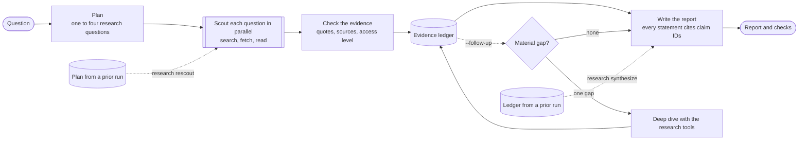

# Research Loop

Research Loop answers a research question with a short report in which every statement cites the evidence behind it. It splits the question into a few research questions, researches them in parallel with web search, page and PDF reading, and scholarly search, and then writes a report from the evidence it found. Code checks that evidence before the report is written: a quote counts as verified only if the research tools actually returned those words, and each source records whether the research read it in full, read its abstract, or only saw it in a search result. The report tells you which statements rest on thin evidence and which questions it could not answer.

The workflow is called Scout. A normal run costs about $0.25 and takes two to five minutes. Every run has a fixed dollar budget and deadline, and each model call is stored with its messages, usage, and cost so that a run can be examined, re-checked, or compared with others afterwards.

Research Loop is built on [PydanticAI](https://ai.pydantic.dev). Runs are stored in Postgres and traced in [Logfire](https://logfire.pydantic.dev).

## What you need

- Python 3.12 or later.
- Docker, for the local Postgres database. Research Loop runs without a database, but then nothing is stored and the study commands are unavailable.
- An API key for each model provider you use. The default models need an OpenAI key and an Anthropic key. Z.ai and Google keys are optional.
- A Logfire token, if you want traces. Without one, tracing stays in the process.

## Install

```bash
make setup && source .venv/bin/activate
cp .env.example .env
make postgres-up migrate
```

`make setup` creates `.venv` and installs the pinned dependencies from `requirements.lock`, then the project itself, which provides the `research` command. `make postgres-up` starts Postgres 16 in Docker on 127.0.0.1:5432 and waits until it is healthy, and `make migrate` applies the schema. Stop the database with `make postgres-down`; its data stays in a Docker volume.

## Configure

Settings come from `.env` or the environment, and exported variables override the file. `.env.example` lists every setting with a comment. The ones most people set are these:

| Setting | What it does |
|---|---|
| `DATABASE_URL` | The Postgres database runs are stored in. The value in `.env.example` matches `make postgres-up`. |
| `OPENAI_API_KEY`, `ANTHROPIC_API_KEY`, `ZAI_API_KEY`, `GOOGLE_API_KEY` | Provider keys. A provider is enabled when its key is set. |
| `RESEARCH_ENABLED_PROVIDERS` | Allow only these providers, comma-separated, even if other keys are set. |
| `LOGFIRE_TOKEN` | Send traces to Logfire. `RESEARCH_LOGFIRE=false` turns tracing off completely. |
| `RESEARCH_MODELS__PLANNER`, `__SCOUT`, `__SYNTHESIZER`, `__FALLBACK` | The model for each role, as `provider:model`. See [Models](#models). |
| `RESEARCH_MODELS__SCOUT_EFFORT` | The scouts' reasoning effort: `low`, `medium`, `high`, or `xhigh`. |
| `RESEARCH_LIMITS__...` | A run's dollar, time, and call limits. See [Limits and budgets](#limits-and-budgets). |
| `RESEARCH_TOKENS_PER_MINUTE` | Provider token rate limits that scouts are paced under, as JSON. See [Rate limits](#rate-limits). |
| `RESEARCH_CACHE_MODE`, `RESEARCH_CACHE_DIR` | The research tools' cache. See [The research cache](#the-research-cache). |
| `OPENALEX_API_KEY`, `CROSSREF_MAILTO` | Optional identification for the scholarly indexes. |

Nested settings use a double underscore, so the scout model is `RESEARCH_MODELS__SCOUT` and the cost limit is `RESEARCH_LIMITS__COST_USD`. Never commit `.env`; it is ignored by git.

## Check the setup

```bash
research doctor           # keys, prices, the database, Logfire, the cache, and DNS for the research hosts
research doctor --smoke   # also makes one small paid call to each configured model
```

`research doctor` prints one line per check, marked `OK`, `WARN`, or `FAIL`, and exits non-zero if anything failed. It fails when a configured model has no key, when its provider is not enabled, or when it has no price, because a model without a price cannot have its cost capped. `--smoke` sends each model a tiny request that must answer with a tool call. It costs well under a cent and is the quickest way to find out that a key is wrong or a model ID is stale before a paid run.

## Run a research question

```bash
research scout "Is SWE-bench Verified still a trustworthy measure of coding-agent progress?"
research scout "..." --note "Keep preprints and published papers distinct." --out report/
research scout "..." --block https://example.org/paywalled-review --max-usd 1.00
research scout "..." --follow-up
```

Scout prints its models and limits before it starts, then prints the report as Markdown when it finishes. With `--out DIR` it also writes `report.md` and `run.json`, the full run record, into that directory. When `DATABASE_URL` is set the run is stored, and the last line gives its run ID for the commands below.

`--note` adds a requirement that every role follows, and can be repeated. `--block URL` names a source that no tool may fetch and no evidence may cite, and can also be repeated. `--max-usd` sets a hard ceiling that is checked before every model request (see [Hard caps](#hard-caps)). `--follow-up` adds a gap analysis and one targeted deep dive before the report is written. `--no-persist` keeps the run in memory even when a database is configured.

A run ends in one of four states. It is `complete` when every research question returned evidence and the report cites only claims that exist. It is `partial` when the report was written but something is missing: a research question returned no evidence, a citation was wrong, or a follow-up left its gap open. If the synthesis itself did not finish, the report lists the claims found without a written answer, and the run is also `partial`. A run that found no evidence at all is `failed`. Pressing Ctrl-C records the run as `cancelled`.

### Reading the report

A report has these sections, in this order. Sections with nothing to say are left out.

| Section | What it holds |
|---|---|
| Needs review | Every reason code flagged the run, such as statements that rest only on search snippets, or questions that returned no evidence. |
| Gap follow-up | In follow-up mode, which gap was chosen and why, and what the deep dive found. |
| Summary and Answer | The written report. Each statement carries inline citations such as [s3], which name sources. |
| Caveats | Limits the synthesizer found in the evidence. |
| Statements resting on thin evidence | Statements whose only support is a search snippet, a record's metadata, an unverified quote, or a source no tool returned. |
| Could not establish | Research questions that returned no evidence, with the reason each one stopped. |
| Sources | Every cited source with its ID, title, publisher, date, and how much of it was read. |
| Sources that could not be read | Pages and records the tools tried and failed to fetch, with the reason. |

### Commands after a run

```bash
research show <run id>              # render a stored run again as Markdown, or --format json
research breakdown <run id>         # where the money and time went, call by call, and why each call stopped
research db status                  # which migrations are applied
research db reconcile --older-than 30 --apply   # close out runs that a killed process left running
```

`research breakdown` is the first thing to look at when a run is slow, expensive, or partial. It lists every model call with its start time, duration, time spent in tools, request count, tokens, cost, and the reason it stopped, followed by the cost by role, the phases of the run, and how often the cache served a lookup.

## How a run works



A run has three steps, and each one is bounded in money and time.

First, a planner splits the question into one to four research questions. If planning fails or takes longer than 90 seconds, the whole question is researched as one.

Second, a scout researches each question at the same time. A scout is a model with four research tools: web search, a fetcher that reads HTML pages and PDFs over public HTTPS, a scholarly search over OpenAlex and arXiv, and a lookup of one scholarly record by DOI, OpenAlex ID, or arXiv ID, which also draws on Crossref. It returns claims, and each claim carries evidence: a source, a summary of what the source says, and usually an exact quote. Each scout is told on every request how much of its budget is left. When its budget is spent, or when less than one request timeout remains before the research deadline, it loses its tools and is told to write up what it has, so that it returns a result instead of being cut off. A scout that fails or is still running at the deadline leaves its question unanswered but keeps the searches it made and the pages it read.

Code then checks every piece of evidence against what the tools actually returned in that scout's call. The checked claims go into the evidence ledger, where each has a unique ID such as `q2/c3`.

Third, a synthesizer writes the report from the ledger. It sees only the checked evidence, never raw pages. Each statement in the report names the claim IDs behind it, and a report that cites a claim that does not exist gets one retry. If the synthesis cannot finish, the run returns the ledger's claims without a written answer.

With `--follow-up`, a gap analyzer reads the plan and the checked ledger after the scouts finish. It picks at most one missing piece of evidence that could change the answer, and a deep dive researches it with the same tools, checks, and budget notes as a scout. The deep dive's claims join the ledger under the original question. The gap analyzer's decision is saved with the run, and the run is marked `partial` if the analysis failed or the deep dive did not settle the gap. Follow-up mode has its own, larger budget and deadline.

Tool output is treated as untrusted data. The prompts say so, the fetcher only reads public HTTPS addresses and refuses private and loopback hosts, and blocked URLs are refused by every tool and rejected as evidence.

### Evidence and what the checks mean

Each piece of evidence gets marks that only code can set.

A quote is `verified` when the tools returned those words in that call, ignoring differences in case, spacing, and punctuation. Otherwise it is `not_found`.

A source is `observed` when a tool returned it in that call. A source that no tool returned, such as one the model cited from memory, is `not_found`.

The access level says how much of the source the research saw. It is `full_text` for a page or PDF that was read, `abstract` for a paper's abstract from a scholarly index, `metadata` for a scholarly record without an abstract, and `snippet` for a search result.

From these marks, each statement in the report gets a support level. It is `read` when at least one supporting item comes from a source read in full or as an abstract, and its quote, if it has one, was not `not_found`. It is `shallow` when the only support is a snippet, metadata, an unverified quote, or a source no tool returned. It is `unsupported` when no evidence supports it. Shallow and unsupported statements are listed under "Needs review" and "Statements resting on thin evidence".

## Limits and budgets

Every run has a fixed budget. The defaults are these:

| Limit | Default | Setting |
|---|---|---|
| Total cost | $0.75 | `RESEARCH_LIMITS__COST_USD` |
| Planner's share | $0.05 | `RESEARCH_LIMITS__PLANNER_USD` |
| Synthesizer's share | $0.40 | `RESEARCH_LIMITS__SYNTHESIS_USD` |
| Whole run | 6 minutes | `RESEARCH_LIMITS__DEADLINE_SECONDS` |
| Research phase | 4.5 minutes | `RESEARCH_LIMITS__RESEARCH_SECONDS` |
| One model request | 120 seconds | `RESEARCH_LIMITS__REQUEST_TIMEOUT_SECONDS` |
| Research questions | 4 | `RESEARCH_LIMITS__MAX_QUESTIONS` |
| Scouts at once | 4 | `RESEARCH_LIMITS__PARALLEL_SCOUTS` |
| Per scout | 12 requests, 16 useful tool calls, 12 failed ones | `RESEARCH_LIMITS__SCOUT_REQUESTS`, `..._PRODUCTIVE_CALLS`, `..._MISSES` |
| Follow-up total cost | $1.25 | `RESEARCH_LIMITS__FOLLOWUP_COST_USD` |
| Follow-up gap analysis and deep dive shares | $0.10 and $0.25 | `RESEARCH_LIMITS__GAP_USD`, `RESEARCH_LIMITS__DEEP_DIVE_USD` |
| Follow-up whole run | 10 minutes | `RESEARCH_LIMITS__FOLLOWUP_DEADLINE_SECONDS` |
| Follow-up gap analysis and deep dive windows | 45 and 180 seconds | `RESEARCH_LIMITS__GAP_SECONDS`, `RESEARCH_LIMITS__DEEP_DIVE_SECONDS` |
| Deep dive calls | 8 requests, 10 useful tool calls, 6 failed ones | `RESEARCH_LIMITS__DEEP_DIVE_REQUESTS`, `..._PRODUCTIVE_CALLS`, `..._MISSES` |

The money is divided before the run starts. The planner and synthesizer get their shares and the scouts split the rest evenly, so four scouts get $0.075 each. In follow-up mode, the gap analysis and deep dive shares come off the top as well. Each call stops before a request that would take it past its share, which means the total can exceed the limit by at most one request per call. These are soft limits; for a hard ceiling, use `--max-usd`.

A useful tool call is a search that found something, a fetch that returned text, or a scholarly call that returned works. A failed one is an empty search, an HTTP error, or a blocked address. Counting them apart lets a scout that is only failing stop early without cutting short one that is working. The framework's own limit on tool calls sits 12 above the sum, so that a batch of parallel calls asked for just before the budget ran out can still run. A turn that asks for more tool calls than that limit leaves runs only the calls that fit, and the next request tells the model how many were dropped.

Both time limits count from the start of the run. Planning counts against the research phase, and the synthesizer gets whatever time is left once research ends, which is at least 1.5 minutes. A scout's request that reaches the 120-second timeout is not sent again, because one slow reply retried twice would fill the research window.

### Hard caps

`--max-usd` puts a hard dollar ceiling on a run or command. Before every model request, the guard reserves a conservative upper bound on what that request could cost and refuses the request if the reservations would pass the ceiling. When a response returns with usage that can be priced, its reservation is replaced by its actual charge. A request that fails keeps its full reservation, because the provider may still have charged for it. A request rejected with a 429 rate-limit error is the exception, because the provider did not process it.

The upper bound on a request's input starts from the last reply in its history: that reply's billed input and output tokens, plus one token per byte of everything added since, plus 4,000 tokens of framing. A first request, which has no reply to start from, is bounded by twice its size in bytes plus 16,000 tokens. The output bound is the call's output cap: 16,000 tokens for the planner and the grading judge, `RESEARCH_LIMITS__GUARDED_SCOUT_MAX_OUTPUT_TOKENS` (24,000) for scouts, and `RESEARCH_LIMITS__SYNTHESIS_MAX_OUTPUT_TOKENS` (32,000) for synthesis. Guarded runs disable the provider SDK's retries and the fallback model, so that nothing is sent without a reservation. The reservation policy is recorded with the run as `usage-anchor-v4`; earlier versions are described in `src/research_loop/study_budget.py`.

`--max-usd` is required for frozen study cases and for `grade`, `assess`, `synthesize`, and `rescout`. It is optional for ordinary runs.

### Rate limits

When a provider rejects a scout's request with a token rate limit and says when to retry, all of the run's scouts pause for that long, and the request is sent again up to twice. A 429 that gives no retry time, or that reports an exhausted balance, fails the call.

Retrying is not enough when parallel scouts regularly send more than the limit allows, so scouts on a model listed in `RESEARCH_TOKENS_PER_MINUTE` are also paced. Before each request, the run waits until the tokens its scouts sent that model in the last minute, plus an estimate for this request, fit under 90% of the limit. The estimate starts from the previous reply's billed tokens and counts four bytes a token for what was added since; the billed count replaces it when the reply returns. The default is `{"openai:gpt-6-luna": 200000}`, the OpenAI tier this project runs on, which four unpaced Luna scouts overran. Set the limit for your own account's tier, or `'{}'` to turn pacing off.

Pacing is per run, so two runs at once against the same account can still reach the limit. Time spent waiting counts against the research window, so a tight limit makes runs slower rather than failing them.

### The research cache

Searches, fetched pages, and scholarly records are cached under `.cache/research-loop` so that repeated lookups within a day are free and fast. `RESEARCH_CACHE_MODE` controls it. `live`, the default, reads entries up to a day old and writes new ones. `record` only writes. `replay` reads entries of any age and never goes to the network, so a miss is an error; it makes a run's research reproducible. `reuse` reads entries of any age and fetches and records any miss. `off` neither reads nor writes. A run records how many lookups the cache served, by provider.

## Models

Models are configuration, separate from the workflow. The defaults come from the settings study described in `docs/lessons.md`, and the scout model was chosen in the comparison in `docs/high-level-study-evaluation.md`.

| Role | Default | Setting |
|---|---|---|
| Planner and gap analyzer | `openai:gpt-6-sol` | `RESEARCH_MODELS__PLANNER` |
| Scouts and deep dive | `openai:gpt-6-luna` | `RESEARCH_MODELS__SCOUT` |
| Synthesizer | `anthropic:claude-opus-5-5` | `RESEARCH_MODELS__SYNTHESIZER` |
| Fallback after a refusal or provider error | `openai:gpt-6-sol` | `RESEARCH_MODELS__FALLBACK` |

A model is named as `provider:model`, where the provider is `openai`, `anthropic`, `zai`, or `google`. Z.ai GLM models think at their highest effort, Opus 5.5 at `medium`, and other models at `high`. `RESEARCH_MODELS__SCOUT_EFFORT` changes the scouts' level without touching the other roles. The planner and synthesizer switch to the fallback model when their own model refuses a call or its provider fails; scouts have no fallback, since a failed scout leaves one question unanswered rather than failing the run.

A model is refused at startup if it has no price, because its cost could not be capped. `src/research_loop/prices.toml` adds or corrects prices that the bundled price data lacks or gets wrong. Model IDs change often, so run `research doctor --smoke` after changing a model.

## Studies and evaluation

Research Loop includes the tools used to choose its own configuration: labeled runs, frozen benchmark cases, a rubric judge, a source-grounded quality judge, and commands that repeat one part of a stored run with a different model.

```bash
research scout --case drb2-task8 --max-usd 3.00 --study drb2-pilot --arm baseline --replicate 1
research grade <run id> --case drb2-task8 --max-usd 1.00
research assess <run id> --case st07 --max-usd 1.00
research synthesize <run id> --model openai:gpt-6-sol --max-usd 1.00 --study synthesis --arm sol --replicate 1
research rescout <run id> --model zai:glm-5.3-flash --max-usd 3.00 --study scouts --arm flash --replicate 1
```

`--study NAME --arm ARM --replicate N` labels a run as one repetition of one arm of a study, so that runs can be paired and compared later. Every run also records a digest of its input, its prompt fingerprint, its git commit, and the settings each model was actually sent.

The study cases are in `src/research_loop/study_cases.jsonl`. `drb2-task8` (52 rubric points) and `drb2-task68-plus` (54 points) keep the exact English tasks, expert rubrics, and blocked expert-report URLs from a pinned snapshot of [DeepResearch Bench II](https://github.com/imlrz/DeepResearch-Bench-II). `research scout --case` sends only the task to the research agents, blocks the expert reports as sources, records the case's identity, and requires a database and `--max-usd`. It cannot add notes or change the blocked URLs.

`research grade` scores a stored report against a case's rubric with a judge (`gpt-6-sol` at high effort, judge version 2) that gives one verdict per rubric point. It checks that the stored run was made for that frozen case before sending anything. `research assess` judges a report's overall quality and specific facts against independently reviewed source summaries in `src/research_loop/quality_packets.jsonl`, which currently cover the st04 and st07 cases. Grades and assessments are stored in their own tables with the judge's version, cost, and messages. Rubric scores measure coverage of what an expert report included, not overall quality, and a model choice that turns on a score should get a human review.

`research synthesize` writes a new report from a stored run's ledger with the model given by `--model`, using the production synthesis prompt, checks, and time window, without planning or research. `research rescout` researches a stored run's plan again with the scout model given by `--model` and stops before synthesis, using the production scout prompt, tools, checks, and research window. Each records a new run that points at its source, with a digest of the fixed ledger or plan, and each carries a frozen case's identity forward so that the result can be graded. A rescout gets the whole research window, while its source's scouts shared it with planning, so compare rescouts with each other rather than with their source.

Paid experiments should be designed to reach a decision. Run-to-run variation on the frozen cases is several rubric points, so a comparison of one run per arm cannot separate small differences from noise. The study records in `docs/` show the numbers so far.

## Using it from Python

```python
from research_loop.scout import scout

run = await scout(
    "How do long-horizon coding agents recover from errors?",
    notes=["Prefer peer-reviewed sources."],
    blocked_urls=["https://example.org/paywalled"],
)
run.status      # "complete", "partial", or "failed"
run.report      # title, summary, answer, caveats, and the claim IDs behind each statement
run.checks      # support for each statement, questions not established, sources not reached, review reasons
run.ledger      # every piece of evidence, by research question, with claim IDs such as q2/c3
run.cost_usd    # the run's cost
run.to_record() # the run as JSON, the same record `--out` writes to run.json
```

`scout` reads settings from the environment unless you pass `settings=`. A cancelled run is recorded as `cancelled` and the cancellation is raised. Without `store=`, the run is kept in memory. It raises `ConfigError` before any call when a configured model cannot run or cannot be priced. `follow_up=True` turns on the gap follow-up, and `budget=StudyBudget(Decimal("1.00"))` from `research_loop.study_budget` sets a hard cap.

## Storage and tracing

Postgres keeps each run: its question, configuration, plan, report, evidence ledger, and checks, plus every model call with its usage, cost, output, full messages, why it stopped, and, for a scout, how long its tools ran. Rubric grades and quality assessments are kept in separate tables. `research db migrate` applies the schema in `src/research_loop/migrations/`.

Each run is one Logfire trace, and every span in it carries the run ID; the trace ID is stored on the run's database row. Traces include prompts and tool results. They are sent only when `LOGFIRE_TOKEN` is set.

## Troubleshooting

A run refuses to start with "Cannot run". A configured model has no key, its provider is not enabled, or it has no price. The message names the model; `research doctor` shows the same problems.

A scout's question fails with "provider error ModelHTTPError 429". If the message mentions tokens per minute, the account's rate limit was reached; check that `RESEARCH_TOKENS_PER_MINUTE` matches your tier. If it mentions balance or quota, the account is out of credit, and `research doctor --smoke` will fail the same way.

A call fails with "study budget refused". The `--max-usd` ceiling would have been passed by the next request's conservative reservation. `research breakdown` shows what the run spent; the reservation that was refused is in the call's stop reason.

The synthesizer fails with an HTTP 400 from Anthropic before writing anything. Check that the Anthropic key is scoped to a workspace; an unscoped key is rejected.

A question is cut off with "network error SSLError" or a similar reason. A network error ended that one call. The rest of the run continues, and the question is listed under "Could not establish".

Runs stay `running` in the database after a process was killed. Run `research db reconcile --older-than 30` to count them, and add `--apply` to mark them failed.

A native crash prints a Python stack to stderr and exits with code 139. Scout enables fault tracing so that the stack shows where it happened; the page and search parsers use a native HTML library.

## Development

```bash
make setup   # create .venv from requirements.lock
make test    # the test suite, offline
make lint    # ruff
make lock    # re-pin requirements.lock after changing pyproject.toml
make skills  # repair the agent skill links after upgrading a package that bundles skills
```

The tests never reach a model provider or the internet. `tests/conftest.py` refuses provider requests and any connection to a non-loopback host, so tests script models with PydanticAI's `FunctionModel` and serve pages with the `serve` and `public_urls` fixtures. The Postgres tests in `tests/test_store.py` run only when `RESEARCH_TEST_DATABASE_URL` names a database whose name contains `test`. CI runs lint, the full suite against Postgres, a lockfile check, and a wheel install on every pull request.

[CONTRIBUTING.md](CONTRIBUTING.md) explains how to send a pull request, and [AGENTS.md](AGENTS.md) sets out the rules for changing the code. Any change to text a model sees counts as a behavior change.

## Where things are

| Module in `src/research_loop/` | What it does |
|---|---|
| `scout.py` | The workflow: allocate the budget, plan, scout, check, optionally analyze a gap and dive, synthesize; also fixed-ledger synthesis and fixed-plan rescouts |
| `agents.py`, `prompts.py` | The planner, scout, gap analyzer, and synthesizer agents, their instructions, and their output checks |
| `tools.py`, `web.py`, `scholar.py`, `acquisition.py` | The research tools, page and PDF extraction, the public-HTTPS fetch guard, and the cache |
| `evidence.py`, `schemas.py` | The evidence ledger, the quote and source checks, and the data types |
| `budget_notes.py` | The scouts' per-request budget notes, tool withdrawal, and tool-batch trimming |
| `rate_limit.py`, `study_budget.py` | Rate-limit retries and pacing, and the hard-cap reservation guard |
| `config.py`, `models.py`, `prices.py`, `prices.toml` | Settings, model construction, and price corrections |
| `store.py`, `db.py`, `migrations/` | Run records in Postgres or memory, and the schema |
| `render.py`, `cli.py`, `doctor.py`, `telemetry.py`, `breakdown.py` | Reports, the `research` command, setup checks, Logfire, and cost and time breakdowns |
| `evals.py`, `quality.py`, `study_cases.jsonl`, `quality_packets.jsonl` | The rubric judge, the quality judge, and their cases |

The `docs/` folder holds the project's records. `lessons.md` records what the first design taught. `quality-calibration.md` and `high-level-study-evaluation.md` record the evaluator calibration and every graded study run with its run IDs and costs. `scout-study-briefing.md` and `scout-study-design.md` are the briefing and proposed design for the first Scout study.

The first design of this project, a six-role graph with benchmark adapters and long-horizon studies, is kept at the git tag `archive/pre-scout-2026-09`.

## License

MIT. See [LICENSE](LICENSE).
