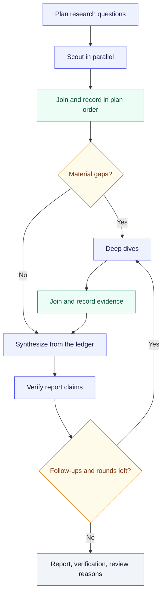
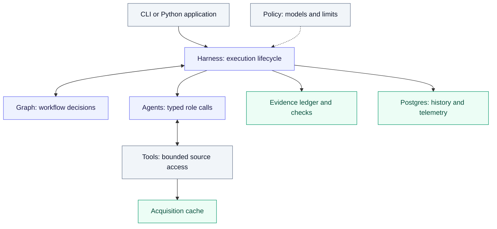
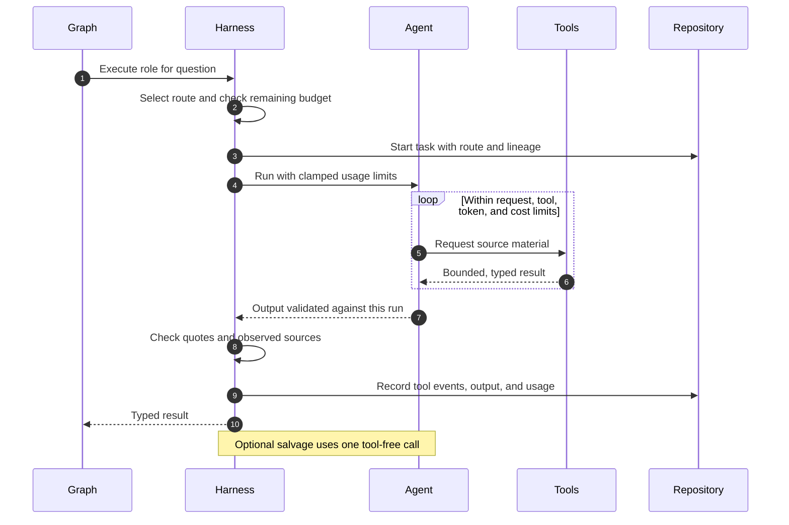
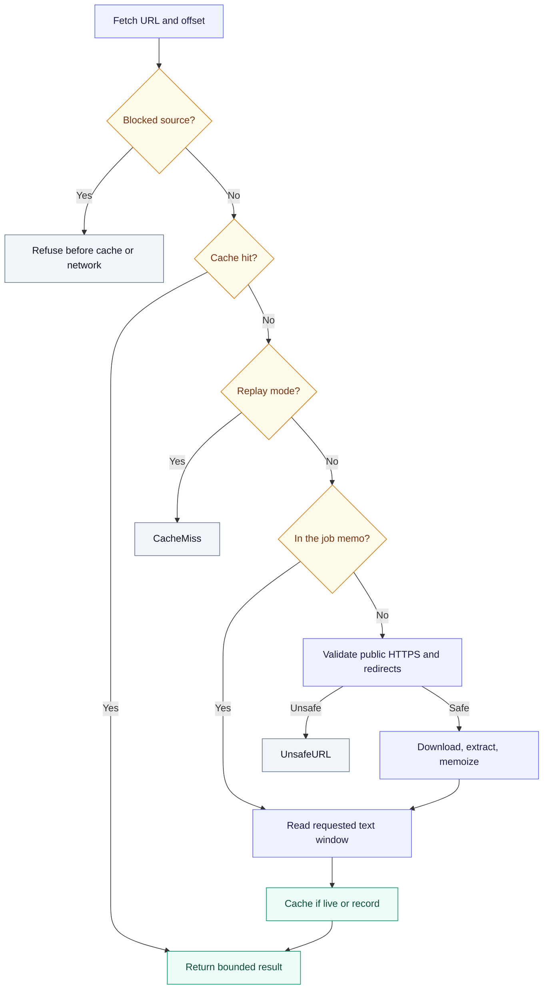
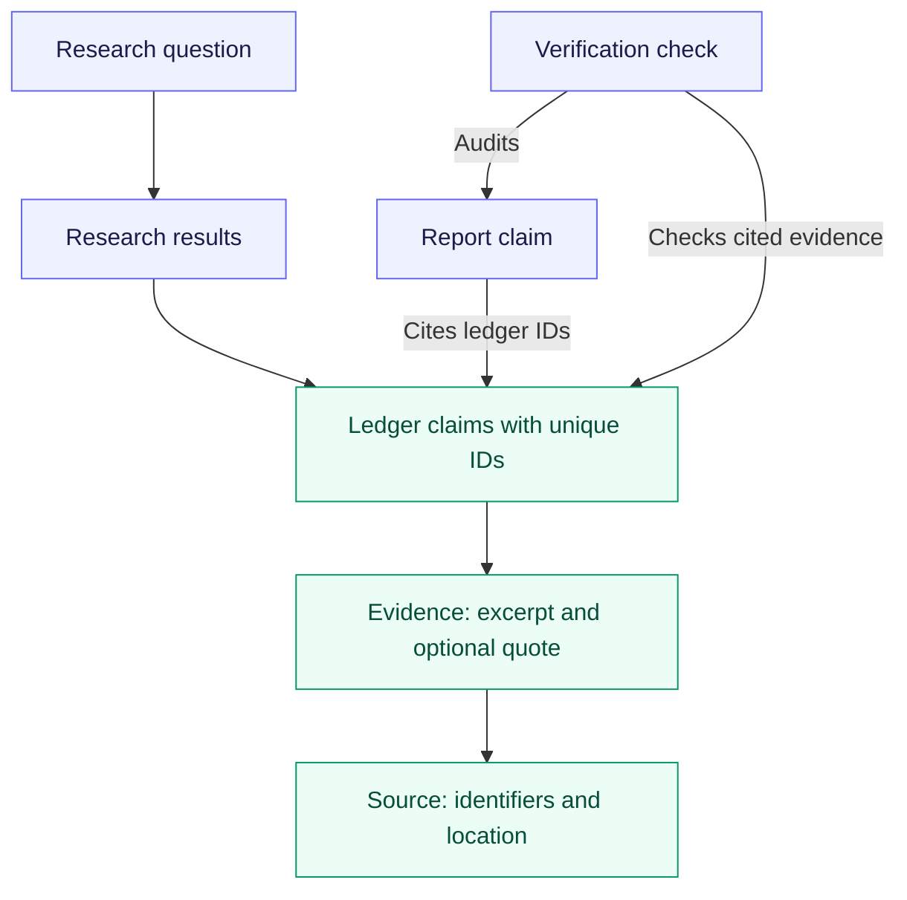
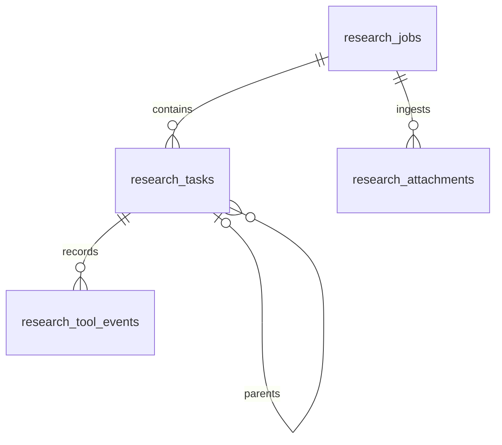
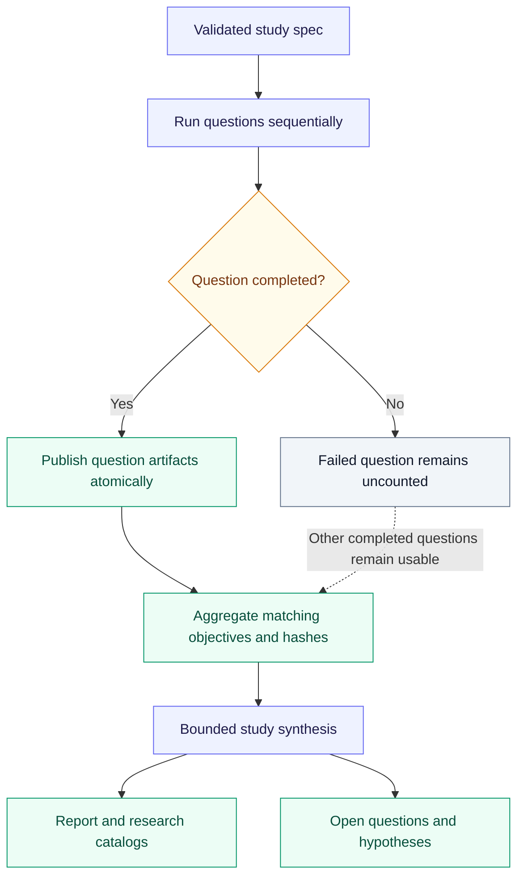
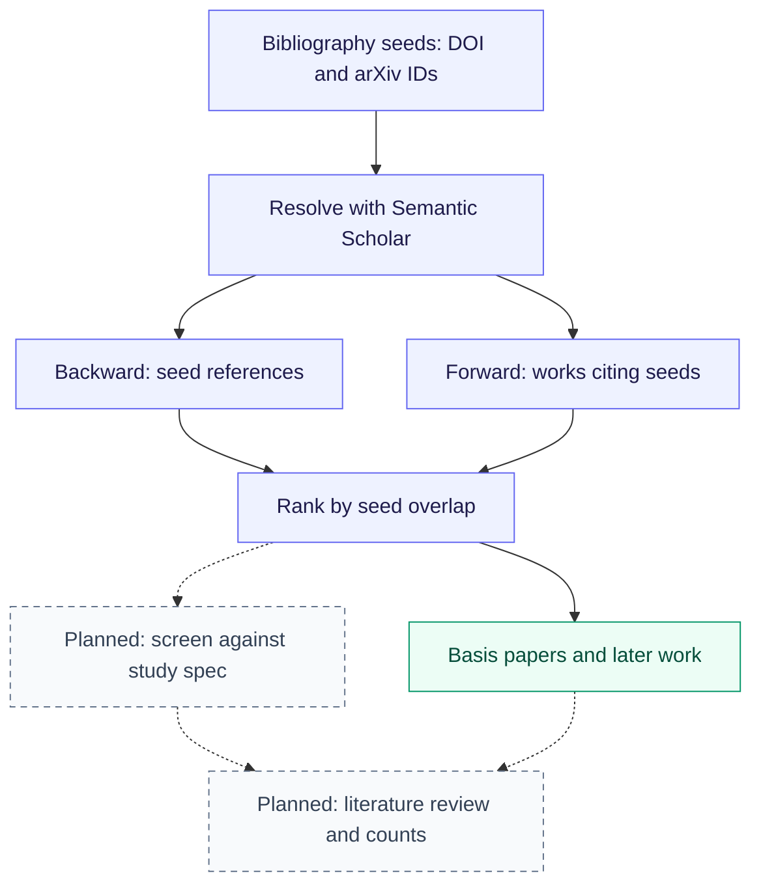

<div align="center">

# Research Loop

### Research you can trace from question to claim.

Evidence-first orchestration with PydanticAI, a versioned research graph,
and a ledger that connects each report claim to its sources.

**Typed agents** · **Bounded research** · **Auditable evidence**

[Get started](#get-started) · [Follow a run](#how-a-run-works) · [Understand the architecture](#architecture) · [Run a study](#long-horizon-studies)

</div>

---

A planner breaks an objective into research questions. Scouts and deep dives investigate them using web, scholarly, and attachment tools. A synthesizer builds a report from their recorded claims, and a verifier audits the result claim by claim. Code checks quotations and source identifiers against the material the tools actually returned.

The workflow is explicit and versioned as `research-graph-v1`. Model assignments and budgets are configuration. Optional Postgres persistence records history and telemetry; benchmark adapters and long-horizon studies run the same loop under recorded conditions.

> **What makes a result inspectable?** A report comes with its evidence ledger, verification findings, and unresolved `review_reasons`. Completing a run does not, by itself, establish that its conclusions are sound.

## Find your way

- **Use it:** [Get started](#get-started) · [Python integration](#python-integration) · [Commands and operations](#commands-and-operations)
- **Understand it:** [Research workflow](#how-a-run-works) · [Architecture](#architecture) · [Evidence and provenance](#evidence-and-provenance)
- **Control it:** [Models and budgets](#models-and-budgets) · [Sources and retrieval](#sources-and-retrieval) · [Storage](#storage-and-observability)
- **Evaluate it:** [Quality and reproducibility](#quality-and-reproducibility) · [Long-horizon studies](#long-horizon-studies) · [Literature review roadmap](#literature-review-roadmap)
- **Develop it:** [Scope](#scope-and-next-steps) · [Repository guide](#repository-guide) · [Documentation](#documentation)

## Get started

```bash
make setup                                    # .venv with every extra
source .venv/bin/activate
pytest -q                                     # offline: no model or network calls
research-diagnose                             # local readiness; safe without API keys
research-bench examples/benchmark_cases.json  # synthetic run of the real graph
```

The diagnostics, tests, and synthetic benchmark above make no paid model calls. Setup installs dependencies and may use the network. CI runs `ruff check .` and `pytest -q` on every push and pull request. The `synthetic` policy runs the real graph and repository with scripted role outputs, which checks the wiring without provider calls. Postgres, provider keys, and the first paid run are covered in [docs/setup.md](docs/setup.md).

## Python integration

```python
# Inside an async application; reuse its pool, session, and run.
from research_loop import (
    AttachmentMode,
    ResearchConfig,
    ResearchConstraints,
    ResearchLoop,
    ResearchToolMode,
    get_policy,
)
from research_loop.repository import PostgresResearchRepository

loop = ResearchLoop(
    get_policy("quality"),
    ResearchConfig(
        tool_mode=ResearchToolMode.NORMALIZED,
        attachment_mode=AttachmentMode.NORMALIZED,
    ),
    repository=PostgresResearchRepository(existing_async_psycopg_pool),
)

outcome = await loop.run(
    "Compare the claims in the attached report with current primary sources.",
    session_id=session.id,
    root_run_id=run.id,
    constraints=ResearchConstraints(attachment_paths=["/local/path/report.pdf"]),
)
print(outcome.report.answer)
```

`outcome` carries the plan, report, verification, evidence ledger, attachment corpus, the job's spend, and `review_reasons`. The model never sees host file paths; attachments are exposed through stable IDs and normalized tools. `examples/run_research.py` runs one objective from the command line: offline with the synthetic policy by default, or with a real policy given `--paid`. `LegacyResearchLoop` takes the same arguments.

## How a run works



The graph alternates evidence collection with explicit decisions about what to investigate next:

1. **Plan.** The planner turns the objective into a `ResearchPlan`: research questions with a priority, an expected difficulty, and flags for primary sources or image input.
2. **Scout, in parallel.** Every question gets a scout. The graph maps the plan into one branch per question, and a semaphore limits how many run at once.
3. **Join and record.** The join waits for every branch. A serial step then appends the results to the evidence ledger **in plan order**, however the branches finished.
4. **Analyze gaps.** The gap analyst names material gaps: low confidence, a missing primary source, a contradiction, missing evidence, or a need for images. Any question whose best result is below `min_scout_confidence` gets a gap as well. The most severe gap per question, up to `max_deep_dives_per_round`, gets a **deep dive**, again in parallel, joined and recorded the same way.
5. **Synthesize.** The synthesizer writes a `FinalReport` from a compact view of the whole ledger. Every report claim must cite ledger claim IDs such as `q2/c1`.
6. **Verify.** The verifier checks each report claim against the cited evidence (supported or not, and how severe the problem is) and may ask for follow-up research.
7. **Loop or finish.** If it asks and rounds remain (`max_verification_rounds`), the follow-ups get deep dives, which may use the policy's alternate deep-dive model, and steps 5–6 repeat. Otherwise the run ends with its report, its verification, and `review_reasons`: what it left unresolved.

### Parallel work, deterministic evidence

Branches may finish in any order. The ledger is updated serially, in the order established by the plan. The diagram illustrates three workers; the actual concurrency comes from configuration.

```mermaid
flowchart TD
    P["Questions in plan order"] --> L["Semaphore limits active workers"]
    L --> A["Scout A"]
    L --> B["Scout B"]
    L --> C["Scout C"]
    A --> J["Join all results"]
    B --> J
    C --> J
    J --> R["Sort by plan position"]
    R --> E["Append to evidence ledger"]

    classDef action fill:#eef2ff,stroke:#6366f1,color:#1e1b4b
    classDef evidence fill:#ecfdf5,stroke:#059669,color:#064e3b
    classDef decision fill:#fffbeb,stroke:#d97706,color:#78350f
    classDef terminal fill:#f1f5f9,stroke:#64748b,color:#0f172a
    class A,B,C action
    class J,R,E evidence
    class P,L terminal
```

Workers never write shared state. Each branch returns a typed `ResearchResult` tagged with its position in the plan. The join only collects them, and the record step sorts them and appends to the ledger. A faster provider cannot reorder evidence, and two branches cannot race on the ledger.

## Architecture

The graph decides which step runs next. The harness executes that step under the configured limits. Agents produce typed results, and tools supply bounded source material. This separation keeps workflow changes distinct from model, retrieval, and storage changes.



| Owner | Responsibility | Code |
|---|---|---|
| PydanticAI `Agent` | Model and tool semantics: prompts, output types, validators, tool loops | `agents.py`, `tools.py` |
| Pydantic Graph | Workflow topology only | `graph.py` |
| `ResearchLoop` run (the harness) | One execution's lifecycle: job record, spend, fetch memo, deadline, terminal state | `async_orchestrator.py`, `orchestrator.py` |
| `ModelPolicy` | Model selection and budgets | `policy.py` |
| `EvidenceLedger` | Evidence gathered during a run | `ledger.py` |
| Postgres | Durable history and telemetry | `repository.py`, `migrations/` |
| CLI | Presentation | `benchmark.py`, `long_horizon.py`, `diagnose.py`, `db.py`, `graph_cli.py` |

### Agents and typed contracts

Six PydanticAI agents, one per `ResearchRole`, each with fixed instructions and a Pydantic output type. The model is not fixed: the harness passes one per call from the [policy](#models-and-budgets), so the same agent can run on any provider.

| Role | Output | Tools | Runs |
|---|---|---|---|
| `planner` | `ResearchPlan` | attachment tools, when there are attachments | once |
| `scout` | `ResearchResult` | web, scholarly, and attachment tools | once per question, in parallel |
| `gap_analyst` | `GapAnalysis` | none | once |
| `deep_dive` | `ResearchResult` | web, scholarly, and attachment tools | once per selected gap, in parallel |
| `synthesizer` | `FinalReport` | none | once per round |
| `verifier` | `VerificationReport` | none | once per round |

A long-horizon study adds one more agent outside the graph, the study synthesizer, which reuses the synthesizer route (see [Long-horizon studies](#long-horizon-studies)).

**Output validators make the typed contract hold for this run, not just parse.** Each agent's output is checked against the run (`agents.py`): the plan's question count and unique IDs, the question a result is filed under, attachment citations naming run attachments, gaps and follow-ups naming planned questions, and report and verifier citations naming ledger claim IDs. A mismatch gets one retry that names the problem, then fails the run instead of returning a result that does not hold together.

**Scouts and deep dives are tool loops.** The agent calls tools until it can answer, within its route's request, tool-call, token, and cost limits. Each request resends the whole history, so the limits bound cost. Gap analysis, synthesis, and verification are single structured calls over a compact projection of the ledger.

Graph and legacy orchestrators share every role call and prompt through `AsyncResearchLoop`, so a prompt lives in one place. Any change to a model-visible prompt is a behavior change and shows up in the manifest's prompt fingerprint.

### Graph topology and state

`research-graph-v1` is built with `pydantic_graph.GraphBuilder`. The workflow above is a reader-oriented view; `research-graph` prints the authoritative diagram from the executable graph.

**Graph state is control data only.** `ResearchGraphState` holds the objective, plan, phase, and verification-round counters. The ledger, attachment corpus, semaphores, and the loop runtime are dependencies (`ResearchGraphDeps`), not state. Mapped branches share state, so nothing a branch produces goes there.

**Topology is versioned.** A new node or edge becomes `research-graph-v2`; `v1` never changes silently. The graph version is recorded next to the policy on every job, so a result can be attributed to a model, a role assignment, or a topology.

**The graph is control flow, not durable execution.** A crashed process does not resume mid-graph. Postgres records what happened, and [`research-db reconcile`](#the-execution-harness) closes out what a killed process left running.

`LegacyResearchLoop`, the earlier plain-asyncio loop, is kept as a regression baseline. Parity tests run both with scripted models and compare the plan, every result field, the report, the verification, and every call's role, question, and attempt. Details: [docs/graph.md](docs/graph.md).

### The execution harness

The harness is `AsyncResearchLoop`: the runtime every graph step calls into. It owns one job from creation to its terminal record, and wraps every agent call in the same sequence:



**Terminal states.** While the process survives, the harness records either `succeeded` (report, verification, ledger, and review reasons) or `failed` (an error, `JobBudgetExceeded`, `PromptExceedsRetryBudget`, cancellation, or deadline). After a process is killed, `research-db reconcile` marks abandoned running jobs as failed with `Abandoned`.

- **Spend.** Each job tracks spend. When `job_cost_limit` is configured, the harness checks the remaining soft job budget before every call and clamps that call's cost limit to what remains. A job whose billed calls include an unpriced model reports its cost as unknown, never as a partial sum.
- **Reserve.** When a job cap is configured, research calls can be required to leave `job_reserve_usd` unspent so gap analysis, synthesis, verification, and salvage still have room.
- **Salvage** (`salvage_exhausted_research`). When enabled, a scout or deep dive that hits a usage limit gets one tool-free call that summarizes evidence captured from **that exhausted agent call** instead of failing the run. It does not receive the whole job ledger. Unanswered, errored, and repeated tool calls are skipped; the remaining tool results share a 64,000-character allowance so later, targeted fetches are not crowded out. Quote checks still use the exhausted call's captured tool text, while the persisted salvage prompt stores hashes and sizes of replayed results rather than their text.
- **Retry room.** Gap analysis, synthesis, and verification are refused before the call when one validation retry would not fit the role's token limit, so a run never pays for a call it cannot finish.
- **Failure recording.** Cancellation (including Ctrl-C), a sibling branch cancelled because another failed, and a deadline overrun (`max_run_seconds`) are all recorded as `failed` with the error type. These writes are shielded from cancellation, and a failed write never replaces the original error.
- **Settings.** The harness takes the settings the application resolved and reads the environment only when none are given.

## Models and budgets

Two objects decide how a run behaves without touching the topology. `ModelPolicy` decides **who** does each step and how much each call may spend. `ResearchConfig`, the loop policy, decides **how much work** the loop does.

### Role routing

Orchestration never branches on vendor names. It asks the policy for a route, and a route is a model plus its limits:

- **Scout routing:** use `multimodal_scout` when image input is required and that route exists. Otherwise use `cheap_scout` for low-difficulty questions that do not require primary sources, when available. All other questions use `scout`.
- **Deep-dive routing:** use `alternate_deep_dive` when `attempt >= 1` and an alternate route exists; otherwise use `deep_dive`.

| Policy | What changes | Planner questions |
|---|---|---|
| `quality` | The default for paid runs | 6–10 |
| `breadth` | Many questions, scouted on the cheap route | 16–24 |
| `glm-heavy` | Gap analysis and cheap scouting move to GLM | 8–12 |
| `synthetic` | Scripted outputs, no provider calls | 1 |

<details>
<summary><strong>Default model routes and per-call limits</strong></summary>

The `quality` routes, each overridable with a `RESEARCH_*_MODEL` variable ([docs/setup.md](docs/setup.md#model-routing)):

| Route | Default model | Requests | Tool calls | Tokens | USD per call |
|---|---|---:|---:|---:|---:|
| planner | `anthropic:claude-opus-5` | 6 | 4 | 70k | 2.50 |
| scout | `zai:glm-5.3` | 12 | 24 | 100k | 0.80 |
| cheap scout | `openai:gpt-5.6-luna` | 10 | 20 | 80k | 0.25 |
| multimodal scout | `google:gemini-3.8-flash` | 12 | 20 | 100k | 0.75 |
| gap analyst | `openai:gpt-5.6-sol` | 6 | 4 | 70k | 1.25 |
| deep dive | `openai:gpt-5.6-sol` | 20 | 40 | 180k | 5.00 |
| alternate deep dive | `xai:grok-4.5` | 20 | 40 | 180k | 5.00 |
| synthesizer | `anthropic:claude-opus-5` | 8 | 4 | 180k | 3.50 |
| verifier | `openai:gpt-5.6-sol` | 8 | 8 | 150k | 2.50 |

Model IDs go stale, and a model a provider lists is not proof of access: confirm every route with `research-diagnose --smoke` before paid runs.

</details>

### Budget boundaries

Limits apply at the provider, job, and individual-call levels:

The provider's hard caps sit outside the job's soft `job_cost_limit`. When a job cap is configured, research calls draw from the amount remaining after `job_reserve_usd`; finishing work and salvage can use that reserve. Every call also has its own request, tool-call, token, and USD limits.

> **Default behavior:** the built-in `quality`, `breadth`, `glm-heavy`, and `synthetic` policies leave `job_cost_limit=None` and `job_reserve_usd=0.0`. Their default budget protection is therefore **per call**, through each route's limits. Set an aggregate job cap explicitly when using the library; long-horizon studies do this from their per-question and synthesis budgets.

A configured job cap is **soft**: it is checked before calls using recorded spend, so it should not be presented as a guarantee that provider billing cannot exceed that amount.

### Workload and stopping rules

`ResearchConfig` controls research breadth, depth, concurrency, and deadlines:

| Knob | Default | Governs |
|---|---|---|
| `max_parallel_scouts` | 8 | Scout branches running at once (the scout semaphore) |
| `max_parallel_deep_dives` | 2 | Deep-dive branches running at once |
| `max_deep_dives_per_round` | 4 | Gaps researched per round, most severe first, one per question |
| `min_scout_confidence` | 0.70 | Below this, a question gets a `low_confidence` gap automatically |
| `max_verification_rounds` | 2 | Research-and-resynthesis rounds after the first verification; `0` turns them off |
| `salvage_exhausted_research` | off | Summarize instead of failing when a scout or deep dive runs out of budget |
| `max_run_seconds` | none | Wall-clock deadline for the run |
| `tool_mode` | `adaptive` | Provider-native or normalized search (see the [search policy](#sources-and-retrieval)) |
| `attachment_mode` | `normalized` | Extracted text only, or also images and scanned PDFs sent as binary |
| `scholarly_cache_mode` | `live` | How the acquisition cache is used |

Benchmarks and long-horizon studies set these explicitly and record them in every manifest. Zero parallel slots is refused, because a semaphore with no slots waits forever.

## Sources and retrieval

Scouts and deep dives gather evidence through three tool groups. Tools return bounded, typed data. They never call a model and never write the ledger.

| Group | Tools | Backends |
|---|---|---|
| Web | `duckduckgo_search`, `web_fetch` | DuckDuckGo; any public HTTPS page |
| Scholarly | `scholar_search`, `scholar_get`, `scholar_references`, `scholar_citations`, `scholar_fetch` | OpenAlex, Crossref, arXiv, ACL Anthology, OpenCitations; open-access PDFs |
| Attachments | `list_attachments`, `search_attachments`, `read_attachment` | Local files, extracted before any model sees them |

**Tool modes decide whose search stack a model uses.** In `normalized` mode every model gets the same local search and fetch, and provider-native search is off, so a policy comparison does not also compare search engines. Benchmarks and long-horizon studies always use it. In `adaptive` mode, the library default, models use their provider's native web tools where available, with local fallbacks. The scholarly tools are added in both modes.

**Every fetch takes the same path:**



- **Fetch bounds.** Downloads are limited to 5 MB. Text extraction uses Trafilatura, pypdf, or GROBID; returned windows contain at most 12,000 characters and expose `next_start`.
- **What the checks mean.** A source is public when every address its host resolves to is globally routable; the original request and each of at most three redirects are checked. A `live` cache entry is used for a day; `replay` uses any age and never goes to the network.
- **Paging, not truncation.** A long document is read window by window with `start=next_start`, and a second agent in the same job reuses the download.
- **Blocked sources are enforced, not just requested.** Benchmark tasks can forbid URLs, such as sources derived from the expert report behind a rubric. The policy is enforced at the fetch, again at every redirect, and on evidence: a result citing a blocked source gets a retry, then fails. Seeing one in search results is allowed.
- **Search is rate-limited and fails soft.** DuckDuckGo searches share a one-per-second slot and retry once. A second failure returns `SearchUnavailable` to the model, which can switch to scholarly tools.
- **Cache modes make runs reproducible.** `off` for benchmarks, so no result depends on an earlier run. `record` for long-horizon studies, so later runs can replay them. `replay` for offline reproduction. `live` for library use.

Details, including URL-safety limits: [docs/acquisition.md](docs/acquisition.md) and [docs/attachments.md](docs/attachments.md).

## Evidence and provenance

### From source records to checked claims

1. **Provider records are normalized, not merged.** Each provider's response becomes a `ScholarWork`: provider and provider ID, title, DOI, arXiv ID, OpenAlex ID, ACL ID, date, authors, abstract (arXiv abstracts are capped at 1,500 characters), open-access full-text URL, retraction flag, citation count, Crossref update relations, and licenses. OpenAlex and Crossref may describe one work differently, and a preprint and its later publication stay separate records.
2. **Publication status is conservative and explains itself.** Every record carries a `publication_status` (`preprint`, `journal`, `accepted_conference`, `conference_submission`, `unknown`) and a `status_basis` saying where that came from, such as "arXiv repository record" or "Crossref type: journal-article". A DOI on an arXiv record does not make it peer-reviewed. Venue metadata alone does not prove peer review. ACL BibTeX stays `unknown` until the venue is verified.
3. **Full text arrives in bounded windows.** `scholar_fetch` extracts open-access HTML or PDF text into the job's memo and returns 12,000 characters at a time with `next_start`.
4. **The agent cites what it read.** Evidence is a `SourceRef` with the identifiers above, a `locator` (page, section), a `publication_status`, a short `excerpt`, and optionally a verbatim `quote`.
5. **Code checks the citation against the tool output.** `quote_check` is `verified` when the quote appears in text this research call's tools returned. The comparison uses only letters and digits and accepts `...`-separated parts in any order, so PDF spacing and list formatting do not matter. `source_check` is `observed` when the cited URL, DOI, or arXiv ID appeared there. Neither is visible to the model or settable by it.
6. **The ledger makes claim IDs unique.** Workers number claims independently, so the ledger renames them `<question>/<claim>` (for example `q3/c2`, then `q3/c2~2` for a deep dive's repeat) and remaps contradictions to the new IDs.
7. **Storage keeps evidence and hashes, not article text.** Postgres stores the finished ledger (claims, excerpts, quotes, and sources) with the job. Tool events keep work IDs, counts, sizes, and content hashes. Study folders add a deduplicated `bibliography.json`.

### How a report stays connected to its sources



`EvidenceLedger` holds `ResearchResult`s by question, append-only, in plan order. Finishing roles never see the raw ledger. They get a projection: empty fields dropped, each source listed once in a table and cited by `source_id`, and a quote in place of its excerpt unless the quote was not found. The verifier sees only the claims the report cites and the claims a contradiction names.


**These checks establish different things.** An observed identifier ties a citation to a tool response; a matched quotation ties text to material returned during that call. Neither proves that a source is correct or that the quoted material supports the report’s interpretation. The verifier assesses support separately.

## Storage and observability

Postgres records the job and its call tree. Each task belongs to a job and can point to the gap-analysis, verification, or exhausted task that caused it. Tool events retain identifiers and hashes; attachments retain ingestion metadata.



| Where | What | Kept for |
|---|---|---|
| Postgres (optional) | Jobs, tasks with lineage, tool events, attachment manifests, finished ledgers | Durable history, cost analysis, reloading a report and resolving its citations |
| `benchmark_outputs/` | Experiment manifests and long-horizon study folders | Comparing runs; aggregating a study |
| `.cache/research-loop/` | Raw provider responses and fetch windows | Replaying a study offline |
| Memory only | The job's fetch memo and full fetched documents | Paging within one job |

Migrations are checksummed SQL files applied by `research-db migrate`; see [docs/setup.md](docs/setup.md#postgres). Local attachments follow the same rules: hashed, chunked, and exposed to models by stable ID, never by host path ([docs/attachments.md](docs/attachments.md)).

<details>
<summary><strong>Stored record fields</strong></summary>

- **Job:** ID, objective, status, policy, effective configuration, plan, report, verification, evidence ledger, review reasons, and error.
- **Task:** job and parent-task IDs, role, question, attempt, prompt, model, output, and usage.
- **Tool event:** task ID, call index, tool name, sanitized arguments, and result metadata (IDs, counts, sizes, hashes).
- **Attachment:** job ID, attachment ID, SHA-256, extractor, and chunk count.

</details>

### Operational visibility

- **Postgres** is the durable record: every task's prompt, route, output, usage, and cost, with parent links forming the call tree of a job.
- **Logfire** is optional tracing. With `RESEARCH_LOGFIRE_ENABLED=true`, each research job is one trace, with every agent call nested under a `research job` span, parallel branches included. Search by `job_id` to find a job's trace. Prompts, completions, and tool content are excluded from spans. See [docs/setup.md](docs/setup.md#logfire-tracing).
- **`research-diagnose`** checks dependencies, graph construction, tools, directories, the database and migrations, credentials, and each route's model profile; `--smoke` makes one small paid call per model.

## Quality and reproducibility

Evaluation happens at three levels, from inside one call to across many runs:

1. **Call integrity:** validate output structure and run-specific IDs; retry a mismatch once, then fail if it persists. Check quotes and source identifiers against tool output.
2. **Report support:** verify each report claim and record findings that need review.
3. **Experiment quality:** compute applicable benchmark metrics and save the configuration needed to interpret comparisons.

- **Finished is not the same as sound.** Every finished run gets `review_reasons`: no evidence, an uncited or unchecked report, unsupported or major verifier findings, or a verifier still asking for research. An empty list means the configured checks flagged no review reason; it is not an independent guarantee of correctness. Benchmark records, study `run.json` files, and the Postgres job row all carry it.
- **Benchmark lanes measure different things.** BrowseComp tests hard retrieval. DeepResearch Bench II tests synthesis against expert rubrics, with blocked sources. GAIA tests mixed tools and attachments. The original DeepResearch Bench, FutureSearch, and generic JSONL are also supported.
- **Metrics, computed with Pydantic Evals:** supported-claim rate, major-error-free rate, primary-source rate, supported claims per tool call and per dollar, unique-search rate, blocked-source compliance, eval integrity (catches searches for the benchmark itself), exact-answer match, verbatim-quote rate, observed-source rate, and attachment citation coverage. A metric that does not apply to a case records nothing, so it is never averaged in as a pass or a failure.
- **Manifests make results comparable.** Each run writes a sanitized manifest with the git commit and a hash of any uncommitted changes, package versions, redacted policy snapshots, the effective configuration, a fingerprint of every agent's instructions and output schema, dataset hashes, and one configuration fingerprint over all of it. Manifests never contain prompts, answers, credentials, or local paths.

Lanes, suites, metric definitions, and comparability rules: [docs/benchmarks.md](docs/benchmarks.md).

### What makes results comparable

For like-for-like comparisons, keep these dimensions fixed. When deliberately comparing policies or models, record that change and hold the other dimensions constant.

| Dimension | Current | Defined in |
|---|---|---|
| Graph topology | `research-graph-v1` | `graph.py` |
| Model policy | `quality`, `breadth`, `glm-heavy`, `synthetic` | `policy.py`, `RESEARCH_*_MODEL` |
| Evidence schema | `evidence_version` 4: a summary `excerpt`, plus a verbatim `quote` and a cited source that code checks against tool output, the quote on its letters and digits; every role's output is checked against the run's plan, ledger, and attachments | `schemas.py`, `quotes.py`, `agents.py` |
| Fetch behavior | `fetch_version` 3: paged fetches with a per-job document memo; the task's blocked sources are refused | `acquisition.py` |
| Tool mode | `normalized` (benchmarks, long-horizon studies) or `adaptive` (library default) | `tools.py` |
| Attachment mode | `normalized` or `multimodal` | `attachments.py` |
| Scoring | `evaluator_version` 1: the benchmark metrics' definitions | `evals.py` |

## Long-horizon studies

A long-horizon study is research too large for one run: a spec of questions, each run as its own research job, then combined into one synthesis.



- **The spec fixes the scope.** `spec.toml` holds the questions, publication window, source tiers, research notes, per-question budgets, and required outputs, and is validated in full when it loads, so `--dry-run` catches what a paid run would otherwise hit.
- **Each question publishes atomically.** Its report, verification, ledger, and bibliography are written to a staging folder that replaces the published one in one rename. `run.json` records every file's hash and a hash of the rendered objective.
- **Aggregation counts only what still matches.** A question counts only if its objective hash still matches the spec and its files still match their hashes. Budget-only edits keep earlier outputs; editing a question or the source policy requires rerunning it.
- **Synthesis is one bounded agent job.** It receives a source table and each question's report claims, caveats, contradictions, and verifier findings, and writes a report, a benchmark catalog, architecture patterns, failure modes, open questions, and falsifiable hypotheses. Every entry must cite claim refs such as `q01/q1/c3`.

```bash
research-long-horizon --dry-run                        # validate the spec; no calls
research-long-horizon --question q01 --paid --persist  # one question
research-long-horizon --all-questions --paid --persist # every question, one after another
research-long-horizon --aggregate                      # merge completed evidence; no calls
research-long-horizon --basis-papers                   # basis papers and later work; no model calls
research-long-horizon --synthesize --paid --persist    # the study report, catalogs, and hypotheses
```

The first study, on long-horizon agentic software engineering, and its calibration pilot are documented in [long_horizon/agentic_se/README.md](long_horizon/agentic_se/README.md).

## Literature review roadmap

> **Partly built.** Backward and forward snowballing work today (`research-long-horizon --basis-papers`). Screening and the literature-review output are planned; the dashed part of the diagram shows the rest of the design.

A long-horizon study is already most of a systematic literature review: a protocol (the spec), research questions, a publication window, inclusion rules (source tiers), recorded search activity, and a synthesis. Two things were missing: finding the papers a field is built on, and reporting how the review got from everything found to what it included.



- **Basis papers** are the works a body of literature rests on: the ones many of the collected papers cite. `--basis-papers` resolves every arXiv ID and DOI in a study's bibliography through Semantic Scholar, collects each seed's references, and ranks the referenced works by how many seeds cite them, marking the ones the study never cites. It is deterministic code: no model call, no new agent role. This implementation uses Semantic Scholar to fill gaps in arXiv-preprint reference retrieval through OpenAlex. Details: [docs/acquisition.md](docs/acquisition.md#citation-snowballing-basis-papers).
- **What the p01 pilot exposed.** The Codex paper that introduced HumanEval comes first in both runs: cited by **6 of 7 seeds** in the evidence-version-3 bibliography and **5 of 8** in the version-4 one, and never by the study. MBPP, SWE-bench, and SWE-agent follow; **29 of the top 30** are works the study had not cited. These are pilot observations, not a general benchmark of retrieval quality.
- **Literature-review output** adds a screening record to a study: how many works were identified, screened, and included, and why each exclusion happened. It also adds a review-shaped synthesis organized by theme and timeline, reusing the study synthesizer.
- **Later work** comes from forward snowballing: works that cite several of the seeds, ranked by how many. On p01 that is 30 works, mostly from 2026, because citations are read newest first and capped at 1,000 per seed.
- **Still planned:** screening against the spec's window and source tiers, co-citation ranking, and feeding basis papers back into a study. The research agents' own `scholar_references` and `scholar_citations` tools still return at most 10 works per call with unresolved metadata, and year filters apply to OpenAlex only.

## Commands and operations

| Command | Purpose | Paid calls |
|---|---|---|
| `research-diagnose` | Check dependencies, graph, tools, directories, database, providers, and model routes | Only with `--smoke` |
| `research-db status` / `migrate` / `reconcile` | Show or apply the SQL migrations; close out runs a killed process left running | No |
| `research-bench SUITE` | Run benchmark cases under one or more policies and write a sanitized manifest | Only with `--paid` |
| `research-long-horizon` | Run a study's questions, aggregate their evidence, and synthesize the study | Only with `--paid` |
| `research-graph` | Print the executable graph as Mermaid | No |

`make` wraps the common ones: `setup`, `test`, `lint`, `diagnose`, `graph`, `postgres-up`, `postgres-down`, `db-status`, `migrate`. The diagrams in this README are self-contained Mermaid. `research-graph` emits the executable topology; `scripts/readme_diagrams.py` provides the repository’s separate diagram-generation tooling.

## Scope and next steps

No durable workflow runtime (DBOS, Temporal, Prefect), no graph-state snapshots presented as crash recovery, no learned router, no additional agent roles, no event sourcing, and no second evidence store. The next step is measurement: small paid runs and scout comparisons, with `ModelPolicy` changes derived from persisted telemetry rather than public leaderboards. Most of the integrity work in [docs/architecture-review.md](docs/architecture-review.md) has landed; its status table lists what remains.

## Repository guide

Use these entry points to find the owner of a behavior before changing it.

- **Workflow and execution —** `src/research_loop/graph.py` defines topology; `async_orchestrator.py` owns role calls, budgets, salvage, and lifecycle; `orchestrator.py` exposes `ResearchLoop` and the legacy baseline.
- **Agents and contracts —** `agents.py` contains prompts and validators; `policy.py` defines routes and presets; `schemas.py` holds typed models; `ledger.py` manages evidence and finishing projections; `quotes.py` implements quote and source checks.
- **Acquisition —** `tools.py`, `web.py`, `scholar.py`, `acquisition.py`, and `attachments.py` expose source access. `citations.py` implements citation snowballing.
- **Persistence and visibility —** `repository.py`, `db.py`, `telemetry.py`, and `observability.py` own history and tracing. `migrations/` holds checksummed SQL.
- **Evaluation and studies —** `benchmark.py`, `evals.py`, `experiment.py`, and `benchmarks/` support evaluation. `long_horizon.py` and `long_horizon_spec.py` manage studies; `long_horizon/agentic_se/` contains the first spec, pilot, and measurements.
- **Supporting material —** `docs/` contains detailed references; `examples/` and `scripts/` contain suites, the single-objective runner, setup, and diagram tooling.

Module names above are relative to `src/research_loop/` unless a directory is explicitly shown.

## Documentation

**Set up and operate:** [Installation and configuration](docs/setup.md) covers model routing, Postgres, diagnostics, and Logfire.

**Understand the implementation:** [Graph design](docs/graph.md) explains state, concurrency, and parity; [Acquisition](docs/acquisition.md) covers paging, caching, URL safety, and source policy; [Attachments](docs/attachments.md) covers extraction and provenance.

**Run experiments:** [Benchmarks](docs/benchmarks.md) defines lanes, metrics, and comparison rules. The [agentic software-engineering study](long_horizon/agentic_se/README.md) covers its pilot and synthesis; [prompt-size measurements](long_horizon/agentic_se/PROMPT_SIZES.md) records where prompts exceed limits.

**Contribute:** Read [AGENTS.md](AGENTS.md) for repository constraints and the [architecture review](docs/architecture-review.md) for dated findings and their implementation status.

