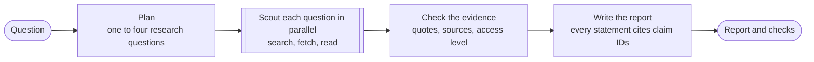

# Research Loop

Research Loop answers a research question with a short report in which every statement cites the evidence behind it. It searches the web and scholarly indexes, reads the pages and papers that matter, and tells you how well each statement is supported: whether its source was read in full, read as an abstract, or only glimpsed in a search result.

It is built on [PydanticAI](https://ai.pydantic.dev). Runs are stored in Postgres and traced in [Logfire](https://logfire.pydantic.dev).

## Setup

You need Python 3.12 or later and Docker for the database.

```bash
make setup && source .venv/bin/activate
cp .env.example .env        # then add your provider keys and LOGFIRE_TOKEN
make postgres-up migrate
research doctor             # checks keys, prices, the database, and the network
research doctor --smoke     # also makes one small paid call per model
```

## Running it

```bash
research scout "Is SWE-bench Verified still a trustworthy measure of coding-agent progress?"
research scout "..." --note "Keep preprints and published papers distinct." --out report/
research show <run id>      # render a stored run again, as Markdown or --format json
```

Every run calls paid models. The command prints its models and limits before it starts. It prints the report when it finishes, and with `--out` it also writes `report.md` and `run.json`. When `DATABASE_URL` is set the run is stored, including every model call's messages.

From Python:

```python
from research_loop.scout import scout

run = await scout("How do long-horizon coding agents recover from errors?")
run.status        # complete, partial, or failed
run.report        # title, summary, answer, and the claim IDs behind each statement
run.checks        # how well each statement is supported, what could not be established
run.ledger        # all the evidence, with unique claim IDs such as q2/c3
```

## How a run works



A planner splits the question into one to four research questions. A scout researches each of them at once, with web search, page and PDF fetching, and scholarly search. Each scout returns claims, and each claim carries evidence: a source, a summary, and often an exact quote.

Code then checks every piece of evidence against what the tools actually returned. A quote is verified only if the tools returned those words, and a source is observed only if a tool returned it. Each source also records how much of it the research saw: a search snippet, a scholarly record, an abstract, or the full text. The model cannot set these marks.

A synthesizer writes the report from that evidence, citing claim IDs, with inline citations such as [s3] that name sources. A report that cites a claim which does not exist gets one retry. The finished report lists each source with how much of it was read, and it flags statements that rest only on snippets or unverified quotes.

Tool output is treated as untrusted data. The prompts say so, the tools only read public HTTPS sources, and the synthesizer sees only the recorded evidence, never raw pages.

## Limits

A run has a fixed budget, set in `.env` or the environment:

| Limit | Default | Setting |
|---|---|---|
| Total cost | $0.75 | `RESEARCH_LIMITS__COST_USD` |
| Whole run | 6 minutes | `RESEARCH_LIMITS__DEADLINE_SECONDS` |
| Research phase | 4.5 minutes | `RESEARCH_LIMITS__RESEARCH_SECONDS` |
| Research questions | 4 | `RESEARCH_LIMITS__MAX_QUESTIONS` |
| Per scout | 12 requests, 16 useful tool calls, 12 failed ones | `RESEARCH_LIMITS__SCOUT_REQUESTS`, `..._PRODUCTIVE_CALLS`, `..._MISSES` |

The money is divided before the run starts. The planner gets $0.05, the synthesizer $0.40, and the scouts split the rest. Each call stops before a request that would pass its share, so the total can exceed the cap by at most one request per call. Each scout is told on every request how much of its budget is left, and loses its tools on its last request, so it returns what it found instead of being cut off.

When something runs out, the run still returns what it can:

- A scout that fails or reaches the deadline leaves its question listed under "Could not establish", along with the searches it made and the pages it read.
- A failed plan means the whole question is researched as one.
- A failed synthesis returns the claims found without a written answer.
- A run that found no evidence at all is `failed`.
- Ctrl-C records the run as `cancelled`.

## Models

Models are configuration, separate from the workflow. The defaults come from the settings study (see `docs/lessons.md`):

| Role | Default | Setting |
|---|---|---|
| Planner | `openai:gpt-6-sol` | `RESEARCH_MODELS__PLANNER` |
| Scouts | `zai:glm-5.3-flash` | `RESEARCH_MODELS__SCOUT` |
| Synthesizer | `anthropic:claude-opus-5-5` | `RESEARCH_MODELS__SYNTHESIZER` |
| Fallback after a refusal or provider error | `openai:gpt-6-sol` | `RESEARCH_MODELS__FALLBACK` |

Z.ai GLM models think at their highest effort (`max`), Opus 5.5 at `medium`, and other models at `high`. A model without a price is refused at startup, because its cost cannot be capped. `src/research_loop/prices.toml` corrects prices that the bundled price data gets wrong.

## Storage and tracing

Postgres keeps each run: its question, configuration, plan, report, evidence ledger, and checks, plus every model call with its usage, cost, output, and messages. Logfire keeps the traces. Each run is one trace, and every span in it carries the run ID; the trace ID is stored on the run's database row.

Traces include prompts and tool results, and they are sent only when `LOGFIRE_TOKEN` is set. Set `RESEARCH_LOGFIRE=false` to turn tracing off. `research db reconcile --older-than 30 --apply` closes out runs that a killed process left running.

## Where things are

| Module in `src/research_loop/` | What it does |
|---|---|
| `scout.py` | The workflow: allocate the budget, plan, scout, check, synthesize |
| `agents.py`, `prompts.py` | The three agents, their instructions, and the checks their outputs must pass |
| `tools.py`, `web.py`, `scholar.py`, `acquisition.py` | Research tools, page and PDF extraction, the public-HTTPS download guard, and the cache |
| `evidence.py`, `schemas.py` | The evidence ledger, the quote and source checks, and the data types |
| `budget_notes.py` | The per-request budget note and tool withdrawal for scouts |
| `config.py`, `models.py`, `prices.py` | Settings, model construction, and price corrections |
| `store.py`, `db.py`, `migrations/` | Run records in Postgres or memory, and the schema |
| `render.py`, `cli.py`, `doctor.py`, `telemetry.py` | Reports, the `research` command, setup checks, and Logfire |

Tests run offline with `make test`. They refuse model-provider requests and any non-loopback network connection. `make lint` runs Ruff. The first design of this project (a six-role graph, benchmarks, and long-horizon studies) is kept at git tag `archive/pre-scout-2026-09`, and `docs/lessons.md` records what it taught.

## License

MIT. See [LICENSE](LICENSE). [CONTRIBUTING.md](CONTRIBUTING.md) explains how to send a pull request, and [AGENTS.md](AGENTS.md) gives the rules for changing the code.
