# Research Loop

**Evidence-first research orchestration on PydanticAI.** A planner splits an objective into research questions. Scouts and deep dives answer them with web, scholarly, and attachment tools and return typed, sourced claims. A synthesizer writes a report that may cite only those claims, and a verifier audits it claim by claim. Code checks every quote and cited source against what the tools actually returned.

The workflow is an explicit, versioned graph (`research-graph-v1`). Which model plays which role is configuration (`ModelPolicy`). Postgres keeps durable history and telemetry. Benchmark adapters and long-horizon studies run the same loop under recorded, reproducible conditions.

<p align="center">
  
</p>

## Contents

- [Quick start](#quick-start)
- [A run, step by step](#a-run-step-by-step)
- [Architecture in layers](#architecture-in-layers)
  - [AI layer: agents and roles](#ai-layer-agents-and-roles)
  - [Graph layer: topology](#graph-layer-topology)
  - [Harness layer: one run's lifecycle](#harness-layer-one-runs-lifecycle)
  - [Policy layer: models, budgets, and the loop policy](#policy-layer-models-budgets-and-the-loop-policy)
  - [Acquisition layer: the search policy](#acquisition-layer-the-search-policy)
  - [Data layer: evidence, storage, and academic records](#data-layer-evidence-storage-and-academic-records)
  - [Evaluation layer: checks, verification, and benchmarks](#evaluation-layer-checks-verification-and-benchmarks)
  - [Observability](#observability)
- [Long-horizon studies](#long-horizon-studies)
- [Next: literature reviews and basis papers](#next-literature-reviews-and-basis-papers)
- [What a result depends on](#what-a-result-depends-on)
- [Using the library](#using-the-library)
- [Commands](#commands)
- [Deliberately out of scope](#deliberately-out-of-scope)
- [Repository map](#repository-map)
- [Documentation](#documentation)

## Quick start

```bash
make setup                                    # .venv with every extra
source .venv/bin/activate
pytest -q                                     # offline: no model or network calls
research-diagnose                             # local readiness; safe without API keys
research-bench examples/benchmark_cases.json  # synthetic run of the real graph
```

None of these commands cost anything. The `synthetic` policy runs the real graph and repository with scripted role outputs, which checks the wiring without provider calls. Postgres, provider keys, and the first paid run are covered in [docs/setup.md](docs/setup.md).

## A run, step by step

The animation above is one run. In words:

1. **Plan.** The planner turns the objective into a `ResearchPlan`: research questions with a priority, an expected difficulty, and flags for primary sources or image input.
2. **Scout, in parallel.** Every question gets a scout. The graph maps the plan into one branch per question, and a semaphore limits how many run at once.
3. **Join and record.** The join waits for every branch. A serial step then appends the results to the evidence ledger **in plan order**, however the branches finished.
4. **Analyze gaps.** The gap analyst names material gaps: low confidence, a missing primary source, a contradiction, missing evidence, or a need for images. Any question whose best result is below `min_scout_confidence` gets a gap as well. The most severe gap per question, up to `max_deep_dives_per_round`, gets a **deep dive**, again in parallel, joined and recorded the same way.
5. **Synthesize.** The synthesizer writes a `FinalReport` from a compact view of the whole ledger. Every report claim must cite ledger claim IDs such as `q2/c1`.
6. **Verify.** The verifier checks each report claim against the cited evidence (supported or not, and how severe the problem is) and may ask for follow-up research.
7. **Loop or finish.** If it asks and rounds remain (`max_verification_rounds`), the follow-ups get deep dives, which may use the policy's alternate deep-dive model, and steps 5–6 repeat. Otherwise the run ends with its report, its verification, and `review_reasons`: what it left unresolved.

The fan-out and join are where concurrency lives, so they are designed so concurrency can never reorder or corrupt evidence:

<p align="center">
  
</p>

Workers never write shared state. Each branch returns a typed `ResearchResult` tagged with its position in the plan. The join only collects them, and the record step sorts them and appends to the ledger. A faster provider cannot reorder evidence, and two branches cannot race on the ledger.

## Architecture in layers

Each concern has exactly one owner, and the layers talk through typed values:

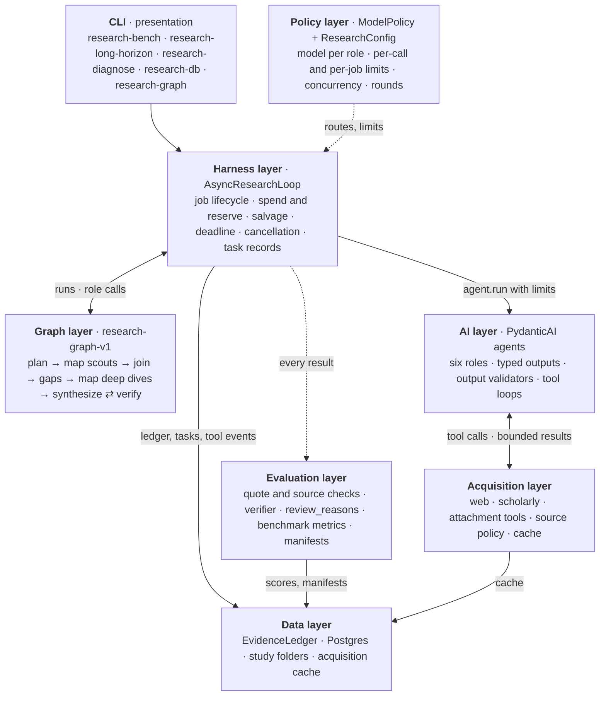

| Owner | Responsibility | Code |
|---|---|---|
| PydanticAI `Agent` | Model and tool semantics: prompts, output types, validators, tool loops | `agents.py`, `tools.py` |
| Pydantic Graph | Workflow topology only | `graph.py` |
| `ResearchLoop` run (the harness) | One execution's lifecycle: job record, spend, fetch memo, deadline, terminal state | `async_orchestrator.py`, `orchestrator.py` |
| `ModelPolicy` | Model selection and budgets | `policy.py` |
| `EvidenceLedger` | Evidence gathered during a run | `ledger.py` |
| Postgres | Durable history and telemetry | `repository.py`, `migrations/` |
| CLI | Presentation | `benchmark.py`, `long_horizon.py`, `diagnose.py`, `db.py`, `graph_cli.py` |

### AI layer: agents and roles

Six PydanticAI agents, one per `ResearchRole`, each with fixed instructions and a Pydantic output type. The model is not fixed: the harness passes one per call from the [policy](#policy-layer-models-budgets-and-the-loop-policy), so the same agent can run on any provider.

| Role | Output | Tools | Runs |
|---|---|---|---|
| `planner` | `ResearchPlan` | attachment tools, when there are attachments | once |
| `scout` | `ResearchResult` | web, scholarly, and attachment tools | once per question, in parallel |
| `gap_analyst` | `GapAnalysis` | none | once |
| `deep_dive` | `ResearchResult` | web, scholarly, and attachment tools | once per selected gap, in parallel |
| `synthesizer` | `FinalReport` | none | once per round |
| `verifier` | `VerificationReport` | none | once per round |

A long-horizon study adds one more agent outside the graph, the study synthesizer, which reuses the synthesizer route (see [Long-horizon studies](#long-horizon-studies)).

**Output validators make the typed contract hold for this run, not just parse.** Each agent's output is checked against the run (`agents.py`): the plan's question count and unique IDs, the question a result is filed under, attachment citations naming run attachments, gaps and follow-ups naming planned questions, and report and verifier citations naming ledger claim IDs. A mismatch gets one retry that names the problem, then fails the run instead of returning a result that does not hold together.

**Scouts and deep dives are tool loops.** The agent calls tools until it can answer, within its route's request, tool-call, token, and cost limits. Each request resends the whole history, so the limits bound cost. Gap analysis, synthesis, and verification are single structured calls over a compact projection of the ledger.

Graph and legacy orchestrators share every role call and prompt through `AsyncResearchLoop`, so a prompt lives in one place. Any change to a model-visible prompt is a behavior change and shows up in the manifest's prompt fingerprint.

### Graph layer: topology

`research-graph-v1` is built with `pydantic_graph.GraphBuilder`. `research-graph` prints the authoritative diagram from the executable graph; this is its shape:

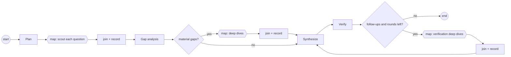

**Graph state is control data only.** `ResearchGraphState` holds the objective, plan, phase, and verification-round counters. The ledger, attachment corpus, semaphores, and the loop runtime are dependencies (`ResearchGraphDeps`), not state. Mapped branches share state, so nothing a branch produces goes there.

**Topology is versioned.** A new node or edge becomes `research-graph-v2`; `v1` never changes silently. The graph version is recorded next to the policy on every job, so a result can be attributed to a model, a role assignment, or a topology.

**The graph is control flow, not durable execution.** A crashed process does not resume mid-graph. Postgres records what happened, and [`research-db reconcile`](#harness-layer-one-runs-lifecycle) closes out what a killed process left running.

`LegacyResearchLoop`, the earlier plain-asyncio loop, is kept as a regression baseline. Parity tests run both with scripted models and compare the plan, every result field, the report, the verification, and every call's role, question, and attempt. Details: [docs/graph.md](docs/graph.md).

### Harness layer: one run's lifecycle

The harness is `AsyncResearchLoop`: the runtime every graph step calls into. It owns one job from creation to its terminal record, and wraps every agent call in the same sequence:

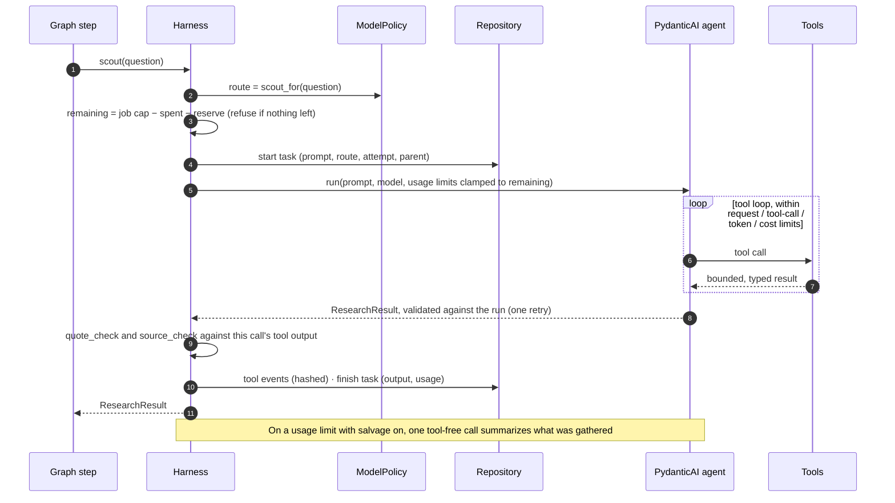

A job always reaches a terminal record while the process survives:

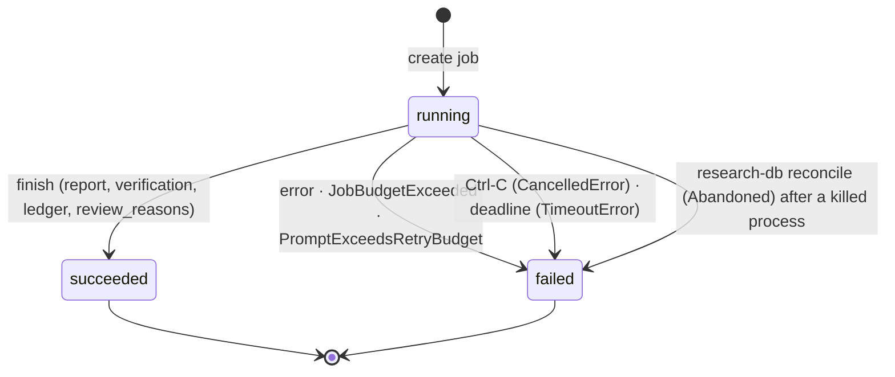

- **Spend.** Each job has a spend account. Before every call, the harness checks the soft job cap and clamps the call's cost limit to what remains. A job whose billed calls include an unpriced model reports its cost as unknown, never as a partial sum.
- **Reserve.** Research calls must leave `job_reserve_usd` unspent, so gap analysis, synthesis, and verification can still run.
- **Salvage** (`salvage_exhausted_research`). A scout or deep dive that hits a usage limit gets one tool-free call that summarizes what it gathered, instead of failing the run. It receives every useful result the run gathered, skipping errors and repeated calls, with long results cut to one shared allowance within 64,000 characters, so late, targeted fetches are not crowded out. Its stored prompt keeps hashes of the replayed tool output, not the text.
- **Retry room.** Gap analysis, synthesis, and verification are refused before the call when one validation retry would not fit the role's token limit, so a run never pays for a call it cannot finish.
- **Failure recording.** Cancellation (including Ctrl-C), a sibling branch cancelled because another failed, and a deadline overrun (`max_run_seconds`) are all recorded as `failed` with the error type. These writes are shielded from cancellation, and a failed write never replaces the original error.
- **Settings.** The harness takes the settings the application resolved and reads the environment only when none are given.

### Policy layer: models, budgets, and the loop policy

Two objects decide how a run behaves without touching the topology. `ModelPolicy` decides **who** does each step and how much each call may spend. `ResearchConfig`, the loop policy, decides **how much work** the loop does.

**Model routing.** Orchestration never branches on vendor names. It asks the policy for a route, and a route is a model plus its limits:

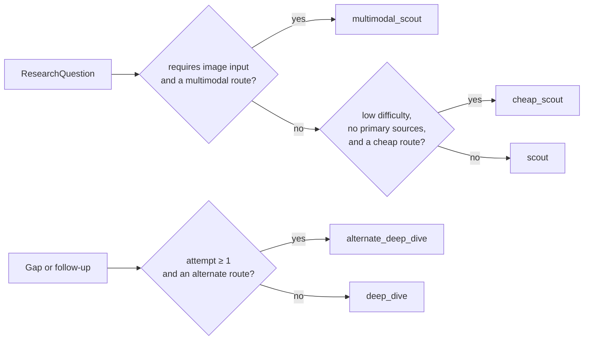

| Policy | What changes | Planner questions |
|---|---|---|
| `quality` | The default for paid runs | 6–10 |
| `breadth` | Many questions, scouted on the cheap route | 16–24 |
| `glm-heavy` | Gap analysis and cheap scouting move to GLM | 8–12 |
| `synthetic` | Scripted outputs, no provider calls | 1 |

The `quality` routes, each overridable with a `RESEARCH_*_MODEL` variable ([docs/setup.md](docs/setup.md#model-routing)):

| Route | Default model | Requests | Tool calls | Tokens | USD per call |
|---|---|---:|---:|---:|---:|
| planner | `anthropic:claude-opus-5` | 6 | 4 | 70k | 2.50 |
| scout | `zai:glm-5.3` | 12 | 24 | 100k | 0.80 |
| cheap scout | `openai:gpt-5.6-luna` | 10 | 20 | 80k | 0.25 |
| multimodal scout | `google:gemini-3.8-flash` | 12 | 20 | 100k | 0.75 |
| gap analyst | `openai:gpt-5.6-sol` | 6 | 4 | 70k | 1.25 |
| deep dive | `openai:gpt-5.6-sol` | 20 | 40 | 180k | 5.00 |
| alternate deep dive | `xai:grok-4.5` | 20 | 40 | 180k | 5.00 |
| synthesizer | `anthropic:claude-opus-5` | 8 | 4 | 180k | 3.50 |
| verifier | `openai:gpt-5.6-sol` | 8 | 8 | 150k | 2.50 |

Model IDs go stale, and a model a provider lists is not proof of access: confirm every route with `research-diagnose --smoke` before paid runs.

**Budgets nest.** Every limit sits inside a wider one, and the outermost is the provider's own:

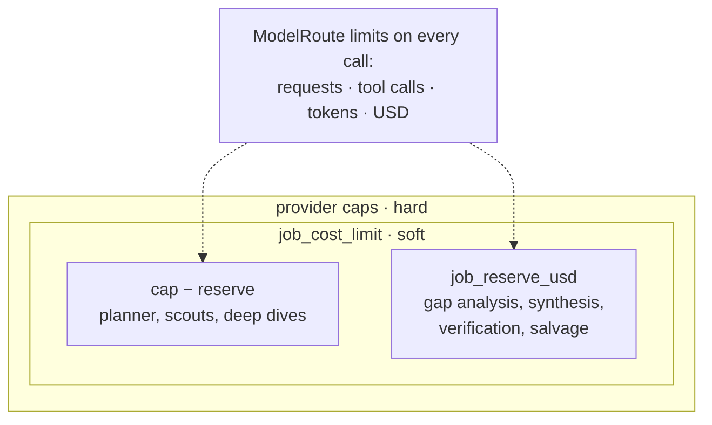

**The loop policy.** `ResearchConfig` sets how wide and how deep the loop goes:

| Knob | Default | Governs |
|---|---|---|
| `max_parallel_scouts` | 8 | Scout branches running at once (the scout semaphore) |
| `max_parallel_deep_dives` | 2 | Deep-dive branches running at once |
| `max_deep_dives_per_round` | 4 | Gaps researched per round, most severe first, one per question |
| `min_scout_confidence` | 0.70 | Below this, a question gets a `low_confidence` gap automatically |
| `max_verification_rounds` | 2 | Research-and-resynthesis rounds after the first verification; `0` turns them off |
| `salvage_exhausted_research` | off | Summarize instead of failing when a scout or deep dive runs out of budget |
| `max_run_seconds` | none | Wall-clock deadline for the run |
| `tool_mode` | `adaptive` | Provider-native or normalized search (see the [search policy](#acquisition-layer-the-search-policy)) |
| `attachment_mode` | `normalized` | Extracted text only, or also images and scanned PDFs sent as binary |
| `scholarly_cache_mode` | `live` | How the acquisition cache is used |

Benchmarks and long-horizon studies set these explicitly and record them in every manifest. Zero parallel slots is refused, because a semaphore with no slots waits forever.

### Acquisition layer: the search policy

Scouts and deep dives gather evidence through three tool groups. Tools return bounded, typed data. They never call a model and never write the ledger.

| Group | Tools | Backends |
|---|---|---|
| Web | `duckduckgo_search`, `web_fetch` | DuckDuckGo; any public HTTPS page |
| Scholarly | `scholar_search`, `scholar_get`, `scholar_references`, `scholar_citations`, `scholar_fetch` | OpenAlex, Crossref, arXiv, ACL Anthology, OpenCitations; open-access PDFs |
| Attachments | `list_attachments`, `search_attachments`, `read_attachment` | Local files, extracted before any model sees them |

**Tool modes decide whose search stack a model uses.** In `normalized` mode every model gets the same local search and fetch, and provider-native search is off, so a policy comparison does not also compare search engines. Benchmarks and long-horizon studies always use it. In `adaptive` mode, the library default, models use their provider's native web tools where available, with local fallbacks. The scholarly tools are added in both modes.

**Every fetch takes the same path:**

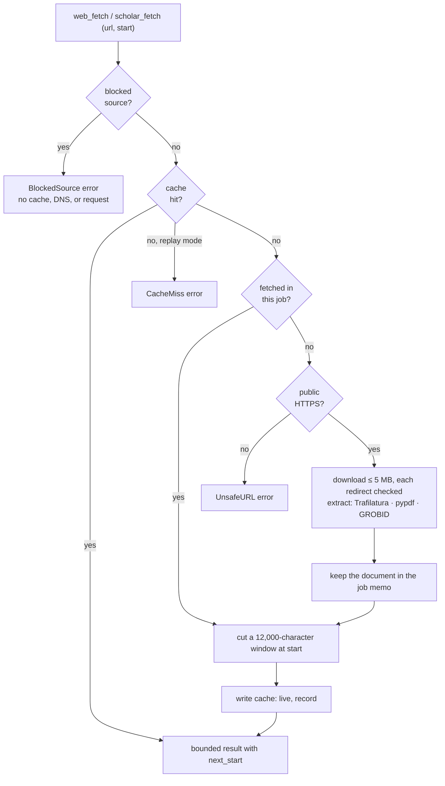

- **What the checks mean.** A source is public when every address its host resolves to is globally routable; the original request and each of at most three redirects are checked. A `live` cache entry is used for a day; `replay` uses any age and never goes to the network.
- **Paging, not truncation.** A long document is read window by window with `start=next_start`, and a second agent in the same job reuses the download.
- **Blocked sources are enforced, not just requested.** Benchmark tasks can forbid URLs, such as sources derived from the expert report behind a rubric. The policy is enforced at the fetch, again at every redirect, and on evidence: a result citing a blocked source gets a retry, then fails. Seeing one in search results is allowed.
- **Search is rate-limited and fails soft.** DuckDuckGo searches share a one-per-second slot and retry once. A second failure returns `SearchUnavailable` to the model, which can switch to scholarly tools.
- **Cache modes make runs reproducible.** `off` for benchmarks, so no result depends on an earlier run. `record` for long-horizon studies, so later runs can replay them. `replay` for offline reproduction. `live` for library use.

Details, including URL-safety limits: [docs/acquisition.md](docs/acquisition.md) and [docs/attachments.md](docs/attachments.md).

### Data layer: evidence, storage, and academic records

#### How academic data is acquired, checked, and stored

<p align="center">
  
</p>

1. **Provider records are normalized, not merged.** Each provider's response becomes a `ScholarWork`: provider and provider ID, title, DOI, arXiv ID, OpenAlex ID, ACL ID, date, authors, abstract (arXiv abstracts are capped at 1,500 characters), open-access full-text URL, retraction flag, citation count, Crossref update relations, and licenses. OpenAlex and Crossref may describe one work differently, and a preprint and its later publication stay separate records.
2. **Publication status is conservative and explains itself.** Every record carries a `publication_status` (`preprint`, `journal`, `accepted_conference`, `conference_submission`, `unknown`) and a `status_basis` saying where that came from, such as "arXiv repository record" or "Crossref type: journal-article". A DOI on an arXiv record does not make it peer-reviewed. Venue metadata alone does not prove peer review. ACL BibTeX stays `unknown` until the venue is verified.
3. **Full text arrives in bounded windows.** `scholar_fetch` extracts open-access HTML or PDF text into the job's memo and returns 12,000 characters at a time with `next_start`.
4. **The agent cites what it read.** Evidence is a `SourceRef` with the identifiers above, a `locator` (page, section), a `publication_status`, a short `excerpt`, and optionally a verbatim `quote`.
5. **Code checks the citation against the tool output.** `quote_check` is `verified` when the quote appears in text this research call's tools returned. The comparison uses only letters and digits and accepts `...`-separated parts in any order, so PDF spacing and list formatting do not matter. `source_check` is `observed` when the cited URL, DOI, or arXiv ID appeared there. Neither is visible to the model or settable by it.
6. **The ledger makes claim IDs unique.** Workers number claims independently, so the ledger renames them `<question>/<claim>` (for example `q3/c2`, then `q3/c2~2` for a deep dive's repeat) and remaps contradictions to the new IDs.
7. **Storage keeps evidence and hashes, not article text.** Postgres stores the finished ledger (claims, excerpts, quotes, and sources) with the job. Tool events keep work IDs, counts, sizes, and content hashes. Study folders add a deduplicated `bibliography.json`.

#### The evidence model

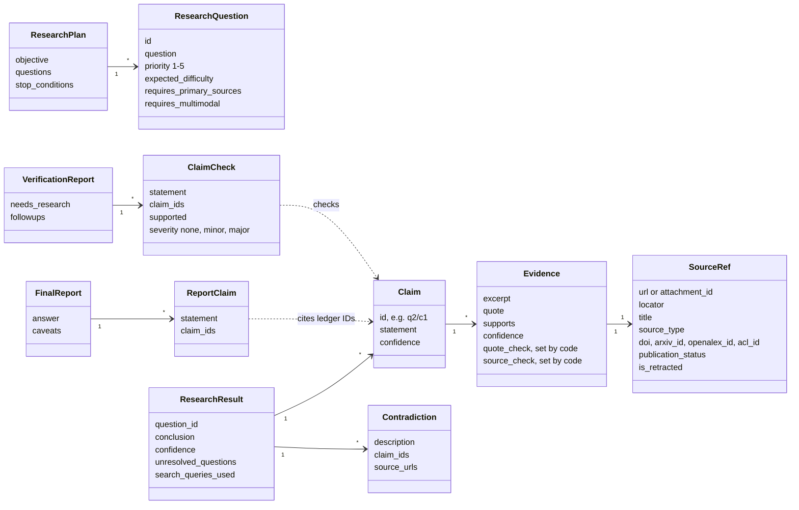

`EvidenceLedger` holds `ResearchResult`s by question, append-only, in plan order. Finishing roles never see the raw ledger. They get a projection: empty fields dropped, each source listed once in a table and cited by `source_id`, and a quote in place of its excerpt unless the quote was not found. The verifier sees only the claims the report cites and the claims a contradiction names.

#### Durable storage

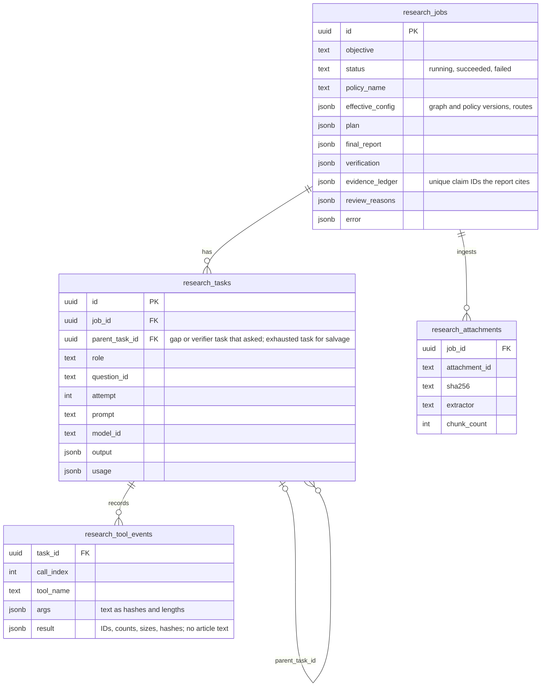

| Where | What | Kept for |
|---|---|---|
| Postgres (optional) | Jobs, tasks with lineage, tool events, attachment manifests, finished ledgers | Durable history, cost analysis, reloading a report and resolving its citations |
| `benchmark_outputs/` | Experiment manifests and long-horizon study folders | Comparing runs; aggregating a study |
| `.cache/research-loop/` | Raw provider responses and fetch windows | Replaying a study offline |
| Memory only | The job's fetch memo and full fetched documents | Paging within one job |

Migrations are checksummed SQL files applied by `research-db migrate`; see [docs/setup.md](docs/setup.md#postgres). Local attachments follow the same rules: hashed, chunked, and exposed to models by stable ID, never by host path ([docs/attachments.md](docs/attachments.md)).

### Evaluation layer: checks, verification, and benchmarks

Evaluation happens at three levels, from inside one call to across many runs:

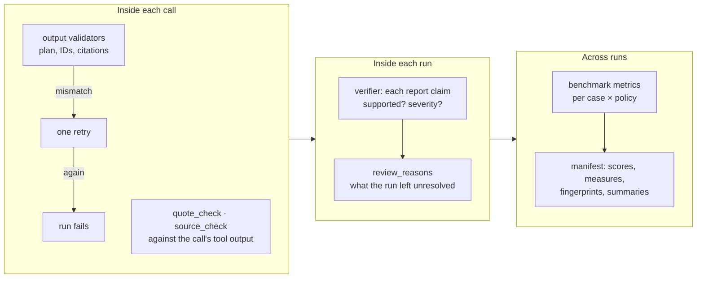

- **Finished is not the same as sound.** Every finished run gets `review_reasons`: no evidence, an uncited or unchecked report, unsupported or major verifier findings, or a verifier still asking for research. An empty list means nothing needs review. Benchmark records, study `run.json` files, and the Postgres job row all carry it.
- **Benchmark lanes measure different things.** BrowseComp tests hard retrieval. DeepResearch Bench II tests synthesis against expert rubrics, with blocked sources. GAIA tests mixed tools and attachments. The original DeepResearch Bench, FutureSearch, and generic JSONL are also supported.
- **Metrics, computed with Pydantic Evals:** supported-claim rate, major-error-free rate, primary-source rate, supported claims per tool call and per dollar, unique-search rate, blocked-source compliance, eval integrity (catches searches for the benchmark itself), exact-answer match, verbatim-quote rate, observed-source rate, and attachment citation coverage. A metric that does not apply to a case records nothing, so it is never averaged in as a pass or a failure.
- **Manifests make results comparable.** Each run writes a sanitized manifest with the git commit and a hash of any uncommitted changes, package versions, redacted policy snapshots, the effective configuration, a fingerprint of every agent's instructions and output schema, dataset hashes, and one configuration fingerprint over all of it. Manifests never contain prompts, answers, credentials, or local paths.

Lanes, suites, metric definitions, and comparability rules: [docs/benchmarks.md](docs/benchmarks.md).

### Observability

- **Postgres** is the durable record: every task's prompt, route, output, usage, and cost, with parent links forming the call tree of a job.
- **Logfire** is optional tracing. With `RESEARCH_LOGFIRE_ENABLED=true`, each research job is one trace, with every agent call nested under a `research job` span, parallel branches included. Search by `job_id` to find a job's trace. Prompts, completions, and tool content are excluded from spans. See [docs/setup.md](docs/setup.md#logfire-tracing).
- **`research-diagnose`** checks dependencies, graph construction, tools, directories, the database and migrations, credentials, and each route's model profile; `--smoke` makes one small paid call per model.

## Long-horizon studies

A long-horizon study is research too large for one run: a spec of questions, each run as its own research job, then combined into one synthesis.

<p align="center">
  
</p>

- **The spec fixes the scope.** `spec.toml` holds the questions, publication window, source tiers, research notes, per-question budgets, and required outputs, and is validated in full when it loads, so `--dry-run` catches what a paid run would otherwise hit.
- **Each question publishes atomically.** Its report, verification, ledger, and bibliography are written to a staging folder that replaces the published one in one rename. `run.json` records every file's hash and a hash of the rendered objective.
- **Aggregation counts only what still matches.** A question counts only if its objective hash still matches the spec and its files still match their hashes. Budget-only edits keep earlier outputs; editing a question or the source policy requires rerunning it.
- **Synthesis is one bounded agent job.** It receives a source table and each question's report claims, caveats, contradictions, and verifier findings, and writes a report, a benchmark catalog, architecture patterns, failure modes, open questions, and falsifiable hypotheses. Every entry must cite claim refs such as `q01/q1/c3`.

```bash
research-long-horizon --dry-run                        # validate the spec; no calls
research-long-horizon --question q01 --paid --persist  # one question
research-long-horizon --all-questions --paid --persist # every question, one after another
research-long-horizon --aggregate                      # merge completed evidence; no calls
research-long-horizon --basis-papers                   # rank the works the sources cite; no model calls
research-long-horizon --synthesize --paid --persist    # the study report, catalogs, and hypotheses
```

The first study, on long-horizon agentic software engineering, and its calibration pilot are documented in [long_horizon/agentic_se/README.md](long_horizon/agentic_se/README.md).

## Next: literature reviews and basis papers

> **Partly built.** Backward snowballing for basis papers works today (`research-long-horizon --basis-papers`). Forward snowballing, screening, and the literature-review output are planned; the dashed part of the diagram shows the whole design.

A long-horizon study is already most of a systematic literature review: a protocol (the spec), research questions, a publication window, inclusion rules (source tiers), recorded search activity, and a synthesis. Two things were missing: finding the papers a field is built on, and reporting how the review got from everything found to what it included.

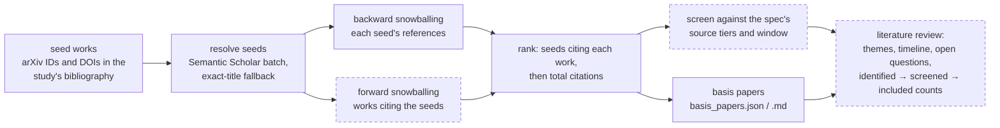

- **Basis papers** are the works a body of literature rests on: the ones many of the collected papers cite. `--basis-papers` resolves every arXiv ID and DOI in a study's bibliography through Semantic Scholar, collects each seed's references, and ranks the referenced works by how many seeds cite them, marking the ones the study never cites. It is deterministic code: no model call, no new agent role. Semantic Scholar is used because OpenAlex lists no references for arXiv preprints. Details: [docs/acquisition.md](docs/acquisition.md#citation-snowballing-basis-papers).
- **On the p01 pilot**, 7 seeds with 419 references put the Codex paper that introduced HumanEval at the top, cited by 6 of the 7 seeds but never by the study, followed by SWE-bench, MBPP, AlphaCode, and EvalPlus. 29 of the top 30 were works the study had not cited.
- **Literature-review output** adds a screening record to a study: how many works were identified, screened, and included, and why each exclusion happened. It also adds a review-shaped synthesis organized by theme and timeline, reusing the study synthesizer.
- **Still planned:** forward snowballing (newer work citing the seeds), co-citation ranking, and feeding basis papers back into a study. The research agents' own `scholar_references` and `scholar_citations` tools still return at most 10 works per call with unresolved metadata, and year filters apply to OpenAlex only.

## What a result depends on

Results are compared only when these match. Manifests record them, with the git commit and a hash of any uncommitted changes, package versions, the effective run configuration, a fingerprint of every agent's instructions and output schema, dataset hashes, and a configuration fingerprint over all of it.

| Dimension | Current | Defined in |
|---|---|---|
| Graph topology | `research-graph-v1` | `graph.py` |
| Model policy | `quality`, `breadth`, `glm-heavy`, `synthetic` | `policy.py`, `RESEARCH_*_MODEL` |
| Evidence schema | `evidence_version` 4: a summary `excerpt`, plus a verbatim `quote` and a cited source that code checks against tool output, the quote on its letters and digits; every role's output is checked against the run's plan, ledger, and attachments | `schemas.py`, `quotes.py`, `agents.py` |
| Fetch behavior | `fetch_version` 3: paged fetches with a per-job document memo; the task's blocked sources are refused | `acquisition.py` |
| Tool mode | `normalized` (benchmarks, long-horizon studies) or `adaptive` (library default) | `tools.py` |
| Attachment mode | `normalized` or `multimodal` | `attachments.py` |
| Scoring | `evaluator_version` 1: the benchmark metrics' definitions | `evals.py` |

## Using the library

```python
from research_loop import (
    AttachmentMode,
    ResearchConfig,
    ResearchConstraints,
    ResearchLoop,
    ResearchToolMode,
    get_policy,
)
from research_loop.repository import PostgresResearchRepository

loop = ResearchLoop(
    get_policy("quality"),
    ResearchConfig(
        tool_mode=ResearchToolMode.NORMALIZED,
        attachment_mode=AttachmentMode.NORMALIZED,
    ),
    repository=PostgresResearchRepository(existing_async_psycopg_pool),
)

outcome = await loop.run(
    "Compare the claims in the attached report with current primary sources.",
    session_id=session.id,
    root_run_id=run.id,
    constraints=ResearchConstraints(attachment_paths=["/local/path/report.pdf"]),
)
print(outcome.report.answer)
```

`outcome` carries the plan, report, verification, evidence ledger, attachment corpus, the job's spend, and `review_reasons`. The model never sees host file paths; attachments are exposed through stable IDs and normalized tools. `examples/run_research.py` runs one objective from the command line: offline with the synthetic policy by default, or with a real policy given `--paid`. `LegacyResearchLoop` takes the same arguments.

## Commands

| Command | Purpose | Paid calls |
|---|---|---|
| `research-diagnose` | Check dependencies, graph, tools, directories, database, providers, and model routes | Only with `--smoke` |
| `research-db status` / `migrate` / `reconcile` | Show or apply the SQL migrations; close out runs a killed process left running | No |
| `research-bench SUITE` | Run benchmark cases under one or more policies and write a sanitized manifest | Only with `--paid` |
| `research-long-horizon` | Run a study's questions, aggregate their evidence, and synthesize the study | Only with `--paid` |
| `research-graph` | Print the executable graph as Mermaid | No |

`make` wraps the common ones: `setup`, `test`, `diagnose`, `graph`, `postgres-up`, `postgres-down`, `db-status`, `migrate`. The diagrams in this README are generated by `scripts/readme_diagrams.py`.

## Deliberately out of scope

No durable workflow runtime (DBOS, Temporal, Prefect), no graph-state snapshots presented as crash recovery, no learned router, no additional agent roles, no event sourcing, and no second evidence store. The next step is measurement: small paid runs and scout comparisons, with `ModelPolicy` changes derived from persisted telemetry rather than public leaderboards. Most of the integrity work in [docs/architecture-review.md](docs/architecture-review.md) has landed; its status table lists what remains.

## Repository map

```text
src/research_loop/
├── graph.py              research-graph-v1 topology (Pydantic Graph)
├── async_orchestrator.py the harness: role calls, lifecycle, budgets, salvage
├── orchestrator.py       ResearchLoop (graph) and LegacyResearchLoop
├── agents.py             the agents: instructions, output types, validators
├── policy.py             ModelPolicy, ModelRoute, presets
├── schemas.py            plan, evidence, report, and verification models
├── ledger.py             EvidenceLedger and the finishing-prompt projection
├── quotes.py             quote_check and source_check
├── tools.py · web.py · scholar.py · acquisition.py · attachments.py
├── citations.py          basis papers: citation snowballing over a bibliography
├── repository.py · db.py · telemetry.py · observability.py
├── benchmark.py · evals.py · experiment.py · benchmarks/   benchmark lanes
└── long_horizon.py · long_horizon_spec.py                  long-horizon studies
long_horizon/agentic_se/  the first study: spec, pilot, measurements
migrations/               checksummed SQL
docs/                     layer references; docs/assets holds the diagrams
examples/ · scripts/      suites, a one-objective runner, setup, diagram builder
```

## Documentation

| Document | Covers |
|---|---|
| [docs/setup.md](docs/setup.md) | Installation, configuration, model routing, Postgres, diagnostics, Logfire |
| [docs/graph.md](docs/graph.md) | Topology, state versus dependencies, concurrency, verification rounds, parity |
| [docs/acquisition.md](docs/acquisition.md) | Web and scholarly tools, fetch paging, caching, URL safety, blocked sources |
| [docs/attachments.md](docs/attachments.md) | Attachment lanes, extractors, provenance, privacy |
| [docs/benchmarks.md](docs/benchmarks.md) | Benchmark lanes, suites, runs, manifests, metrics, comparability |
| [long_horizon/agentic_se/README.md](long_horizon/agentic_se/README.md) | The first long-horizon study: running questions, the calibration pilot, synthesis |
| [long_horizon/agentic_se/PROMPT_SIZES.md](long_horizon/agentic_se/PROMPT_SIZES.md) | Measured prompt sizes and where they exceed limits |
| [docs/architecture-review.md](docs/architecture-review.md) | Dated review findings, with a status table |
| [AGENTS.md](AGENTS.md) | Constraints for coding agents working in this repository |
