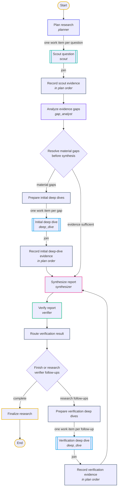
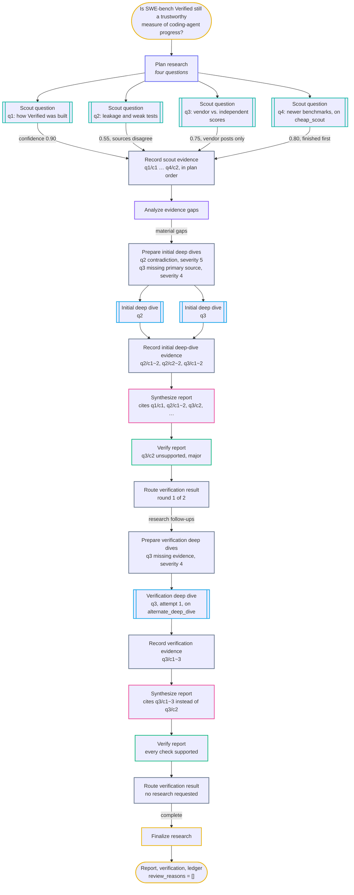
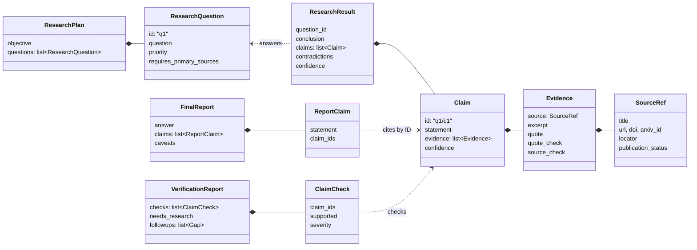

# Research Loop

Research Loop is a framework for agentic research. You give it a question. A team of AI agents plans the work, researches the parts in parallel with web, scholarly, and file tools, and writes a report. Every claim in the report cites the evidence it rests on, and a separate agent checks the report before it comes back to you.

It is built on [PydanticAI](https://ai.pydantic.dev) for the agents and Pydantic Graph for the workflow.

## Run it

```bash
make setup && source .venv/bin/activate
pytest -q                                          # offline tests
python examples/run_research.py "Your question"    # scripted models: free, no network
python examples/run_research.py "Your question" --policy quality --paid   # real models
python examples/run_research.py "Your question" --policy quality --paid --persist   # and store the job in Postgres
python examples/run_research.py "Your question" --report-dir report/   # and write it as a PDF and Markdown
```

Before your first paid run, set up provider keys and network access with [docs/setup.md](docs/setup.md#preparing-for-paid-runs) and check them with `research-diagnose --smoke`.

From Python:

```python
from research_loop import ResearchLoop, get_policy

loop = ResearchLoop(get_policy("quality"))
outcome = await loop.run("How do long-horizon coding agents recover from errors?")

outcome.report          # the answer, with each claim citing ledger claim IDs
outcome.verification    # the verifier's check of each claim
outcome.ledger          # all the evidence gathered
outcome.sources         # what the report's inline [sN] citations name
outcome.review_reasons  # anything left unresolved; empty means no check flagged a problem
```

To read or share a run, render it as a document. The PDF (through LaTeX) holds the report with its key statements and verdicts, a bibliography of every source in the ledger with scholarly works listed apart from web sources and attachments, and appendices for the plan, the evidence ledger, and the verification. Citations, claim IDs, and sources link to each other.

```python
from research_loop import ReportDocument, write_report

write_report(ReportDocument.from_outcome(outcome), "report/", ["pdf", "md", "html", "bib", "json"])
```

You steer a run with `ResearchConstraints`: files for the agents to read, sources they must not use, and notes they should follow.

```python
from research_loop import ResearchConstraints

outcome = await loop.run(
    "Check the claims in this report against current primary sources.",
    constraints=ResearchConstraints(
        attachment_paths=["report.pdf", "figures.xlsx"],
        blocked_urls=["https://example.com/answer-key"],
        notes=["Prefer peer-reviewed sources published since 2024."],
    ),
)
```

## How a run works

<p align="center">
  
</p>

Six agents take turns, each with one job:

| Agent | Job | Returns |
|---|---|---|
| Planner | Split the objective into research questions | `ResearchPlan` |
| Scout | Research one question with tools; all questions run in parallel | `ResearchResult` |
| Gap analyst | Find weak spots: low confidence, missing primary sources, contradictions | `GapAnalysis` |
| Deep dive | Research one weak spot more thoroughly, also in parallel | `ResearchResult` |
| Synthesizer | Write the report from the gathered evidence | `FinalReport` |
| Verifier | Check each report claim against its evidence; may ask for more research | `VerificationReport` |

If the verifier asks for more research and rounds remain, the follow-ups become deep dives, and the synthesizer and verifier run again.

### The graph

This is `research-graph-v1` as `graph.py` builds it, with each box named after its step. Double-edged boxes run once per question or gap, in parallel; every other step runs once. Diamonds are decisions, and their edge labels are the branch names in the code.



`research-graph` prints the executable graph, and [docs/graph.md](docs/graph.md) explains every step.

## Example: one question through the graph

The question below shows the loop at full stretch. It needs scholarly search. Its sources mix preprints, published papers, and vendor posts. And its evidence disagrees, so it takes every branch of the graph. The outputs are illustrative and shortened, but every ID, route, and decision shown is what the code does with them. To run this question for real, use `python examples/readme_example.py --paid`: it runs the `quality` policy under a $4 total cap with fewer questions, deep dives, and verification rounds, and saves the report, verification, and the exact configuration as JSON.

```python
outcome = await ResearchLoop(get_policy("quality")).run(
    "Is SWE-bench Verified still a trustworthy measure of coding-agent progress?",
    constraints=ResearchConstraints(notes=[
        "Keep preprints and published papers distinct.",
        "Label scores a vendor reports about its own model as vendor claims.",
    ]),
)
```



| Step | Agent | What happens to this question |
|---|---|---|
| Plan research | `planner` | Splits the objective into four questions; the `quality` policy aims for six to ten, shortened here. q1 and q2 require primary sources. q4 is marked `expected_difficulty: "low"` and doesn't require them. |
| Scout question (×4, in parallel) | `scout`; q4 on `cheap_scout` | All four start together (there are eight slots). q4 goes to the cheaper model because it is easy and needs no primary sources, and it finishes first. q2 finds two analyses that disagree, records the contradiction, and reports confidence 0.55. q3 finds only vendor launch posts, and one quote it gives appears in nothing its tools returned, so code marks it `quote_check: not_found`. |
| Record scout evidence | Code | Adds the four results in plan order, whatever order they finished in, and names their claims `q1/c1` to `q4/c2`. |
| Analyze evidence gaps | `gap_analyst`, then code | The analyst names two gaps: the contradiction on q2 (severity 5) and missing primary sources on q3 (severity 4). Code adds a `low_confidence` gap for q2, because 0.55 is below `min_scout_confidence` (0.70). It keeps one gap per question, the most severe or, on a tie, the first. Both gaps fit under `max_deep_dives_per_round` (4), so both are material. |
| Prepare initial deep dives, Initial deep dive (×2, in parallel), Record initial deep-dive evidence | `deep_dive` | Each deep dive gets its question and its gap. Both workers number their claims from `c1` again, so the ledger renames them `q2/c1~2`, `q2/c2~2`, and `q3/c1~2`, and nothing is overwritten. Each task records the gap-analysis task as its parent. |
| Synthesize report | `synthesizer` | Writes the report from the ledger. Every statement cites claim IDs, and a citation to an ID that isn't in the ledger gets one retry. |
| Verify report | `verifier` | Sees the report and the claims it cites. The statement about vendor scores rests only on `q3/c2`, whose quote was not found, so the verifier rates it unsupported and major and asks for more research on q3. |
| Route verification result | Code | The follow-up names a planned question and round 1 of `max_verification_rounds` (2) is still open, so the run goes back to research. |
| Prepare verification deep dives, Verification deep dive, Record verification evidence | `deep_dive` on `alternate_deep_dive` | A different model looks for an independent run of the same models. Its claim becomes `q3/c1~3`, and the verifier task is its parent. |
| Synthesize report, Verify report, Route verification result, Finalize research | `synthesizer`, `verifier` | The new report cites `q3/c1~3` instead of `q3/c2`. Every check is supported and nothing more is requested, so the run finishes with an empty `review_reasons`. |

<details>
<summary>The plan (<code>ResearchPlan</code>, defaults left out)</summary>

```json
{
  "objective": "Is SWE-bench Verified still a trustworthy measure of coding-agent progress?",
  "questions": [
    {"id": "q1", "question": "How was SWE-bench Verified built from SWE-bench, and what does it measure?",
     "priority": 5, "requires_primary_sources": true},
    {"id": "q2", "question": "What independent evidence shows solution leakage, weak tests, or training-data contamination in SWE-bench tasks?",
     "priority": 5, "requires_primary_sources": true},
    {"id": "q3", "question": "How do scores vendors report for their own models compare with independent runs of the same models?",
     "priority": 4},
    {"id": "q4", "question": "Which newer benchmarks were proposed to address these problems?",
     "priority": 2, "expected_difficulty": "low"}
  ]
}
```

</details>

<details>
<summary>Two claims in the ledger (<code>Claim</code>): one clean, one whose quote was not found</summary>

The first cites the SWE-bench paper as the preprint it is. The second cites a vendor post the scout did fetch, so its source is `observed`, but the quoted words appear in nothing the tools returned, so its quote is `not_found`. Code sets both marks; the model can't.

```json
{
  "id": "q1/c2",
  "statement": "SWE-bench builds its tasks from real GitHub issues and the pull requests that resolved them.",
  "confidence": 0.9,
  "evidence": [{
    "source": {"url": "https://arxiv.org/abs/2310.06770", "arxiv_id": "2310.06770",
               "title": "SWE-bench: Can Language Models Resolve Real-World GitHub Issues?",
               "source_type": "paper", "publication_status": "preprint"},
    "excerpt": "Each task pairs an issue with the repository at that commit; the tests from the resolving pull request judge a fix.",
    "confidence": 0.9,
    "source_check": "observed"
  }]
}
```

```json
{
  "id": "q3/c2",
  "statement": "Vendor-reported scores run ahead of independent runs of the same models.",
  "confidence": 0.7,
  "evidence": [{
    "source": {"url": "https://vendor.example/blog/model-launch", "title": "Model launch post",
               "source_type": "official", "publication_status": "vendor_technical_report"},
    "excerpt": "The vendor reports a higher score than public leaderboards show.",
    "quote": "resolves more issues than any model we have tested",
    "confidence": 0.7,
    "quote_check": "not_found",
    "source_check": "observed"
  }]
}
```

</details>

<details>
<summary>Gap selection before the first deep dives</summary>

| Question | Reason | Severity | Raised by | Deep dive? |
|---|---|---|---|---|
| q2 | `contradiction` | 5 | Gap analyst | Yes: kept first on the tie |
| q2 | `low_confidence` | 5 | Code: 0.55 < 0.70 | No: one gap per question |
| q3 | `missing_primary_source` | 4 | Gap analyst | Yes |

</details>

<details>
<summary>The first verification (<code>VerificationReport</code>, passing checks left out)</summary>

```json
{
  "needs_research": true,
  "checks": [
    {"statement": "Vendor-reported scores run ahead of independent runs of the same models.",
     "claim_ids": ["q3/c2"], "supported": false, "severity": "major",
     "explanation": "The only evidence is a quote no research tool returned."}
  ],
  "followups": [
    {"question_id": "q3", "reason": "missing_evidence", "severity": 4,
     "followup": "Find an independent run of the same models under matched conditions."}
  ]
}
```

</details>

### A real run of this question

The illustrative outputs above show every branch of the graph. A real run, from `python examples/readme_example.py --paid` on 25 September 2026, took a shorter path:

- **Routes:** the `quality` policy under a $4 cap, with `openai:gpt-5.6-sol` planning, analysing gaps, deep diving, synthesizing, and verifying, and `zai:glm-5.3` scouting.
- **Work:** 3 questions and 3 scouts; the q1 scout used its 12 requests and was salvaged. Gap analysis sent q1 and q2 to deep dives, both of which reached their tool-call limit and were salvaged. One synthesis and one verification followed.
- **Result:** $2.26 in 11.8 minutes. The verifier checked 15 statements: all supported, 3 with minor wording or citation notes, and no further research requested.

The report's bottom line, as written:

> **Bottom line:** SWE-bench Verified is still useful as a **narrow, controlled regression test**, but it is no longer trustworthy as a **standalone measure of frontier coding-agent progress**. Its score measures whether an agent can patch 500 selected Python/GitHub issues so that all hidden FAIL_TO_PASS and PASS_TO_PASS tests pass; it does not directly measure general software-engineering quality or model ability independent of the scaffold [[1]](https://web.archive.org/web/2024/https://openai.com/index/introducing-swe-bench-verified/)[[2]](https://www.swebench.com/verified.html).

<details>
<summary>The full report, with its sources</summary>

**Why it retains value**
- The benchmark improved substantially on the original SWE-bench: 93 Python-experienced developers reviewed 1,699 random samples, yielding 500 human-filtered instances intended to have clear specifications, correctly scoped tests, and solvable environments [[3]](https://openai.com/index/introducing-swe-bench-verified/)[[2]](https://www.swebench.com/verified.html).
- Its official Docker harness standardizes patch application and test execution, improving reproducibility at the evaluation layer [[4]](https://github.com/SWE-bench/SWE-bench/blob/main/docs/reference/harness.md).
- Independent evidence indicates that coding agents really have improved: METR reports rapidly increasing task-completion horizons driven by greater reliability, mistake recovery, reasoning, and tool use; newer frontier models also outperform older or smaller models on the more contamination-resistant SWE-bench Pro under a unified scaffold [[5]](https://metr.org/blog/2025-03-19-measuring-ai-ability-to-complete-long-tasks/)[[6]](https://arxiv.org/abs/2503.14499)[[7]](https://arxiv.org/html/2509.16941v2).

**Why the headline score is no longer enough**
1. **It is a system score, not a model-only score.** The unrestricted leaderboard mixes simple loops, retrieval systems, multi-rollout systems, and review systems. Even the controlled Bash Only track warns that its 1.x and 2.x results are not necessarily comparable [[2]](https://www.swebench.com/verified.html). Historically, the same model family could vary dramatically with scaffold—for example, GPT-4 ranged from 2.7% to 28.3% on SWE-bench Lite [[1]](https://web.archive.org/web/2024/https://openai.com/index/introducing-swe-bench-verified/).
2. **Single runs can overstate small gains.** A preprint based on 60,000 trajectories reports that single-run Verified estimates varied by 2.2–6.0 percentage points, with standard deviations above 1.5 points even at temperature zero; consequently, a two- or three-point improvement may be evaluation noise [[8]](https://arxiv.org/abs/2602.07150).
3. **The tests make errors in both directions.** OpenAI’s later vendor audit of 138 difficult instances reported material specification or test flaws in 59.4% of them, potentially rejecting valid solutions [[9]](https://web.archive.org/web/2026/https://openai.com/index/why-we-no-longer-evaluate-swe-bench-verified/). Conversely, the SWE-ABS preprint found that strengthened tests rejected 19.71% of previously passing patches and reduced the top score from 78.80% to 62.20%, suggesting weak tests also accept incorrect solutions [[10]](https://arxiv.org/abs/2603.00520v1). These findings concern selected subsets and should not be extrapolated mechanically to all 500 tasks.
4. **Public, static tasks are increasingly vulnerable to contamination.** The dataset exposes gold and test patches [[11]](https://www.swebench.com/SWE-bench/guides/datasets/)[[12]](https://huggingface.co/datasets/princeton-nlp/SWE-bench_Verified). A separate preprint found Claude models localized buggy files about three times better on Verified than on similar benchmarks and found edited files six times better, a pattern consistent with training overlap [[13]](https://arxiv.org/abs/2512.10218). OpenAI later reported that all frontier models it tested could reproduce some gold patches or verbatim task details and stopped reporting Verified scores, although that remains a vendor’s audit and recommendation [[9]](https://web.archive.org/web/2026/https://openai.com/index/why-we-no-longer-evaluate-swe-bench-verified/).
5. **Passing tests is not the same as producing mergeable work.** METR reports that blinded maintainer merge decisions were about 24 percentage points below automated SWE-bench scores on average, with roughly half of test-passing PRs in its study judged unmergeable [[14]](https://metr.org/notes/2026-03-10-many-swe-bench-passing-prs-would-not-be-merged-into-main/).
6. **Historical comparability is conditional.** Dataset files have been revised, historical metadata does not consistently expose every artifact needed for exact forensic reproduction, and the harness can reuse stale results if a run ID and instance ID are repeated with a changed prediction [[15]](https://github.com/swe-bench/experiments/tree/main)[[16]](https://huggingface.co/datasets/princeton-nlp/SWE-bench_Verified/commits/main)[[17]](https://huggingface.co/datasets/princeton-nlp/SWE-bench_Verified/commit/c104f84)[[18]](https://github.com/SWE-bench/SWE-bench/blob/main/README.md). OpenAI also disclosed that some historical vendor results used 477 runnable tasks rather than all 500 [[19]](https://openai.com/index/introducing-upgrades-to-codex/).

**Practical verdict:** Treat SWE-bench Verified as one diagnostic, not as the coding-agent equivalent of a definitive capability meter. It remains informative when the dataset and harness versions, scaffold, model, rollout budget, timeout, and denominator are fixed; runs are repeated with uncertainty reported; and predictions are reevaluated under identical conditions. Claims of broad progress should also reproduce on fresh or held-out tasks and ideally undergo stronger tests or maintainer review [[8]](https://arxiv.org/abs/2602.07150)[[2]](https://www.swebench.com/verified.html)[[7]](https://arxiv.org/html/2509.16941v2)[[14]](https://metr.org/notes/2026-03-10-many-swe-bench-passing-prs-would-not-be-merged-into-main/)[[10]](https://arxiv.org/abs/2603.00520v1).

Thus, Verified can still answer **“Did this fixed system get better on this fixed public test suite?”** It cannot, by itself, reliably answer **“How much did general real-world coding ability improve?”**

**Caveats**

- Most quantitative evidence challenging the benchmark—including randomness, contamination, and adversarial test-strengthening results—comes from preprints rather than peer-reviewed publications [[8]](https://arxiv.org/abs/2602.07150)[[13]](https://arxiv.org/abs/2512.10218)[[10]](https://arxiv.org/abs/2603.00520v1).
- OpenAI’s later contamination and test-quality findings are vendor claims, even though they criticize a benchmark OpenAI helped validate [[9]](https://web.archive.org/web/2026/https://openai.com/index/why-we-no-longer-evaluate-swe-bench-verified/).
- The evidence does not provide a per-model decomposition of how much Verified improvement comes from genuine capability, contamination, scaffold optimization, or evaluation noise [[5]](https://metr.org/blog/2025-03-19-measuring-ai-ability-to-complete-long-tasks/)[[13]](https://arxiv.org/abs/2512.10218).
- METR’s maintainer-review result covered only part of SWE-bench Verified, so its reported mergeability gap should not be assumed to apply uniformly to all repositories or agents [[14]](https://metr.org/notes/2026-03-10-many-swe-bench-passing-prs-would-not-be-merged-into-main/).

**Sources**

1. [Introducing SWE-bench Verified (OpenAI blog, via web.archive.org)](https://web.archive.org/web/2024/https://openai.com/index/introducing-swe-bench-verified/)
2. [SWE-bench Verified](https://www.swebench.com/verified.html)
3. [Introducing SWE-bench Verified](https://openai.com/index/introducing-swe-bench-verified/)
4. [SWE-bench Docker-based evaluation harness reference](https://github.com/SWE-bench/SWE-bench/blob/main/docs/reference/harness.md)
5. [Measuring AI Ability to Complete Long Software Tasks (METR blog post)](https://metr.org/blog/2025-03-19-measuring-ai-ability-to-complete-long-tasks/)
6. [Measuring AI Ability to Complete Long Software Tasks (arXiv:2503.14499)](https://arxiv.org/abs/2503.14499)
7. [SWE-Bench Pro: Can AI Agents Solve Long-Horizon Software Engineering Tasks? (arXiv:2509.16941)](https://arxiv.org/html/2509.16941v2)
8. [On Randomness in Agentic Evals (arXiv:2602.07150)](https://arxiv.org/abs/2602.07150)
9. [Why SWE-bench Verified no longer measures frontier coding capabilities (OpenAI, archived)](https://web.archive.org/web/2026/https://openai.com/index/why-we-no-longer-evaluate-swe-bench-verified/)
10. [SWE-ABS: Adversarial Benchmark Strengthening Exposes Inflated Success Rates on Test-based Benchmark (arXiv:2603.00520)](https://arxiv.org/abs/2603.00520v1)
11. [SWE-bench Datasets](https://www.swebench.com/SWE-bench/guides/datasets/)
12. [princeton-nlp/SWE-bench_Verified](https://huggingface.co/datasets/princeton-nlp/SWE-bench_Verified)
13. [Does SWE-Bench-Verified Test Agent Ability or Model Memory? (arXiv:2512.10218)](https://arxiv.org/abs/2512.10218)
14. [Many SWE-bench-Passing PRs Would Not be Merged into Main (METR)](https://metr.org/notes/2026-03-10-many-swe-bench-passing-prs-would-not-be-merged-into-main/)
15. [SWE-bench experiments repository organization and artifact policy](https://github.com/swe-bench/experiments/tree/main)
16. [SWE-bench Verified dataset commit history](https://huggingface.co/datasets/princeton-nlp/SWE-bench_Verified/commits/main)
17. [SWE-bench Verified dataset commit c104f84](https://huggingface.co/datasets/princeton-nlp/SWE-bench_Verified/commit/c104f84)
18. [SWE-bench repository README — result caching note](https://github.com/SWE-bench/SWE-bench/blob/main/README.md)
19. [Introducing upgrades to Codex](https://openai.com/index/introducing-upgrades-to-codex/)

</details>

## The data

Everything an agent returns is a typed Pydantic model (`schemas.py`). These are the ones that matter:



<p align="center">
  
</p>

The `EvidenceLedger` (`ledger.py`) collects every `ResearchResult` from a run, in plan order, and gives each claim a unique ID such as `q3/c2`. A report can cite only claims that exist in the ledger. That is how you get from any sentence in the report back to the passage and source behind it.

## Ideas you need to know

**The graph decides what happens next; the harness does the work.** `graph.py` holds only the order of steps. `AsyncResearchLoop` in `async_orchestrator.py` runs each agent call: it picks the model, enforces budgets, records the call, and checks the output. Prompts and role calls live in the harness and in `agents.py`, never in graph steps.

**Parallel agents never write shared state.** Each scout or deep dive returns its result as a value. One step then adds all the results to the ledger, sorted into plan order, so the evidence comes out the same no matter which agent finished first.

<p align="center">
  
</p>

**Outputs are checked against the run, not just parsed.** Validators reject a plan with duplicate question IDs, a result filed under the wrong question, or a report citing a claim that doesn't exist. A failing output gets one retry with the problem explained, then the run fails. Separately, plain code marks each quote `verified` if it appears in what the tools actually returned, and each source `observed` if its URL or DOI appeared there. The model can't set these marks.

**A finished run isn't a correct run.** Check `review_reasons`. It lists missing evidence, unchecked claims, unsupported claims, research the verifier still wanted, and web and scholarly tools that mostly could not reach their sources.

**Models and budgets are configuration.** A `ModelPolicy` (`policy.py`) maps each role to a model and per-call limits on requests, tool calls, tokens, and dollars. Presets are `quality`, `breadth`, `glm-heavy`, `value`, and `synthetic`. A `ResearchConfig` sets how much work the loop does: parallelism, deep dives per round, verification rounds, and deadline. The only built-in spending limit is per call; set `job_cost_limit` if you want a cap per run.

**The model can change per question.** A question that needs images goes to the policy's multimodal scout. An easy question that doesn't need primary sources goes to a cheaper scout. Deep dives in a verification round switch to an alternate model. Each of these routes is optional; without it, the regular scout or deep-dive model is used.

**Running out of budget can end gracefully.** By default, a scout or deep dive that hits its limits fails the run. With `salvage_exhausted_research=True`, it instead gets one extra call without tools to write up what it already found, and its quotes are still checked against the tool output it gathered.

**Providers are checked before anything runs.** Each provider needs its own API key in the environment or `.env`. `RESEARCH_ENABLED_PROVIDERS` limits which ones are used, and a `RESEARCH_*_MODEL` override must be written as `provider:model`, or startup fails before any money is spent. [docs/setup.md](docs/setup.md) lists the variables.

**Tools are bounded and sandboxed.** Fetches only reach public HTTPS addresses, download at most 5 MB, and return text in pages of 12,000 characters. Sources in `blocked_urls` are refused at the fetch, at every redirect, and again if evidence cites one. In `normalized` tool mode every model uses the same search tools, so comparing models doesn't also compare search engines.

**Your files are sources too.** Attachments can be PDF, Word, CSV, Excel, HTML, text, JSON, or images (`attachments.py`). Each one is extracted, hashed, and split into chunks before any model sees it, and agents read it through attachment tools by ID, never by your file path. Citations to attachments are checked like any other. In the default `normalized` attachment mode models get extracted text only; `multimodal` also sends the original images and scanned PDFs to the model.

**Results are reproducible on purpose.** The graph is versioned (`research-graph-v1`) and never changes silently. Benchmarks write a manifest with the commit, the policy, the configuration, and a fingerprint of every prompt. The fetch cache can record a run and replay it offline.

**Storage is optional.** Without a database, runs live in memory. With Postgres, every job, agent call, and tool call is kept with its cost and lineage (`research-db migrate` sets up the tables).

## Where things are

The code is layered: each layer uses only the layers below it.

| Layer | Modules in `src/research_loop/` |
|---|---|
| Commands | `main()` in `benchmark.py`, `long_horizon.py`, `diagnose.py`, `db.py`; `graph_cli.py`; `render.py` (report documents) |
| Workflows built on the loop | `benchmark.py`, `benchmarks/`, `evals.py`, `experiment.py`, `long_horizon.py`, `citations.py`, `diagnose.py` |
| The research loop | `orchestrator.py` (the public `ResearchLoop`), `graph.py`, `async_orchestrator.py`, `agents.py` |
| Core types and rules | `schemas.py`, `ledger.py`, `quotes.py`, `policy.py` |
| Outside world | `tools.py`, `web.py`, `scholar.py`, `acquisition.py`, `attachments.py`, `repository.py`, `db.py`, `telemetry.py`, `observability.py`, `settings.py` |

| Command | What it does |
|---|---|
| `research-diagnose` | Checks your setup; `--smoke` makes one small paid call per model |
| `research-bench SUITE` | Runs a benchmark suite (BrowseComp, DeepResearch Bench, GAIA, and others) |
| `research-long-horizon` | Runs a multi-question study and synthesizes the results |
| `research-db` | Applies migrations and closes out runs a crashed process left open |
| `research-graph` | Prints the workflow graph as Mermaid |
| `research-report` | Renders a saved run or a stored job as PDF, LaTeX, Markdown, HTML, BibTeX, or JSON |

## Read more

- [docs/guide.md](docs/guide.md): the full tour, covering every setting, check, and stored field
- [docs/setup.md](docs/setup.md): keys, models, Postgres, tracing
- [docs/graph.md](docs/graph.md): the workflow graph and its parity with the legacy loop
- [docs/acquisition.md](docs/acquisition.md) and [docs/attachments.md](docs/attachments.md): tools, caching, and file handling
- [docs/benchmarks.md](docs/benchmarks.md): benchmark lanes and metrics
- [docs/model-routing.md](docs/model-routing.md): which model to run each role on, by cost and quality
- [docs/settings-study.md](docs/settings-study.md): the planned study of search depth, response size, and models per role
- [long_horizon/agentic_se/README.md](long_horizon/agentic_se/README.md): the first long-horizon study
- [AGENTS.md](AGENTS.md): rules for changing the code
- [CONTRIBUTING.md](CONTRIBUTING.md): how to send a pull request

## License

MIT. See [LICENSE](LICENSE). Contributions are welcome; see [CONTRIBUTING.md](CONTRIBUTING.md).
