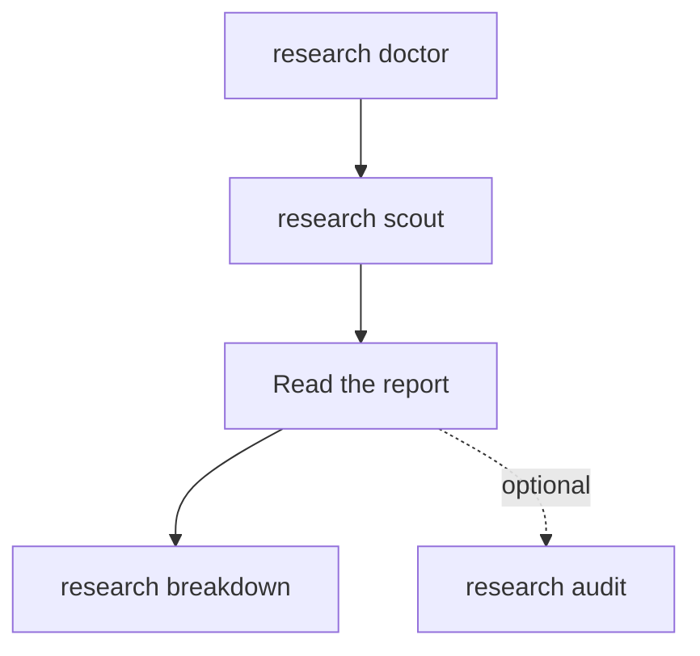
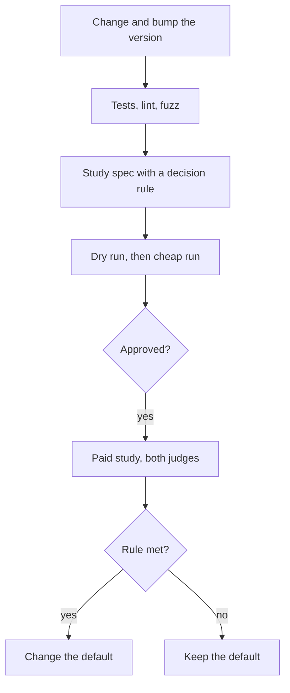
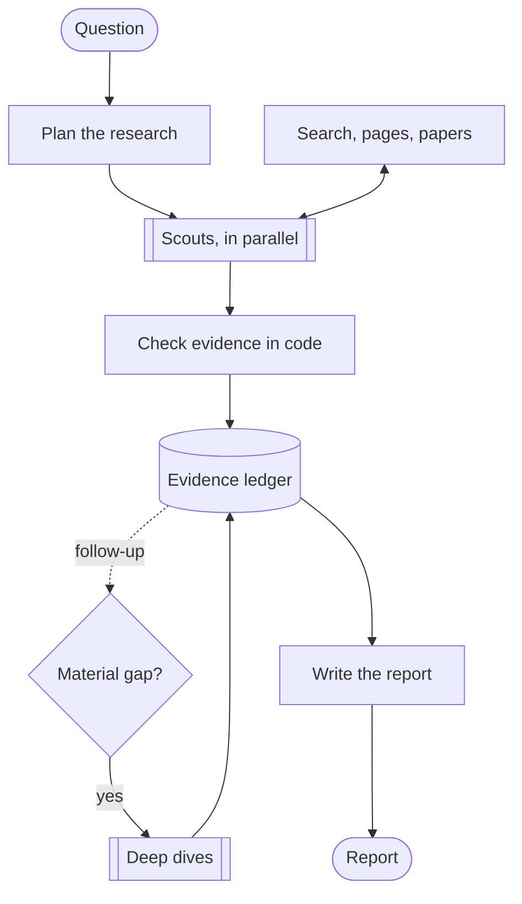

# Research Loop

Research Loop answers a research question with a short report in which every statement is traced to the evidence behind it.

[](https://github.com/rjanseko/research-loop/actions/workflows/ci.yml)

[](LICENSE)

Research Loop splits a question into a few research questions and researches them in parallel. Each research agent searches the web, reads pages and PDFs, and searches scholarly indexes. A final model then writes the report from the evidence they found. Before the report is written, code checks that evidence. A quote counts as verified only if the tools actually returned those words from the source it cites. Each source records whether the research read it in full, read its abstract, or only saw it in a search result. The report says which statements rest on thin evidence and which questions it could not answer. An optional audit then asks the configured auditor model whether the quotes behind each statement really support it.

The workflow is called Scout. It is built on [PydanticAI](https://ai.pydantic.dev), stores every run in Postgres, and traces runs in [Logfire](https://logfire.pydantic.dev).

## At a glance

| | |
|---|---|
| What you get | A Markdown report with a direct answer, inline citations, a coverage list, caveats, and a "Needs review" list of every weakness code found |
| What a run costs | With the default models, as measured: about $0.05 for a quick question, $0.10 to $0.40 for a standard one, and $0.45 to $0.60 for a deep one with Luna scouts. Every run has a budget and a deadline. |
| How long it takes | About a minute for a quick question, 3 to 9 minutes for a standard one, and up to 32 minutes for a deep one (11 to 12 minutes under the shorter limits deep runs had before `scout-followup-v10`) |
| The commands most people need | `research doctor` to check the setup, `research scout "question"` to run, `research breakdown <run id>` to see where the time and money went |

> [!WARNING]
> Every command that calls a model costs money: `scout`, `synthesize`, `rescout`, `grade`, `assess`, `audit`, `study run` (without `--dry`), and `doctor --smoke`. Use `--max-usd` to put a hard ceiling on any of them.

## Contents

- [Get started](#get-started)
- [Working with Scout](#working-with-scout)
- [Run a research question](#run-a-research-question)
- [How a run works](#how-a-run-works)
- [External services and APIs](#external-services-and-apis)
- [Limits and budgets](#limits-and-budgets)
- [Configuration inventory](docs/configuration.md)
- [Models](#models)
- [Studies and evaluation](#studies-and-evaluation)
- [Using it from Python](#using-it-from-python)
- [Storage and tracing](#storage-and-tracing)
- [Troubleshooting](#troubleshooting)
- [Development](#development)
- [Where things are](#where-things-are)

## Get started

### What you need

- Python 3.12 or later.
- Docker, for the local Postgres database. Research Loop runs without a database, but then nothing is stored and the study commands are unavailable.
- An API key for each model provider you use. The default models need an OpenAI key and an Anthropic key. Z.ai, Google, and DeepSeek keys are optional; the support audit and the second rubric judge use Z.ai.
- A Logfire token or a project configured through `logfire auth`, if you want to export traces. Without either, tracing stays in the process.

### Install

```bash
make setup && source .venv/bin/activate
cp .env.example .env
make postgres-up migrate
```

`make setup` creates `.venv` and installs the pinned dependencies from `requirements.lock`, then the project itself, which provides the `research` command. `make postgres-up` starts Postgres 16 in Docker on 127.0.0.1:5432 and waits until it is healthy, and `make migrate` applies the schema. Stop the database with `make postgres-down`; its data stays in a Docker volume.

### Configure

Settings come from `.env` or the environment, and exported variables override the file. [The configuration inventory](docs/configuration.md) lists every setting and the fixed limits that affect a run, with their current code defaults. `.env.example` shows common settings. The ones most people set are these:

| Setting | What it does |
|---|---|
| `DATABASE_URL` | The Postgres database runs are stored in. The value in `.env.example` matches `make postgres-up`. |
| `OPENAI_API_KEY`, `ANTHROPIC_API_KEY`, `ZAI_API_KEY`, `GOOGLE_API_KEY`, `DEEPSEEK_API_KEY` | Provider keys. A provider is enabled when its key is set. |
| `RESEARCH_ENABLED_PROVIDERS` | Allow only these providers, comma-separated, even if other keys are set. |
| `LOGFIRE_TOKEN` | Send traces to Logfire; an authenticated Logfire project can also enable export. `RESEARCH_LOGFIRE=false` turns tracing off completely. |
| `RESEARCH_MODELS__PLANNER`, `__SCOUT`, `__SYNTHESIZER`, `__FALLBACK`, `__JUDGE` | The model and reasoning effort for each role, as `provider:model@effort`. See [Models](#models). |
| `RESEARCH_MODELS__SCOUT_ALT` | Optional. A second scout model, such as `zai:glm-5.3@xhigh`, that takes every other scout and deep dive of a deep run. See [Rate limits](#rate-limits). |
| `RESEARCH_MODELS__AUDIT`, `__DIAGNOSE`, `__CHEAP`, `__DRY` | Audit and diagnosis defaults, plus the paid cheap and offline fake check models. See [Models](#models). |
| `RESEARCH_LIMITS__...` | A run's dollar, time, and call limits. See [Limits and budgets](#limits-and-budgets). |
| `RESEARCH_MODEL_CALLS__...` | Planner, synthesizer, evaluation, and smoke-test model request caps and timeouts. See [the configuration inventory](docs/configuration.md#model-call-limits). |
| `RESEARCH_TOKENS_PER_MINUTE` | Provider token rate limits that scouts are paced under, as JSON. See [Rate limits](#rate-limits). |
| `RESEARCH_SEARCH_ENGINE`, `EXA_API_KEY`, `SERPER_API_KEY`, `BRAVE_API_KEY` | The scouts' web search: `duckduckgo` (default), `serper`, `brave`, `exa`, or an ordered comma-separated chain. `hybrid` means DuckDuckGo then Exa. Paid engines need their keys. See [Web search](#web-search). |
| `RESEARCH_READ_FALLBACK`, `FIRECRAWL_API_KEY` | Readers to try, in order, when our fetch cannot read a page: `oa`, `exa`, `firecrawl`. Unset, every reader that can run: `oa` always, `exa` and `firecrawl` when their keys are set. Empty turns it off. See [Reading fallback](#reading-fallback). |
| `RESEARCH_CACHE_MODE`, `RESEARCH_CACHE_DIR` | The research tools' cache. See [The research cache](#the-research-cache). |
| `OPENALEX_API_KEY`, `CROSSREF_MAILTO` | Optional identification for the scholarly indexes. |

Nested settings use a double underscore, so the scout model is `RESEARCH_MODELS__SCOUT` and the cost limit is `RESEARCH_LIMITS__COST_USD`.

Codex conversations signed in with a ChatGPT plan use that plan’s [Codex allowance](https://learn.chatgpt.com/docs/pricing). Running Scout is separate: `research scout`, grading, audits, and `research doctor --smoke` call model or paid search APIs with the keys configured for this project. Those calls can incur provider API charges; a ChatGPT subscription does not cover them. The dollar limits below describe Scout spending controls, not Codex chat usage.

> [!CAUTION]
> Never commit `.env` or an API key. `.env` is ignored by git, and traces never carry request headers, so keys sent in headers stay out of Logfire.

### Check the setup

```bash
research doctor           # keys, prices, the search engine, the database, Logfire, the cache, and DNS for the research hosts
research doctor --smoke   # also makes one small paid call to each configured model
```

`research doctor` prints one line per check, marked `OK`, `WARN`, or `FAIL`, and exits non-zero if anything failed. It fails when a configured model has no key, when its provider is not enabled, or when it has no price, because a model without a price cannot have its cost capped. It also fails when Exa search is chosen without its key. `--smoke` sends each model a tiny request that must answer with a tool call. It costs well under a cent and is the quickest way to find out that a key is wrong or a model ID is stale before a paid run.

## Working with Scout

There are two ways to work with Scout: using it to answer a question, and changing it so that it answers better. The second one spends money on evidence, so it follows a fixed order.

### From a question to a report


```mermaid
flowchart TD
    doctor["research doctor"] --> run["research scout"]
    run --> read["Read the report"]
    read --> inspect["research breakdown"]
    read -. "optional" .-> audit["research audit"]
```

1. Run `research doctor` once, and `research doctor --smoke` after changing a model or a key.
2. Run `research scout "your question"`. Add `--max-usd` for a hard ceiling, `--depth` to override the planner's choice of depth, or `--follow-up` for a gap analysis and targeted deep dives.
3. Read the first lines of the report. The status says whether the run did its work. The answer's support says whether every statement rests on quote-checked evidence. The "Needs review" list says exactly what code found weak.
4. Use `research breakdown <run id>` when a run was slow, costly, or partial, and `research show <run id>` to render it again later.
5. Optionally, run `research audit <run id> --model zai:glm-5.3@high --max-usd 0.30`. It checks whether the quotes behind each statement say what the statement says, which the quote check cannot establish.

### From a change to a decision


```mermaid
flowchart TD
    change["Change and bump the version"] --> tests["Tests, lint, fuzz"]
    tests --> spec["Study spec with a decision rule"]
    spec --> checks["Dry run, then cheap run"]
    checks --> approve{"Approved?"}
    approve -- "yes" --> paid["Paid study, both judges"]
    paid --> decide{"Rule met?"}
    decide -- "yes" --> adopt["Change the default"]
    decide -- "no" --> keep["Keep the default"]
```

1. Make the change, and bump the version the change affects: the workflow version when prompts or scout behavior change, the evidence, fetch, budget, or rate-limit version when those rules change. Runs record every version, so results are only compared within one.
2. Run the narrowest tests first, then `pytest -q`, `make lint`, and `make fuzz`.
3. Write a study spec in `studies/`. Put the decision rule in its header before anything is paid for: what must not regress, what must improve, and by how much, and what added cost is acceptable. [docs/evaluation.md](docs/evaluation.md) explains how to make a comparison able to decide.
4. Run `research study run SPEC --dry`, which is free, then `--cheap`, which costs cents. Both must report no invariant violations.
5. Estimate the paid study from the most expensive comparable run, set a hard cap per run and a ceiling for the study, and get approval.
6. Run the study with `grade = true`, `audit = true`, and `diagnose = true`, one Luna study at a time. The diagnosis grades every report with a second judge as well, and the summary says where each arm lost its points and the smallest difference the study can detect.
7. Check the judges' disagreements and any points the diagnosis marks as never met by hand.
8. Record the runs, costs, and outcome in [docs/study-log.md](docs/study-log.md), and change the default only if the rule was met.

## Run a research question

```bash
research scout "Is SWE-bench Verified still a trustworthy measure of coding-agent progress?"
research scout "..." --note "Keep preprints and published papers distinct." --out report/
research scout "..." --block https://example.org/paywalled-review --max-usd 1.00
research scout "..." --block-title "The exact title of a work to keep out, wherever it appears"
research scout "..." --follow-up
research scout "..." --depth deep
```

Scout prints its models and limits before it starts, then prints the report as Markdown when it finishes. With `--out DIR` it also writes `report.md` and `run.json`, the full run record, into that directory. When `DATABASE_URL` is set the run is stored, and the last line gives its run ID for the commands below.

The options:
- `--note` adds a requirement that every role follows, and can be repeated.
- `--block URL` names a source that no tool may fetch and no evidence may cite, and can also be repeated.
- `--max-usd` sets a hard ceiling that is checked before every model request and paid search (see [Hard caps](#hard-caps)).
- `--follow-up` adds a gap analysis and up to three targeted deep dives, run in parallel, before the report is written.
- `--depth quick|standard|deep` sets how much research the run does; by default the planner chooses (see [Depth](#depth)).
- `--no-persist` keeps the run in memory even when a database is configured.

A run reports two things separately: whether it did its work, and how well its answer is backed.

Its **status** says whether it did its work:
- `complete` when every step ran to its end and the report was written;
- `partial` when a research question was cut off by a limit, deadline, or error, the gap analysis failed, or the synthesis did not finish, in which case the report lists the claims found without a written answer;
- `failed` when the run found no evidence at all;
- `cancelled` when you pressed Ctrl-C.

The **answer's support** says how well it is backed:
- `supported` when every statement in the report rests on evidence the research read, with a quote that code found in the cited source;
- `weak` when some statement rests only on thin evidence or on the research's own summary of a source, or when a research question or follow-up gap was left without an answer;
- `unsupported` when a statement rests on no evidence, or cites a claim that does not exist.

A complete run can therefore have a weak or unsupported answer; the report's first lines and its "Needs review" list say which.

### Reading the report

A report opens with a line giving the run's status, its answer's support, how many answer sentences carry no inline citation, its cost and time, and how many sources were read. Uncited sentences are a diagnostic, since some of them are framing rather than findings. The sections follow in this order; sections with nothing to say are left out.

| Section | What it holds |
|---|---|
| Needs review | Every reason code flagged the run, such as statements that rest only on search snippets, or questions that returned no evidence. |
| Gap follow-up | In follow-up mode, which gaps were chosen and why, and whether the deep dives settled them. |
| Coverage | Each thing a sufficient answer must address, and whether the answer addresses it, says it was not established, or leaves it out. |
| Summary and Answer | The written report. Each statement carries inline citations such as [s3], which name sources. |
| Caveats | Limits the synthesizer found in the evidence. |
| Statements resting on thin evidence | Statements whose only support is the research's own summary of a source with no quote checked against it, a search snippet, a record's metadata, a quote not found in its cited source, or a source no tool returned. |
| Could not establish | Research questions that returned no evidence, with the reason each one stopped. |
| Sources | Every cited source with its ID, title, publisher, date, and how much of it was read. |
| Sources that could not be read | Pages and records the tools tried and failed to fetch, with the reason, such as an HTTP status or a page over the size limit. |

### Commands after a run

```bash
research show <run id>              # render a stored run again as Markdown, or --format json
research breakdown <run id>         # where the money and time went, call by call, and why each call stopped
research audit <run id> --model zai:glm-5.3@high --max-usd 0.30   # do the quotes support each statement?
research diagnose <run id> [<run id> ...] --model zai:glm-5.3@high --max-usd 1.50   # where were rubric points lost?
research db status                  # which migrations are applied
research db reconcile --older-than 30 --apply   # close out runs that a killed process left running
```

`research breakdown` is the first thing to look at when a run is slow, expensive, or partial. It lists every model call with its start time, duration, time spent in tools, request count, tokens, cost, and the reason it stopped. After that come the cost by role and of paid web searches, the phases of the run, and how often the cache served a lookup.

## How a run works


```mermaid
flowchart TD
    question(["Question"]) --> plan["Plan the research"]
    plan --> scouts[["Scouts, in parallel"]]
    tools["Search, pages, papers"] <--> scouts
    scouts --> check["Check evidence in code"]
    check --> ledger[("Evidence ledger")]
    ledger -. "follow-up" .-> gap{"Material gap?"}
    gap -- "yes" --> dive[["Deep dives"]]
    dive --> ledger
    ledger --> synthesize["Write the report"]
    synthesize --> report(["Report"])
```

`research rescout` reruns the scouts on a stored plan, and `research synthesize` rewrites the report from a stored ledger. `research audit` checks a finished report's statements with the configured auditor model.

A run has three steps, and each one is bounded in money and time.

First, a planner chooses a depth for the question (see [Depth](#depth)) and splits it into research questions: at most two for a quick question, four for a standard one, and eight for a deep one. If planning fails or takes longer than 90 seconds, the whole question is researched as one.

Second, a scout researches each question at the same time. A scout is a model with four research tools:
- web search, on DuckDuckGo or Exa;
- a fetcher that reads HTML pages and PDFs over public HTTPS;
- a scholarly search over OpenAlex and arXiv;
- a lookup of one scholarly record by DOI, OpenAlex ID, or arXiv ID, which also draws on Crossref.

The fetcher reads pages up to 5 MB and PDFs up to 25 MB, and extracts a PDF's first 30 pages. Search results and scholarly records from blocked sources are left out, so a blocked page never reaches a scout even as a snippet or an abstract.

A scout returns claims. Each claim carries evidence: a source, a summary of what the source says, and the exact passage the claim rests on.

Each scout is told on every request how much of its budget is left. When its budget is spent, or when less than one request timeout remains before the research deadline, it loses its tools and is told to write up what it has, so that it returns a result instead of being cut off. A request that fails on a transient network fault is sent once more. A scout that fails or is still running at the deadline leaves its question unanswered, but keeps the searches it made and the pages it read.

Every request resends a scout's whole history, and page text is most of it. So once a scout has read more than 48,000 characters of pages, about four full fetches, the model sees a note in place of its oldest pages: fetch the page again before quoting it. Search results are treated the same way past 16,000 characters of snippets, keeping each result's title and address. The pages from its latest two requests always stay in view, and a page once replaced stays replaced. The re-read is served from the run's memory, and it uses none of the scout's budget. Only what the model is sent changes. The history that is stored and checked keeps every page.

Code then checks every piece of evidence against what the tools actually returned in that scout's call. The checked claims go into the evidence ledger, where each has a unique ID such as `q2/c3`.

Third, a synthesizer writes the report from the ledger. It sees only the checked evidence, never raw pages. Each statement in the report names the claim IDs behind it, and a report that cites a claim that does not exist gets one retry. If the synthesis cannot finish, the run returns the ledger's claims without a written answer.

With `--follow-up`, a gap analyzer reads the plan and the checked ledger after the scouts finish. It picks up to three missing pieces of evidence that could change the answer, preferring members of a requested set that a scout named but did not establish. A deep dive researches each one in parallel, with the same tools, checks, and budget notes as a scout. Each deep dive's claims join the ledger under the original question, in the order the gaps were chosen. The gap analyzer's decision is saved with the run. The run is marked `partial` if the analysis failed or any deep dive did not settle its gap. Follow-up mode has its own, larger budget and deadline.

Tool output is treated as untrusted data. The prompts say so, the fetcher only reads public HTTPS addresses and refuses private and loopback hosts, and blocked sources are refused by every tool and rejected as evidence. A blocked source is matched by its address, and also by the DOI or arXiv ID that a blocked address names: a copy at another address that carries the DOI, a scholarly record with that DOI, and evidence that cites the DOI alone are all blocked. A copy that carries neither the address nor the identifier, such as a mirror under its own ID, is not recognized, so a blocked list should name the source's DOI when it has one.

### Coverage

The planner also lists what a sufficient answer must address, as coverage items:
- each category or group of a requested set;
- each dimension to compare items across;
- limits, such as a date range;
- how it read any ambiguity in the question, which it records as an assumption instead of asking.

Each research question names the items it serves. Scouts say which items each claim addresses, and name as open items the members or categories their sources mention but they did not establish. Open items are short names, at most five per question. Longer items and anything shaped like a sentence are dropped, since caveats belong in a scout's unresolved list. Code adds each open item to the list with an ID made from its name, such as `o3f2a9c`, which stays the same however much research arrives later.

The gap analysis chooses its deep dives from open items first, and a deep dive may address any item still open. The synthesizer must address every item, either by citing claims that cover it or by saying it could not be established. An item the answer does not address with cited claims makes its support `weak`, and the report's Coverage section lists every item and where it stands.

### Depth

The planner also decides how much research the question warrants, and the run takes the limits of that depth:
- **quick**, for a question one or two sources can settle, such as a single fact or figure: at most two scouts, a $0.30 budget, and six minutes;
- **standard**, the limits in [Limits and budgets](#limits-and-budgets): up to four scouts, $0.75, and twelve minutes;
- **deep**, for a comprehensive report, a survey of a field, or a complete set spanning several categories: up to eight scouts and the gap follow-up, with a $3.00 budget and up to 32 minutes. Its scouts get 20 minutes of research and 48 useful tool calls each, and its deep dives 8 minutes each with a scout's full loop budget. Scouts paced under Luna's token rate need that time: in the first deep example run, three of four scouts were cut off at the standard 8 minutes with over 90% of their money unspent, and a scout cut off at its deadline keeps no claims.

`--depth` fixes the depth instead, and the plan, the run's recorded configuration, and its workflow version show the depth used.

### Evidence and what the checks mean

Each piece of evidence gets marks that only code can set.

A quote is `verified` when the tools returned those words, in that call, as part of the source the evidence cites, ignoring differences in case, spacing, and punctuation. It is `misattributed` when the words appear only in another source's text, and the evidence then names that source. It is `not_found` when they appear nowhere.

A source counts as the same work under its other addresses:
- an arXiv paper's abstract page, PDF, and ar5iv rendering;
- a DOI, and a publisher page whose address contains it or a Nature article page;
- a Wayback Machine copy, and the page it archived;
- a fetched document, and the DOI printed on its first page.

A preprint and its published version count as different works.

A source is `observed` when a tool returned it in that call. A source that no tool returned, such as one the model cited from memory, is `not_found`.

The access level says how much of the source the research saw: `full_text` for a page or PDF that was read, `abstract` for a paper's abstract from a scholarly index, `metadata` for a scholarly record without an abstract, and `snippet` for a search result.

From these marks, each statement in the report gets a support level:

| Level | When |
|---|---|
| `read` | At least one supporting item comes from a source read in full or as an abstract, and carries a `verified` quote |
| `paraphrase` | The only read support is the research's own summary of the source, with no quote that code could check |
| `shallow` | The only support is a snippet, metadata, an unverified quote, or a source no tool returned |
| `unsupported` | No evidence supports it |

Paraphrase, shallow, and unsupported statements are listed under "Needs review" and "Statements resting on thin evidence", and each makes the answer `weak` or `unsupported`. A run also counts its short quotes, verified quotes with fewer than a quarter of their claim's words.

A verified quote shows that the source contains those words, not that they carry the whole claim. That is what the support audit checks (see [Studies and evaluation](#studies-and-evaluation)). The evidence version (7) is recorded with each run.

## External services and APIs

These are all the outside services the code calls, what it sends them, and what they cost. Prices were checked on 27 September 2026; `src/research_loop/prices.toml` holds the model price corrections.

| Service | What Scout uses it for | When | Key or setting | Cost | What is sent |
|---|---|---|---|---|---|
| OpenAI | `gpt-6-sol@high`: the planner, the gap analyzer, the rubric judge, and the fallback. `gpt-6-luna@high`: scouts and deep dives; `gpt-6-luna@low`: `--cheap` checks | Default | `OPENAI_API_KEY` | Per token, from the bundled price data | Prompts, including tool output |
| Anthropic | `claude-opus-5-5@medium`: the synthesizer | Default | `ANTHROPIC_API_KEY` (scoped to a workspace) | Per token | The checked evidence ledger |
| Z.ai | `glm-5.3@high`: the support audit and the second rubric judge; any role on request | Optional | `ZAI_API_KEY` | Per token (`glm-5.3-flash` prices corrected in `prices.toml`) | Report statements and their quotes, or a report and its rubric |
| Google | Any role on request | Optional | `GOOGLE_API_KEY` | Per token | Prompts |
| DeepSeek | Any role on request | Optional | `DEEPSEEK_API_KEY` | Per token | Prompts |
| DuckDuckGo | Web search, through PydanticAI's search tool | Default search | None | Free | Search queries |
| Exa | Web search (`/search`, with highlights capped at 600 characters a result) | `RESEARCH_SEARCH_ENGINE=exa`, or `hybrid` for the searches DuckDuckGo cannot answer | `EXA_API_KEY` | $7 per 1,000 searches; each search is recorded and capped | Search queries |
| Serper | Google organic web results | Optional search engine or chain member | `SERPER_API_KEY` | Configured at $0.001 per search | Search queries |
| Brave | Web search | Optional search engine or chain member | `BRAVE_API_KEY` | Configured at $0.005 per search | Search queries |
| OpenAlex | Scholarly search and records, with abstracts and open-access links | Default | `OPENALEX_API_KEY` (optional) | Free | Search terms and identifiers |
| arXiv | Preprint search and records | Default | None | Free | Search terms and IDs |
| Crossref | Records by DOI | Default | `CROSSREF_MAILTO` (optional) | Free | DOIs |
| The public web | Reading pages and PDFs | Default | None | Free | Requests to public HTTPS addresses only |
| Europe PMC | Open-access full text of a paper our fetch could not read | The reading fallback's `oa`, on by default | None | Free | DOIs |
| CORE | Repository full text of a paper, when Europe PMC and OpenAlex have no readable copy | The reading fallback's `oa`, on by default | `CORE_API_KEY` (optional) | Free: 100 requests a day without a key, 1,000 with one | DOIs |
| Exa | Reading a page from Exa's crawl (`/contents`) | The reading fallback's `exa`, on by default when `EXA_API_KEY` is set | `EXA_API_KEY` | $1 per 1,000 pages; recorded and capped | The page's address |
| Firecrawl | Scraping a page our fetch could not read, with basic proxies only | The reading fallback's `firecrawl`, on by default when `FIRECRAWL_API_KEY` is set | `FIRECRAWL_API_KEY` | One credit a page (about $0.0054 on the Hobby plan); recorded and capped | The page's address |
| Logfire | Traces of runs, model calls, and HTTP requests | Optional | `LOGFIRE_TOKEN` or `logfire auth` | Your Logfire plan | Prompts, tool results, and timings |
| Postgres | Run records, grades, assessments, and audits | Local | `DATABASE_URL` | Free | Everything a run records |

Two more services, Jina Reader and Tavily Extract (`TAVILY_API_KEY`), are used only by `scripts/fetch_bakeoff.py`, which measured which readers best read the pages our fetcher cannot; the bake-off chose the fallback above (see [docs/study-log.md](docs/study-log.md)).

What leaves your machine:
- **To model providers:** everything a role's prompt contains, which includes text the tools returned.
- **To search and reading services:** queries, and the addresses of pages our fetch could not read.
- **To the pages themselves:** a fetch goes straight to the page's address, and the scholarly indexes see the identifiers looked up.
- **Nothing for blocked sources:** a blocked URL or scholarly identifier is refused before any request, and blocked sources are dropped from search results and scholarly records.
- **Not your keys:** traces never capture request headers, and secret query parameters such as OpenAlex's `api_key` are redacted.
- **Exa retention:** Exa's documentation lists `/search` among its zero-data-retention endpoints.

## Limits and budgets

Every run has a fixed budget. The money is divided before the run starts. The planner and synthesizer get their shares, and the scouts split the rest evenly, so four scouts get $0.075 each on a standard run. Each call stops before a request that would take it past its share, which means the total can exceed the limit by at most one request per call. These are soft limits; for a hard ceiling, use `--max-usd`.

<details>
<summary>All limits and their settings (defaults for a standard question)</summary>

| Limit | Default | Setting |
|---|---|---|
| Total cost | $0.75 | `RESEARCH_LIMITS__COST_USD` |
| Planner's share | $0.05 | `RESEARCH_LIMITS__PLANNER_USD` |
| Synthesizer's share | $0.40 | `RESEARCH_LIMITS__SYNTHESIS_USD` |
| Whole run | 12 minutes | `RESEARCH_LIMITS__DEADLINE_SECONDS` |
| Research phase | 8 minutes | `RESEARCH_LIMITS__RESEARCH_SECONDS` |
| One model request | 120 seconds | `RESEARCH_LIMITS__REQUEST_TIMEOUT_SECONDS` |
| Research questions (standard depth) | 4 | `RESEARCH_LIMITS__MAX_QUESTIONS` |
| Scouts at once | 8 | `RESEARCH_LIMITS__PARALLEL_SCOUTS` |
| Quick depth | 2 questions, $0.30 with $0.12 for synthesis, 4 minutes of research, 6 in all | `RESEARCH_LIMITS__QUICK__MAX_QUESTIONS`, `..._COST_USD`, `..._SYNTHESIS_USD`, `..._RESEARCH_SECONDS`, `..._DEADLINE_SECONDS` |
| Deep depth | 8 questions and the gap follow-up; $3.00, which leaves eight scouts about $0.21 each; 20 minutes of research and 32 in all; 48 useful tool calls a scout; deep dives of 8 minutes with 20 requests, 32 useful tool calls, and 16 failed ones | `RESEARCH_LIMITS__DEEP__MAX_QUESTIONS`, `..._FOLLOW_UP`, `..._FOLLOWUP_COST_USD`, `..._RESEARCH_SECONDS`, `..._FOLLOWUP_DEADLINE_SECONDS`, `..._SCOUT_PRODUCTIVE_CALLS`, `..._DEEP_DIVE_SECONDS`, `..._DEEP_DIVE_REQUESTS`, `..._DEEP_DIVE_PRODUCTIVE_CALLS`, `..._DEEP_DIVE_MISSES` |
| Per scout | 20 requests, 32 useful tool calls, 16 failed ones | `RESEARCH_LIMITS__SCOUT_REQUESTS`, `..._PRODUCTIVE_CALLS`, `..._MISSES` |
| Follow-up total cost | $2.00 | `RESEARCH_LIMITS__FOLLOWUP_COST_USD` |
| Follow-up gap analysis share, and each deep dive's | $0.10 and $0.25 | `RESEARCH_LIMITS__GAP_USD`, `RESEARCH_LIMITS__DEEP_DIVE_USD` |
| Gaps followed up | at most 3 | `RESEARCH_LIMITS__MAX_GAPS` |
| Follow-up whole run | 15 minutes | `RESEARCH_LIMITS__FOLLOWUP_DEADLINE_SECONDS` |
| Follow-up gap analysis and deep dive windows | 45 and 240 seconds | `RESEARCH_LIMITS__GAP_SECONDS`, `RESEARCH_LIMITS__DEEP_DIVE_SECONDS` |
| Each deep dive | 12 requests, 16 useful tool calls, 8 failed ones | `RESEARCH_LIMITS__DEEP_DIVE_REQUESTS`, `..._PRODUCTIVE_CALLS`, `..._MISSES` |

In follow-up mode, the gap analysis share and three deep-dive shares come off the top as well, which leaves four scouts $0.175 each.

A setting for one limit of a depth, such as `RESEARCH_LIMITS__DEEP__MAX_QUESTIONS=6`, changes only that limit; the depth keeps the rest of its own. The follow-up rows above apply to `--follow-up` on a standard run, and the deep row replaces them for a deep run.

A useful tool call is a search that found something, a fetch that returned text, or a scholarly call that returned works. A failed one is an empty search, an HTTP error, or a blocked address. Counting them apart lets a scout that is only failing stop early, without cutting short one that is working. The framework's own limit on tool calls sits 12 above the sum, so that a batch of parallel calls asked for just before the budget ran out can still run. When a turn asks for more tool calls than that limit leaves, only the calls that fit run, and the next request tells the model how many were dropped.

Both time limits count from the start of the run. Planning counts against the research phase, and the synthesizer gets whatever time is left once research ends, which is at least 1.5 minutes. A scout's request that reaches the 120-second timeout is not sent again, because one slow reply retried twice would fill the research window.

</details>

### Hard caps

`--max-usd` puts a hard dollar ceiling on a run or command. Before every model request, the guard reserves a conservative upper bound on what that request could cost, and refuses the request if the reservations would pass the ceiling. A paid web search reserves a fixed $0.01 the same way. When a response returns with usage that can be priced, its reservation is replaced by its actual charge. A request that fails keeps its full reservation, because the provider may still have charged for it. A request rejected with a 429 rate-limit error is the exception, because the provider did not process it.

The upper bound on a request's input starts from the last reply in its history: that reply's billed input and output tokens, plus one token per byte of everything added since, plus 4,000 tokens of framing. A first request, with no reply to start from, is bounded by twice its size in bytes plus 16,000 tokens.

The output bound is the call's output cap:
- `RESEARCH_MODEL_CALLS__PLANNER_MAX_OUTPUT_TOKENS` (16,000) for the planner, and `RESEARCH_MODEL_CALLS__RUBRIC_MAX_OUTPUT_TOKENS` / `__AUDIT_MAX_OUTPUT_TOKENS` (16,000 each) for grading and support audit;
- `RESEARCH_LIMITS__GUARDED_SCOUT_MAX_OUTPUT_TOKENS` (24,000) for scouts;
- `RESEARCH_LIMITS__SYNTHESIS_MAX_OUTPUT_TOKENS` (32,000) for synthesis.

The reservation prices the input bound at the model's highest input rate and the output bound at its output rate. It is never less than the price of one request that uses both bounds, so a long-context tier is covered. GPT-6 Luna and Sol, for example, charge 1.5 times as much for output once the input passes 272,000 tokens.

Guarded runs disable the provider SDK's retries and the fallback model, so that nothing is sent without a reservation. The reservation policy is recorded with the run as `usage-anchor-v6`; earlier versions are described in `src/research_loop/study_budget.py`.

`--max-usd` is required for frozen study cases and for `grade`, `assess`, `audit`, `synthesize`, and `rescout`. It is optional for ordinary runs.

### Rate limits

When a provider rejects a scout's request with a token rate limit and says when to retry, all of the run's scouts pause for that long, and the request is sent again up to twice. A 429 that gives no retry time, or that reports an exhausted balance, fails the call.

Retrying is not enough when parallel scouts regularly send more than the limit allows, so scouts on a model listed in `RESEARCH_TOKENS_PER_MINUTE` are also paced. Before each request, the run waits until the tokens its scouts sent that model in the last minute, plus an estimate for this request, fit under 90% of the limit. The estimate starts from the previous reply's billed tokens and counts four bytes a token for what was added since; the billed count replaces it when the reply returns.

The limit paced under is the one OpenAI reports. Every OpenAI response carries `x-ratelimit-limit-tokens`, and from a run's first response on, its pacer uses that value for the model. So a change of tier is picked up without a setting. Until then it uses the configured default, `{"openai:gpt-6-luna": 2000000}`, this project's OpenAI tier; on a lower tier, the first response brings the limit down. Setting `RESEARCH_TOKENS_PER_MINUTE` explicitly fixes the limit instead, and `'{}'` turns pacing off.

The default used to be 200,000. After the tier rose, that held every run to a tenth of the account's real limit of 2,000,000. The deep runs' scouts ran out of time under our own pacer, not OpenAI's limit (study log, 28 September 2026). Time spent waiting counts against the research window, so a tight limit makes runs slower rather than failing them. Long tool results fill the window quickly: every request resends a scout's history. The rate-limit policy is recorded with the run as `scout-429-v5`.

A deep run can also spread its scouts over two providers' limits. With `RESEARCH_MODELS__SCOUT_ALT` set, such as `zai:glm-5.3@xhigh`, a deep run's second, fourth, and later even-numbered scouts and deep dives use that model, each model with its own pacer. It applies to deep runs only, and the run records the model with its configuration. Paced under Luna's limit alone, the scouts of the first two deep example runs together sent about 115,000 tokens a minute, whether they had 8 minutes or 20. GLM-5.3 costs about seven times Luna per token, which is why a deep run has $3.00.

> [!IMPORTANT]
> Pacing is per run, so two runs at once against the same account can still reach the limit. Run one Luna study at a time.

A scout's request that fails on a connection fault that is not a timeout, such as a TLS error or a dropped connection, is sent once more after a one-second pause, under a new reservation when a hard cap is set. A second fault ends the call, and a timeout is never sent again. A server error (HTTP 500, 502, 503, or 504) is sent again twice, after pauses of 2 and 8 seconds; before this, one provider 500 ended a scout's research question. The retry policy is part of `scout-429-v5`.

### Web search

The scouts' `web_search` tool runs on DuckDuckGo unless `RESEARCH_SEARCH_ENGINE` says otherwise. DuckDuckGo is reached through `ddgs`, a library that scrapes whichever of several search sites it picks. It is free but unreliable: in production runs it returned nothing for 34% of 2,636 searches and timed out on 104 more, and 4 of 6 of those empty queries found results when tried again later.

`RESEARCH_SEARCH_ENGINE=hybrid` asks DuckDuckGo first, and Exa only when DuckDuckGo finds nothing or fails, so only those searches are paid for. The setting also accepts `serper`, `brave`, `exa`, or a comma-separated chain such as `duckduckgo,brave,exa`; a later engine runs only when earlier ones found nothing or failed. Exa is sent its recommended request, the query with `auto` search and highlights, with each result's highlights capped at 600 characters. Its API default controls the result count; the returned highlights become the snippets. They are labeled `snippet` like DuckDuckGo's, so a scout still fetches a page to read it in full. Blocked sources are left out of every engine's results, by address, DOI, or title: a frozen case's blocked work is also known by its title, so a copy at an address that carries neither, which Exa finds readily, is left out too.

Each Exa search's reported cost is added to the run's cost, and shown as `external_usd` in its checks and as "search+read" in `research breakdown`. Each engine keeps its own cache entries and rate slot. The run records its engine, so a study can compare engines with an arm that sets `RESEARCH_SEARCH_ENGINE` in its `env`.

> [!NOTE]
> Uncapped, Exa's highlights carried about 20 times the text of a DuckDuckGo search, which slowed scouts under the rate limit. Capped, ten results come to about 6,000 characters, three times a DuckDuckGo search, and old search snippets leave a scout's view like old pages (see [Scouts](#how-a-run-works)). DuckDuckGo stays the default until a comparison decides otherwise; see [docs/study-log.md](docs/study-log.md).

### Reading fallback

About 20% of the pages scouts tried to read in production runs failed, mostly with 403s from publishers behind bot protection: MDPI, RSC, ACS, OUP, AIP, and ScienceDirect were read 2 to 9% of the time. A page our fetch cannot read is tried with each reader of the reading fallback in turn. Unset, `RESEARCH_READ_FALLBACK` is every reader that can run: `oa`, which is free, always, then `exa` and `firecrawl` when their keys are set. An empty value turns the fallback off, and a list such as `oa,exa` names the readers and their order.
- `oa` finds the paper's open-access copy from an identifier in its address (a DOI, an RSC article ID, or an arXiv ID; for an MDPI address, the DOI OpenAlex records for its journal, volume, issue, and article number), through Europe PMC's full text, OpenAlex's best open-access location, or a PDF at up to three of OpenAlex's other locations, such as a repository's copy, and reads it with our own fetcher; last, it asks CORE for its full text of the DOI, spacing requests 6.5 seconds apart and stopping until CORE's reset time after a 429 or once CORE reports none left (100 requests a day without `CORE_API_KEY`, 1,000 with a free key);
- `exa` reads the page from Exa's crawl;
- `firecrawl` scrapes it with Firecrawl, using basic proxies only, never stealth or residential proxies.

The fallback runs after a 401, 403, 429, 451, or server error, a timeout or dropped connection, an empty extraction, or a page over the size limit, but not after a 404, which is usually a guessed address. A blocked URL is refused before any reader sees it. Text that is short or looks like a challenge page counts as not found, and the next reader is tried. When one succeeds, the result says `via` which one read it, quotes are checked against its text as usual, and the run counts pages by reader in `pages_read_via`. When every reader fails, the scout is told what was tried. Paid reads are recorded in `external_usd` and reserved under `--max-usd` like paid searches. Pages the fallback read are cached apart from our own, so a study arm without the fallback never gets a page only the fallback could read.

On the 160 pages our fetcher failed on, this chain read 139 and recovered 68 of the 79 quotes scouts had cited from them. It has been on by default since fetch version 14, at about $0.02 a run in paid reads; a comparison of whole runs has not yet measured its effect on reports.

### The research cache

Searches, fetched pages, and scholarly records are cached under `.cache/research-loop`, so that repeated lookups within a day are free and fast. `RESEARCH_CACHE_MODE` controls it:
- `live`, the default, reads entries up to a day old and writes new ones;
- `record` only writes;
- `replay` reads entries of any age and never goes to the network, so a miss is an error; it makes a run's research reproducible;
- `reuse` reads entries of any age, and fetches and records any miss;
- `off` neither reads nor writes.

A run records the cache's directory and mode, and how many lookups it served, by provider. A run labeled with `--study` uses its study's own cache instead, as described under [Studies and evaluation](#studies-and-evaluation).

## Models

Models are configuration, separate from the workflow. The defaults come from the settings study described in [docs/lessons.md](docs/lessons.md), and the scout model was chosen in the fixed-plan comparison in [docs/study-log.md](docs/study-log.md).

| Role | Default | Setting |
|---|---|---|
| Planner and gap analyzer | `openai:gpt-6-sol@high` | `RESEARCH_MODELS__PLANNER` |
| Scouts and deep dives | `openai:gpt-6-luna@high` | `RESEARCH_MODELS__SCOUT` |
| Synthesizer | `anthropic:claude-opus-5-5@medium` | `RESEARCH_MODELS__SYNTHESIZER` |
| Fallback after a refusal or provider error | `openai:gpt-6-sol@high` | `RESEARCH_MODELS__FALLBACK` |
| Every other scout and deep dive of a deep run | none | `RESEARCH_MODELS__SCOUT_ALT` |
| Rubric and quality judge | `openai:gpt-6-sol@high` | `RESEARCH_MODELS__JUDGE` |
| Study support auditor | `zai:glm-5.3@high` | `RESEARCH_MODELS__AUDIT` |
| Study diagnosis judge | `zai:glm-5.3@high` | `RESEARCH_MODELS__DIAGNOSE` |
| Cheap study check, every role | `openai:gpt-6-luna@low` | `RESEARCH_MODELS__CHEAP` |
| Dry study check, every role | `fake:fuzz@high` | `RESEARCH_MODELS__DRY` |

Standalone `research audit` and `research diagnose` use their configured defaults unless `--model` selects another model. A study spec's `audit_model` or `diagnose_model` overrides its configured default.

A model is named with the reasoning effort it runs at, as `provider:model@effort`. A live provider is `openai`, `anthropic`, `zai`, `google`, or `deepseek`; the offline dry model uses `fake`. The effort is `low`, `medium`, `high`, or `xhigh`. The effort is required: a setting or `--model` without one is refused before any call, so a model and its effort are always chosen together, and a run never picks an effort you did not name. PydanticAI sends `xhigh` to GLM-5.3 as its `max` level.

DeepSeek Flash uses automatic tool choice in thinking mode. DeepSeek rejects a forced tool choice in that mode; `research doctor --smoke` checks that the configured model can call a tool before a study.

Each run records the model and effort every role was sent, plus the effective model-call limits. Price entries and `RESEARCH_TOKENS_PER_MINUTE` are keyed by the model alone, without the effort. The planner and synthesizer switch to the fallback model when their own model refuses a call or its provider fails. Scouts have no fallback, since a failed scout leaves one question unanswered rather than failing the run.

A model selected for a paid command is refused before calls if it has no price, because its cost could not be capped. `src/research_loop/prices.toml` adds or corrects prices that the bundled price data lacks or gets wrong. Model IDs change often, so run `research doctor --smoke` after changing a model.

## Studies and evaluation

Research Loop includes the tools used to choose its own configuration:
- labeled runs;
- frozen benchmark cases;
- a rubric judge and a source-grounded quality judge;
- a support audit;
- commands that repeat one part of a stored run with a different model.

How quality is measured, and how a comparison is designed so that it can decide, is in [docs/evaluation.md](docs/evaluation.md). Every study so far is indexed in [docs/study-log.md](docs/study-log.md), with older entries linked to a dated archive; the entries preserve run IDs, costs, and outcomes.

```bash
research study plan studies/SPEC.toml                   # the planned runs and their worst-case cost, without running anything
research study run studies/SPEC.toml --dry              # free: fake models, an offline web, and a separate database
research study run studies/SPEC.toml --cheap            # cents: every role on a cheap model, against the real web
research study run studies/SPEC.toml                    # the paid study
research scout --case drb2-task8 --max-usd 3.00 --study NAME --arm ARM --replicate 1
research grade <run id> --case drb2-task8 --max-usd 1.00
research assess <run id> --case st07 --max-usd 1.00
research audit <run id> [<run id> ...] --model zai:glm-5.3@high --max-usd 1.00
research synthesize <run id> --model openai:gpt-6-sol@high --max-usd 1.00 --study NAME --arm ARM --replicate 1
research rescout <run id> --model zai:glm-5.3-flash@high --max-usd 3.00 --study NAME --arm ARM --replicate 1
```

`research study run SPEC.toml` runs a whole study from a spec, in this way:
- every arm, case or stored run, and replicate runs one at a time;
- the arm order rotates by one place on each replicate and target, so each arm goes first equally often against the study's shared cache (two arms alternate);
- each run, grade, and audit has a hard cap, and arms at other git refs run from temporary worktrees;
- when the spec says so, each run is graded (`grade = true`), audited (`audit = true`), and diagnosed (`diagnose = true`).

A rescout writes no report, so a rescout study cannot be graded or audited. Its `diagnose = true` grades each rescout's claims and research instead, and the summary compares arms on the rubric points their claims met (`research diagnose` accepts a rescout's run ID the same way). This compares scout models on one fixed plan with no planner or synthesizer in between. `--dry` copies a rescout or synthesis study's source runs from the main database into the dry one first.

It refuses a spec whose planned runs could cost more than its ceiling by their estimates. It also refuses one with an arm whose runs would not start, such as an arm that turns on the reading fallback without its API keys. It snapshots model IDs, effort, and model-call limits from the parent configuration once at the start, then applies each arm's overrides and the dry or cheap mode. It checks each arm with that effective environment and code before any run, so an earlier arm cannot spend first. The estimates only plan the study; the ceiling is enforced by the hard caps. Each run, grade, and audit gets a cap no larger than what remains of the ceiling, and a run's cap keeps room for its grade and audit by their estimates. A step whose cost cannot be read, because it wrote no record or its output could not be parsed, counts its whole cap as spent. Set the ceiling above the worst case by the estimates, or the last runs get smaller caps than the first and may be cut short. It writes a summary table to `runs/STUDY/summary.md`: status, answer support, cost, time, quote checks, statement support, audit verdicts, coverage, and grades. The spec format is described in `src/research_loop/study.py`, and `studies/` holds the specs used so far. A spec’s `audit_model` or `diagnose_model` overrides the corresponding model from the arm’s environment; when omitted, the study uses the configured defaults above.

Every run records a digest of its input, its prompt fingerprint, its git commit, and the settings each model was actually sent. A run labeled with `--study` keeps its searches, pages, and scholarly records in `.cache/studies/NAME` in `reuse` mode. A lookup any run of the study has made returns the same answer to every later run, on any day, which removes changes in the web from a comparison. The models themselves cannot be made deterministic, so arms still need repeated runs.

The study cases are in `src/research_loop/study_cases.jsonl`:
- **Short cases,** st01 to st05, catch regressions.
- **st07,** a contested question, is a diagnostic.
- **Development cases,** `drb2-task8`, `drb2-task68-plus`, `drb2-task98-plus`, `drb2-task75`, `drb2-task15`, and `drb2-task21`, keep the exact tasks, expert rubrics, and blocked expert-report URLs from a pinned snapshot of [DeepResearch Bench II](https://github.com/imlrz/DeepResearch-Bench-II).
- **Held-out cases,** `drb2-task82`, `drb2-task59`, and `drb2-task78`, are run only to confirm a change before adopting it.

`research scout --case` sends only the task to the research agents and blocks the expert reports as sources. It requires a database and `--max-usd`. `scripts/import_drb2.py TASK... --role held-out` freezes further tasks.

The judges and the audit:
- **`research grade`** scores a stored report against a case's rubric, one verdict per point. Grade close decisions with both judges: the choice of judge alone has moved a long case's score by up to 8 points.
- **`research assess`** judges overall quality and specific facts against independently reviewed source summaries.
- **`research audit`** asks the configured auditor model whether the verified quotes behind each report statement say what the statement says. It also sends the record the tools returned for each quoted source, and nothing a model wrote about it.
- **`research synthesize` and `research rescout`** repeat the synthesis of a stored ledger, or the research of a stored plan, with another model, so that one step can be compared alone.

### Finding bugs before paying

The harness in `src/research_loop/dryrun.py` finds bugs in the workflow's plumbing, IDs, money, and error handling for free, so that a paid study measures research instead of paying for a crash. It never produces useful research, and it cannot see quality problems.

- **`research fuzz --runs N`** runs seeded Scout runs in process, each followed by a rescout and a fixed-ledger synthesis. A fuzz model stands in for every role, and an offline world stands in for the web, including a fake Exa API.
  - The model returns edge cases and injects rate limits, server errors, refusals, one-time TLS faults, and oversized costs.
  - The world serves copies of the same work, 403s, redirects to blocked addresses, timeouts, broken bodies, and a PDF whose text holds lone surrogates.
  - After each run, `check_record` checks the invariants, and each problem is printed with the command that reproduces it. `make fuzz` runs 200.
- **`research study run SPEC --dry [--seeds N]`** runs a study's real commands in subprocesses with the configured `RESEARCH_MODELS__DRY` fake model, the offline world, and a separate `research_dry` database (`make dry-db`). It costs nothing.
- **`research study run SPEC --cheap`** runs one replicate of the first target, with every role on the configured `RESEARCH_MODELS__CHEAP` model (`openai:gpt-6-luna@low` by default), against the real web. Each run and the whole check are capped at $0.25.
- **Hypothesis property tests** in `tests/test_properties.py` check the pure functions, and a fixed fuzz sweep runs with the test suite.

When a paid run finds a bug, it first gets the narrowest test that would have caught it: a unit test for a local bug, and fuzz or invariant behavior only when the bug comes from how a run's parts interact. `fake:` models and the offline world only run together, so neither can reach a real run.

## Using it from Python

```python
from research_loop.scout import scout

run = await scout(
    "How do long-horizon coding agents recover from errors?",
    notes=["Prefer peer-reviewed sources."],
    blocked_urls=["https://example.org/paywalled"],
)
run.status      # "complete", "partial", or "failed"
run.report      # title, summary, answer, caveats, and the claim IDs behind each statement
run.checks      # support for each statement, questions not established, sources not reached, review reasons
run.ledger      # every piece of evidence, by research question, with claim IDs such as q2/c3
run.cost_usd    # the run's cost, model calls and paid searches together
run.to_record() # the run as JSON, the same record `--out` writes to run.json
```

`scout` reads settings from the environment unless you pass `settings=`. A cancelled run is recorded as `cancelled`, and the cancellation is raised. Without `store=`, the run is kept in memory. It raises `ConfigError` before any call when a configured model cannot run or cannot be priced. `follow_up=True` turns on the gap follow-up, and `budget=StudyBudget(Decimal("1.00"))` from `research_loop.study_budget` sets a hard cap.

## Storage and tracing

Postgres keeps each run: its question, configuration, plan, report, evidence ledger, and checks. It also keeps every model call, with its usage, cost, output, full messages, why it stopped, and, for a scout, how long its tools ran. Rubric grades, quality assessments, and support audits are kept in their own tables, each with its judge, version, cost, and messages. `research db migrate` applies the schema in `src/research_loop/migrations/`.

Each run is one Logfire trace, and every span in it carries the run ID; the trace ID is stored on the run's database row. Each agent call is an `invoke_agent` span named for its role, and carries the run ID, role, question ID, and depth as metadata, which never reaches the model. Page fetches, scholarly lookups, and Exa searches appear as HTTP spans with their status and latency, with request headers left out and secret query parameters redacted. DuckDuckGo searches go through the search library and are not traced at the HTTP level. Traces include prompts and tool results, and are sent when a Logfire token or authenticated project is available.

## Troubleshooting

<details>
<summary>A run refuses to start with "Cannot run"</summary>

A configured model has no key, its provider is not enabled, or it has no price; or Exa search is chosen without `EXA_API_KEY`. The message names the problem, and `research doctor` shows the same.

</details>

<details>
<summary>A scout's question fails with "provider error ModelHTTPError 429"</summary>

If the message mentions tokens per minute, the account's rate limit was reached; check that `RESEARCH_TOKENS_PER_MINUTE` matches your tier, and that no other run is using the same account. If it mentions balance or quota, the account is out of credit, and `research doctor --smoke` will fail the same way.

</details>

<details>
<summary>A call fails with "study budget refused"</summary>

The `--max-usd` ceiling would have been passed by the next request's conservative reservation. `research breakdown` shows what the run spent, and the refused reservation is in the call's stop reason.

</details>

<details>
<summary>The synthesizer fails with an HTTP 400 from Anthropic before writing anything</summary>

Check that the Anthropic key is scoped to a workspace; an unscoped key is rejected.

</details>

<details>
<summary>A question is cut off with "network error SSLError" or a similar reason</summary>

A scout's request that fails on a connection fault is sent once more after a second. So this means the fault happened twice, or once after a streamed reply had begun, and it ended that one call. The rest of the run continues, and the question is listed under "Could not establish".

</details>

<details>
<summary>Runs are slow, and "model" time dominates in <code>research breakdown</code></summary>

The scouts are probably waiting under the token rate limit. Long tool results, such as uncapped search highlights or many large pages, make every later request bigger. Compare the input tokens per scout with the limit in `RESEARCH_TOKENS_PER_MINUTE`.

</details>

<details>
<summary>Runs stay <code>running</code> in the database after a process was killed</summary>

A run stopped with Ctrl-C or SIGTERM, the signal `kill` and process managers send, records itself and its calls as `cancelled`. One whose process died without that, as on SIGKILL or a crash, stays `running`. Run `research db reconcile --older-than 30` to count them, and add `--apply` to mark them failed.

</details>

<details>
<summary>A native crash prints a Python stack to stderr and exits with code 139</summary>

Scout enables fault tracing, so the stack shows where it happened; the page and search parsers use a native HTML library.

</details>

## Development

```bash
make setup   # create .venv from requirements.lock
make test    # the test suite, offline
make lint    # ruff
make fuzz    # 200 seeded fuzz runs
make lock    # re-pin requirements.lock after changing pyproject.toml
make skills  # repair the agent skill links after upgrading a package that bundles skills
```

The tests never reach a model provider or the internet. `tests/conftest.py` refuses provider requests and any connection to a non-loopback host, so tests script models with PydanticAI's `FunctionModel`, serve pages with the `serve` and `public_urls` fixtures, and fake other services with `httpx.MockTransport`. The Postgres tests in `tests/test_store.py` run only when `RESEARCH_TEST_DATABASE_URL` names a database whose name contains `test`. CI runs lint, the full suite against Postgres, a lockfile check, and a wheel install on every pull request.

[CONTRIBUTING.md](CONTRIBUTING.md) explains how to send a pull request, and [AGENTS.md](AGENTS.md) sets out the rules for changing the code. Any change to text a model sees counts as a behavior change.

## Where things are

| Module in `src/research_loop/` | What it does |
|---|---|
| `scout.py` | The workflow: plan and choose a depth, take its budget, scout, check, optionally analyze gaps and dive, synthesize; also fixed-ledger synthesis and fixed-plan rescouts |
| `agents.py`, `prompts.py` | The planner, scout, gap analyzer, and synthesizer agents, their instructions, and their output checks |
| `tools.py`, `web.py`, `scholar.py`, `acquisition.py` | The research tools, web search (DuckDuckGo and Exa), page and PDF extraction, the public-HTTPS fetch guard, and the cache |
| `reading.py` | The reading fallback: open-access copies, Exa's crawl, and Firecrawl, tried in order when our fetch fails |
| `evidence.py`, `schemas.py` | The evidence ledger, the quote and source checks, the support levels, and the data types |
| `budget_notes.py` | The scouts' per-request budget notes, tool withdrawal, and tool-batch trimming |
| `rate_limit.py`, `study_budget.py` | Rate-limit and network retries, pacing, and the hard-cap reservation guard |
| `config.py`, `models.py`, `prices.py`, `prices.toml` | Settings, model construction, and price corrections |
| `store.py`, `db.py`, `migrations/` | Run records in Postgres or memory, and the schema |
| `render.py`, `cli.py`, `doctor.py`, `telemetry.py`, `breakdown.py` | Reports, the `research` command, setup checks, Logfire, and cost and time breakdowns |
| `evals.py`, `quality.py`, `study_cases.jsonl`, `quality_packets.jsonl` | The rubric judge, the quality judge, and their cases |
| `audit.py` | The support audit: whether the verified quotes behind each report statement say what it says |
| `diagnose.py` | The post-run diagnosis: where a run's rubric points were lost, and whether a score can show a change |
| `study.py`, `coverage.py` | The study runner, and the count of a development case's expected set a run found |
| `dryrun.py` | The bug-finding harness: the fuzz model, the offline world, the invariants, and `research fuzz` |

In `scripts/`:
- `bootstrap.sh` sets up the environment;
- `import_drb2.py` freezes DeepResearch Bench II tasks as study cases;
- `ledger_coverage.py` counts how much of a development case's expected set a run found;
- `rescore_quotes.py` re-checks every stored scout call's quotes under the current evidence rules;
- `fetch_bakeoff.py` tries other ways to read the pages our fetcher failed on.

The last three make no model calls.

| In `docs/` | What it holds |
|---|---|
| [study-log.md](docs/study-log.md) | Index of every study, paid run, and offline re-scoring, linking to archived detail where needed |
| [evaluation.md](docs/evaluation.md) | How quality is measured and how a comparison is set up so that it can decide |
| [lessons.md](docs/lessons.md) | What the first design and Scout's first days taught |
| [notes.md](docs/notes.md) | Ideas with some evidence but no decision yet: cache warming and a source ranker |
| [archive/](docs/archive/) | Superseded plans and dated historical study-log entries |

`.agents/skills/` holds agent skills used as API references, such as Exa's `build-with-exa`. The first design of this project, a six-role graph with benchmark adapters and long-horizon studies, is kept at the git tag `archive/pre-scout-2026-09`.

## License

MIT. See [LICENSE](LICENSE).
