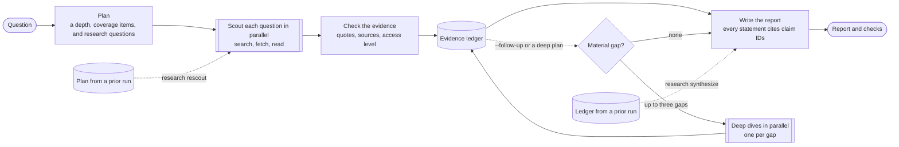

# Research Loop

Research Loop answers a research question with a short report in which every statement cites the evidence behind it. It splits the question into a few research questions, researches them in parallel with web search, page and PDF reading, and scholarly search, and then writes a report from the evidence it found. Code checks that evidence before the report is written: a quote counts as verified only if the research tools actually returned those words from the source it cites, and each source records whether the research read it in full, read its abstract, or only saw it in a search result. The report tells you which statements rest on thin evidence and which questions it could not answer.

The workflow is called Scout. A normal run costs about $0.25 and stops within twelve minutes. Every run has a fixed dollar budget and deadline, and each model call is stored with its messages, usage, and cost so that a run can be examined, re-checked, or compared with others afterwards.

Research Loop is built on [PydanticAI](https://ai.pydantic.dev). Runs are stored in Postgres and traced in [Logfire](https://logfire.pydantic.dev).

## What you need

- Python 3.12 or later.
- Docker, for the local Postgres database. Research Loop runs without a database, but then nothing is stored and the study commands are unavailable.
- An API key for each model provider you use. The default models need an OpenAI key and an Anthropic key. Z.ai and Google keys are optional.
- A Logfire token, if you want traces. Without one, tracing stays in the process.

## Install

```bash
make setup && source .venv/bin/activate
cp .env.example .env
make postgres-up migrate
```

`make setup` creates `.venv` and installs the pinned dependencies from `requirements.lock`, then the project itself, which provides the `research` command. `make postgres-up` starts Postgres 16 in Docker on 127.0.0.1:5432 and waits until it is healthy, and `make migrate` applies the schema. Stop the database with `make postgres-down`; its data stays in a Docker volume.

## Configure

Settings come from `.env` or the environment, and exported variables override the file. `.env.example` lists every setting with a comment. The ones most people set are these:

| Setting | What it does |
|---|---|
| `DATABASE_URL` | The Postgres database runs are stored in. The value in `.env.example` matches `make postgres-up`. |
| `OPENAI_API_KEY`, `ANTHROPIC_API_KEY`, `ZAI_API_KEY`, `GOOGLE_API_KEY` | Provider keys. A provider is enabled when its key is set. |
| `RESEARCH_ENABLED_PROVIDERS` | Allow only these providers, comma-separated, even if other keys are set. |
| `LOGFIRE_TOKEN` | Send traces to Logfire. `RESEARCH_LOGFIRE=false` turns tracing off completely. |
| `RESEARCH_MODELS__PLANNER`, `__SCOUT`, `__SYNTHESIZER`, `__FALLBACK` | The model and reasoning effort for each role, as `provider:model@effort`. See [Models](#models). |
| `RESEARCH_LIMITS__...` | A run's dollar, time, and call limits. See [Limits and budgets](#limits-and-budgets). |
| `RESEARCH_TOKENS_PER_MINUTE` | Provider token rate limits that scouts are paced under, as JSON. See [Rate limits](#rate-limits). |
| `RESEARCH_CACHE_MODE`, `RESEARCH_CACHE_DIR` | The research tools' cache. See [The research cache](#the-research-cache). |
| `OPENALEX_API_KEY`, `CROSSREF_MAILTO` | Optional identification for the scholarly indexes. |

Nested settings use a double underscore, so the scout model is `RESEARCH_MODELS__SCOUT` and the cost limit is `RESEARCH_LIMITS__COST_USD`. Never commit `.env`; it is ignored by git.

## Check the setup

```bash
research doctor           # keys, prices, the database, Logfire, the cache, and DNS for the research hosts
research doctor --smoke   # also makes one small paid call to each configured model
```

`research doctor` prints one line per check, marked `OK`, `WARN`, or `FAIL`, and exits non-zero if anything failed. It fails when a configured model has no key, when its provider is not enabled, or when it has no price, because a model without a price cannot have its cost capped. `--smoke` sends each model a tiny request that must answer with a tool call. It costs well under a cent and is the quickest way to find out that a key is wrong or a model ID is stale before a paid run.

## Run a research question

```bash
research scout "Is SWE-bench Verified still a trustworthy measure of coding-agent progress?"
research scout "..." --note "Keep preprints and published papers distinct." --out report/
research scout "..." --block https://example.org/paywalled-review --max-usd 1.00
research scout "..." --follow-up
research scout "..." --depth deep
```

Scout prints its models and limits before it starts, then prints the report as Markdown when it finishes. With `--out DIR` it also writes `report.md` and `run.json`, the full run record, into that directory. When `DATABASE_URL` is set the run is stored, and the last line gives its run ID for the commands below.

`--note` adds a requirement that every role follows, and can be repeated. `--block URL` names a source that no tool may fetch and no evidence may cite, and can also be repeated. `--max-usd` sets a hard ceiling that is checked before every model request (see [Hard caps](#hard-caps)). `--follow-up` adds a gap analysis and up to three targeted deep dives, run in parallel, before the report is written. `--depth quick|standard|deep` sets how much research the run does; by default the planner chooses (see [Depth](#depth)). `--no-persist` keeps the run in memory even when a database is configured.

A run reports two things separately: whether it did its work, and how well its answer is backed. Its status says the first. It is `complete` when every step ran to its end and the report was written, and `partial` when a research question was cut off by a limit, deadline, or error, the gap analysis failed, or the synthesis did not finish, in which case the report lists the claims found without a written answer. A run that found no evidence at all is `failed`, and pressing Ctrl-C records it as `cancelled`. The answer's support says the second. It is `supported` when every statement in the report rests on evidence the research read and whose quote code found in the cited source, `weak` when some statement rests only on thin evidence or on the research's own summary of a source, a research question or follow-up gap was left without an answer, and `unsupported` when a statement rests on no evidence or cites a claim that does not exist. A complete run can therefore have a weak or unsupported answer; the report's first lines and its "Needs review" list say which.

### Reading the report

A report opens with a line giving the run's status, its answer's support, how many answer sentences carry no inline citation, its cost and time, and how many sources were read. Uncited sentences are a diagnostic: some are framing rather than findings. The sections follow, in this order; sections with nothing to say are left out.

| Section | What it holds |
|---|---|
| Needs review | Every reason code flagged the run, such as statements that rest only on search snippets, or questions that returned no evidence. |
| Gap follow-up | In follow-up mode, which gaps were chosen and why, and whether the deep dives settled them. |
| Coverage | Each thing a sufficient answer must address, and whether the answer addresses it, says it was not established, or leaves it out. |
| Summary and Answer | The written report. Each statement carries inline citations such as [s3], which name sources. |
| Caveats | Limits the synthesizer found in the evidence. |
| Statements resting on thin evidence | Statements whose only support is the research's own summary of a source with no quote checked against it, a search snippet, a record's metadata, a quote not found in its cited source, or a source no tool returned. |
| Could not establish | Research questions that returned no evidence, with the reason each one stopped. |
| Sources | Every cited source with its ID, title, publisher, date, and how much of it was read. |
| Sources that could not be read | Pages and records the tools tried and failed to fetch, with the reason, such as an HTTP status or a page over the size limit. |

### Commands after a run

```bash
research show <run id>              # render a stored run again as Markdown, or --format json
research breakdown <run id>         # where the money and time went, call by call, and why each call stopped
research db status                  # which migrations are applied
research db reconcile --older-than 30 --apply   # close out runs that a killed process left running
```

`research breakdown` is the first thing to look at when a run is slow, expensive, or partial. It lists every model call with its start time, duration, time spent in tools, request count, tokens, cost, and the reason it stopped, followed by the cost by role, the phases of the run, and how often the cache served a lookup.

## How a run works


```mermaid
flowchart LR
    question(["Question"]) --> plan["Plan<br/>a depth, coverage items, and research questions"]
    plan --> scouts[["Scout each question in parallel<br/>search, fetch, read"]]
    prior_plan[("Plan from a prior run")] -. "research rescout" .-> scouts
    scouts --> check["Check the evidence<br/>quotes, sources, access level"]
    check --> ledger[("Evidence ledger")]
    ledger --> synthesize["Write the report<br/>every statement cites claim IDs"]
    ledger -. "--follow-up or a deep plan" .-> gap{"Material gap?"}
    gap -- "up to three gaps" --> dive[["Deep dives in parallel<br/>one per gap"]]
    dive --> ledger
    gap -- "none" --> synthesize
    prior_ledger[("Ledger from a prior run")] -. "research synthesize" .-> synthesize
    synthesize --> report(["Report and checks"])
```

A run has three steps, and each one is bounded in money and time.

First, a planner chooses a depth for the question (see [Depth](#depth)) and splits it into research questions: at most two for a quick question, four for a standard one, and eight for a deep one. If planning fails or takes longer than 90 seconds, the whole question is researched as one.

Second, a scout researches each question at the same time. A scout is a model with four research tools: web search, a fetcher that reads HTML pages and PDFs over public HTTPS, a scholarly search over OpenAlex and arXiv, and a lookup of one scholarly record by DOI, OpenAlex ID, or arXiv ID, which also draws on Crossref. The fetcher reads pages up to 5 MB and PDFs up to 25 MB, and extracts a PDF's first 30 pages. A scout returns claims, and each claim carries evidence: a source, a summary of what the source says, and usually an exact quote. Each scout is told on every request how much of its budget is left. When its budget is spent, or when less than one request timeout remains before the research deadline, it loses its tools and is told to write up what it has, so that it returns a result instead of being cut off. A scout that fails or is still running at the deadline leaves its question unanswered but keeps the searches it made and the pages it read.

Code then checks every piece of evidence against what the tools actually returned in that scout's call. The checked claims go into the evidence ledger, where each has a unique ID such as `q2/c3`.

Third, a synthesizer writes the report from the ledger. It sees only the checked evidence, never raw pages. Each statement in the report names the claim IDs behind it, and a report that cites a claim that does not exist gets one retry. If the synthesis cannot finish, the run returns the ledger's claims without a written answer.

With `--follow-up`, a gap analyzer reads the plan and the checked ledger after the scouts finish. It picks up to three missing pieces of evidence that could change the answer, preferring members of a requested set that a scout named but did not establish, and a deep dive researches each one in parallel with the same tools, checks, and budget notes as a scout. Each deep dive's claims join the ledger under the original question, in the order the gaps were chosen. The gap analyzer's decision is saved with the run, and the run is marked `partial` if the analysis failed or any deep dive did not settle its gap. Follow-up mode has its own, larger budget and deadline.

### Coverage

The planner also lists what a sufficient answer must address, as coverage items: each category or group of a requested set, each dimension to compare items across, limits such as a date range, and how it read any ambiguity in the question, which it records as an assumption instead of asking. Each research question names the items it serves. Scouts say which items each claim addresses, and name as open items the members or categories their sources mention but they did not establish, as short names, at most five per question (longer items and anything shaped like a sentence are dropped; caveats belong in a scout's unresolved list); code adds those to the list with an ID made from the item's name, such as `o3f2a9c`, which stays the same however much research arrives later, since the categories that matter are often learned during research rather than stated in the question. The gap analysis chooses its deep dives from open items first, and a deep dive may address any item still open. The synthesizer must address every item, citing claims that cover it or saying it could not be established. An item the answer does not address with cited claims makes its support `weak`, and the report's Coverage section lists every item and where it stands.

### Depth

The planner also decides how much research the question warrants, and the run takes the limits of that depth. A `quick` question, one that one or two sources can settle, such as a single fact or figure, gets at most two scouts, a $0.30 budget, and six minutes. A `standard` question gets the limits in [Limits and budgets](#limits-and-budgets): up to four scouts, $0.75, and twelve minutes. A `deep` question, such as a comprehensive report, a survey of a field, or a complete set spanning several categories, gets up to eight scouts and the gap follow-up, with its $2.00 budget and fifteen minutes. `--depth` fixes the depth instead, and the plan, the run's recorded configuration, and its workflow version show the depth used. A rescout researches a stored plan with the limits of that plan's depth; plans made before depths existed count as standard.

Tool output is treated as untrusted data. The prompts say so, the fetcher only reads public HTTPS addresses and refuses private and loopback hosts, and blocked URLs are refused by every tool and rejected as evidence.

### Evidence and what the checks mean

Each piece of evidence gets marks that only code can set.

A quote is `verified` when the tools returned those words, in that call, as part of the source the evidence cites, ignoring differences in case, spacing, and punctuation. It is `misattributed` when the words appear only in another source's text, and the evidence then names that source; it is `not_found` when they appear nowhere. A source counts as the same work under its other addresses: an arXiv paper's abstract page, PDF, and ar5iv rendering; a DOI and a publisher page whose address contains it, or a Nature article page; a Wayback Machine copy and the page it archived; and a fetched document and the DOI printed on its first page. A preprint and its published version count as different works.

A source is `observed` when a tool returned it in that call. A source that no tool returned, such as one the model cited from memory, is `not_found`.

The access level says how much of the source the research saw. It is `full_text` for a page or PDF that was read, `abstract` for a paper's abstract from a scholarly index, `metadata` for a scholarly record without an abstract, and `snippet` for a search result.

From these marks, each statement in the report gets a support level. It is `read` when at least one supporting item comes from a source read in full or as an abstract and carries a `verified` quote. It is `paraphrase` when the only read support is the research's own summary of the source, with no quote: the research read the source, but code cannot check that the source says what the summary says. It is `shallow` when the only support is a snippet, metadata, an unverified quote, or a source no tool returned. It is `unsupported` when no evidence supports it. Paraphrase, shallow, and unsupported statements are listed under "Needs review" and "Statements resting on thin evidence", and each makes the answer `weak` or `unsupported`.

A verified quote shows that the source contains those words, not that they carry the whole claim. A run also counts its short quotes, verified quotes with fewer than a quarter of their claim's words, as `quotes_short` in its checks; a short quote is often an exact figure or name and does not lower a statement's support. None of these checks establishes that a claim follows from its source; the evidence version (7) is recorded with each run.

## Limits and budgets

Every run has a fixed budget. These are the defaults for a standard question; [Depth](#depth) describes the quick and deep ones:

| Limit | Default | Setting |
|---|---|---|
| Total cost | $0.75 | `RESEARCH_LIMITS__COST_USD` |
| Planner's share | $0.05 | `RESEARCH_LIMITS__PLANNER_USD` |
| Synthesizer's share | $0.40 | `RESEARCH_LIMITS__SYNTHESIS_USD` |
| Whole run | 12 minutes | `RESEARCH_LIMITS__DEADLINE_SECONDS` |
| Research phase | 8 minutes | `RESEARCH_LIMITS__RESEARCH_SECONDS` |
| One model request | 120 seconds | `RESEARCH_LIMITS__REQUEST_TIMEOUT_SECONDS` |
| Research questions (standard depth) | 4 | `RESEARCH_LIMITS__MAX_QUESTIONS` |
| Scouts at once | 8 | `RESEARCH_LIMITS__PARALLEL_SCOUTS` |
| Quick depth | 2 questions, $0.30 with $0.12 for synthesis, 4 minutes of research, 6 in all | `RESEARCH_LIMITS__QUICK__MAX_QUESTIONS`, `..._COST_USD`, `..._SYNTHESIS_USD`, `..._RESEARCH_SECONDS`, `..._DEADLINE_SECONDS` |
| Deep depth | 8 questions and the gap follow-up | `RESEARCH_LIMITS__DEEP__MAX_QUESTIONS`, `RESEARCH_LIMITS__DEEP__FOLLOW_UP` |
| Per scout | 20 requests, 32 useful tool calls, 16 failed ones | `RESEARCH_LIMITS__SCOUT_REQUESTS`, `..._PRODUCTIVE_CALLS`, `..._MISSES` |
| Follow-up total cost | $2.00 | `RESEARCH_LIMITS__FOLLOWUP_COST_USD` |
| Follow-up gap analysis share, and each deep dive's | $0.10 and $0.25 | `RESEARCH_LIMITS__GAP_USD`, `RESEARCH_LIMITS__DEEP_DIVE_USD` |
| Gaps followed up | at most 3 | `RESEARCH_LIMITS__MAX_GAPS` |
| Follow-up whole run | 15 minutes | `RESEARCH_LIMITS__FOLLOWUP_DEADLINE_SECONDS` |
| Follow-up gap analysis and deep dive windows | 45 and 240 seconds | `RESEARCH_LIMITS__GAP_SECONDS`, `RESEARCH_LIMITS__DEEP_DIVE_SECONDS` |
| Each deep dive | 12 requests, 16 useful tool calls, 8 failed ones | `RESEARCH_LIMITS__DEEP_DIVE_REQUESTS`, `..._PRODUCTIVE_CALLS`, `..._MISSES` |

The money is divided before the run starts. The planner and synthesizer get their shares and the scouts split the rest evenly, so four scouts get $0.075 each. In follow-up mode, the gap analysis share and three deep dive shares come off the top as well, leaving four scouts $0.175 each. Each call stops before a request that would take it past its share, which means the total can exceed the limit by at most one request per call. These are soft limits; for a hard ceiling, use `--max-usd`.

A useful tool call is a search that found something, a fetch that returned text, or a scholarly call that returned works. A failed one is an empty search, an HTTP error, or a blocked address. Counting them apart lets a scout that is only failing stop early without cutting short one that is working. The framework's own limit on tool calls sits 12 above the sum, so that a batch of parallel calls asked for just before the budget ran out can still run. A turn that asks for more tool calls than that limit leaves runs only the calls that fit, and the next request tells the model how many were dropped.

Both time limits count from the start of the run. Planning counts against the research phase, and the synthesizer gets whatever time is left once research ends, which is at least 1.5 minutes. A scout's request that reaches the 120-second timeout is not sent again, because one slow reply retried twice would fill the research window.

### Hard caps

`--max-usd` puts a hard dollar ceiling on a run or command. Before every model request, the guard reserves a conservative upper bound on what that request could cost and refuses the request if the reservations would pass the ceiling. When a response returns with usage that can be priced, its reservation is replaced by its actual charge. A request that fails keeps its full reservation, because the provider may still have charged for it. A request rejected with a 429 rate-limit error is the exception, because the provider did not process it.

The upper bound on a request's input starts from the last reply in its history: that reply's billed input and output tokens, plus one token per byte of everything added since, plus 4,000 tokens of framing. A first request, which has no reply to start from, is bounded by twice its size in bytes plus 16,000 tokens. The output bound is the call's output cap: 16,000 tokens for the planner and the grading judge, `RESEARCH_LIMITS__GUARDED_SCOUT_MAX_OUTPUT_TOKENS` (24,000) for scouts, and `RESEARCH_LIMITS__SYNTHESIS_MAX_OUTPUT_TOKENS` (32,000) for synthesis. Guarded runs disable the provider SDK's retries and the fallback model, so that nothing is sent without a reservation. The reservation policy is recorded with the run as `usage-anchor-v4`; earlier versions are described in `src/research_loop/study_budget.py`.

`--max-usd` is required for frozen study cases and for `grade`, `assess`, `synthesize`, and `rescout`. It is optional for ordinary runs.

### Rate limits

When a provider rejects a scout's request with a token rate limit and says when to retry, all of the run's scouts pause for that long, and the request is sent again up to twice. A 429 that gives no retry time, or that reports an exhausted balance, fails the call.

Retrying is not enough when parallel scouts regularly send more than the limit allows, so scouts on a model listed in `RESEARCH_TOKENS_PER_MINUTE` are also paced. Before each request, the run waits until the tokens its scouts sent that model in the last minute, plus an estimate for this request, fit under 90% of the limit. The estimate starts from the previous reply's billed tokens and counts four bytes a token for what was added since; the billed count replaces it when the reply returns. The default is `{"openai:gpt-6-luna": 200000}`, the OpenAI tier this project runs on, which four unpaced Luna scouts overran. Set the limit for your own account's tier, or `'{}'` to turn pacing off.

Pacing is per run, so two runs at once against the same account can still reach the limit. Time spent waiting counts against the research window, so a tight limit makes runs slower rather than failing them.

A scout's request that fails on a connection fault that is not a timeout, such as a TLS error or a dropped connection, is sent once more after a one-second pause, under a new reservation when a hard cap is set. One such fault once cost a run the question that decided its answer. A second fault ends the call, and a timeout is never sent again. The retry policy is recorded with the run as `scout-429-v3`.

### The research cache

Searches, fetched pages, and scholarly records are cached under `.cache/research-loop` so that repeated lookups within a day are free and fast. `RESEARCH_CACHE_MODE` controls it. `live`, the default, reads entries up to a day old and writes new ones. `record` only writes. `replay` reads entries of any age and never goes to the network, so a miss is an error; it makes a run's research reproducible. `reuse` reads entries of any age and fetches and records any miss. `off` neither reads nor writes. A run records the cache's directory and mode and how many lookups it served, by provider. A run labeled with `--study` uses its study's own cache instead, as described under [Studies and evaluation](#studies-and-evaluation).

## Models

Models are configuration, separate from the workflow. The defaults come from the settings study described in `docs/lessons.md`, and the scout model was chosen in the comparison in `docs/high-level-study-evaluation.md`.

| Role | Default | Setting |
|---|---|---|
| Planner and gap analyzer | `openai:gpt-6-sol@high` | `RESEARCH_MODELS__PLANNER` |
| Scouts and deep dive | `openai:gpt-6-luna@high` | `RESEARCH_MODELS__SCOUT` |
| Synthesizer | `anthropic:claude-opus-5-5@medium` | `RESEARCH_MODELS__SYNTHESIZER` |
| Fallback after a refusal or provider error | `openai:gpt-6-sol@high` | `RESEARCH_MODELS__FALLBACK` |

A model is named with the reasoning effort it runs at, as `provider:model@effort`, where the provider is `openai`, `anthropic`, `zai`, or `google` and the effort is `low`, `medium`, `high`, or `xhigh`. The effort is required: a setting or `--model` without one is refused before any call, so a model and its effort are always chosen together and a run never picks an effort you did not name. PydanticAI sends `xhigh` to GLM-5.3 as its `max` level. Each run records the model and effort every role was sent. Price entries and `RESEARCH_TOKENS_PER_MINUTE` are keyed by the model alone, without the effort. The planner and synthesizer switch to the fallback model when their own model refuses a call or its provider fails; scouts have no fallback, since a failed scout leaves one question unanswered rather than failing the run.

A model is refused at startup if it has no price, because its cost could not be capped. `src/research_loop/prices.toml` adds or corrects prices that the bundled price data lacks or gets wrong. Model IDs change often, so run `research doctor --smoke` after changing a model.

## Studies and evaluation

Research Loop includes the tools used to choose its own configuration: labeled runs, frozen benchmark cases, a rubric judge, a source-grounded quality judge, and commands that repeat one part of a stored run with a different model.

```bash
research scout --case drb2-task8 --max-usd 3.00 --study drb2-pilot --arm baseline --replicate 1
research grade <run id> --case drb2-task8 --max-usd 1.00
research assess <run id> --case st07 --max-usd 1.00
research audit <run id> [<run id> ...] --model zai:glm-5.3@high --max-usd 1.00
research synthesize <run id> --model openai:gpt-6-sol@high --max-usd 1.00 --study synthesis --arm sol --replicate 1
research rescout <run id> --model zai:glm-5.3-flash@high --max-usd 3.00 --study scouts --arm flash --replicate 1
```

`--study NAME --arm ARM --replicate N` labels a run as one repetition of one arm of a study, so that runs can be paired and compared later. `research study run SPEC.toml` runs a whole study from a spec: every arm, case or stored run, and replicate, one at a time, with each arm going first on alternate replicates, each run under its hard cap, arms at other git refs run from temporary worktrees, and optional grading. It refuses a spec whose planned runs could cost more than its ceiling by their estimates, stops before any run that could take actual spend past it, and writes a summary table of status, answer support, cost, time, quote checks with the short-quote count, statement support (quoted, summary only, and thin), coverage, and grades to `runs/STUDY/summary.md`. `research study plan SPEC.toml` lists the runs and the worst case without running anything. The format is described in `src/research_loop/study.py`, and `studies/` holds the specs used so far. Every run also records a digest of its input, its prompt fingerprint, its git commit, and the settings each model was actually sent. A `scout` or `rescout` run with `--study` keeps its searches, pages, and scholarly records in `.cache/studies/NAME` in `reuse` mode: a lookup any run of the study has made returns the same answer to every later run, on any day, and a new lookup is made once and kept. This removes changes in the web from a comparison where the arms look up the same things; the models themselves cannot be made deterministic, so arms still need repeated runs. Strict `replay` suits only a rerun that makes exactly the same lookups, since any new lookup is an error. Setting `RESEARCH_CACHE_MODE` or `RESEARCH_CACHE_DIR` overrides the study cache.

The study cases are in `src/research_loop/study_cases.jsonl`. `drb2-task8` (52 rubric points) and `drb2-task68-plus` (54 points) keep the exact English tasks, expert rubrics, and blocked expert-report URLs from a pinned snapshot of [DeepResearch Bench II](https://github.com/imlrz/DeepResearch-Bench-II). `research scout --case` sends only the task to the research agents, blocks the expert reports as sources, records the case's identity, and requires a database and `--max-usd`. It cannot add notes or change the blocked URLs.

Three more cases from the same snapshot are held out: `drb2-task82` (how oil-dependent countries manage their wealth, 62 points), `drb2-task59` (how birds sense magnetic direction, 44 points), and `drb2-task78` (the history of Parkinson's diagnostic criteria, 62 points). They come from fields the first two cases don't cover, and most of their rubric points ask for concepts rather than specific named papers. Tune changes on `drb2-task8` and `drb2-task68-plus`, and run the held-out cases only to confirm a change before adopting it; `research scout` prints a reminder when one is run. `drb2-task78`'s presentation rubric asks for a comparison table its task never requests, so expect to lose those points. `scripts/import_drb2.py TASK... --role held-out` freezes further tasks: it checks the downloaded file against the pinned snapshot's hash and never replaces a case that is already frozen.

`research grade` scores a stored report against a case's rubric with a judge (`gpt-6-sol` at high effort, judge version 2) that gives one verdict per rubric point. It checks that the stored run was made for that frozen case before sending anything. `research assess` judges a report's overall quality and specific facts against independently reviewed source summaries in `src/research_loop/quality_packets.jsonl`, which currently cover the st04 and st07 cases. Grades and assessments are stored in their own tables with the judge's version, cost, and messages. Rubric scores measure coverage of what an expert report included, not overall quality, and a model choice that turns on a score should get a human review.

`research audit` checks what the quote checks cannot: whether the quotes behind a report's statements say what the statements say. For each statement it collects the verified quotes of the supporting evidence behind its claims, with the record the research tools returned for each quoted source (its address, and for a scholarly record its title, authors, date, and venue, but nothing a model wrote about it), and asks a model, given with `--model`, whether they support it: `supported`, `partial` when the statement adds something the quotes do not state, such as a number, a scope, or more certainty, or `unsupported`. A statement with no verified quote is marked `no_quote` without a model call. The model judges only from the quotes, so a model from a vendor the run did not use makes an independent check. One `--max-usd` cap covers every run audited. Each audit is stored in the `support_audits` table with its verdicts, counts, audit version, the run's evidence version, and the call's usage, cost, and messages; the stored run is not changed. A model's verdicts are not ground truth, so check a sample by hand before relying on them.

`research synthesize` writes a new report from a stored run's ledger with the model given by `--model`, using the production synthesis prompt, checks, and time window, without planning or research. `research rescout` researches a stored run's plan again with the scout model given by `--model` and stops before synthesis, using the production scout prompt, tools, checks, and research window. Each records a new run that points at its source, with a digest of the fixed ledger or plan, and each carries a frozen case's identity forward so that the result can be graded. A rescout gets the whole research window, while its source's scouts shared it with planning, so compare rescouts with each other rather than with their source.

Paid experiments should be designed to reach a decision. Run-to-run variation on the frozen cases is several rubric points, so a comparison of one run per arm cannot separate small differences from noise. The study records in `docs/` show the numbers so far.

### Finding bugs before paying

The harness in `src/research_loop/dryrun.py` exists to find bugs in the workflow's plumbing, IDs, and error handling for free, so a paid study measures research instead of paying for a crash. It never produces useful research.

- `research fuzz --runs N` runs seeded Scout runs in process, each followed by a rescout and a fixed-ledger synthesis of it, with a fuzz model standing in for every role and an offline world standing in for the web. The fuzz model returns mostly valid outputs with colliding and unknown IDs, quotes from the wrong source, and odd text, and injects rate limits, server errors, refusals, one-time TLS faults, and usage large enough to trip cost limits. The world serves pages whose texts share passages, Wayback, ar5iv, and publisher copies, and 403s, redirects to blocked addresses, timeouts, broken bodies, and a PDF whose text holds lone surrogates. After each run, `check_record` checks the invariants: every run ends in an end state with no call left running, IDs are unique and open-item IDs keep their meaning, references resolve, a verified quote is in its cited source's text, derived values and costs recompute, every message is valid UTF-8, and the report renders. Each problem is printed with a command that reproduces it (`research fuzz --one SEED`). `make fuzz` runs 200.
- `research study run SPEC --dry [--seeds N]` runs a study's real commands in subprocesses with the fake models, the offline world, and a separate `research_dry` database (`make dry-db`), grading included, and checks every run the same way and its output for tracebacks. It costs nothing.
- `research study run SPEC --cheap` runs one replicate of the first target with every role on `openai:gpt-6-luna@low` under a $0.25 ceiling, against the real web and database, with the same checks. It costs a few cents.
- Hypothesis property tests in `tests/test_properties.py` check the pure functions under generated inputs, and a fixed fuzz sweep runs with the test suite.

Before a paid study, run its spec `--dry`, then `--cheap`; both must report no invariant violations. `fake:` models and the offline world (`RESEARCH_OFFLINE_WORLD`) only run together, so neither can reach a real run. The rubric and quality judges are `RESEARCH_MODELS__JUDGE`, `openai:gpt-6-sol@high` by default, and every grade records which judge gave it.

## Using it from Python

```python
from research_loop.scout import scout

run = await scout(
    "How do long-horizon coding agents recover from errors?",
    notes=["Prefer peer-reviewed sources."],
    blocked_urls=["https://example.org/paywalled"],
)
run.status      # "complete", "partial", or "failed"
run.report      # title, summary, answer, caveats, and the claim IDs behind each statement
run.checks      # support for each statement, questions not established, sources not reached, review reasons
run.ledger      # every piece of evidence, by research question, with claim IDs such as q2/c3
run.cost_usd    # the run's cost
run.to_record() # the run as JSON, the same record `--out` writes to run.json
```

`scout` reads settings from the environment unless you pass `settings=`. A cancelled run is recorded as `cancelled` and the cancellation is raised. Without `store=`, the run is kept in memory. It raises `ConfigError` before any call when a configured model cannot run or cannot be priced. `follow_up=True` turns on the gap follow-up, and `budget=StudyBudget(Decimal("1.00"))` from `research_loop.study_budget` sets a hard cap.

## Storage and tracing

Postgres keeps each run: its question, configuration, plan, report, evidence ledger, and checks, plus every model call with its usage, cost, output, full messages, why it stopped, and, for a scout, how long its tools ran. Rubric grades and quality assessments are kept in separate tables. `research db migrate` applies the schema in `src/research_loop/migrations/`.

Each run is one Logfire trace, and every span in it carries the run ID; the trace ID is stored on the run's database row. Each agent call is an `invoke_agent` span named for its role (planner, scout, gap_analyzer, synthesizer) and carries the run ID, role, question ID, and depth as metadata, which never reaches the model. The research tools' page fetches and scholarly lookups appear as HTTP spans with their status and latency, with any secret query parameter, such as OpenAlex's `api_key`, redacted; web searches go through the search library and are not traced at the HTTP level. Traces include prompts and tool results. They are sent only when `LOGFIRE_TOKEN` is set.

## Troubleshooting

A run refuses to start with "Cannot run". A configured model has no key, its provider is not enabled, or it has no price. The message names the model; `research doctor` shows the same problems.

A scout's question fails with "provider error ModelHTTPError 429". If the message mentions tokens per minute, the account's rate limit was reached; check that `RESEARCH_TOKENS_PER_MINUTE` matches your tier. If it mentions balance or quota, the account is out of credit, and `research doctor --smoke` will fail the same way.

A call fails with "study budget refused". The `--max-usd` ceiling would have been passed by the next request's conservative reservation. `research breakdown` shows what the run spent; the reservation that was refused is in the call's stop reason.

The synthesizer fails with an HTTP 400 from Anthropic before writing anything. Check that the Anthropic key is scoped to a workspace; an unscoped key is rejected.

A question is cut off with "network error SSLError" or a similar reason. A scout's request that fails on a connection fault is sent once more after a second, so this means the fault happened twice, or once after a streamed reply had begun, and ended that one call. The rest of the run continues, and the question is listed under "Could not establish".

Runs stay `running` in the database after a process was killed. Run `research db reconcile --older-than 30` to count them, and add `--apply` to mark them failed.

A native crash prints a Python stack to stderr and exits with code 139. Scout enables fault tracing so that the stack shows where it happened; the page and search parsers use a native HTML library.

## Development

```bash
make setup   # create .venv from requirements.lock
make test    # the test suite, offline
make lint    # ruff
make lock    # re-pin requirements.lock after changing pyproject.toml
make skills  # repair the agent skill links after upgrading a package that bundles skills
```

The tests never reach a model provider or the internet. `tests/conftest.py` refuses provider requests and any connection to a non-loopback host, so tests script models with PydanticAI's `FunctionModel` and serve pages with the `serve` and `public_urls` fixtures. The Postgres tests in `tests/test_store.py` run only when `RESEARCH_TEST_DATABASE_URL` names a database whose name contains `test`. CI runs lint, the full suite against Postgres, a lockfile check, and a wheel install on every pull request.

[CONTRIBUTING.md](CONTRIBUTING.md) explains how to send a pull request, and [AGENTS.md](AGENTS.md) sets out the rules for changing the code. Any change to text a model sees counts as a behavior change.

## Where things are

| Module in `src/research_loop/` | What it does |
|---|---|
| `scout.py` | The workflow: plan and choose a depth, take its budget, scout, check, optionally analyze gaps and dive, synthesize; also fixed-ledger synthesis and fixed-plan rescouts |
| `agents.py`, `prompts.py` | The planner, scout, gap analyzer, and synthesizer agents, their instructions, and their output checks |
| `tools.py`, `web.py`, `scholar.py`, `acquisition.py` | The research tools, page and PDF extraction, the public-HTTPS fetch guard, and the cache |
| `evidence.py`, `schemas.py` | The evidence ledger, the quote and source checks, and the data types |
| `budget_notes.py` | The scouts' per-request budget notes, tool withdrawal, and tool-batch trimming |
| `rate_limit.py`, `study_budget.py` | Rate-limit retries and pacing, and the hard-cap reservation guard |
| `config.py`, `models.py`, `prices.py`, `prices.toml` | Settings, model construction, and price corrections |
| `store.py`, `db.py`, `migrations/` | Run records in Postgres or memory, and the schema |
| `render.py`, `cli.py`, `doctor.py`, `telemetry.py`, `breakdown.py` | Reports, the `research` command, setup checks, Logfire, and cost and time breakdowns |
| `evals.py`, `quality.py`, `study_cases.jsonl`, `quality_packets.jsonl` | The rubric judge, the quality judge, and their cases |
| `audit.py` | The support audit: whether the verified quotes behind each report statement say what it says |
| `study.py`, `coverage.py` | The study runner, and the count of a development case's expected set a run found |
| `dryrun.py` | The bug-finding harness: the fuzz model, the offline world, the invariants, and `research fuzz` |

In `scripts/`, `bootstrap.sh` sets up the environment, `import_drb2.py` freezes DeepResearch Bench II tasks as study cases, and `ledger_coverage.py` counts how much of a development case's expected set a run's research found, without a model call. `rescore_quotes.py` re-checks every stored scout call's quotes under the current evidence rules.

The `docs/` folder holds the project's records. `lessons.md` records what the first design taught. `quality-calibration.md` and `high-level-study-evaluation.md` record the evaluator calibration and every graded study run with its run IDs and costs. `scout-study-briefing.md` and `scout-study-design.md` are the briefing and proposed design for the first Scout study.

The first design of this project, a six-role graph with benchmark adapters and long-horizon studies, is kept at the git tag `archive/pre-scout-2026-09`.

## License

MIT. See [LICENSE](LICENSE).
