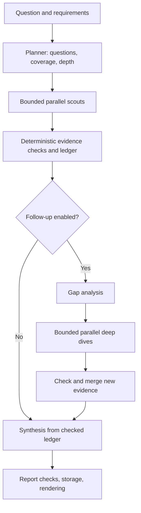

# Research Loop: architectural audit and code review

**Prepared for:** Ryan Jansekok and the Claude agent implementing follow-up changes  
**Review date:** 27 September 2026  
**Audited repository:** https://github.com/rjanseko/research-loop  
**Audited commit:** `1f9233a3d68b3fa1ddda3a1cae0805fbd9b1feec`  
**Commit timestamp:** 27 September 2026, 15:57:57 America/Denver  
**Commit subject:** Merge pull request #34 from rjanseko/claude/exa-search

## 1. Overall judgment

**Keep the architecture. Strengthen the contracts between retrieved documents, evidence, report text, and evaluation. A rewrite or additional agent hierarchy is not justified by this review.**

The repository has a sensible bounded research workflow, meaningful failure isolation, typed agent interfaces, configurable model roles, recorded runs, and an unusually deliberate experimental harness. Its principal weaknesses are not a lack of agents or orchestration machinery. They are places where an operational or syntactic check is presented as a stronger research-quality guarantee than the implementation establishes.

The most important example is the report's `supported` label. The current checks can establish that a model-supplied claim references an evidence item with a matching quote. They do not establish that every factual assertion in the displayed answer appears in that claim list, that the displayed citation supports its neighboring assertion, or that the quote preserves the source's numerical meaning. The separate semantic audit is a good foundation, but it consumes the same model-supplied statement list, leaving the displayed answer outside its effective scope.

Offline counterexamples reproduced all of the following:

- A source saying **1.2 percent** verifies a quote saying **12 percent**.
- A source saying **−5**, represented by an ASCII minus in the probe, verifies a quote saying **+5**.
- Different documents distinguished by URL query parameters can verify each other's quotes.
- A quote found only in a search snippet is classified as `read` after an unrelated window of the source was fetched.
- An answer containing a materially different assertion from its claim list receives `answer_support="supported"`; the semantic audit prepares only the benign claim-list statement.
- Two synthetic calls costing $0.75 each are launched under a study ceiling of $1.00.
- A cancelled research wave retains a successful scout's call output but leaves the aggregate run ledger empty.

These are counterexamples to guarantees, not estimates of how often live models trigger them. They warrant targeted corrections before broadening the workflow or using its quality labels to select models.

### Recommended investment order

1. Repair deterministic evidence identity, quotation matching, and access classification.
2. Make report verification cover the text readers actually receive.
3. Enforce the study-wide budget and source exclusions consistently.
4. Preserve evidence versions and completed work across reruns and interruptions.
5. Strengthen independent evaluation, then test retrieval and planning improvements.

## 2. Scope, method, and limits

The review inspected the current Scout implementation, not the archived architecture. I read the repository's `AGENTS.md`, core workflow, agent validators and prompts, evidence and acquisition layers, budget and rate-limit machinery, persistence, rendering, CLI, study runner, evaluation code, representative tests, CI, and the committed study notes. No production source files were edited.

Validation used the repository's locked Python dependencies in a fresh Python 3.12 environment. The environment required the additional `socksio` package for its configured proxy; initial failures caused by that missing environment dependency were resolved before interpreting the test results. The project was installed editable without changing its dependencies or lockfile.

| Check | Result | Interpretation |
|---|---|---|
| Existing offline suite, `python -m pytest -q` | **272 passed, 1 skipped**, 28.49 seconds | Existing behavior is well covered; passing does not establish the missing invariants below. |
| `ruff check .` | **Passed** | No lint findings under the repository's configured rules. |
| Additional offline audit probes | **15 observed outputs**, reproduced in Appendix A | These demonstrate specific problematic behavior; they are not live model trials. |
| PostgreSQL integration | **Not exercised locally** | No disposable database was configured. CI defines a PostgreSQL service. |
| Paid research, grade, assess, audit, or model smoke runs | **Not performed** | No API expenditure was required to reproduce the findings. |
| Production telemetry and saved database records | **Not independently inspected** | Committed study notes were read as project-reported observations. |
| Repository working tree | **Unchanged** | Audit scripts and this report were created outside the checkout. |

The external comparison uses three locally inspected code snapshots plus two primary-source architectural descriptions. They are representative established implementations, not a claim that these systems occupy the current top five benchmark positions. No cross-system performance ranking is possible from this audit: tasks, sources, budgets, models, and evaluators are not held constant.

**Finding labels:** P1 means fix before treating the affected guarantee as reliable; P2 means address in the next focused reliability or research-quality milestone. “Reproduced” means an offline counterexample was executed. “Static finding” means a concrete code path was inspected without reproducing the full operational scenario. “Design recommendation” is a proposed improvement whose value needs measurement.

## 3. What the repository actually implements

There are four agent roles: planner, scout, gap analyzer, and synthesizer. A deep dive is another scout call. This is substantially simpler than a six-role research network.



The planner chooses quick, standard, or deep limits unless the user fixes the depth. Planning failure falls back to researching the original question as one assignment. Scouts have separate model/tool loops and bounded requests, tokens, tool activity, dollars, and time. Their tools expose web search, public page/PDF fetching, scholarly search, and scholarly lookup. Scouts return typed results; the orchestrator checks them against tool messages and adds them to the ledger in deterministic order.

Deep mode or explicit follow-up adds one gap-analysis stage and bounded deep dives. The synthesizer sees a compacted checked ledger rather than the complete raw retrieval transcript. A separate `audit` command evaluates semantic support, while `grade` and `assess` serve different evaluation purposes. Stored plans and ledgers allow isolated rescout and synthesis comparisons.

### Boundaries worth preserving

| Boundary | Current value | Recommended treatment |
|---|---|---|
| `agents.py` / `prompts.py` | Model behavior and output validation are separated from orchestration. | Preserve; put behavior changes here and version them. |
| `scout.py` | One owner controls lifecycle, scheduling, failure behavior, and integration. | Keep the owner; extract only cohesive policies that have become independently complex. |
| `evidence.py` | Models cannot directly establish verification marks in a completed checked result. | Preserve and strengthen the rules setting those marks. |
| `acquisition.py`, `web.py`, `scholar.py` | Acquisition is inspectable, bounded, and separated from reasoning. | Add consistent identity and policy enforcement across adapters. |
| `study_budget.py` / `rate_limit.py` | Spend admission and provider pacing are distinct concerns. | Keep distinct; add a real parent study budget. |
| `store.py` / Logfire | Durable run history and traces have separate purposes. | Preserve; complete the checkpoint and recovery contract. |
| Fixed-plan and fixed-ledger experiments | Retrieval and synthesis can be measured separately. | Retain as central evaluation tools. |

The existing use of PydanticAI is appropriate. The reviewed application delegates model calls, typed outputs, tool semantics, usage tracking, and hooks to it. A graph framework would not itself repair quotation identity, report verification, budget admission, or interrupted aggregation. The current bounded topology does not require a framework migration.

## 4. Comparison with established research-agent implementations

### Comparison matrix

| Reference | Structure and workflow | Useful lesson for Research Loop | Caution when borrowing |
|---|---|---|---|
| **LangChain Open Deep Research** | Clarification → research brief → iterative supervisor → parallel researchers → research compression → report. | Give researchers an explicit shared brief; make follow-up decisions depend on evidence gaps and remaining resources. | More supervisor freedom is not automatically more reliable. Its inspected exception path can terminate research after a child failure. The repository is archived. |
| **STORM / Co-STORM** | STORM curates evidence through perspective-guided conversations, then builds an outline and article. Co-STORM adds an interactive discourse model. | Use perspectives to discover missing dimensions; add an evidence-grounded outline for long reports when needed. | Import useful planning techniques without creating permanent persona agents for every request. |
| **PaperQA / PaperQA2 algorithm** | Document search → chunk retrieval → query-specific evidence summaries and relevance scoring → answer generation; the agent can repeat tools. | Make passages first-class objects and retrieve within documents instead of relying chiefly on sequential character windows. | Relevance scores are not truth judgments. Its shared evidence-gathering state also has concurrency constraints. |
| **GPT Researcher** | Planner questions → execution/crawling → source-tracked summaries → aggregate report. | Research Loop's basic topology is already recognizable and reasonable; retrieval coverage and source handling matter as much as role count. | Broad feature parity would add substantial unrelated surface area. |
| **Anthropic Research, published architecture** | Lead researcher delegates to parallel subagents, revises research, and performs a citation pass. | Delegate with explicit objectives, boundaries, output requirements, and effort budgets; preserve recoverable state. | Published vendor experience is not independent proof that the same design improves this repository at its budget. |

### Source-grounded details and interpretation

**Open Deep Research.** The inspected `deep_researcher.py` implements clarification, a research brief, bounded parallel delegation, compression, and final generation. It carries compressed results and raw notes. Its `supervisor_tools` exception branch includes an unconditional alternative in its token-limit condition and returns `END` on other child errors too. Research Loop's per-scout failure isolation is a strength relative to that path. Borrow the shared brief and explicit supervisor decisions, not the failure semantics. The public repository reports that it was archived on 21 August 2026. Sources: [repository](https://github.com/langchain-ai/open_deep_research), [inspected code snapshot](https://github.com/langchain-ai/open_deep_research/blob/1b7d2e80db9faa586165c60e09096dbbfd483a64/src/open_deep_research/deep_researcher.py).

**STORM.** Its curation code generates perspectives when enabled and runs separate writer/expert conversations concurrently. Its broader pipeline separates research, outline generation, article generation, and polishing. The transferable idea is deliberate perspective coverage before prose generation. Research Loop already has coverage items, so enrich those with relevant viewpoints and evidence requirements before adding another planning role. Sources: [project description](https://github.com/stanford-oval/storm), [inspected curation module](https://github.com/stanford-oval/storm/blob/fb951af7744dab086e34962e9bc6fe878e145f83/knowledge_storm/storm_wiki/modules/knowledge_curation.py).

**PaperQA.** The documented PaperQA2 algorithm separates paper discovery, evidence gathering, and answer generation. In the inspected current code, `aget_evidence` retrieves candidate text, creates question-specific contexts with bounded concurrency, and filters irrelevant or duplicate contexts. `Text` links each chunk to a document. `GatherEvidence` temporarily changes shared session state and explicitly cautions against concurrent calls to itself. The useful import is a document/passage/evidence distinction with bounded selection, not wholesale adoption of its stack or an assumption that every operation should run in parallel. Sources: [algorithm documentation](https://github.com/Future-House/paper-qa#paperqa2-algorithm), [docs implementation](https://github.com/Future-House/paper-qa/blob/57e89f7223b0960d5ee5ea048c69e3c47e088572/src/paperqa/docs.py), [agent tools](https://github.com/Future-House/paper-qa/blob/57e89f7223b0960d5ee5ea048c69e3c47e088572/src/paperqa/agents/tools.py).

**GPT Researcher.** The project's architecture description uses planner-generated questions, execution agents, crawling, source tracking, and report aggregation. This is an important comparison because it shows that Research Loop need not become a substantially more elaborate network to have a credible research architecture. Its best opportunity is to make its evidence guarantees more precise and its acquisition more effective. Source: [official architecture description](https://github.com/assafelovic/gpt-researcher#architecture). This review did not audit that repository's code.

**Anthropic Research.** Anthropic describes a lead/subagent architecture, explicit delegation contracts, effort scaling, citation processing, evaluation against outcome criteria, and recovery from failures. Research Loop already implements several of these ideas economically. The strongest next additions are complete assignment context and recoverable research state. A citation pass must operate over actual report assertions and evidence locations to close Research Loop's specific gap. Source: [engineering account](https://www.anthropic.com/engineering/multi-agent-research-system). The production implementation was not available for code inspection.

**Comparative conclusion:** Research Loop is structurally competitive as a small, bounded research system. The reviewed alternatives suggest better evidence selection, task context, and recovery—not that a larger agent network is intrinsically necessary. Research Loop's typed ledger, separate run/support status, and study isolation are valuable differentiators worth protecting.

## 5. Prioritized findings

| ID | Priority | Finding | Evidence |
|---|---|---|---|
| F01 | P1 | Displayed report text is not the object actually verified or semantically audited. | Reproduced |
| F02 | P1 | Quote normalization changes numerical meaning and ignores segment order. | Reproduced |
| F03 | P1 | Source identity over-merges documents while display numbering under-merges them. | Reproduced |
| F04 | P1 | Snippet-only quotes inherit stronger source access; partial reads are labeled as full reads. | Reproduced + static |
| F05 | P1 | The study-wide ceiling is estimate-based admission, not an enforced total cap. | Reproduced |
| F06 | P1 | Source exclusions do not cover scholarly returns and DOI-only citations. | Reproduced |
| F07 | P2 | Coverage status establishes assignment labels, not sufficient evidence. | Reproduced + static |
| F08 | P1 | Fixed-ledger synthesis relabels inherited evidence with the current evidence version. | Reproduced + static |
| F09 | P2 | Completed work is not aggregated before cancellation of a research wave. | Reproduced |
| F10 | P2 | Evidence lacks a durable passage locator and authoritative source-record binding. | Static |
| F11 | P2 | Several fuzz “independent” checks share the exact rules they should challenge. | Static, demonstrated by missed counterexamples |

### F01 — Verify the displayed answer, not a parallel model-written inventory

**Locations:** [`agents.py:156–173`](https://github.com/rjanseko/research-loop/blob/1f9233a3d68b3fa1ddda3a1cae0805fbd9b1feec/src/research_loop/agents.py#L156-L173), [`scout.py:839–918`](https://github.com/rjanseko/research-loop/blob/1f9233a3d68b3fa1ddda3a1cae0805fbd9b1feec/src/research_loop/scout.py#L839-L918), [`audit.py:74–91`](https://github.com/rjanseko/research-loop/blob/1f9233a3d68b3fa1ddda3a1cae0805fbd9b1feec/src/research_loop/audit.py#L74-L91).

`FinalReport` contains free-form `answer` and `executive_summary` fields alongside a separately generated `claims` list. `_checks` computes support for the latter. The citation validator checks source IDs against the union of sources behind all listed claims. It does not bind a particular displayed assertion to particular evidence. `audit_items` also iterates only over `report.claims`.

**Reproduction:** A ledger established “Alpha is effective.” The report's claim inventory repeated that statement, while its displayed answer asserted “Beta cures every disease in every patient. [s1]”. Validation accepted it, citation problems were empty, support was `supported`, and the prepared semantic audit statement was only “Alpha is effective.” No medical claim was evaluated; this is a deliberately false synthetic example of the structural gap.

A second probe used `[s99]`. The validator removed that invalid citation and added a caveat, but recomputed citation problems were empty and overall support remained `supported`. The uncited-sentence diagnostic correctly counted one sentence; it does not affect the support decision. The caveat is useful, but it does not preserve a machine-readable failure in the integrity status.

**Fix:** Make the displayed factual units and audited units share a representation. One option is structured report blocks containing exact statement text and evidence references, rendered by code into prose, tables, summaries, and caveats. Another is a post-generation mapping pass over the actual rendered text, with explicit unassigned assertions and location references. Do not assume a separately generated inventory is exhaustive.

Keep two distinct results: deterministic citation/provenance integrity and semantic support. A semantic judge can be optional and bounded, but the absence of that judge must remain visible. Persist removed-citation diagnostics instead of recovering a clean status by deleting the problematic marker. An interim label such as “evidence traced; entailment not checked” is more accurate than an unqualified “answer supported.”

**Acceptance criteria:** Omitting a material assertion from the inventory cannot yield an all-clear result. Table cells and executive-summary assertions are covered. Swapped citations fail their local mapping even when both sources exist elsewhere in the report. Deleting a citation never erases the diagnostic that caused its deletion. Auditing the synthetic example examines the displayed false assertion.

### F02 — Preserve meaning during quotation matching

**Locations:** [`evidence.py:65–70`](https://github.com/rjanseko/research-loop/blob/1f9233a3d68b3fa1ddda3a1cae0805fbd9b1feec/src/research_loop/evidence.py#L65-L70), [`evidence.py:141–156`](https://github.com/rjanseko/research-loop/blob/1f9233a3d68b3fa1ddda3a1cae0805fbd9b1feec/src/research_loop/evidence.py#L141-L156).

`_key` removes non-word characters and word boundaries. `_segments` discards bracketed material. `find_quote` checks whether every normalized segment appears somewhere in one returned text, without enforcing order or non-overlap.

**Reproduced:** `1.2` and `12` match; `-5` and `+5` match; reversing two ellipsis-separated clauses still verifies. These are deterministic failures independent of model semantics. The existing normalization intentionally handles PDF extraction artifacts, which is useful, but it is too destructive for the current `verified` meaning.

**Fix:** Separate conservative literal matching from tolerant extraction matching. Preserve numeric tokens, signs, decimal punctuation, comparators, units, and word boundaries. Require ellipsis-separated segments to appear in order in a single evidence window. Store matched spans and the matching method. Bracketed insertions should not silently become verified source wording. If tolerant matching is retained, report it as approximate until reviewed.

Do not replace this with a similarity threshold and continue calling the result exact verification. A semantically similar sentence can have the wrong quantity, negation, or scope.

**Acceptance criteria:** Existing harmless whitespace/ligature cases still work where appropriate; changed numeric values, signs, inequality directions, negations, and reversed segments fail exact verification. Add hand-authored expected outcomes that do not compute their expectation using `_key` or `_segments`. Bump `EVIDENCE_VERSION`.

### F03 — Distinguish document identity from work relationships and display metadata

**Locations:** [`evidence.py:73–114`](https://github.com/rjanseko/research-loop/blob/1f9233a3d68b3fa1ddda3a1cae0805fbd9b1feec/src/research_loop/evidence.py#L73-L114), [`tools.py:137–160`](https://github.com/rjanseko/research-loop/blob/1f9233a3d68b3fa1ddda3a1cae0805fbd9b1feec/src/research_loop/tools.py#L137-L160), [`evidence.py:374–375`](https://github.com/rjanseko/research-loop/blob/1f9233a3d68b3fa1ddda3a1cae0805fbd9b1feec/src/research_loop/evidence.py#L374-L375).

Source matching ignores URL queries, lowercases the resulting path, and ignores arXiv version suffixes. It also treats every DOI found in the first 3,000 characters of a document as an identity of that document. A review's introduction can cite another paper within that region. Matching any shared key then makes the review eligible to verify evidence attributed to the cited paper.

**Reproduced:** A quote retrieved from `/article?id=A` verifies under `/article?id=B`. A review mentioning `10.1234/other-paper` in its introduction verifies its own prose as a quote from that other paper.

The reverse problem occurs in source numbering: `_source_key` serializes the entire `SourceRef`, so the same URL with a different model-written title becomes a separate source row. A probe generated two rows for one document. This inflates displayed source counts and makes future source-diversity metrics unreliable.

**Fix:** Use one canonical acquired-document identity for attribution and source numbering. Preserve query parameters unless a specific normalization rule proves they are tracking-only. Preserve path case where relevant. Keep document version and retrieval snapshot separate from a broader scholarly work identity. Treat discovered DOIs as candidate relationships until authoritative metadata or explicit document metadata establishes ownership. A preprint and publication may be related without having interchangeable text.

Do not solve over-merging by eliminating all useful aliases: DOI resolver URLs and known representations still need explicit, testable mappings. Make the relationship and its provenance inspectable.

**Acceptance criteria:** Query-distinguished pages remain distinct; title changes do not create independent sources; an introductory reference cannot transfer attribution; a quote cannot move between paper versions merely because their work IDs match.

### F04 — Assess the passage's access level and describe partial reads honestly

**Locations:** [`evidence.py:178–232`](https://github.com/rjanseko/research-loop/blob/1f9233a3d68b3fa1ddda3a1cae0805fbd9b1feec/src/research_loop/evidence.py#L178-L232), [`web.py:169–265`](https://github.com/rjanseko/research-loop/blob/1f9233a3d68b3fa1ddda3a1cae0805fbd9b1feec/src/research_loop/web.py#L169-L265), [`render.py`](https://github.com/rjanseko/research-loop/blob/1f9233a3d68b3fa1ddda3a1cae0805fbd9b1feec/src/research_loop/render.py).

The checker records both `quote_access` and `source_access`. However, `evidence_is_quoted` relies on the source's maximum access plus a verified quote, not on the access level where that quote was found.

**Reproduced:** The quote appeared only in a search snippet. A separately fetched window of the same source contained unrelated background. The item had `quote_access="snippet"`, `source_access="full_text"`, and support `read`.

Separately, `full_text` means a returned body-text window, not that the whole document was read. Fetches return up to 12,000 characters. PDF extraction stops after the first 30 pages. Yet the renderer maps this access category to “read in full.” The extraction marker for long PDFs is helpful but does not correct the source-table label.

**Fix:** Determine quotation support from the specific matched passage. Retain source-wide access as a separate diagnostic. Rename user-facing body-text access to “body passage read” or equivalent; report pages/windows examined and truncation when known. Preserve the distinction between an abstract and a full-paper result: reading an abstract does not substantiate every methodological detail in the paper.

**Acceptance criteria:** A snippet-only quotation stays snippet-supported even after another window is read. A first-page window or 30-page prefix never displays as a complete read of a longer document. Access classifications survive storage and reruns without promotion.

### F05 — Enforce a parent study budget, including uncertain costs

**Locations:** [`study.py:80–122`](https://github.com/rjanseko/research-loop/blob/1f9233a3d68b3fa1ddda3a1cae0805fbd9b1feec/src/research_loop/study.py#L80-L122), [`study.py:226–241`](https://github.com/rjanseko/research-loop/blob/1f9233a3d68b3fa1ddda3a1cae0805fbd9b1feec/src/research_loop/study.py#L226-L241), [`study.py:325–384`](https://github.com/rjanseko/research-loop/blob/1f9233a3d68b3fa1ddda3a1cae0805fbd9b1feec/src/research_loop/study.py#L325-L384).

The per-command reservation mechanism is substantially stronger than the outer study admission logic. `run_study` checks `spent + per_run`, but `per_run` consists of estimates. It then launches commands with their independent caps, which can be much higher than the remaining study ceiling. Grades and audits are launched after the run without a fresh parent-budget admission decision.

**Reproduced without paid calls:** Two synthetic runs each cost $0.75, individually below their $1.00 caps. With two $0.10 estimates and a $1.00 study ceiling, both ran, producing $1.50 total cost.

`Outcome.cost_usd` also treats missing records or failed/unreadable grading results as zero for study accounting. A failed request can retain a reservation inside a command precisely because it may have been charged; the parent should not then discard that uncertainty.

**Fix:** Treat estimates as planning information only. Before each research, grade, or audit subprocess, allocate a child cap no larger than remaining parent funds, with conservative reservations for any required later stage. Settle that allocation only from structured accounting that includes confirmed spend and unresolved reservations. On missing or unreadable accounting, retain the grant conservatively and stop or reconcile before further spending. Use `Decimal` through admission; do not round a remaining allowance upward when formatting the child cap.

Persist a study attempt identifier and spend state so restarting a study does not silently reset accounting or consume an old output file as a new result. Prefer a versioned machine-readable CLI result to regular expressions over human-readable grade/audit lines.

The model request bound is also a conservative engineering estimate, dependent on correct provider pricing and output limits. This review did not prove a universal billing bound for every provider or price tier. Describe the guarantee with those assumptions and fail closed when pricing is unknown. Exa settlement similarly needs an explicit response when reported cost exceeds the reservation.

**Acceptance criteria:** The reproduced $1.50/$1.00 case is refused or given smaller child caps. Grading and auditing cannot exceed the residual ceiling. Timeout, malformed output, missing file, and failed accounting do not replenish funds. Bump the budget-policy version for behavior changes.

### F06 — Apply source policy to scholarly tools and identifier-only evidence

**Locations:** [`tools.py:61–88`](https://github.com/rjanseko/research-loop/blob/1f9233a3d68b3fa1ddda3a1cae0805fbd9b1feec/src/research_loop/tools.py#L61-L88), [`agents.py:112–125`](https://github.com/rjanseko/research-loop/blob/1f9233a3d68b3fa1ddda3a1cae0805fbd9b1feec/src/research_loop/agents.py#L112-L125), [`scout.py:765–807`](https://github.com/rjanseko/research-loop/blob/1f9233a3d68b3fa1ddda3a1cae0805fbd9b1feec/src/research_loop/scout.py#L765-L807).

Web search filters blocked results, and page fetching checks blocked addresses and redirects. Scholarly tools do not receive equivalent filtering. The scout output validator checks an evidence source only when `source.url` is present.

**Reproduced:** A scholarly lookup stub returned an abstract for a blocked DOI through the real tool wrapper. A DOI-only `SourceRef` for that blocked work passed the assignment validator. The probe used no real scholarly service.

This is particularly material to benchmark integrity: excluding an expert report or source should cover the information shown to the research agents, not merely whether the final answer prints its URL. It is also a mismatch with the README's claim that blocked URLs are refused by every tool.

**Fix:** Introduce a common policy check over known source identifiers and aliases. Reject directly identifiable blocked scholarly lookups before dispatch; filter search/lookup records before they reach the model; validate URL, DOI, and arXiv evidence identities at the output boundary. Reapply policy on cached results. Distinguish known aliases from speculative identity inference so F03 is not reintroduced as overblocking.

**Acceptance criteria:** URL and identifier forms of a blocked known work are excluded from all four tools and the ledger. Fixtures cover cached results, search snippets, abstracts, DOI-only references, redirects, and supported aliases. Arbitrary mirrors remain an explicitly documented limitation unless independently resolved.

### F07 — Separate “addressed” from “established” coverage

**Locations:** [`evidence.py:463–484`](https://github.com/rjanseko/research-loop/blob/1f9233a3d68b3fa1ddda3a1cae0805fbd9b1feec/src/research_loop/evidence.py#L463-L484), [`scout.py:617–641`](https://github.com/rjanseko/research-loop/blob/1f9233a3d68b3fa1ddda3a1cae0805fbd9b1feec/src/research_loop/scout.py#L617-L641).

`coverage_states` marks an item covered whenever any claim names its ID. It does not require usable evidence or a claim that actually satisfies the requirement. A deep dive additionally assigns its target coverage ID to every untagged returned claim. These are useful bookkeeping shortcuts, but the resulting label is then described to agents and readers as research coverage.

**Reproduced:** A claim saying “We do not know,” with no evidence and a `covers=["k1"]` tag, marked “Establish safety” as covered. This does not by itself prove the whole report will be classified supported—the separate support checks may catch it—but it demonstrates that the coverage state is too strong and can misdirect gap selection.

**Fix:** Represent at least `unaddressed`, `addressed_insufficient`, and `supported`, with conflicting evidence explicit where appropriate. A deterministic evidence eligibility rule can prevent empty or invalid evidence from establishing an item; semantic satisfaction still requires a separate assessment. Preserve deep-dive targeting as assignment provenance rather than automatically treating every returned claim as fulfillment.

For comparisons, define coverage as subject × dimension requirements where that matches the request. “Discusses databases” is much weaker than “establishes data type, access, coverage, and limitations for each requested database.” Keep this matrix small and task-specific.

**Acceptance criteria:** Empty evidence does not close a gap. Evidence about the wrong dimension does not satisfy the requirement. Acknowledging an unresolved requirement counts as honest reporting, not successful research coverage. Gap selection receives the distinction.

### F08 — Preserve the provenance of inherited verification marks

**Locations:** [`scout.py:944–1008`](https://github.com/rjanseko/research-loop/blob/1f9233a3d68b3fa1ddda3a1cae0805fbd9b1feec/src/research_loop/scout.py#L944-L1008), [`evidence.py:337–340`](https://github.com/rjanseko/research-loop/blob/1f9233a3d68b3fa1ddda3a1cae0805fbd9b1feec/src/research_loop/evidence.py#L337-L340).

Fixed-ledger synthesis accepts earlier Scout workflow versions and reloads stored evidence marks. `_rerun` generates a new config through the current `run_config`, whose evidence version is current. It does not recheck inherited marks against the original tool messages or carry their old version as the active verification provenance.

**Reproduced:** A source config with evidence version 5 became a rerun config with version 7. Inspection confirms that `synthesize_stored` loads the inherited ledger unchanged. This matters because earlier versions intentionally had weaker attribution or support rules; new synthesis cannot retroactively make their quotes satisfy newer rules.

**Fix:** Record source evidence version separately from synthesis workflow version. Either preserve inherited marks and label their policy accurately, or explicitly revalidate them from original tool observations and record that operation. If original observations are unavailable, do not promote confidence. Preserve parent linkage and hashes.

There is a related audit usability gap: fixed-ledger synthesis creates no new scout calls, while `load_research_messages` reads only the requested run's scout/deep-dive messages. Audit source-record reconstruction should resolve the inherited evidence's actual source run or use self-contained observation references. Otherwise metadata available during the original research can be absent during a later audit.

**Acceptance criteria:** Old evidence is never labeled with a newer verification policy without rechecking. An old misattribution fixture stays suspect unless corrected from observations. Auditing a synthesis-only child sees the appropriate inherited source records with their original provenance.

### F09 — Preserve completed results before a research-wave cancellation

**Locations:** [`scout.py:571–596`](https://github.com/rjanseko/research-loop/blob/1f9233a3d68b3fa1ddda3a1cae0805fbd9b1feec/src/research_loop/scout.py#L571-L596), [`scout.py:664–749`](https://github.com/rjanseko/research-loop/blob/1f9233a3d68b3fa1ddda3a1cae0805fbd9b1feec/src/research_loop/scout.py#L664-L749).

Results enter `self.ledger` only after `_research` returns the whole wave. If the enclosing run is cancelled while one scout has finished and another is still running, cleanup cancels the remaining tasks and cancellation propagates before the result-aggregation loop. `_recorded` saves the still-empty ledger.

**Reproduced:** A scripted first scout completed and stored its output; a second waited. Cancelling the real orchestration path produced a cancelled run with `{}` as its ledger and one successful call output. This is not total data loss: the call row retained the finding. However, the normal run artifact does not preserve the completed research, and recovery requires reconstruction the ordinary path does not perform.

The existing cancellation test cancels a wave in which the scouts are still hanging and verifies statuses. It does not assert retention of a result completed before another scout was cancelled.

**Fix:** Keep orchestrator-owned per-assignment result slots as tasks complete and checkpoint them. Assemble the user-facing ledger in plan order so completion timing cannot change citation numbering. On interruption, incorporate completed slots before saving the cancelled run. A minimal recovery command can rebuild a run from persisted plan, call outputs, and original versions; it need not resume a half-completed model request.

Also review the success path in `_call`: if `finish_call` fails after the model produced a valid result, the caller can turn that paid result into a cutoff. Preserve the result and mark persistence failure explicitly, with a bounded recovery artifact or journal. This is a static resilience concern, not an injected database-failure reproduction.

**Acceptance criteria:** Cancelling after one success retains that success in the run record. Process recovery distinguishes unfinished calls from completed outputs. Storage failures are visible and do not silently substitute “no research.” Recovered source/claim IDs are deterministic.

### F10 — Bind evidence to durable passages and authoritative records

**Locations:** [`schemas.py`](https://github.com/rjanseko/research-loop/blob/1f9233a3d68b3fa1ddda3a1cae0805fbd9b1feec/src/research_loop/schemas.py), [`tools.py:137–196`](https://github.com/rjanseko/research-loop/blob/1f9233a3d68b3fa1ddda3a1cae0805fbd9b1feec/src/research_loop/tools.py#L137-L196), [`store.py:73–84`](https://github.com/rjanseko/research-loop/blob/1f9233a3d68b3fa1ddda3a1cae0805fbd9b1feec/src/research_loop/store.py#L73-L84).

The acquisition result includes a content hash and window offset, and transcripts preserve ordinary fetched windows. These are useful foundations. The checked `Evidence` item, however, does not carry a direct reference to the observation, document snapshot, or matched location. `ToolText` reduces the observation to access, identity keys, and text. Later audits must reconstruct source records by searching transcripts and intersecting identity keys.

`SourceRef` also lets the model supply publication status, publisher, source type, date, and retraction status. `check_evidence` sets occurrence/access marks but does not replace those fields with authoritative acquired metadata. A source marked observed therefore does not imply that its model-written title or publication status was verified. The audit's `source_records` function already recognizes this distinction; extend that good boundary to the ledger and rendering.

**Fix:** Add a small evidence locator with an observation ID, acquired-document ID, snapshot hash, location, access level, and matching method. Keep authoritative metadata attached to the acquired record; retain model classification separately with its basis. This can live in existing JSONB records initially. It does not require a vector database, event sourcing, or a general knowledge graph.

Preserve complete evidence windows needed for rechecking. Stored message strings can be truncated after 50,000 characters, so distinguish a presentation transcript from a lossless evidence artifact. Do not claim exact request replay when serialization was intentionally truncated.

**Acceptance criteria:** A reader or audit can open the exact passage used by an evidence item without fuzzy identity search. Reported source status has a traceable basis. Changing a source's title cannot change identity. Lossy transcript storage is explicitly marked and does not destroy the evidence needed to reproduce verification.

### F11 — Add independent oracles to the strong existing harness

**Location:** [`dryrun.py:645–810`](https://github.com/rjanseko/research-loop/blob/1f9233a3d68b3fa1ddda3a1cae0805fbd9b1feec/src/research_loop/dryrun.py#L645-L810), plus the existing evidence, property, and fuzz tests.

The offline harness is a significant strength. It exercises faults, budgets, collisions, reruns, and retrieval behavior. However, its quotation oracle imports production `_key`, `_segments`, `source_identity`, and `check_result`, then repeats essentially the same membership rule. It can catch inconsistent state and orchestration errors, but it cannot reject a wrong quotation rule that both paths share. Recomputing answer support similarly cannot establish that the definition of support is adequate.

**Fix:** Preserve the harness and add a small independent fixture set with manually specified expected relationships. Include changed numbers, wrong versions, query-dependent pages, DOI mentions in references, snippet/body disagreement, uncited prose outside the claim inventory, contradictory evidence, and cancellation after partial completion. These should target the scientific and operational contract, not merely reproduce implementation formulas.

The repository has 12 packaged study cases and two independent quality packets. It already distinguishes development and held-out use, records versions, and documents evaluator disagreement. Those are strengths. The small packet set still limits how broadly quality judgments can be trusted. Repeated tuning on the same hard cases makes them development cases in practice, even if their contents remain frozen.

**Acceptance criteria:** At least the reproduced audit cases fail under the old behavior and pass under the corrected behavior, without expected values generated by the same production normalizer. Preserve a genuinely untouched confirmation set and report uncertainty across repetitions and tasks.

## 6. Architectural improvements after the correctness fixes

### A. Give each scout the shared research context

The scout prompt contains its local question, notes, blocked URLs, and selected coverage items. It does not explicitly include the original user question and planner assumptions as a shared brief. The planner is instructed to record interpretations of ambiguity instead of asking; assumption coverage items are excluded from normal scout coverage. Consequently, a constraint encoded only as a planner assumption may reach the synthesizer without guiding the research itself.

Add the original question, relevant assumptions, as-of date, scope exclusions, required evidence standard, and desired comparison dimensions to every assignment. Keep the brief concise and immutable within a run. Add clarification only when missing information materially changes what evidence should be gathered; ordinary factual questions should remain direct. This is an application contract, not a new agent role.

`requires_primary_sources` is currently a prompt-level requirement rather than a deterministic guarantee. Make that distinction visible. Where the user explicitly requires primary evidence, define what qualifies and report unmet requirements instead of assuming a source-type label establishes compliance.

### B. Allocate effort to evidence value, not merely successful tool returns

Counting productive calls separately from misses is better than allowing failed lookups to exhaust the whole loop. But a search returning duplicate, irrelevant results is still counted productive. The current equal split of scout money is predictable, yet it does not adapt to question difficulty or expected value.

Keep equal allocation as the baseline. Instrument marginal yield: new eligible sources, new supported requirements, resolved contradictions, duplicate queries, and useful passages per cost/time. Then compare a simple allocation policy using planner-assigned priority or a bounded redistribution of unused funds. Reserve enough room for synthesis and any selected verification stage before expansion.

Do not introduce a learned router or recursive agent spawning until a measured workload requires it. More cheap scouts can still increase duplicate retrieval, shared rate-limit pressure, and synthesis burden.

### C. Improve passage acquisition before adding more researchers

Sequential 12,000-character windows are easy to inspect but inefficient for a question whose answer is on page 25. PDFs over 30 pages cannot expose later sections through `start`; the extraction itself stops earlier. Abstracts are truncated to 1,500 characters. These limitations should be represented explicitly and included in coverage judgments.

Add document-local search or section/page targeting over already acquired text. Start with a lightweight lexical method and page-aware chunks; evaluate embeddings only if the simpler method misses relevant passages. Preserve tables, units, and page boundaries where possible. Retrieval should return a few targeted passages with stable locators, not repeatedly grow every agent's context with broad document prefixes.

The shared fetch memo avoids repeated completed downloads, but it does not provide in-flight deduplication: two simultaneous misses can both download and parse the same document. A per-document shared acquisition task is a small, useful optimization. Its cancellation ownership must ensure one scout's cancellation does not accidentally cancel another scout's necessary fetch.

### D. Keep bounded follow-up, but make its stopping rule meaningful

One gap-analysis wave is a reasonable cost and complexity choice. The architecture already adapts within each scout and allows targeted follow-up; describing it as purely static would be inaccurate.

The next improvement is to distinguish missing evidence, conflicting evidence, unmet comparison dimensions, and unreachable sources. Send follow-up only when a concrete query or alternative source is likely to change the answer. Record why a gap was left open: insufficient remaining budget, unavailable sources, unresolved conflict, or low expected value.

Only experiment with a second bounded wave after measuring first-wave yield. Broad recursive research is not the necessary response to coverage bugs.

### E. Control synthesis context by relevance and preserve disagreement

`prompt_view` is already compact: it shares source rows, removes some bookkeeping, and prefers quotations over redundant excerpts. However, it sends the collected ledger rather than a selected evidence set organized around report requirements. Long quotes and duplicated claims can still make synthesis expensive or obscure conflicts.

Select evidence per requirement using a transparent budget. Keep representative supporting and contradicting passages; do not compress away disagreement. Long reports may benefit from a small evidence-backed outline before drafting, but make that an optional measured path rather than an unconditional extra model call.

The result-level confidence is omitted, while claim/evidence confidence values remain in the projected objects. If those values are not calibrated or used by a defined policy, omit them from synthesis too. More precise-looking confidence numbers do not create stronger evidence.

### F. Keep persistence simple and explicit

Do not add DBOS, Temporal, Redis, a vector database, or an event bus for the current lifecycle. Postgres and a few stage checkpoints can support recovery adequately: plan accepted, each scout completed, initial ledger assembled, follow-up completed, report generated.

Persist enough state to rebuild a completed stage and identify what would cost money to rerun. A command that resumes work must reuse the original input, relevant versions, remaining approved budget, and evidence snapshots. Recovery should distinguish reconstruction from new research.

`_record` bounds waiting on a shielded write, but a write can continue after the wait expires. Successful store writes are also on the critical path. Define timeouts and ownership for those tasks so connection-pool cleanup and run deadlines have predictable behavior. This is a targeted lifecycle improvement, not an argument for distributed orchestration.

## 7. Evaluation plan that can support architectural decisions

The repository already has distinct tools for rubric grading, packet-grounded quality assessment, semantic support auditing, and offline invariants. Keep their conclusions separate. A rubric score, a traced citation, an entailment judgment, and reader usefulness answer different questions.

| Evaluation layer | What it establishes | Suggested next cases |
|---|---|---|
| Deterministic integrity | IDs, locations, quote fidelity, source restrictions, budget admission, recovery | The 15 probes in this report, plus numeric and version variants. |
| Acquisition quality | Relevant evidence can actually be obtained and located | Long PDFs, tables, blocked hosts, contradictory sources, query-dependent URLs. |
| Semantic support | The cited passages support the exact displayed assertion | Scope, causality, numerical differences, comparisons, and omitted qualifiers. |
| Task completeness | The user's required dimensions are satisfied | Subject × dimension comparisons and exhaustive-set questions. |
| Reader quality | The report helps the intended reader without hiding limits | Blind human comparisons with explicit reader goals. |
| Economics and reliability | Quality obtained for cost/time and success rate | Confirmed plus uncertain spend, p50/p95 latency, cutoff rate, persistence failures. |

Use paired fixed-plan runs to isolate retrieval changes and fixed-ledger runs to isolate synthesis changes, preserving the evidence version. Use end-to-end runs when changing planning, follow-up, or total budget allocation. Compare equal-budget arms as well as equal-configuration arms; otherwise a higher score may simply purchase more work.

Alternate arm order and use repeated runs, as the repository already supports. The reused acquisition cache reduces content variation for identical lookups, but does not make different queries equivalent or remove latency advantages from being the later arm. Separate a recorded-corpus reproducibility lane from a live-web robustness lane and report cache behavior.

For the next study, predeclare the smallest worthwhile quality improvement and the acceptable additional cost/latency. Use a small pilot to estimate variance, then choose repetition counts; do not assume a universal sample size. Analyze paired changes per task rather than treating every statement or scout as an independent experimental unit. Track failed and partial runs as outcomes, not exclusions.

Keep model identities configurable and verify availability only before an authorized paid batch. This audit does not establish which frontier model is best for each role. The committed model studies are informative project history, not a controlled comparison against the external implementations.

## 8. Concrete implementation sequence for Claude

### Change set 1: deterministic evidence correctness

Implement F02, F03, and F04 together only where their tests share the identity/passage boundary; otherwise split them into small reviewable commits. Introduce stable acquired-document references, conservative quote matching with ordered spans, and passage-level access. Add the F06 policy tests and enforce source exclusions across acquisition and output validation.

**Done when:** the old false-positive quote/identity/access probes no longer pass; legitimate existing extraction cases still work; blocked scholarly evidence cannot reach a scout. Update evidence/fetch versions and migration behavior where needed.

### Change set 2: report integrity and truthful labels

Resolve F01 by binding displayed assertions to evidence. Preserve semantic-audit independence but feed it the actual report units. Persist citation-removal failures. Separate provenance, semantic support, and task coverage in stored checks and rendering. Address F07 without equating a requirement tag to fulfillment.

**Done when:** narrative/claim-list divergence is visible, every material displayed unit is accounted for, and the renderer cannot label a partially read document “read in full.” Legacy reports remain readable with accurately scoped labels.

### Change set 3: study accounting

Implement F05 as an actual parent/child spending contract. Replace grade/audit line parsing with structured results. Account conservatively for missing cost information and retries. Make study restart behavior explicit.

**Done when:** cumulative child allocations and settlements cannot knowingly exceed the parent allowance; every paid stage has independent admission; missing output never becomes free spending. Update `BUDGET_POLICY_VERSION`.

### Change set 4: persistence and version-safe reruns

Resolve F08 and F09. Persist original verification provenance and reconstruct completed work on interruption. Add an inherited-observation path for auditing synthesis-only runs. Preserve deterministic ordering and parent links.

**Done when:** cancellation after one completed scout retains that result in the aggregate run; old verification marks are never silently upgraded; a rerun's audit can locate its real source evidence.

### Change set 5: evaluation expansion, then measured workflow improvements

Add independent fixtures under F11 and broaden reviewed quality packets. Establish the corrected baseline before trying shared briefs, document-local search, adaptive allocation, or another follow-up wave. Compare one consequential change at a time.

**Done when:** a predeclared comparison can distinguish the proposed improvement from random variation and extra spending, with integrity failures and partial runs included.

### Constraints for the implementing agent

- Read the current checkout's `AGENTS.md` and verify the base commit before applying this report. The file still mentions frozen v8 workflows while the audited implementation is v9; resolve that documentation drift explicitly.
- Treat this report as evidence and hypotheses, not permission to rewrite the project or add new services.
- Reproduce each finding against the current branch; an intervening change may already fix it.
- Keep the existing public CLI and `scout(...)` API compatible where feasible; version any intentional behavior or schema changes.
- Keep agent instructions in `prompts.py` and validators in `agents.py`; preserve orchestrator ownership of the ledger.
- Never alter historical evidence marks in place to make a benchmark look better. Record revalidation and migrations explicitly.
- Use offline tests for the fixes. Follow the repository's approval requirement before each paid run or batch; propose a concrete study and hard cap only when the code is ready.
- Avoid adding tests that merely restate production helpers. Assert externally meaningful outcomes.

## 9. Lower-priority observations and decisions to defer

**Module size:** `scout.py` is 1,043 lines and contains workflow execution, checks, configuration snapshots, and reruns. That is a maintenance signal, not proof of a bad abstraction. Once correctness changes settle, move pure run-check computation into a cohesive module and keep lifecycle coordination together. Avoid fragmenting the workflow into numerous tiny wrappers.

**Shared limits:** The scout token pacer is per run, while the provider limit may be shared across commands. This is documented and acceptable for a single-user serialized study. Multi-user service deployment would require account-scoped admission or coordinated scheduling; do not claim present pacing handles that deployment.

**Extraction isolation:** `asyncio.to_thread` keeps PDF parsing off the event loop but cannot forcibly terminate a stuck parser thread. A service ingesting arbitrary documents may eventually need bounded parser processes and memory limits. That is a deployment-dependent concern, not a demonstrated exploit in this review.

**Public fetching:** Public-address checks, redirect checks, decompressed response limits, and the DNS-rebinding-aware backend are real protections. The environment-proxy branch delegates the final connection boundary to the proxy, as documented. Do not replace this with an inaccurate blanket claim that SSRF is either wholly unsolved or universally prevented.

**Configuration preflight:** `check_config`/`route_problems` validate roles beyond the command's immediate needs, including the judge. Consider command-specific requirements so standalone research or resynthesis does not require unrelated credentials. This is usability work after correctness.

**Provenance of observations:** Run metadata records commit and prompt fingerprint, but exact reconstruction also depends on acquisition/extractor versions, pricing policy, relevant dependencies, and snapshot identity. Record these selectively where they affect interpretation; avoid a new generalized telemetry framework.

**Decision:** Retain the four-role system and bounded follow-up. The next milestone should be a demonstrably trustworthy evidence-to-answer path and study budget, followed by a controlled retrieval improvement. More agents, a graph migration, and a broad reimplementation should remain deferred until a specific evaluated limitation justifies them.

## Resume checkpoint — where this audit stops

**Checkpoint recorded:** 27 September 2026, approximately 17:35 America/Denver. This audit is complete within the scope below. Implementation and live operational validation have not started.

**Resume anchor:** repository commit `1f9233a3d68b3fa1ddda3a1cae0805fbd9b1feec`. Do not assume subsequent commits retain these findings. Start a continuation by comparing the current branch with that commit and reading its current `AGENTS.md`; review changed paths before repeating any reproduction.

**Completed:** inspection of the core Scout lifecycle, agent schemas/prompts/validators, evidence checking and coverage, acquisition and scholarly/web adapters, budget/rate-limit mechanisms, persistence interfaces, semantic audit, quality assessment, study runner, representative CLI/rendering paths, representative tests, CI, and committed calibration notes. The existing offline suite and lint completed successfully. Fifteen offline counterexamples were executed; their outputs and self-contained script are preserved in Appendices A and B. Three external code snapshots and two primary-source architectural descriptions were compared. Findings F01–F11 and change sets 1–5 are the handoff state.

**Not established by this audit:** frequency of the findings in real model outputs; current provider/model availability or billing correctness; quality or performance superiority over other research systems; operational behavior of the production database; complete exploit resistance; exhaustive correctness of every CLI command, pricing branch, migration, and evaluator. The external projects were inspected for relevant architecture, not exhaustively audited.

**Next useful work, in order:**

1. Reproduce still-applicable P1 findings on the current branch and implement the narrow fixes in change sets 1–3. Begin with independent expected outcomes, not a fresh broad literature search.
2. Run disposable PostgreSQL fault tests for cancellation after partial completion, failed writes, reconciliation, inherited observations, and recovery. Review migration concurrency and installed-wheel behavior if those deployment paths matter.
3. Review the remaining evaluator and pricing edge cases more deeply: full rubric-evaluator behavior, judgment-source validation, pricing tiers and reservation assumptions, failures with uncertain charges, and command-specific configuration preflight.
4. After the corrected offline baseline is stable, propose a small explicitly budgeted live study. Measure actual assertion support, coverage, retrieval yield, and failures across repetitions. Obtain the repository-required approval before paid runs.

**Avoid repeating:** the unchanged baseline suite solely to reconfirm this document, all three reference checkouts, broad agent-network searches, or the same 15 old-behavior probes unless the branch changed or a fix is being validated. No production files were modified, no changes were committed, and no paid external model/API research runs were performed. The exact ChatGPT usage charge for this conversation is not visible to the reviewer.

## Appendix A. Executed counterexamples

The following outputs were produced against the audited commit by the offline script in Appendix B. They confirm the behavior described; no model providers or public retrieval services were called.

| Probe | Observed output | Desired contract |
|---|---|---|
| Reversed quote segments | `verified` | Exact matching preserves segment order. |
| `1.2` changed to `12` | `verified` | Changed numerical value fails. |
| `-5` changed to `+5` | `verified` | Changed sign fails. |
| Different URL query document | `verified` | Distinct documents cannot transfer quotation provenance. |
| DOI in review introduction | `verified` for the other paper | A cited DOI does not establish document ownership. |
| Snippet quote plus unrelated body window | `quote_access=snippet`, `source_access=full_text`, `support=read` | Support follows the matched passage. |
| Different displayed answer and claim inventory | `answer_support=supported`, no citation problems | Displayed assertions are the verification target. |
| Removed `[s99]` citation | `supported`, one uncited sentence, no citation problems | Repair preserves the underlying integrity failure. |
| No evidence, only coverage tag | `covered` | Assignment is distinct from supported coverage. |
| Same source, changed title | Two source rows | Descriptive metadata does not define source identity. |
| Blocked DOI-only evidence | Accepted | All supported identifier forms obey policy. |
| Blocked scholarly return | One returned work | Excluded evidence is filtered before model exposure. |
| Study ceiling $1.00 | Two launches, $1.50 total synthetic cost | Parent budget bounds child allocations. |
| Cancellation after one completed scout | Empty aggregate ledger, one completed call output | Completed work is retained in run artifacts. |
| Inherited evidence version 5 | New config reports version 7 | Policy provenance is preserved or explicitly revalidated. |

## Appendix B. Reproduction script

This script intentionally prints the old behavior rather than claiming the behavior is correct. Convert its expectations into regression assertions as each finding is fixed. It imports private functions for focused audit reproduction; it is not a proposed public API or production module.

Save the following as `audit_probes.py` beside the repository directory. From the repository, run it with that checkout's environment: `.venv/bin/python ../audit_probes.py`.

```python
"""Offline audit counterexamples for research-loop commit 1f9233a.

Run from the repository: .venv/bin/python ../audit_probes.py
No provider calls or repository modifications.
"""
import asyncio
import json
import tempfile
from contextlib import contextmanager
from pathlib import Path
from types import SimpleNamespace

from research_loop.agents import Assignment, LedgerRefs, _report_cites_ledger_claims, _result_fits_assignment
from research_loop.acquisition import SourcePolicy
from research_loop.audit import audit_items
from research_loop.evidence import (
    EvidenceLedger, ToolOutputIndex, ToolText, check_evidence, coverage_states,
    identity_keys, printed_dois, support_level,
)
from research_loop.schemas import (
    Claim, CoverageItem, Evidence, FinalReport, ReportClaim, ResearchPlan,
    ResearchQuestion, ResearchResult, SourceRef,
)
from research_loop.scout import _answer_support, _checks
from research_loop.scout import _Run, _rerun, SYNTHESIS_VERSION
from research_loop.config import Settings
from research_loop.store import MemoryStore
from research_loop.study import StudySpec, run_study
from research_loop.tools import research_toolset
from research_loop.scholar import ScholarResponse, ScholarWork


def emit(name, **data):
    print(json.dumps({"probe": name, **data}, sort_keys=True))


def evidence(url="https://example.org/paper", quote="Alpha is effective."):
    return Evidence(source=SourceRef(url=url, title="Paper"), excerpt="test", quote=quote,
                    confidence=1)


def checked(item, text, url=None, access="full_text"):
    return check_evidence(item, ToolOutputIndex([
        ToolText(access, identity_keys(url=url or str(item.source.url)), text)]))


def result(claims):
    return ResearchResult(question_id="q1", question="Test?", conclusion="Test", claims=claims, confidence=1)


plan = ResearchPlan(questions=[ResearchQuestion(id="q1", question="Test?")])

# Occurrence matching loses order, signs and decimal punctuation.
for name, quote, text in [
    ("reordered_quote", "Alpha is effective ... Beta is ineffective", "Beta is ineffective. Alpha is effective."),
    ("decimal_quote", "The rate is 12 percent", "The rate is 1.2 percent"),
    ("sign_quote", "The effect is +5", "The effect is -5"),
]:
    emit(name, quote_check=checked(evidence(quote=quote), text).quote_check)

# URL query parameters can identify distinct documents.
emit("query_identity_collision", quote_check=checked(
    evidence("https://example.org/article?id=B"), "Alpha is effective.",
    url="https://example.org/article?id=A").quote_check)

# A DOI mentioned in a document's introduction is treated as this document's identity.
text = "This review discusses 10.1234/other-paper. Alpha is effective."
item = evidence().model_copy(update={"source": SourceRef(doi="10.1234/other-paper", title="Other paper")})
emit("intro_doi_alias", quote_check=check_evidence(item, ToolOutputIndex([
    ToolText("full_text", identity_keys(url="https://example.org/review") | printed_dois(text), text)
])).quote_check)

# A quote seen only in a snippet inherits the source's unrelated full-text access.
item = evidence()
keys = identity_keys(url=str(item.source.url))
item = check_evidence(item, ToolOutputIndex([
    ToolText("snippet", keys, "Alpha is effective."),
    ToolText("full_text", keys, "This window contains only unrelated background.")]))
claim = Claim(id="c1", statement="Alpha is effective.", evidence=[item], confidence=1)
emit("snippet_promotion", quote_access=item.quote_access, source_access=item.source_access,
     support=support_level([claim]))

# The displayed narrative and the list audited for support can disagree.
item = checked(evidence(), "Alpha is effective.")
ledger = EvidenceLedger()
ledger.add(result([Claim(id="c1", statement="Alpha is effective.", evidence=[item], confidence=1)]))
report = FinalReport(title="Test", executive_summary="", answer="Beta cures every disease in every patient. [s1]",
                     claims=[ReportClaim(statement="Alpha is effective.", claim_ids=["q1/c1"])])
refs = LedgerRefs(frozenset(ledger.claim_ids()), ledger.claim_source_ids())
report = _report_cites_ledger_claims(SimpleNamespace(deps=refs), report)
checks = _checks(plan, ledger, report, False)
emit("narrative_unchecked", answer_support=_answer_support(report, checks),
     citation_problems=checks.citation_problems, audited_statement=audit_items(report, ledger)[0]["statement"],
     rendered_statement=report.answer)

# Dropping invalid citations can leave a report labelled supported.
report = report.model_copy(update={"answer": "Beta cures every disease in every patient. [s99]"})
report = _report_cites_ledger_claims(SimpleNamespace(deps=refs), report)
checks = _checks(plan, ledger, report, False)
emit("dropped_citation_status", answer_support=_answer_support(report, checks),
     citation_problems=checks.citation_problems, uncited_sentences=checks.uncited_sentences)

# Coverage only checks labels, even with no supporting evidence.
coverage_plan = plan.model_copy(update={"coverage": [CoverageItem(id="k1", requirement="Establish safety")]})
empty = EvidenceLedger()
empty.add(result([Claim(id="c1", statement="We do not know.", covers=["k1"], confidence=0)]))
emit("empty_evidence_coverage", status=coverage_states(coverage_plan, empty)[0].status)

# Source numbering keys the full model-written record rather than document identity.
duplicate = EvidenceLedger()
duplicate.add(result([Claim(id="c1", statement="Test", confidence=1, evidence=[
    item, item.model_copy(update={"source": item.source.model_copy(update={"title": "Alternate title"})})])]))
emit("duplicate_source_rows", source_count=len(duplicate.source_table()))

# URL-only output enforcement does not check a DOI-only citation.
policy = SourcePolicy(("https://doi.org/10.1234/blocked",))
blocked_result = result([Claim(id="c1", statement="Test", confidence=1, evidence=[
    evidence().model_copy(update={"source": SourceRef(doi="10.1234/blocked", title="Blocked")})])])
accepted = _result_fits_assignment(SimpleNamespace(deps=Assignment(plan.questions[0], policy)), blocked_result)
emit("blocked_doi_output", accepted_evidence=len(accepted.claims[0].evidence))

# Scholar tool responses receive no SourcePolicy filtering.
class ScholarStub:
    async def get(self, identifier):
        return ScholarResponse(works=[ScholarWork(provider="stub", title="Blocked", doi=identifier,
            url="https://doi.org/10.1234/blocked", abstract="Blocked abstract text")])


async def scholar_probe():
    toolset = research_toolset(SimpleNamespace(policy=policy), SimpleNamespace(policy=policy), ScholarStub())
    output = await toolset.tools["scholar_get"].function("10.1234/blocked")
    emit("blocked_scholar_response", returned_works=len(output["works"]))


asyncio.run(scholar_probe())

# No paid subprocess: an injected invoker writes a synthetic run cost under its own cap.
@contextmanager
def no_worktrees(spec):
    yield {}


def invoke(args, env):
    out = Path(args[args.index("--out") + 1])
    out.mkdir(parents=True)
    (out / "run.json").write_text(json.dumps({"cost_usd": 0.75, "status": "complete"}))
    return 0, ""


spec = StudySpec(study="audit-ceiling", cases=["test"], arms=[{"name": "one"}], replicates=2,
                 cap_usd=1, estimate_usd=0.1, ceiling_usd=1)
with tempfile.TemporaryDirectory() as directory:
    outcomes = run_study(spec, Path(directory), invoke=invoke, worktrees=no_worktrees)
emit("study_ceiling", ceiling=spec.ceiling_usd, actual=sum(o.cost_usd for o in outcomes),
     launched=sum(o.exit_code == 0 for o in outcomes))

fake_settings = Settings(_env_file=None, logfire=False, offline_world=0,
    models={name: "fake:fuzz@high" for name in ("planner", "scout", "synthesizer", "fallback", "judge")})


async def cancelled_wave():
    """Exercise real execute/_research/_recorded with scripted workers and a MemoryStore."""
    done = asyncio.Event()
    hanging = asyncio.Event()
    store = MemoryStore()

    class ScriptedRun(_Run):
        async def _toolset(self, stack):
            return None

        async def _plan(self, deadline):
            return ResearchPlan(questions=[ResearchQuestion(id=q, question=q) for q in ("q1", "q2")])

        async def _scout(self, attempt, semaphore, share, toolset, deadline, **kwargs):
            call_id = await store.start_call(self.run_id, role="scout", model="fake", question_id=attempt.question.id)
            if attempt.question.id == "q1":
                output = result([Claim(id="c1", statement="Completed finding", confidence=1)])
                await store.finish_call(call_id, status="succeeded", output=output)
                done.set()
                return output
            hanging.set()
            try:
                await asyncio.Event().wait()
            finally:
                await store.finish_call(call_id, status="cancelled")

    runner = ScriptedRun("Test?", fake_settings, store, (), (), None, None)
    task = asyncio.create_task(runner.execute())
    await done.wait()
    await hanging.wait()
    task.cancel()
    try:
        await task
    except asyncio.CancelledError:
        pass
    row = store.runs[runner.run_id]
    emit("cancelled_wave_ledger", status=row["status"], aggregate_ledger=row["ledger"],
         completed_call_outputs=sum(c["status"] == "succeeded" for c in store.calls.values()))
    source = {**row, "plan": plan.model_dump(mode="json"), "config": {"evidence_version": 5}}
    replay = _rerun(source, fake_settings, store, None, None, SYNTHESIS_VERSION)
    emit("legacy_evidence_version", source_version=source["config"]["evidence_version"],
         new_config_version=replay.config["evidence_version"])


asyncio.run(cancelled_wave())
```
