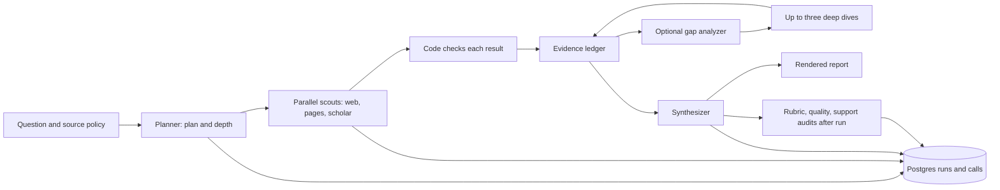

# Independent architecture audit: Scout at `c3bea6a`

**Date:** 28 September 2026
**Scope:** the checked-out `claude/example-glp1-alcohol` branch, its local study artifacts, and read-only queries of the local Postgres database. This report reviews the supplied, untracked `audit.md` as one input, but reaches its own conclusions from current code and offline probes. It makes no model or paid-service calls and changes no run data.

## Executive assessment

Scout has a sound *separation of responsibilities*: typed PydanticAI roles produce plans, research, and reports; the workflow controls their order and budgets; code builds the evidence ledger and checks quotations; Postgres stores runs; versioned, external evaluators inspect completed work. The bounded gap follow-up is a reasonable extension of that design. The offline harness, explicit study ceilings, frozen cases, and recorded prompt/version metadata are unusual strengths for a small research agent.

The largest risk is the distance between **traceability** and **truthful reader output**. A current run can be labelled `answer supported` when its visible answer has uncited factual sentences; a snippet quote can be promoted to read evidence; the support audit judges model-written claim inventory entries while leaving the displayed answer and summary unjudged. These are concrete code paths, not a claim that every saved report is wrong. The benchmark program has a separate validity problem: model-visible examples overlap the task most often used for development, and almost all measured broad-case improvement comes from that one task. More paid comparisons on it will not establish generalization.

The operational picture is also less clean than the roadmap suggests. No research or study command is currently running. The latest Serper study has six complete rescouts and a saved summary; the DeepSeek study has five complete rescouts and one interrupted run. Two run rows (`6e1d421b`, `e994230a`) and five call rows remain `running` in Postgres. The repository has no open PR. Paid work was paused in the supplied audit, and this review made none.

**Recommendation:** keep the paid-study pause. Merge or port the narrowly scoped case-example and child-signal fixes, reconcile the abandoned rows after checking their process state, then repair the reader/evaluator contract and evidence classification. Measure the claim fix and any default-changing comparison on held-out cases with a predeclared decision rule. No additional run role or infrastructure service is needed for those changes.

## Method and limits

- Inspected the role schemas and prompts, orchestration, evidence and source policy, search and reading tools, budget and rate wrappers, study runner, persistence, renderer, and three evaluation lanes. The main source files are `src/research_loop/{agents,prompts,schemas,scout,evidence,acquisition,tools,web,reading,study,study_budget,rate_limit,store,render,evals,quality,audit}.py`.
- Ran deterministic, offline counterexamples against the imported current modules. Their observed values appear beside the affected findings below. No synthetic probe establishes the frequency of a defect in real reports.
- Ran `.venv/bin/pytest -q`: **368 passed, 3 skipped**. The skipped tests were the three Postgres cases in `tests/test_store.py`, because `RESEARCH_TEST_DATABASE_URL` was unset. Ran those six store tests separately against a uniquely named disposable local database: **6 passed**, and the database was removed. `.venv/bin/ruff check .` passed. The full suite was not rerun with that test DSN; the result is a complete offline suite plus a separate Postgres integration pass, not a single 371-test CI run.
- Queried only run IDs/statuses and study counts in the existing database. A read-only `research db reconcile --older-than 60` would have marked one run and one call at the time of checking; the other abandoned run was newer than that threshold. Neither was changed.
- Did not call providers, verify live prices or vendor limits, simulate a provider outage, or assess report truth against outside sources. References to study outcomes below are to stored local artifacts and `docs/study-log.md`, not independently regraded results.

## Current architecture and state

`scout.py:397-821` implements this lifecycle. Parallel scouts return typed `ResearchResult`s; `_research` collects them in plan order and only then adds them to `EvidenceLedger`. A deep dive sees the ledger as of gap analysis, and its results are likewise added after its wave. The synthesizer receives `ledger.prompt_view()`, not raw tool messages (`scout.py:596-612, 713-738`; `evidence.py:350-360`). The tool-output index, not a model, assigns quote and access checks (`evidence.py:139-211`). These boundaries are worth retaining.

The current recorded versions are `scout-v15`, `scout-followup-v16`, `scout-research-v15`, `scout-synthesis-v4`, evidence 7, fetch 18, budget policy `usage-anchor-v6`, and rate policy `scout-429-v5` (`scout.py:179-184`, `schemas.py:27`, `acquisition.py:70`, `study_budget.py:42`, `rate_limit.py:45`). Models, depth limits, output caps, pacing, and retries are configured in `config.py`; each run records model and limit settings and a prompt fingerprint (`scout.py:319-345, 563-571`). Ordinary `research scout` prints its dollar envelopes as **soft limits**; an explicit `--max-usd` adds a pre-dispatch reservation guard (`cli.py:80-123`). A study gives each subprocess such a cap and charges unreadable steps at their full cap (`study.py:471-605`).

The checkout is at `c3bea6a`, six commits ahead of `origin/claude/example-glp1-alcohol`; only `audit.md` is untracked. The proposed `fceba00` contamination/signal patch is on the separate `claude/scout-v15` branch, absent here. `docs/roadmap.md` still calls the trimming and search studies running and the DeepSeek study pending. The study log records that trimming and the four-engine search study finished; `runs/serper-rescout-task8/summary.md` records six later completed rescouts costing $1.87, and the local DeepSeek log ends during diagnosis after its fifth completed rescout. Those later artifacts have no study-log decision yet. Do not treat a stored `running` status as proof of an active process.

## Ranked findings

### P1 — A01. Benchmark examples leak development-case structure into research prompts

**Evidence.** The scout output schema still gives “Inorganic Crystal Structure Database (ICSD)” as an `open_items` example (`schemas.py:177-180`), a named task8 target worth several rubric points. The planner's category/dimension example uses “principle, algorithms, advantages, and disadvantages” and “Exploration-based: disadvantages” (`prompts.py:28-35`); the scout instructions paraphrase task8's database fields and category structure (`prompts.py:45-60`). `audit.md` correctly identifies those overlaps and the low-severity st07 vendor-claim overlap. These instructions and schemas are included in `prompt_fingerprint` (`prompts.py:117-133`), so a correction has an identifiable behavior version.

**Impact.** The rubric is not directly supplied to a research run: `cli.py:80-128` sends the case objective and blocked URLs/titles and records case identity; grading reads the rubric later. The leakage is therefore *indirect task tuning*, not a literal rubric injection at invocation. It can still prime the planner and scouts on a benchmark case. The supplied audit's statement that within-study comparisons “stay valid” needs qualification: arms share the same examples, so a paired result describes performance **under this contaminated prompt**. Search engines or models may respond differently to that priming. The relative result does not automatically transfer to a neutral prompt or a different domain.

**Action.** Port the neutral-example patch and its guard test from `fceba00`, with the correct workflow/prompt version and historical score annotation. Review examples by meaning as well as phrase overlap; the proposed phrase test cannot catch paraphrases. Treat task8 and task68-plus as development diagnostics. Reserve untouched tasks 82, 59, and 78 for one preregistered confirmation, reporting costs and failures alongside scores.

### P1 — A02. “Answer supported” does not certify the displayed answer

**Evidence.** `FinalReport` has three different factual text surfaces: `executive_summary`, `answer`, and `claims` (`schemas.py:186-208`). `_checks` grades only `report.claims` for statement support and separately counts uncited sentences in `report.answer` (`scout.py:946-962`). `_answer_support` uses the statement list, question/coverage state, and citation problems, but does **not** use `uncited_sentences` or compare a claim statement to the answer sentence it allegedly supports (`scout.py:1015-1029`). The renderer displays the summary and answer, but normally not the claim inventory (`render.py:18-75`). The output validator only checks that listed claim IDs exist and inline source IDs lie somewhere behind the aggregate listed claims (`agents.py:166-183`). It does not bind a particular citation to a particular sentence.

**Reproduction.** An offline `RunChecks` with one `read` claim and `sentences=1, uncited_sentences=1` returned `supported` from `_answer_support`. This isolates the missing condition; a full report can additionally have coverage or other weaknesses. A model-written answer may also make a more ambitious assertion than its listed claim. In this architecture “supported” currently means a checked claim inventory and coarse coverage passed, not that every reader-visible factual sentence has sufficient evidence.

**Action.** Make a stable mapping from answer/summary assertion spans to ledger claim IDs and inline source IDs, and validate the mapping before issuing a reader-facing support label. Include uncited material sentences and post-validator citation stripping in the label calculation. Keep a separate traceability mark and a semantic support verdict; do not rename the current label without versioning stored interpretations.

### P1 — A03. Quote verification can overstate what was read or preserve the wrong number

**Evidence.** Quote matching removes all punctuation and joins letters/digits (`evidence.py:61-71`). An offline check accepted `-5` and `-10` as verified against tool text containing `+5` and `+10`. Omissions split a quote into segments whose presence is checked without order (`evidence.py:139-161`), so segments are not a faithful passage check. Separately, `check_evidence` records both the access level of the passage containing the quote and the most the source was ever read (`evidence.py:183-199`). `evidence_is_read` and `evidence_is_quoted` use `source_access`, not `quote_access` (`evidence.py:215-224`). In an offline probe, a quote present only in a `snippet`, plus an unrelated `full_text` window for the same URL, produced `quote_check=verified`, `quote_access=snippet`, `source_access=full_text`, and `evidence_is_quoted=True`.

**Impact.** This is a false-positive path for the `read` statement and `answer supported` marks. It is especially consequential for numerical claims and long documents where only one window was fetched. The code correctly stores `quote_access`; the classification simply does not use it.

**Action.** Define an ordered, punctuation-aware numeric passage matcher (signs, decimal points, units, ranges, ordering) and require the quote's own access to be abstract or full text for the `read` label. Retain a looser search matcher only as a candidate finder or a separately labelled approximate match. Regression examples should cover signs, decimal punctuation, segment order, snippets plus unrelated fetched windows, and PDF spacing.

### P1 — A04. All three evaluation lanes score a different object from the delivered report

**Evidence.** The rubric judge's `reader_text` includes every hidden `report.claims` statement under “Key statements” and omits the displayed executive summary to preserve historical grades (`evals.py:143-161`). The renderer does the reverse for those surfaces (`render.py:18-75`). The support auditor enumerates `report.claims` only (`audit.py:72-90`); it sends the model those statements and verified quotes, not the answer or summary (`audit.py:140-185`). Its code marks a claim with no quote `no_quote`, but a factual assertion that appears only in the answer has no audit item at all. The quality assessment has the reader-facing report, but `_validate` accepts a resolved additional critical claim with no packet source IDs and does not verify that report anchors occur in the report (`quality.py:158-185`).

**Reproduction.** A report with “Hidden inventory assertion” only in `claims` and “Visible summary assertion” only in `executive_summary` put the former in `reader_text` and `audit_items`, but not in `render_markdown`; it put the latter in the rendered report, but not in `reader_text` or `audit_items`. This is a representation mismatch, independent of judge model accuracy.

**Action.** Preserve `JUDGE_VERSION=2` as the explicitly named historical projection. Define one canonical reader artifact and a new evaluator/projection version for future decisions. Audit factual statements selected from its answer, summary, tables, and caveats; map them to ledger claims and passages. Validate anchors and packet-source IDs in quality judgments. Re-score a paired sample before comparing old and new numbers; never mix projections in one score series.

### P1 — A05. Interrupted child processes leave durable status ambiguous

**Evidence.** `study._invoke` uses blocking `subprocess.run` (`study.py:341-347`). `_Run._recorded` records cancellation when Python receives and handles `CancelledError` or `KeyboardInterrupt` (`scout.py:740-770`); a killed child cannot do that. The local DeepSeek log ends with “Interrupted; the run is recorded as cancelled,” but its `e994230a` row remains `running`. A second row `6e1d421b` is also `running`. The database currently has five `running` call rows. `research db reconcile` can mark abandoned records failed (`db.py:91-125`), but requires an age threshold and cannot recover exact incurred cost or partial output.

**Impact.** Status and cost accounting remain uncertain after an interruption; a later study can mistake missing data for an active run. A process scan found no active `research study run`, `research scout`, or `research rescout` command. The proposed signal forwarding in `fceba00` addresses normal interruption but cannot cover SIGKILL, host failure, or a database outage.

**Action.** Port signal forwarding with a bounded graceful shutdown, then reconcile the two known run IDs after checking they have no live owner. Record reconciliation as `abandoned` or failed with unknown final cost, not as a normally cancelled run. Add a durable heartbeat/lease or explicit command ID only if repeated crashes show the age-based reconciler is inadequate; Postgres is sufficient for this lifecycle.

### P2 — A06. A completed model result can be lost on a storage failure

**Evidence.** `_call` performs `finish(result)` and then writes the successful call outside its exception-recording `try` (`scout.py:480-510`). `_scout` catches a later unexpected exception and returns `_cut_off` (`scout.py:630-648`), which uses captured messages but no completed `ResearchResult`. Thus a failure in `store.finish_call(status="succeeded")` after inference can discard checked claims and leave the call row `running`. The 27 September audit addendum reproduced that exact control flow with an injected failing `MemoryStore`; this review confirms the relevant current code remains in place but did not repeat the fault injection. Separately, `_research` collects the whole scout wave before adding any result to `self.ledger` (`scout.py:650-676`, `794-800`). External cancellation while waiting can bypass that collection and leave already finished research out of the run's final ledger.

**Action.** Retain completed checked outputs in run-owned memory before the persistence write and distinguish a persistence failure from a research failure. Finish each call idempotently; record known completed results as each task finishes, with deterministic plan-order projection for downstream use. Test failure before and after the DB commit, plus cancellation with one finished and one pending scout. Do not retry the paid model just to repair a record.

### P2 — A07. Source identity and coverage checks remain permissive

**Evidence.** URL identity drops the query (`evidence.py:73-76`): offline, `https://example.org/view?id=1` and `...?id=2` shared an identity key. That is useful for tracking URLs with harmless parameters but wrong for endpoints where a query selects the document. A DOI printed in the first 3,000 characters is treated as a document identity (`evidence.py:110-125`), although a paper may mention another DOI in an introduction. `coverage_states` marks an item covered as soon as *any* claim names its ID, irrespective of source access, quote status, or whether the claim actually establishes every field in the requirement (`evidence.py:468-491`). An offline plan requiring “All four fields” became `covered` from a claim about only one field tagged with that ID.

**Impact.** These checks can inflate source observation, quotation attribution, and coverage. The source-policy URL blocker is a separate stricter function (`acquisition.py:212-321`), so this finding does not imply the same query confusion in blocking. The system's previous blocked-title/identifier fixes and scholarly-tool filtering (`tools.py:63-101`) are present and materially reduce source leakage.

**Action.** Use canonical identifiers only where their relationship to the fetched document is proven; retain query selectors for document endpoints; distinguish `about this DOI` from `this document's DOI`. Track coverage as “mentioned/claimed,” “evidence present,” and “established for every required field,” rather than one boolean. Make status labels reflect those levels.

### P2 — A08. Study comparisons are inexpensive screens, not default-setting evidence yet

**Evidence.** The study runner rotates arm order, freezes models/call limits from `Settings`, preflights arms, assigns per-step hard caps, and charges unreadable steps pessimistically (`study.py:169-182, 423-435, 471-605`). These fix major earlier budget and arm-order problems. The Serper rerun's summary shows three fixed task8 plans per arm, only a 1.3-point mean claims-score difference (28.0 versus 26.7), and its own diagnostic says differences below about 7.5 points are not distinguishable from run variation. It emits no full report, so its “no report” rows cannot establish reader utility or factual accuracy. The earlier four-engine screen also had one partial Serper run for a reason unrelated to search (`docs/study-log.md:311-337`). A single tuned case and three plans offer weak external validity even if internal randomization is good.

**Action.** Record the completed Serper run and interrupted DeepSeek run without inferring a default change. For each proposed default, write a decision rule and detectable effect before spending; pair on several development domains and reserve held-out confirmation for the final candidate. Include status, cost, time, query availability, evidence quality, reader artifact grades, and human-reviewed critical facts. Report screens as screens. If expected gains are smaller than the detectable effect, improve measurement or stop the comparison.

### P2 — A09. Money and rate controls are strong for studies, weaker as general guarantees

**Evidence.** `StudyBudget` reserves before each model request and paid search, settles known usage, and retains reservations for uncertain failures (`study_budget.py:83-145`). Version 6 prices input and output jointly at the bounded tier, closing the earlier long-context pricing defect. `rate_limit.py` paces scouts per run and retries timed 429s, selected 5xx responses, and some network errors. The default Luna token limit is initialized at 2,000,000/minute and updated from provider headers when available (`config.py:330-333`, `rate_limit.py:160-211`). Ordinary runs without `--max-usd`, however, have no shared reservation guard (`cli.py:80-123`, `scout.py:431-445`). Their dollar envelopes are per-call framework limits plus a predictive `LoopBudget` note (`budget_notes.py:126-173`), and paid tool batches can already be in flight when a note withdraws future tools. The header's “soft limits” wording is accurate. Per-run pacing also cannot coordinate multiple separate processes; the repository instruction therefore limits concurrent Luna studies to two.

**Action.** Keep paid studies behind explicit `--max-usd` and the study ceiling. If ordinary users need a genuine all-service cap, require or default a hard cap at the command boundary and include every billable service. Treat token-bound reservations as conservative engineering estimates, not a mathematical invoice guarantee; compare reserved and settled usage and alert on any overrun. For concurrent studies, respect the two-run process policy and inspect 429/pacing waits before treating latency or quality as a model property.

### P3 — A10. Operational documentation and durable data can diverge

**Evidence.** `docs/roadmap.md` says studies are running although the study log and artifacts show completion or interruption. The local `audit.md` says two runs remain running, which the database confirms; `research db reconcile --older-than 60` counted only one because it is a thresholded view. The renderer and study summary depend on JSON and printed CLI output; grade/audit/diagnosis costs are parsed from human-readable lines (`study.py:349-411`) rather than a typed subprocess result. The runner protects unreadable costs by charging the step cap, but a wording change can still turn a successful evaluation into an `unreadable` violation or lose its decision data. Run and call tables persist questions and model/tool transcripts (`store.py:73-81, 156-205`; `migrations/001_scout.sql:11-74`); the code truncates oversized strings but specifies no retention/redaction policy here.

**Action.** Generate study results from stored structured rows rather than stderr parsers, and update the roadmap as a checkpoint when a study starts, stops, or changes decision. Document retention and access controls for saved questions, passages, and transcripts before using sensitive prompts. This is a governance concern, not evidence of a current secret leak; tests prohibit committing `.env` and current code reads provider keys as `SecretStr` (`config.py:1-7, 334-345`).

## Disposition of earlier audits

The 27 September architecture audit and addendum were valuable, but their base commit predates this checkout. A current reviewer should not treat every original finding as still open. This table records what the inspected current code supports; it is not a complete diff of every intervening commit.

| Earlier topic | Current disposition | Current evidence |
|---|---|---|
| F05 study ceiling and C01 long-context reservation | Substantially fixed | Per-step caps and unknown-cost charge in `study.py:471-605`; joint pricing in `study_budget.py:91-117`. Actual invoice bounds remain empirical. |
| F06 blocked scholarly results and identifier-only citations | Substantially fixed | Tool filtering in `tools.py:63-101`, address/title/identifier policy in `acquisition.py:212-321`. Historic blocked citations remain historic data. |
| F01/C03 reader artifact versus graded inventory | Still open | A02/A04 above; historical `JUDGE_VERSION=2` retained intentionally. |
| F02/F03/F04 quote semantics, identity, access | Still open in narrower, reproduced forms | A03/A07 above. |
| F07 coverage established by a tag | Still open | A07 above. |
| F09/C04 cancellation and storage failure | Still open | A05/A06 above; proposed branch addresses ordinary child interruption only. |
| F08 inherited verification, F10 durable passages, F11 oracle breadth | Partly addressed or not fully revalidated | Current ledger stores per-item check marks and transcripts; this review did not reproduce every historical scenario. Keep those topics in regression review rather than assert closure. |

## Recommended sequence and acceptance checks

1. **Restore study integrity before spending.** Port the neutral examples, version/fingerprint change, contamination guard, and child SIGTERM handling from `fceba00` with a reviewed merge. Reconcile `6e1d421b` and `e994230a` only after checking for owners; preserve unknown cost and the reason for reconciliation. Add the interrupted DeepSeek and completed Serper artifacts to the study log as incomplete/screen results, with exact IDs and costs from stored rows. Update the roadmap. Acceptance: no orphaned process, no stale `running` rows after reconciliation, a clean offline suite and CI.
2. **Make the report's checks describe its actual text.** Introduce a versioned reader artifact with assertion-to-claim-to-source bindings; use it consistently in rendering, the support label, grading, quality assessment, and support audit. Acceptance: a factual answer/summary sentence absent from the assertion map cannot yield “supported”; an uncited material sentence appears in the review; hidden inventory text earns no reader-grade credit.
3. **Harden evidence and coverage semantics.** Use `quote_access` for read status; test signs, decimals, ordered omissions, query-selected documents, and mistaken own-DOI attribution. Split claim-tag coverage from field-complete, evidence-backed coverage. Acceptance: the offline counterexamples in A03/A07 fail on the old semantics and pass on the new labels/matcher; stored version identifiers change where meanings change.
4. **Recover paid work across faults.** Keep checked results before persistence writes, finish calls idempotently, and add cancellation and DB fault-injection tests. Acceptance: a completed scout is represented once after one sibling is cancelled or a success write fails; no model is called again solely to repair storage; cost uncertainty is visible.
5. **Then evaluate defaults.** Run one frozen, preregistered confirmation across genuinely separate cases and a reader-aligned evaluator. Quantify the detectable difference and record model/search costs and rate waits. Review decisive claims against independent source packets. Only then use a result to change a default.

The existing role structure can support all five steps. A validator role inside the paid workflow would add cost and another source of model error before the deterministic defects above are corrected. Improve the checks and the outside-run evaluation lanes first; measure any new role's incremental value only after a stable, reader-aligned baseline exists.
