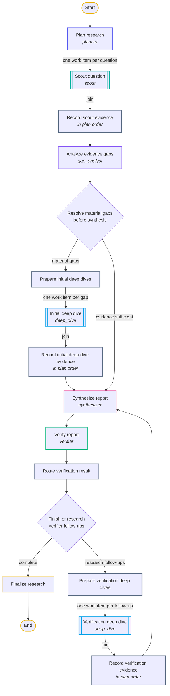

# Research graph

`research-graph-v1` is the versioned research algorithm. It is built with `pydantic_graph.GraphBuilder` in `graph.py`, and `ResearchLoop.run(...)` executes it.

## Topology



Each box is named after its step in `graph.py`. Double-edged boxes run once per question or gap, in parallel. The [README example](../README.md#example-one-question-through-the-graph) follows one question through this graph.

The authoritative diagram comes from the executable graph:

```bash
research-graph                                   # Mermaid state diagram on stdout
research-graph --direction TB --output research-graph.mmd
```

## Steps and the shared runtime

Graph steps own control flow only. Each role call is a method on `AsyncResearchLoop` that the legacy loop uses too, so both orchestrators build identical prompts, route to the same models, and persist the same task records:

| Step | Runtime method |
|---|---|
| Plan research | `_plan` (also saves the plan) |
| Scout question | `_run_scout` |
| Analyze evidence gaps | `_analyze_gaps`, then `_select_gaps` |
| Initial and verification deep dives | `_run_gap` |
| Synthesize report | `_synthesize` |
| Verify report | `_verify` |

Each agent's output is checked against the run (`agents.py`): the planner's question count and IDs, the question a research result is filed under, attachment and claim citations, and the questions gaps and follow-ups name. A mismatch gets one retry that names it, then fails the run.

Job creation, attachment loading, spend tracking, the per-job fetch memo, and the terminal job record (`_create_job`, `_load_attachments`, `_job_scope`, `_finish`) are shared the same way.

## State and dependencies

`ResearchGraphState` is small, mutable control-plane state:

- `job_id`, `objective`, `policy_name`
- `plan`
- `phase`
- `verification_round`, `max_verification_rounds`

`ResearchGraphDeps` holds run-scoped services and the data plane:

- the loop runtime (`loop`) and `job_id`
- research constraints and the normalized attachment corpus
- the append-only `EvidenceLedger`
- the scout and deep-dive semaphores

Mapped graph branches share state, so parallel scout and deep-dive steps change neither the ledger nor the graph state. The join collects their typed outputs, and a serial record step appends them to the ledger afterwards.

## Concurrency

`GraphBuilder.map()` expresses potential parallelism. `ResearchConfig` decides permitted parallelism:

```text
map scouts
   ├── scout ──┐
   ├── scout ──┤  each waits on scout_semaphore (max_parallel_scouts, default 8)
   └── scout ──┘
```

Deep dives use a separate semaphore (`max_parallel_deep_dives`). A breadth policy can therefore plan 24 questions without opening 24 simultaneous model runs. `ResearchConfig` rejects zero-slot semaphores, which would wait forever. Under a `job_cost_limit`, a semaphore slot is not enough: each call also sets aside its route's `cost_limit`, so fewer calls may run at once than the semaphore allows (see the [guide](guide.md#how-spending-is-limited)).

Every mapped work item carries its position in the plan. Record steps sort joined results by that position before they reach the ledger, so a faster provider cannot reorder evidence. This matches the input-order behavior of the legacy `asyncio.gather` implementation.

## Gap selection

Initial deep dives come from the gap analyst's gaps plus a `low_confidence` gap for every question whose best result is below `min_scout_confidence`. Verification deep dives come from the verifier's follow-ups. In both cases a gap naming a question outside the plan gets the agent a retry; selection also drops any that remain, keeps the most severe gap per question, and at most `max_deep_dives_per_round` are researched, most severe first. Deep dives in verification rounds use `attempt >= 1`, which routes to the policy's alternate deep-dive model when it has one.

## Verification rounds

```text
initial verification
       ├── no research needed, or no follow-ups ──► finish
       └── research requested
                │  if rounds remain
                ▼
          follow-up deep dives ──► synthesize ──► verify
```

`max_verification_rounds` bounds the research-and-resynthesis rounds after the first verification; `0` disables them. When the limit is reached, the run finishes with the last verification, including its unresolved findings.

Follow-ups naming questions outside the plan are retried away by the verifier, so they no longer buy an empty round. One case remains, held because fixing it changes `v1` routing: with `max_deep_dives_per_round = 0`, valid follow-ups still repeat synthesis and verification on an unchanged ledger. See finding 2 in the [architecture review](architecture-review.md).

## Versioning

Topology and model policy are separate experimental dimensions:

```text
research-graph-v1 + quality
research-graph-v1 + breadth
research-graph-v1 + glm-heavy
```

A critic loop, multi-team topology, or any other change to nodes or edges becomes `research-graph-v2` instead of silently changing `v1`. Postgres and manifests record the graph version next to the policy, so a result can be attributed to a model, a role assignment, or a topology.

## Persistence boundary

The graph is typed control flow, not durable execution, and not a crash-resumable checkpoint store. Postgres persists:

- job and run identity
- task attempts with lineage: a deep dive's `parent_task_id` is the gap-analysis or verifier task that requested it, and a salvage call's is the research task that ran out of budget
- effective model configuration
- structured outputs, usage, and cost
- tool calls
- attachment manifests
- the final report and verification
- the evidence ledger, whose unique claim IDs the report and verification cite, including a failed job's partial ledger
- `review_reasons`, what a finished job left unresolved

Every job and task ends in a terminal record when the process survives: a failure, a cancelled run (Ctrl-C reaches the run as cancellation), and a sibling scout or deep dive cancelled because another failed (in both orchestrators) are all recorded as `failed`, with the error type (`CancelledError` for cancellation). These writes are shielded from cancellation for up to ten seconds, and if one fails, the original error is still the one raised, with a note. `ResearchConfig.max_run_seconds` sets an optional deadline: past it, the run is cancelled and recorded failed with `TimeoutError`. A killed process still leaves `running` records; `research-db reconcile` closes them out.

If in-flight crash recovery becomes necessary, add a durable execution layer deliberately. Graph nodes plus Postgres records do not amount to durability.

## Parity

`LegacyResearchLoop` keeps the v4 plain-async control flow as a regression baseline.

`tests/test_parity.py` runs both orchestrators with the same deterministic agent outputs. The scenario deliberately takes the long path: parallel scouts that finish out of order, a low-confidence initial deep dive, synthesis and verification, a verifier-requested second deep dive, and a passing re-verification. It compares an order-insensitive fingerprint of the plan, every field of every result (claims, evidence, and contradictions included), the report, and the verification, plus the role, question, and attempt of every call.

`tests/test_workflow_contract.py` runs every contract test (round limits, gap selection, failure and cancellation recording, salvage, prompt contents, task lineage, and the shared fetch memo) against both orchestrators through the real agent runner, with only model responses scripted.
