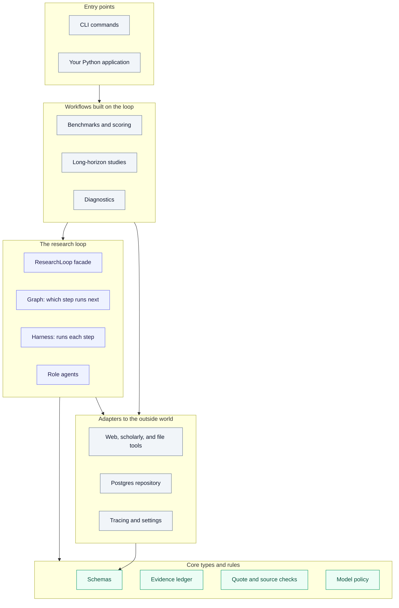
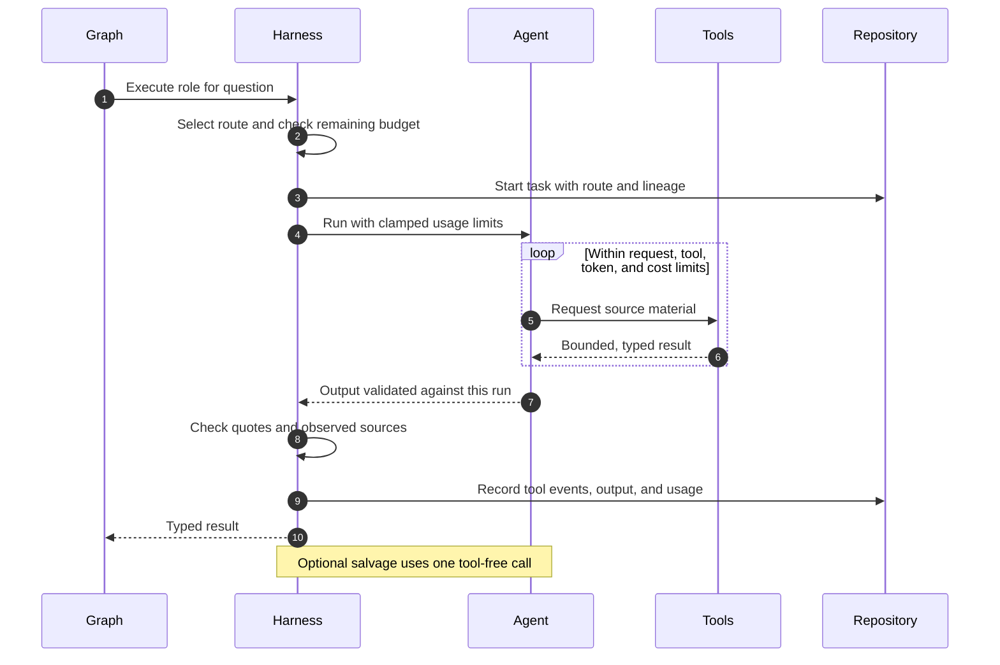
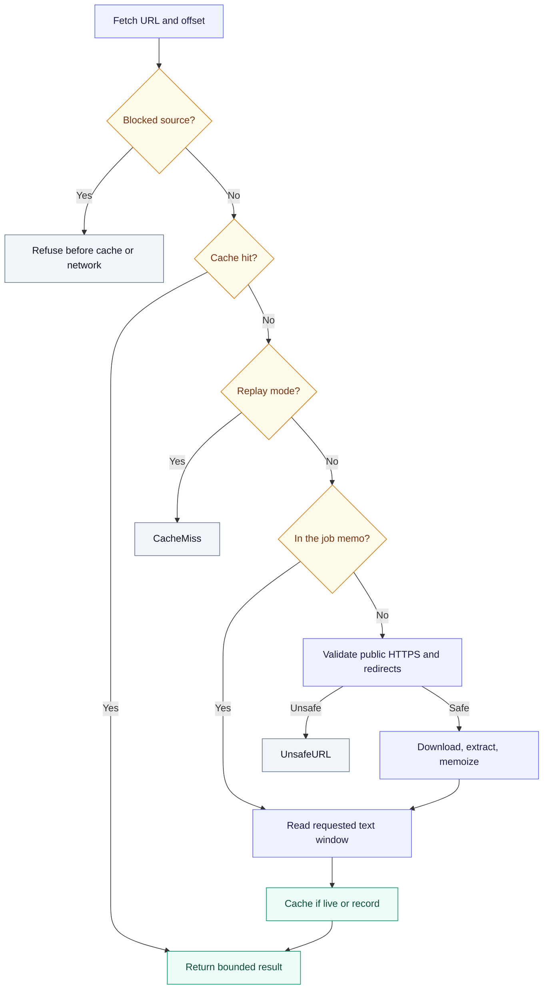
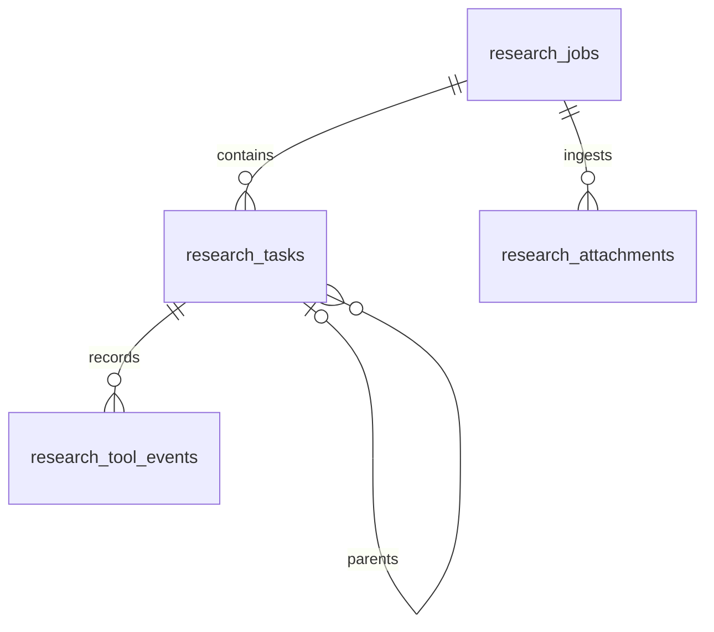
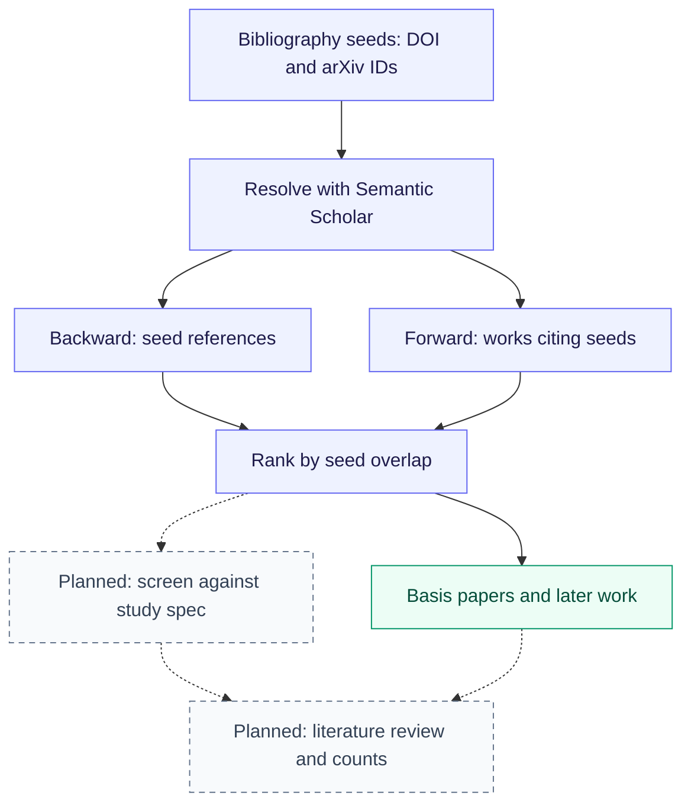

# Research Loop: the full guide

Research Loop takes a research question, splits it into smaller questions, investigates each one with web, scholarly, and file tools, and writes a report in which every claim points back to the evidence it came from. A separate verifier then checks the report claim by claim, and plain code checks that quoted passages and cited sources really appeared in what the tools returned.

It is built on PydanticAI agents and a Pydantic Graph workflow. Which model does which job, and how much each call may spend, is configuration. Postgres can optionally keep a durable history of every run, and the same loop drives the benchmark suites and the multi-question studies described further down.

A finished run is not a guarantee that its conclusions are right. What you get is a report you can inspect: the evidence behind each claim, the verifier's findings, and a list of `review_reasons` naming anything the run left unresolved.

## Trying it out

```bash
make setup                                    # create .venv with every optional extra
source .venv/bin/activate
pytest -q                                     # offline; makes no model or network calls
research-diagnose                             # checks your local setup; safe without API keys
research-bench examples/benchmark_cases.json  # runs the real graph with scripted models
```

None of these commands spends money on model calls, though `make setup` downloads dependencies. The last command uses the `synthetic` policy, which runs the real graph and repository with scripted role outputs, so you can see the whole pipeline work before configuring any provider. When you are ready for Postgres, API keys, and a first paid run, follow [docs/setup.md](setup.md). CI runs `ruff check .` and `pytest -q` on every push and pull request.

## Using it from Python

```python
# Inside an async application that already has a database pool, session, and run.
from research_loop import (
    AttachmentMode,
    ResearchConfig,
    ResearchConstraints,
    ResearchLoop,
    ResearchToolMode,
    get_policy,
)
from research_loop.repository import PostgresResearchRepository

loop = ResearchLoop(
    get_policy("quality"),
    ResearchConfig(
        tool_mode=ResearchToolMode.NORMALIZED,
        attachment_mode=AttachmentMode.NORMALIZED,
    ),
    repository=PostgresResearchRepository(existing_async_psycopg_pool),
)

outcome = await loop.run(
    "Compare the claims in the attached report with current primary sources.",
    session_id=session.id,
    root_run_id=run.id,
    constraints=ResearchConstraints(attachment_paths=["/local/path/report.pdf"]),
)
print(outcome.report.answer)
```

The returned `outcome` holds the plan, the report, the verification, the evidence ledger, the attachment corpus, what the job spent, and its `review_reasons`. Models never see file paths on your machine; they reach attachments through stable IDs and a small set of attachment tools.

To try a single question from the command line, run `examples/run_research.py`. It uses the synthetic policy unless you pass `--paid`. `LegacyResearchLoop` accepts the same arguments as `ResearchLoop`.

## What happens during a run

<p align="center">
  
</p>

A run begins with the planner, which turns your objective into a `ResearchPlan`: a list of research questions, each with a priority, an expected difficulty, and flags saying whether it needs primary sources or images.

Every question then gets a scout. Scouts run in parallel, up to a configured limit, and each one searches and reads until it can answer its question. When all of them have finished, their results are added to the evidence ledger in the order the plan listed the questions, regardless of which scout finished first.

Next, the gap analyst looks for material gaps: low confidence, a missing primary source, a contradiction, missing evidence, or a need for images. Any question whose best result falls below `min_scout_confidence` gets a gap automatically. The most severe gap for each question, up to `max_deep_dives_per_round`, gets a deep dive, which is a longer and more thorough investigation. Deep dives also run in parallel and are recorded the same way.

The synthesizer then writes a `FinalReport` from a compact view of the ledger. Every claim in the report has to cite ledger claim IDs such as `q2/c1`. The verifier checks each of those claims against the evidence it cites, grades any problems by severity, and may ask for more research. If it does and rounds remain (`max_verification_rounds`), the follow-ups become deep dives, possibly on the policy's alternate deep-dive model, and synthesis and verification run again. Otherwise the run ends with its report, its verification, and its `review_reasons`.

### Why parallel work still gives repeatable evidence

<p align="center">
  
</p>

Workers never write to shared state. Each one returns a typed `ResearchResult` tagged with its question's position in the plan. The join step only collects these results, and a separate record step sorts them and appends them to the ledger. That way a faster provider can't change the order of the evidence, and two workers can't race to update the ledger. The diagram shows three workers; the real number comes from configuration.

## How the code is organized

The code is arranged in layers. Each layer builds on the ones below it and never imports from the ones above, so you can read it from the bottom up, and a change to a lower layer's internals stays contained there.



| Layer | What it does | Modules in `src/research_loop/` |
|---|---|---|
| Entry points | Parse arguments, print results, and assemble the objects a run needs | `main()` in `benchmark.py`, `long_horizon.py`, `diagnose.py`, and `db.py`; `graph_cli.py`; `examples/` |
| Workflows | Run the loop many times under recorded conditions and summarize the results | `benchmark.py`, `benchmarks/`, `evals.py`, `experiment.py`, `long_horizon.py`, `long_horizon_spec.py`, `citations.py`, `diagnose.py`, `synthetic.py`, `parity.py` |
| The research loop | Plan, research, synthesize, and verify one objective | `orchestrator.py`, `graph.py`, `async_orchestrator.py`, `agents.py` |
| Core types and rules | Define what a question, claim, and source are, hold the evidence, and decide which model handles each role | `schemas.py`, `ledger.py`, `quotes.py`, `policy.py` |
| Adapters | Talk to search engines, scholarly APIs, local files, Postgres, and tracing | `tools.py`, `web.py`, `scholar.py`, `acquisition.py`, `attachments.py`, `repository.py`, `db.py`, `telemetry.py`, `observability.py`, `settings.py` |

Inside the research loop, the work is split so that each kind of change has one home:

- The graph (`graph.py`) decides only which step comes next. Its state holds control data: the objective, the plan, the current phase, and the round counters. The ledger, attachments, and concurrency limits are passed to steps as dependencies, because parallel branches share state and nothing a branch produces should live there.
- The harness (`AsyncResearchLoop` in `async_orchestrator.py`) runs each step: it picks the model route, checks the budget, calls the agent, checks quotes and sources, and records the result. Every prompt and role call lives here or in `agents.py`, and both the graph loop and the legacy loop go through it, so changing a prompt means editing one place. A change to anything a model sees counts as a behavior change and shows up in each manifest's prompt fingerprint.
- `ResearchLoop` in `orchestrator.py` is the public entry point. It creates the job, runs the graph, and records how the job ended.

The graph is versioned as `research-graph-v1`. Adding a node or an edge would make it `research-graph-v2`; `v1` does not change silently. Each job records the graph version next to its policy, so a result can be traced to a particular model, role assignment, or topology. Running `research-graph` prints the diagram from the executable graph itself; the animation under [What happens during a run](#what-happens-during-a-run) is a simplified reading of it.

`LegacyResearchLoop` is the earlier plain-asyncio version of the loop, kept as a baseline. Parity tests run both loops with scripted models and compare the plan, every result field, the report, the verification, and the role, question, and attempt of every call. [docs/graph.md](graph.md) covers the graph in depth.

The graph is ordinary control flow, not a durable workflow engine: if the process crashes, the run does not resume where it stopped. Postgres keeps the record of what happened, and `research-db reconcile` marks jobs left running by a killed process as failed.

### The six agents

There is one PydanticAI agent per `ResearchRole`, each with fixed instructions and a Pydantic output type. None is tied to a model; the harness supplies one on every call according to the [policy](#models-and-budgets), so any agent can run on any provider.

| Role | Produces | Tools | Runs |
|---|---|---|---|
| `planner` | `ResearchPlan` | attachment tools, if the run has attachments | once |
| `scout` | `ResearchResult` | web, scholarly, and attachment tools | once per question, in parallel |
| `gap_analyst` | `GapAnalysis` | none | once |
| `deep_dive` | `ResearchResult` | web, scholarly, and attachment tools | once per selected gap, in parallel |
| `synthesizer` | `FinalReport` | none | once per round |
| `verifier` | `VerificationReport` | none | once per round |

Long-horizon studies add a seventh agent outside the graph, the study synthesizer, which uses the synthesizer's model route.

Each agent's output is checked against the current run, beyond just parsing it (see `agents.py`). The plan must have the right number of questions with unique IDs. A result must be filed under the question it was assigned. Attachment citations must name this run's attachments, gaps and follow-ups must name planned questions, and report and verifier citations must name real ledger claims. If an output fails a check, the agent gets one retry with the problem spelled out; if it fails again, the run fails rather than returning something inconsistent.

Scouts and deep dives work in a loop, calling tools until they can answer, within their route's limits on requests, tool calls, tokens, and cost. Every request resends the whole conversation, so those limits are what keep cost bounded. Gap analysis, synthesis, and verification are each a single structured call over a compact view of the ledger.

### What the harness does around each call



While the process is alive, every job ends as either `succeeded`, with its report, verification, ledger, and review reasons, or `failed`, with the error that stopped it. Failures include ordinary exceptions, `JobBudgetExceeded`, `PromptExceedsRetryBudget`, cancellation (including Ctrl-C), a branch cancelled because a sibling failed, and running past `max_run_seconds`. These records are written even while the run is being cancelled, and if writing the record itself fails, the original error is still the one you see.

The harness also tracks each job's spend. If you set `job_cost_limit`, every call first sets aside its route's `cost_limit` from what remains, and returns the unused part when it finishes, so calls running at the same time cannot count on the same money. A call whose allowance does not fit beside the running calls waits for one of them to finish; with nothing running it takes what is left as its cost limit. You can also set `job_reserve_usd`, an amount research calls must leave untouched, so that gap analysis, synthesis, verification, and salvage still have money left. If any billed call used a model with no known price, the job reports its cost as unknown instead of a misleading partial sum.

Before gap analysis, synthesis, or verification, the harness checks that the prompt leaves room for one validation retry within the role's token limit. If it doesn't, the call is refused before it is made, so you never pay for a call that cannot finish.

With `salvage_exhausted_research` turned on, a scout or deep dive that hits a usage limit gets one more call without tools, which summarizes the evidence that call had already gathered. It sees only that call's tool results, not the whole ledger. Unanswered, failed, and repeated tool calls are left out, and the remaining results share a 64,000-character allowance so that later, more targeted fetches aren't crowded out. Quote checks still run against the captured tool text, but the stored salvage prompt keeps only hashes and sizes of the replayed results.

The harness uses whatever settings the application passes in and reads environment variables only when none are given.

## Models and budgets

Two objects shape a run without touching the graph. `ModelPolicy` decides who does each step and how much each call may spend. `ResearchConfig` decides how much work the loop does overall.

### Choosing a model for each role

The loop never checks vendor names. It asks the policy for a route, and a route is a model together with its limits. Scouts use the `multimodal_scout` route when a question needs images and that route exists, the `cheap_scout` route for easy questions that don't need primary sources when that route exists, and the regular `scout` route otherwise. Deep dives use `alternate_deep_dive` from the second attempt onward if that route exists, and `deep_dive` otherwise.

| Policy | What it's for | Questions per plan |
|---|---|---|
| `quality` | The default for paid runs | 6–10 |
| `breadth` | Many questions, scouted on the cheap route | 16–24 |
| `glm-heavy` | Moves gap analysis and cheap scouting to GLM | 8–12 |
| `synthetic` | Scripted outputs with no provider calls | 1 |

<details>
<summary>Default routes and per-call limits for the <code>quality</code> policy</summary>

Each route's model can be overridden with a `RESEARCH_*_MODEL` environment variable ([docs/setup.md](setup.md#model-routing)).

| Route | Default model | Requests | Tool calls | Tokens | USD per call |
|---|---|---:|---:|---:|---:|
| planner | `anthropic:claude-opus-5` | 6 | 4 | 70k | 2.50 |
| scout | `zai:glm-5.3` | 12 | 24 | 100k | 0.80 |
| cheap scout | `openai:gpt-5.6-luna` | 10 | 20 | 80k | 0.25 |
| multimodal scout | `google:gemini-3.8-flash` | 12 | 20 | 100k | 0.75 |
| gap analyst | `openai:gpt-5.6-sol` | 6 | 4 | 70k | 1.25 |
| deep dive | `openai:gpt-5.6-sol` | 20 | 40 | 180k | 5.00 |
| alternate deep dive | `xai:grok-4.5` | 20 | 40 | 180k | 5.00 |
| synthesizer | `anthropic:claude-opus-5` | 8 | 4 | 180k | 3.50 |
| verifier | `openai:gpt-5.6-sol` | 8 | 8 | 150k | 2.50 |

Model IDs go out of date, and a model appearing in a provider's list doesn't mean your key can use it. Run `research-diagnose --smoke` to confirm every route before a paid run.

</details>

### How spending is limited

There are three levels of limits. Your provider account's own caps are the outermost. Inside them is the job's `job_cost_limit`, less any `job_reserve_usd` held back for finishing work. Inside that, every call has its own limits on requests, tool calls, tokens, and dollars.

The built-in policies leave `job_cost_limit` unset and `job_reserve_usd` at zero, so out of the box the only protection is the per-call limits. If you use the library directly, set a job cap yourself; long-horizon studies set one from their per-question and synthesis budgets. The job cap is a soft limit: a call's cost is known only after each request returns, so a call can overshoot its allowance by part of a request, and the cap can't promise that your provider bill will never go over it. Setting aside each call's full allowance is cautious: under a job cap, parallel scouts run only as many at once as their route `cost_limit`s fit beside the reserve, and a route without a `cost_limit` runs one call at a time.

Limits that no call could run under are refused before a job is created. A route needs a model, at least one request and one token, and zero or more tool calls (zero makes it tool-free); its dollar limit and `max_tokens`, when set, must be positive. A policy needs a route for every role, a planner range with 1 ≤ min ≤ max, a positive job cap when set, and a reserve of zero or more that stays below the cap.

### How much work a run does

| Setting | Default | What it controls |
|---|---|---|
| `max_parallel_scouts` | 8 | How many scouts run at once |
| `max_parallel_deep_dives` | 2 | How many deep dives run at once |
| `max_deep_dives_per_round` | 4 | How many gaps are researched per round, most severe first, one per question |
| `min_scout_confidence` | 0.70 | Questions whose best result is below this get a `low_confidence` gap |
| `max_verification_rounds` | 2 | Extra research-and-rewrite rounds after the first verification; `0` turns them off |
| `salvage_exhausted_research` | off | Summarize instead of failing when a scout or deep dive runs out of budget |
| `max_run_seconds` | none | A wall-clock deadline for the run |
| `keep_recent_tool_results` | none (off) | Experimental. A scout or deep dive sends only its N most recent tool results whole; older results of 2,000 characters or more that it has already read go as a note plus their first 500 characters, and it can call the tool again for the full text. Stored tool output, quote and source checks, and salvage still see everything. It changes what models are sent, so compare quality before turning it on |
| `tool_mode` | `adaptive` | Whether models use their provider's search or the shared local tools (see [sources](#where-evidence-comes-from)) |
| `attachment_mode` | `normalized` | Send attachments as extracted text only, or also send images and scanned PDFs |
| `scholarly_cache_mode` | `live` | How the acquisition cache is used |

Benchmarks and long-horizon studies set all of these explicitly and record them in every manifest. A parallelism setting of zero is rejected, since a semaphore with no slots would wait forever.

## Where evidence comes from

Scouts and deep dives gather evidence through three groups of tools. Tools return bounded, typed data. They never call a model and never write to the ledger.

| Group | Tools | Backends |
|---|---|---|
| Web | `duckduckgo_search`, `web_fetch` | DuckDuckGo and any public HTTPS page |
| Scholarly | `scholar_search`, `scholar_get`, `scholar_references`, `scholar_citations`, `scholar_fetch` | OpenAlex, Crossref, arXiv, ACL Anthology, OpenCitations, and open-access PDFs |
| Attachments | `list_attachments`, `search_attachments`, `read_attachment` | Local files, extracted before any model sees them |

The tool mode decides whose search a model uses. In `normalized` mode every model gets the same local search and fetch tools and provider-native search is switched off, so comparing two policies doesn't quietly compare two search engines as well. Benchmarks and studies always use this mode. In `adaptive` mode, the library default, models use their provider's own web tools where they have them, with the local tools as a fallback. The scholarly tools are available in both modes.

Every fetch follows the same path:



Downloads are capped at 5 MB. Text is extracted with Trafilatura, pypdf, or GROBID and returned in windows of at most 12,000 characters, each with a `next_start` offset. A long document is read one window at a time, and a second agent in the same job reuses the download instead of fetching it again.

A URL counts as public only if every address its host resolves to is globally routable. That check applies to the original request and to each of up to three redirects. A benchmark task can also forbid particular sources, such as material derived from the expert report its rubric is based on. Forbidden sources are refused at the fetch, again at every redirect, and once more when evidence is recorded: a result that cites one gets a retry, and fails if it cites one again. Seeing a forbidden source in search results is allowed.

DuckDuckGo searches share a rate limit of one per second and retry once. If the retry also fails, the model gets a `SearchUnavailable` result and can switch to the scholarly tools.

The cache has four modes. `off`, used by benchmarks, means no result depends on an earlier run. `record`, used by studies, saves everything so a later run can replay it. `replay` reads cache entries of any age and never touches the network, for offline reproduction. `live`, the library default, reuses entries for up to a day.

More detail, including the URL-safety limits: [docs/acquisition.md](acquisition.md) and [docs/attachments.md](attachments.md).

## How a claim stays tied to its source

<p align="center">
  
</p>

Each scholarly provider's response becomes a `ScholarWork` record: provider and provider ID, title, DOI, arXiv ID, OpenAlex ID, ACL ID, date, authors, abstract (arXiv abstracts are cut at 1,500 characters), open-access full-text URL, retraction flag, citation count, Crossref update relations, and licenses. Records from different providers are kept separate even when they describe the same work, and a preprint stays a separate record from its later publication.

Every record also says how far along the publication process the work is (`preprint`, `journal`, `accepted_conference`, `conference_submission`, or `unknown`) and, in `status_basis`, where that came from, such as "arXiv repository record" or "Crossref type: journal-article". The classification errs on the side of caution. A DOI on an arXiv record doesn't make the work peer-reviewed, venue metadata alone doesn't prove peer review, and ACL BibTeX stays `unknown` until the venue is verified.

When an agent cites something, it records a `SourceRef` with those identifiers, a `locator` such as a page or section, the publication status, a short `excerpt`, and optionally a verbatim `quote`. Code then compares the citation with what the tools actually returned during that research call. `quote_check` is `verified` when the quote appears in that text; the comparison looks only at letters and digits and accepts parts separated by `...` in any order, so PDF spacing and list formatting don't cause false misses. `source_check` is `observed` when the cited URL, DOI, or arXiv ID appeared there. The model can't see or set either result.

The two checks tell you different things. An observed source means the citation matches something a tool returned; a verified quote means the quoted text was really in that material. Neither means the source is correct or that it supports how the report uses it. That judgment is the verifier's job.

`EvidenceLedger` stores results by question, append-only, in plan order. Workers number their claims independently, so the ledger renames them to `<question>/<claim>`, for example `q3/c2`, or `q3/c2~2` when a deep dive repeats a number, and updates contradictions to match. Synthesis and verification never see the raw ledger. They see a trimmed view: empty fields removed, each source listed once in a table and cited by `source_id`, and a quote shown in place of its excerpt unless the quote check couldn't find it. The verifier sees only the claims the report cites, plus any claims named in a contradiction.

## What gets stored

Postgres records each job and its tree of calls. Every task belongs to a job and can point to the gap analysis, verification, or exhausted task that led to it. Tool events keep identifiers and hashes rather than article text, and attachments keep their ingestion details.



| Where | What | Why it's kept |
|---|---|---|
| Postgres (optional) | Jobs, tasks and their lineage, tool events, attachment manifests, finished ledgers | Durable history, cost analysis, and reloading a report with its citations |
| `benchmark_outputs/` | Experiment manifests and study folders | Comparing runs and aggregating studies |
| `.cache/research-loop/` | Raw provider responses and fetched text windows | Replaying a study offline |
| Memory only | The job's fetch memo and full fetched documents | Paging through documents within one job |

A job row holds its ID, objective, status, policy, effective configuration, plan, report, verification, evidence ledger, review reasons, and error. A task row holds its job and parent task, role, question, attempt, prompt, model, output, and usage. A tool event holds its task, call index, tool name, sanitized arguments, and result metadata (IDs, counts, sizes, and hashes). An attachment row holds its job, attachment ID, SHA-256, extractor, and chunk count. Study folders also get a deduplicated `bibliography.json`.

Migrations are checksummed SQL files applied with `research-db migrate` ([docs/setup.md](setup.md#postgres)). Attachments are hashed, split into chunks, and shown to models by stable ID only ([docs/attachments.md](attachments.md)).

Tracing through Logfire is optional. With `RESEARCH_LOGFIRE_ENABLED=true`, each job becomes one trace with every agent call nested under a `research job` span, parallel branches included; search by `job_id` to find one. Prompts, completions, and tool content are kept out of spans ([docs/setup.md](setup.md#logfire-tracing)). `research-diagnose` checks dependencies, graph construction, tools, directories, the database and its migrations, credentials, and each route's model profile. With `--smoke` it also makes one small paid call per model.

## Measuring quality

Quality is checked at three levels. Within a single call, the output is validated against the run's IDs and the quotes and sources are checked against tool output. Across a report, the verifier checks each claim. Across many runs, benchmark metrics are computed and the configuration is saved so the comparison can be interpreted later.

Every finished run gets `review_reasons`, which flag a run with no evidence, a report that is uncited or unchecked, unsupported or major verifier findings, a verifier still asking for more research, or web and scholarly tool calls that mostly reached no source, as happens behind a network that allows only listed domains ([acquisition.md](acquisition.md#telemetry-and-privacy)). An empty list means none of these checks found a problem; it isn't an independent guarantee of correctness. Benchmark records, study `run.json` files, and Postgres job rows all include it.

The benchmark lanes test different skills. BrowseComp tests hard retrieval, DeepResearch Bench II tests synthesis against expert rubrics with forbidden sources, and GAIA tests mixed tool use with attachments. The original DeepResearch Bench, FutureSearch, and generic JSONL cases are supported too.

Metrics are computed with Pydantic Evals: supported-claim rate, major-error-free rate, primary-source rate, supported claims per tool call and per dollar, unique-search rate, forbidden-source compliance, eval integrity (which catches searches for the benchmark itself), exact-answer match, verbatim-quote rate, observed-source rate, and attachment citation coverage. A metric that doesn't apply to a case records nothing, so it's never averaged in as a pass or a fail.

Each benchmark run writes a sanitized manifest containing the git commit and a hash of any uncommitted changes, package versions, redacted policy snapshots, the effective configuration, a fingerprint of every agent's instructions and output schema, dataset hashes, and one fingerprint over all of it. Manifests never contain prompts, answers, credentials, or local paths. Lanes, suites, metric definitions, and comparison rules are in [docs/benchmarks.md](benchmarks.md).

To compare two runs fairly, hold these fixed. When you are deliberately comparing policies or models, change only that and record it.

| What to hold fixed | Current version | Defined in |
|---|---|---|
| Graph topology | `research-graph-v1` | `graph.py` |
| Model policy | `quality`, `breadth`, `glm-heavy`, `synthetic` | `policy.py`, `RESEARCH_*_MODEL` |
| Evidence schema | `evidence_version` 4: an `excerpt`, plus a verbatim `quote` and cited source that code checks against tool output, and every role's output checked against the run's plan, ledger, and attachments | `schemas.py`, `quotes.py`, `agents.py` |
| Fetch behavior | `fetch_version` 4: paged fetches, a per-job document memo, refusal of the task's forbidden sources, and year bounds on every scholarly search provider | `acquisition.py` |
| Tool mode | `normalized` for benchmarks and studies, `adaptive` as the library default | `tools.py` |
| Attachment mode | `normalized` or `multimodal` | `attachments.py` |
| Scoring | `evaluator_version` 1, the metric definitions | `evals.py` |

## Long-horizon studies

Some research is too big for one run. A long-horizon study is a spec file listing many questions. Each question runs as its own research job, and the results are then combined into one synthesis.

<p align="center">
  
</p>

The spec, `spec.toml`, sets the questions, the publication window, the source tiers, research notes, per-question budgets, and the required outputs. It is fully validated when it loads, so `--dry-run` catches the mistakes a paid run would otherwise hit.

Each question's report, verification, ledger, and bibliography are written to a staging folder, which then replaces the published folder in a single rename, so a question's output is never half-written. Its `run.json` records a hash of every file and of the rendered objective. When results are aggregated, a question only counts if its objective hash still matches the spec and its files still match their hashes. Changing only a budget keeps earlier outputs valid; changing a question or the source policy means rerunning it.

The final synthesis is one bounded agent job. It receives a source table and, for each question, the report's claims, caveats, contradictions, and verifier findings. It writes a report, a catalog of benchmarks, architecture patterns, failure modes, open questions, and falsifiable hypotheses, and every entry must cite claim references such as `q01/q1/c3`.

```bash
research-long-horizon --dry-run                        # validate the spec; no calls
research-long-horizon --question q01 --paid --persist  # run one question
research-long-horizon --all-questions --paid --persist # run every question in turn
research-long-horizon --all-questions --resume --paid   # rerun only questions not completed under this configuration
research-long-horizon --aggregate                      # merge completed evidence; no calls
research-long-horizon --basis-papers                   # find basis papers and later work; no model calls
research-long-horizon --synthesize --paid --persist    # write the study report, catalogs, and hypotheses
```

The first study, on long-horizon agentic software engineering, and its calibration pilot are described in [long_horizon/agentic_se/README.md](../long_horizon/agentic_se/README.md).

### Toward literature reviews

A long-horizon study already has most of what a systematic literature review needs: a protocol (the spec), research questions, a publication window, inclusion rules (the source tiers), a record of every search, and a synthesis. Two pieces were missing. One is finding the papers a field is built on; that part works today. The other is reporting how the review narrowed everything it found down to what it included; that part is still planned. The dashed boxes below are the planned part.



Basis papers are the works a body of literature rests on: the ones many of the collected papers cite. `--basis-papers` looks up every arXiv ID and DOI in a study's bibliography on Semantic Scholar, collects each one's references, and ranks the referenced works by how many of the study's papers cite them, marking the ones the study itself never cited. This step is plain code, with no model call and no new agent. It uses Semantic Scholar because OpenAlex lists no references for arXiv preprints ([docs/acquisition.md](acquisition.md#citation-snowballing-basis-papers)). Going the other direction, forward snowballing finds later works that cite several of the study's papers.

On the p01 pilot, the Codex paper that introduced HumanEval ranked first in both runs. It was cited by 6 of 7 seed papers in the evidence-version-3 bibliography and 5 of 8 in the version-4 one, yet the study never cited it. MBPP, SWE-bench, and SWE-agent came next, and 29 of the top 30 were works the study hadn't cited. Forward snowballing found 30 later works, mostly from 2026, because citations are read newest first and capped at 1,000 per seed. These are observations from one pilot, not a general measure of retrieval quality.

Still to come: screening against the spec's window and source tiers, a screening record of how many works were found, screened, and included (with a reason for each exclusion), a review-style synthesis organized by theme and timeline that reuses the study synthesizer, co-citation ranking, and feeding basis papers back into a study. The research agents' own `scholar_references` and `scholar_citations` tools still return at most 10 works per call with unresolved metadata.

## Commands

| Command | What it does | Makes paid calls |
|---|---|---|
| `research-diagnose` | Checks dependencies, the graph, tools, directories, the database, providers, and model routes | Only with `--smoke` |
| `research-db status`, `migrate`, `reconcile` | Shows or applies SQL migrations, and closes out jobs a killed process left running | No |
| `research-bench SUITE` | Runs benchmark cases under one or more policies and writes a sanitized manifest | Only with `--paid` |
| `research-long-horizon` | Runs a study's questions, aggregates their evidence, and writes the synthesis | Only with `--paid` |
| `research-graph` | Prints the executable graph as Mermaid | No |

The Makefile wraps the common tasks: `setup`, `test`, `lint`, `diagnose`, `graph`, `postgres-up`, `postgres-down`, `db-status`, and `migrate`. The animated diagrams in `docs/assets/` are generated by `scripts/readme_diagrams.py`; edit the script and rerun it rather than editing the SVGs.

## What this project leaves out

There is deliberately no durable workflow engine (DBOS, Temporal, Prefect), no crash recovery from graph-state snapshots, no learned router, no extra agent roles, no event sourcing, and no second evidence store. The next step is measurement: small paid runs and scout comparisons, with changes to `ModelPolicy` driven by the recorded telemetry rather than public leaderboards. Most of the integrity work from [docs/architecture-review.md](architecture-review.md) is done, and its status table lists what remains.

## Further reading

- [docs/setup.md](setup.md): installation, model routing, Postgres, diagnostics, and Logfire.
- [docs/graph.md](graph.md): graph state, concurrency, and parity with the legacy loop.
- [docs/acquisition.md](acquisition.md): paging, caching, URL safety, and source policy.
- [docs/attachments.md](attachments.md): file extraction and provenance.
- [docs/benchmarks.md](benchmarks.md): benchmark lanes, metrics, and comparison rules.
- [long_horizon/agentic_se/README.md](../long_horizon/agentic_se/README.md): the first study, its pilot, and its synthesis; [PROMPT_SIZES.md](../long_horizon/agentic_se/PROMPT_SIZES.md) records where prompts exceed limits.
- [AGENTS.md](../AGENTS.md): rules for changing the repository.
- [docs/architecture-review.md](architecture-review.md): a dated review with the status of each finding.
