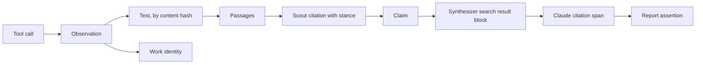

# Plan: rebuild Scout's evidence layer around passages

**Status: approved on 29 September 2026.** The user approved it with its recommended decisions, recorded in [the final section](#decisions). The plan makes no paid calls of its own. The two small paid checks it asks for wait until paid calls resume after the contamination audit.

**Starting point:** `claude/scout-v15` at `b0ca70f`, where PRs #45, #46 and #47 are now merged; its content is identical to checkout `852c46a`. Master (`4974ebf`) does not yet have these 17 commits. Its findings come from [the project synthesis](project-synthesis.md) and from the critique of PR #47. The synthesis cites the audit IDs (F01 to F11, S1, C03, and others) used below.

## Summary

Scout currently reconstructs provenance after the fact:

- A scout copies a quote from a tool's output.
- Code fuzzy-matches the quote back to the tool text and to a source the scout described in its own words.
- The synthesizer cites the passages this produces.

Most of Scout's evidence problems come from that reconstruction:

- quote-check false negatives, and the normalizer regressions in PR #47;
- "misattributed" quotes;
- source identity guessed from DOIs printed in a document;
- access levels assigned by matching identity keys;
- publisher, date and type written by the model;
- legacy numbering;
- ambiguity about which quote supports which sentence.

This plan reverses the direction. Code splits every tool result into **passages** before the scout sees it, and gives each one an ID. A scout supports a claim by citing passage IDs, and an output validator rejects any ID the scout was not shown. The synthesizer's Claude citations are translated back to the same passage IDs. So one set of code-owned IDs runs from the tool call to the sentence a reader sees, and nothing on that path relies on matching model-written text.

The rebuild covers the evidence layer:

- the tool output format;
- the scout output schema;
- the ledger;
- the checks;
- the synthesizer's input and citation mapping;
- rendering;
- storage;
- the support audit.

The planner, scouts, gap analysis, deep dives, budgets, rate limits, acquisition stack, study harness and dry-run world stay. Legacy data is not carried forward: old runs are archived, and the code has no compatibility branches.

## Why, and what this does not fix

The [29 September workflow audit](audit-2026-09-29-workflow-revisions.md#a-correction-where-points-are-lost) found where rubric points go missing on the broad development case, drb2-task8 (since removed; its leaked snippets would, if anything, have made more points findable, so the retrieval loss is not overstated):

- 17 to 28 of 52 points per run were never found in research.
- Only 0 to 4 points were seen in research but not claimed.

**Retrieval is the main loss, and a provenance rebuild does not change retrieval.** This plan should therefore not be expected to raise rubric scores. What it does:

1. **It makes the report honest.** Each sentence a reader sees has a checkable pointer to exact source text, or is visibly uncited. This closes most of F01, F02, F03, F04, F07, F10 and S1, and replaces the quote machinery whose bugs keep recurring.
2. **It builds what the retrieval work needs.** Targeted acquisition (synthesis item 6) needs passages with stable locators over whole documents. Passage selection (item 7) needs a passage unit. The stage funnel (item 14) needs one identity across discovery, acquisition, evidence, selection, synthesis and delivery. All three are this passage layer.
3. **It makes runs recoverable** (F08, F09, C04). Research results and their observations are stored per scout as each finishes, not as one ledger at the end.

**The first measurement.** The diagnosis marks a point "not found" when it is missing from the synthesizer's view (`diagnose.research_text`). That hides whether a scout fetched the text and failed to use it. Stored transcripts keep tool returns up to 50,000 characters (`store.MESSAGE_MAX_CHARS`). Grading a view built from the raw tool output would split "not found" into two groups:

- **Acquired but not extracted.** Passage-first scouts and in-document search address this directly.
- **Never acquired.** This needs search and discovery work, and the overhaul only provides the infrastructure for it.

*Dropped on 29 September with DeepResearch Bench II.* This measurement needed the stored drb2-task8 runs and their rubric, and those cases were removed (see [evaluation](evaluation.md#the-study-cases)). The rebuild's stage funnel measures the same split on the new cases, since every observation it stores is searchable: a point is "acquired" when a passage of any text the run fetched states it. That result decides what comes after the rebuild: in-document search, or search and discovery.

## Invariants

The implementation and the dry-run oracle enforce these rules.

1. **Every piece of text a report rests on is text a tool returned,** stored by content hash and never edited. No model-written text is ever presented as evidence.
2. **Every passage ID a model cites was shown to that same call.** A scout cannot cite a passage from another scout's call. The synthesizer's citations resolve only to passages it was sent.
3. **Code owns identity, access and metadata.** URL, final URL, DOI, arXiv ID, title, authors, date, venue, publication status, retraction, extraction method and coverage come from tool and API responses. A model's opinion of a source, such as "vendor" or "secondary", is stored as the scout's assessment and labelled that way.
4. **A citation's stance and claim come from the stored research record,** never from how the synthesizer cited it.
5. **Provenance and meaning are measured separately.** Code can show that a sentence points to a passage. Only the offline auditor or a human can judge whether the passage supports the sentence. No code check reports "supported".
6. **Uncited is not unsupported.** An uncited sentence is counted and shown as uncited. It never marks the report as unsupported.
7. **Results survive partial failure.** A scout's observations and result are stored when that scout finishes, not when its wave does.

## The evidence model



| Record | What it is | Who writes it |
|---|---|---|
| **Observation** | One thing a tool returned in one call: a search result, a scholarly record, or a window of a fetched document. It holds the call, the arguments, the access level, the coverage (which characters and pages of how many), the URL and final URL, the tool-returned metadata, and the time. It has a short handle, such as `r7`, that is unique within its model call. | Code, when the tool returns |
| **Text** | The full extracted text behind an observation, keyed by its SHA-256. For a fetch, this is the whole extracted document, not only the window shown. For a search result, it is the title and snippet. For a scholarly record, it is the title and abstract. Identical text is stored once, across runs. | Code |
| **Passage** | A span of a text: a paragraph, a whole table (split by rows under its header if it is long), a list, a snippet, or an abstract. It has character offsets, a page number where known, and a kind. Its ID is a hash of the text hash and the offsets, so the same span always has the same ID. Within a model call it is shown as `r7.3`. | Code, using a versioned splitter |
| **Work** | Scholarly identity: DOI, arXiv ID without version, OpenAlex ID. It is taken only from scholarly API records, or from URL forms the acquisition layer resolved, such as `arxiv.org/abs/…` or a `doi.org` redirect. It is never scanned out of document text. Different arXiv versions of one work stay separate documents. So do a preprint and its published version, unless a scholarly record links them. | Code |
| **Citation** | A scout's support for a claim: `{passage: "r7.3", stance: supports or contradicts}`. | The scout, checked by the validator |
| **Claim** | The scout's statement, the coverage items it addresses, its confidence, and its citations. | The scout |
| **Assertion** | One unit of the rendered report: a sentence, a bullet, or a table row. Each has a citation state (exact, shared or uncited) and the passage IDs behind it. | Code, from the synthesizer's reply and citations |

The **ledger** is no longer a JSON object that accumulates checked results. It is the set of stored research results for a run, in plan order, together with their observations. A deep dive's results follow the question it researched.

## Tools and passages

### What a tool returns

Each research tool returns the same data as now, but its text arrives already split into marked passages. For example, a fetch returns:

```text
r7 · https://example.org/report.pdf · pages 1–12 of 30 extracted (57 in the file) · characters 0–39,412 of 212,880
⟦r7.1⟧ Abstract. We measured …
⟦r7.2⟧ | Model | Params | Score |
| A | 7B | 61.2 | …
⟦r7.3⟧ …
next_start: 39412
```

Search results and scholarly records work the same way. Each search result is one passage (`r2.1` … `r2.10`), and each scholarly record is a passage for its abstract, or a metadata-only observation with no passage.

- **Markers use characters that page text cannot supply.** The splitter removes `⟦` and `⟧` from extracted text, so a page cannot forge a marker. If a handle were somehow misread, it could only point to other code-owned text, never to invented text.
- **Windows end on passage boundaries.** A window covers the whole passages that start within its 40,000 characters, and `next_start` is the start of the first passage not returned. No passage is ever split across two windows.
- **Overhead:** at an average passage of about 800 characters, a 40,000-character window gains about 50 markers, roughly 2 to 3% more tokens.
- **Trimmed context keeps its handles.** When `budget_notes` replaces an old page's text with a note, the note lists the handles it covers. A scout can still cite them, because code holds the text. The current instruction to "fetch again with the same start to quote" is removed, which saves those refetch requests.

### The splitter

The splitter is a pure function with a version number, `splitter_version`. It takes an extracted text, its extraction method and its page offsets, and returns passages. Its rules:

- **HTML (trafilatura):** paragraphs are separated by blank lines. Table rows stay with their table. A heading joins the paragraph after it.
- **PDF (pypdf):** extraction records where each page starts (today pages are joined with `"\n\n"` and the offsets are lost). Hard-wrapped lines are merged into paragraphs. Numbers and hyphenation are left exactly as extracted: the passage is the evidence, so nothing needs normalizing.
- **Size:** the target is at most 800 characters. A longer paragraph is split at sentence boundaries (the list of abbreviations it ignores is tested). A fragment under 80 characters joins its neighbour. A table is kept whole up to 2,400 characters, then split by row groups with the header repeated.
- **JSON:** passages follow the top-level entries.
- **Coverage:** passages cover the whole text in order, without overlapping, and every non-whitespace character belongs to exactly one passage. Property tests check this.

Passage size sets how precise the synthesizer's citations can be. Claude cites whole blocks, so a passage is the finest source span a reader can be pointed to. The 800-character target is a starting value. The synthesizer check (see "Paid checks") shows whether cited blocks are small enough to read as evidence.

### Observations are recorded as tools return

Today, code rebuilds what the tools returned by parsing the call's messages afterwards (`labeled_texts`, `source_records` and `tool_outcomes` in `tools.py`). Instead, each scout call gets a registry of its own observations in its deps (`Assignment`). The tools add to that registry as they return and assign its handles. The registry belongs to one call, so parallel scouts still share no mutable state, and the rule that scouts never touch the ledger still holds. A cancelled or cut-off call keeps its registry through its `_Attempt`, so its observations are stored even when it returns no result.

## Scouts

### Output schema

```python
class Cite(BaseModel):
    passage: str                                 # a handle shown to this call, such as "r7.3"
    stance: Literal["supports", "contradicts"]

class Claim(BaseModel):
    id: str
    statement: str
    cites: list[Cite]
    covers: list[str] = []
    confidence: float

class SourceNote(BaseModel):                     # optional, stored as the scout's own view
    observation: str                             # "r7"
    kind: Literal["primary", "official", "paper", "vendor", "news", "secondary"]
    note: str | None = None

class ResearchResult(BaseModel):
    question_id: str
    conclusion: str
    claims: list[Claim]
    source_notes: list[SourceNote] = []
    unresolved: list[str] = []
    open_items: list[str] = []
    confidence: float
```

The following are gone: `SourceRef` written by the model, `Evidence`, `quote`, `excerpt`, the quote-check fields, and `contradictions` (a claim with contradicting citations is conflicted). So are the bookkeeping fields `searches`, `pages_read`, `unreached` and `read_via`, which now come from the stored observations.

**No sub-quotes in the first version.** A passage of at most 800 characters is the evidence. A sub-quote would bring back the string matching this plan removes, along with its false negatives. Sub-quotes return only if the audit shows passages are too coarse to judge.

### Validator

`agents._result_fits_assignment` gains these checks:

- **Unknown handle:** a cited handle that is not in this call's registry triggers a retry. The retry message names the unknown handles and says that handles look like `r7.3`. This makes misattribution impossible.
- **Claims without evidence:** a claim with no citations is allowed, but it is marked unsupported and cannot close a coverage item. Retrying would cost a request, and "I found no text for this" is a legitimate result.
- **Unknown coverage item:** checked as now.
- **Blocked sources:** still checked. A citation to a passage whose observation is blocked is refused, as blocked URLs are now.

The scout keeps `retries={"output": 2}`.

### Prompt

The scout instructions lose everything about copying quotes, misattribution, reconstructing wording, refetching to quote, and recording publication status (code now records it). They gain one short paragraph: cite the passages that state each claim, mark the ones that contradict it, and prefer passages from documents actually read over snippets. The scout's remaining guidance is unchanged: sets, reviews, coverage, and `open_items`.

## Ledger, coverage and gap analysis

Coverage states are computed from citations, not from `covers` labels (F07):

| State | Rule |
|---|---|
| `supported` | A claim that covers the item cites at least one supporting passage from an abstract or document text. |
| `thin` | Its supporting passages are only snippets or metadata. |
| `conflicted` | It has both supporting and contradicting passages. |
| `open` | No claim covering the item has a supporting citation. |

The report side stays as it is now (`cited`, `not_established`, `missing`). A covering claim with no citations never closes an item.

The gap analyzer reads these states, plus each claim's access profile (its number of document-text, abstract and snippet passages). As now, it sees no passage text. A deep dive's `known_research` lists claim statements and coverage states, but no handles, because a deep dive may cite only its own call's passages.

## Synthesis

### What the synthesizer receives

- **One search result per document,** with the document's cited passages in text order. It stays one per document even when a scout read several windows of it. The search result's title is the document title from the tool; `source` is the reference label (for example `s4`). Passages from different documents never share a search result, so Claude's contiguous block ranges stay within one document.
- **Block text is only the passage text.** Claim IDs, access and stance no longer sit inside the block, so they no longer appear in `cited_text`.
- **A JSON brief follows the search results.** It holds the question, the coverage states and assumptions, and for each research question its claims. Each claim has its statement, its supporting and contradicting passages given as `result.block` references, the access and coverage of each, and any source note. Contradicting passages are sent and can be cited, and the brief labels them as contradicting. The rule from v8 stays: a claim whose passages are sent is listed without its statement, so the synthesizer writes from the passages.
- **Selection.** At first, every cited passage is sent, as now. The passage selector (synthesis item 7) is a later trial on fixed ledgers (see [After the overhaul](#after-the-overhaul)).

### From citations to assertions

`CitingAnthropicModel` stays as the adapter. It already sends search_result blocks, keeps the citations, and prices the server-side fallback. Its output changes:

1. The tagged reply is parsed into sections, as now. A missing title, summary or answer makes the run `partial` (S1).
2. Each section is split into **assertions**: sentences (with the same tested list of abbreviations), bullets, and table rows. Table rows and bullets are always separate assertions.
3. Each Claude citation is a span of the reply's text with a range of blocks in one search result. It resolves to passage IDs through the block map that was sent. An invalid citation (wrong index, wrong range, or `cited_text` that doesn't match) is dropped and **stored** in the checks with its location (F01).
4. Each assertion gets a state:
   - **exact:** one or more citation spans fall inside this assertion alone.
   - **shared:** a citation span covers several assertions. Every member lists the span's passages, and the group is recorded.
   - **uncited:** no span touches it.
5. **Rendering:**
   - The marker goes at the end of the cited span, as normal academic style does for a paragraph-level citation.
   - The references list shows each document with its locator, such as "pages 3 and 7" or "characters 12,000–14,400 of 212,880", plus its work identity and publication status when a scholarly record supplied them.
   - `research show --provenance` lists every assertion with its state and passages.

This keeps what PR #47 got right: exact passages, with ambiguity kept visible. It drops what PR #47 got wrong: shared members counted as uncited, and uncited counted as unsupported.

## Checks and the report contract

`RunChecks` reports three separate axes and never merges them:

| Axis | Contents | Effect |
|---|---|---|
| **Structure** | Missing required sections, and sections that had to be recovered from an unclosed tag | Missing title, summary or answer means `partial` |
| **Provenance** | Assertion counts (exact, shared, uncited) per section; invalid citations with their locations; the access profile of the cited passages (the share resting only on snippets or metadata); coverage states | A reason for review, with the reason named. Never "unsupported" |
| **Semantics** | Nothing from the run itself; the offline audit fills it | None during the run |

The single `answer_support` verdict (read, paraphrase, shallow, weak or unsupported) and its per-statement support levels are removed. Their inputs were quote checks that no longer exist, and the two axes above describe the same thing more precisely.

## Storage

The storage follows the precedent of the first redesign: archive the database, reset it, and squash the migrations into a new baseline. New tables:

```sql
create table texts (
    sha256 text primary key,
    body text not null,
    chars integer not null
);

create table observations (
    id uuid primary key,
    run_id uuid not null references runs(id) on delete cascade,
    call_id uuid not null references run_calls(id) on delete cascade,
    question_id text,
    handle text not null,              -- r7, unique within the call
    tool text not null,
    args jsonb not null,
    status text not null,              -- ok, error, blocked, refused
    error jsonb,
    access text,                       -- snippet, metadata, abstract, document
    url text,
    final_url text,
    work jsonb,                        -- doi, arxiv_id, openalex_id from the tool record
    metadata jsonb,                    -- title, authors, date, venue, status, retraction, extraction, content hash
    text_sha256 text references texts(sha256),
    window_start integer,
    window_end integer,
    pages jsonb,                       -- page start offsets, pages extracted, pages in the file
    observed_at timestamptz not null,
    unique (call_id, handle)
);

create table passages (
    id text primary key,               -- hash of text_sha256 and offsets
    text_sha256 text not null references texts(sha256),
    splitter_version integer not null,
    ordinal integer not null,
    start_char integer not null,
    end_char integer not null,
    page integer,
    kind text not null
);

create table research_results (
    id uuid primary key,
    run_id uuid not null references runs(id) on delete cascade,
    call_id uuid references run_calls(id),
    question_id text not null,
    role text not null,                -- scout or deep_dive
    status text not null,              -- returned or cut_off
    cut_off text,
    result jsonb not null,             -- claims with handles resolved to passage IDs
    created_at timestamptz not null default now(),
    unique (call_id)
);
```

- **Checkpointing (F09, C04).** When a scout call ends, whether it returned, was cut off or was cancelled, its observations, texts, passages and result are written in one transaction, keyed by `call_id`. This happens before `finish_call`. The write is idempotent, so a failed `finish_call` can be retried without repeating inference. A run cancelled after one of two scouts finished keeps that scout's result, and nothing is paid twice.
- **`runs.ledger` is removed.** Loading a ledger means reading the `research_results` rows in plan order. `MemoryStore` implements the same methods for tests and runs without a database.
- **Fixed-ledger children (F08).** `research synthesize` reads the parent's `research_results` and observations by run ID and copies nothing. The child records the parent's run ID and evidence version, and refuses a parent with a different `EVIDENCE_VERSION`. There is no revalidation path. The audit of a child resolves its sources through the parent.
- **Size, measured on 29 September.** Summing the document lengths stored fetches report (`scripts/passage_replay.py`), a run's full extracted texts come to a median of 0.73 MB, 1.60 MB at the 90th percentile, and 11.7 MB at most, over 142 stored runs: 127 MB in all before deduplication and TOAST compression. That is less than the 5 to 15 MB first estimated, and modest.
- **Transcripts.** `run_calls.messages` keeps the full transcript as now. Removing duplicated tool text from transcripts is a later optimization, not part of this plan.

## Evaluation

- **One report view for every evaluator (C03, V1).** A single function renders the report as the reader sees it: summary, answer, tables and caveats, with no hidden list of statements. The rubric judge, quality judge and support auditor all read it. Because they read new text, `JUDGE_VERSION` becomes 3, `QUALITY_VERSION` 2 and `AUDIT_VERSION` 4. Earlier grades stay in the archive.
- **Support audit v4.**
  - The auditor judges each exact assertion, and each shared group, against the text of its passages and their coverage.
  - Verdicts: supported, partly supported, unsupported, or contradicted.
  - It also judges each cited passage as relevant or not, which gives citation precision in the ALCE sense.
  - Uncited assertions are listed but not judged.
  - Splitting assertions into atomic facts (synthesis item 2) comes later, after calibration against human labels.
- **Diagnosis v2 and the stage funnel (item 14).** The existing stages (reported, claimed, seen, not found) gain an **acquired** stage between claimed and not found. For each rubric point, a lexical ranking over all of the run's stored texts picks the top passages, and the judge decides whether the point is in them. A point matches only within one run: passage IDs don't carry across runs, because the live web changes. Across runs the unit is the rubric point or fact. Stages without data are marked unknown.

## Offline tests

The tests should be written before the code they cover, following the synthesis's call for an independent test lane (T1).

- **Splitter property tests:**
  - coverage and order;
  - no overlap;
  - markers can't be forged;
  - tables kept whole;
  - page offsets;
  - windows ending on passage boundaries.

  A local script, not committed, replays texts from stored transcripts through the splitter before the database is archived, and reports failures to add as fixtures. The fixtures are hand-written from those failures, not copies of real page text.
- **Validator tests:**
  - an unknown handle leads to a retry;
  - a handle from another call leads to a retry;
  - a handle to trimmed text is accepted;
  - a claim with no citations is accepted and cannot close coverage;
  - a blocked observation is refused.
- **Citation adapter tests** use hand-built Claude streams:
  - exact;
  - shared across three sentences;
  - a span crossing sections;
  - a table row;
  - a bullet;
  - a wrong search result index, a wrong block range and a mismatched `cited_text` (each stored as invalid);
  - a server-side fallback partway through;
  - a refusal;
  - an answer-only reply, which ends as `partial`.
- **Store tests on Postgres:**
  - the checkpoint transaction;
  - idempotent retry after a failed `finish_call`;
  - text shared across runs;
  - a fixed-ledger child resolving through its parent.

  Following the [run Postgres tests before push](../AGENTS.md#validation) practice, `RESEARCH_TEST_DATABASE_URL` must be set.
- **Dry-run world and fuzz.** `FuzzModel` generates:
  - scout outputs citing valid, invented and cross-call handles;
  - Claude citation streams, both valid and corrupted, for the synthesizer;
  - cancellation partway through a wave.

  New invariants in `check_record`:
  - every stored citation resolves to a passage observed in the same call;
  - every report citation resolves to a passage that was sent;
  - no coverage item is supported by snippets alone;
  - a cancelled wave keeps its finished scouts' results.

  This is the successful citation lifecycle the synthesis says the fuzz world lacks.

## What is removed

| Removed | Reason |
|---|---|
| Quote matching: `_normalized`, `_match_segments`, `_segments`, `ToolOutputIndex`, `find_passage`, `find_quote`, `check_evidence`, and `quote_check`, `quote_found_in`, `quote_access`, `source_check`, `source_access` | Evidence is a passage the scout pointed to, so nothing needs matching. This removes the F02 class, including PR #47's seven regressions. |
| `SourceRef` written by the model, and replacing its fields with tool metadata in `source_table` | Scouts no longer describe sources. |
| `printed_dois` and `_OWN_DOI_CHARS`; access worked out from identity keys | Identity and access are properties of the observation (F03, F04). |
| `Evidence.excerpt` shown as a passage (F10) | Every passage is tool text. |
| The `ResearchResult` bookkeeping fields, and `labeled_texts`, `source_records` and `tool_outcomes` parsing messages | Observations are recorded as tools return. |
| `contradictions` | Covered by stance. |
| Legacy numbering (`_legacy_source_keys`, `_source_numbering`, `_source_key(legacy=)`), `ReportClaim`, `citation_scope="legacy"`, the legacy audit path, and `_SOURCE_VERSIONS` accepting old workflows | This is a clean break, and old runs are archived. |
| Inline `[sN]` text: `inline_source_ids`, `strip_inline_citations`, `uncited_sentences` | References are rendered from assertions. |
| `support_level`, `evidence_is_read`, `evidence_is_quoted`, `quote_is_short`, `answer_support`, `statement_support` | Replaced by the three axes. |
| `PASSAGE_LABEL`, `PASSAGE_QUOTE`, `PASSAGE_SUMMARY`, `PASSAGE_NO_QUOTE` | Labels move to the brief. |
| The instruction to "fetch again to quote" and the quote guidance in the scout prompt | Not needed with handles. |
| `runs.ledger` | Replaced by `research_results`. |
| PR #47's `SourceSnapshot` and `ReportAssertion` as written (merged to `claude/scout-v15`) | Their ideas carry over into observations and assertions. The code is rewritten. |

## What stays

- **Roles:** the planner, the depth choice, coverage items, parallel scouts, gap analysis, and deep dives as scout calls.
- **Budgets and pacing:** `LoopBudget`, budget notes (their trimming note gains the handle list), `study_budget`, `rate_limit`, `_Run`'s lifecycle, and the money and time given to each call.
- **Acquisition:** search engines, fetch, the readers and their fallbacks, `SourcePolicy`, the caches and `FetchMemo`. Their changes are recording page offsets and returning whole documents to the splitter.
- **Synthesis plumbing:** `CitingAnthropicModel`'s transport, citation capture, server-side fallback and pricing. Also the synthesizer's tagged-section format.
- **Evaluation and studies:** the study harness, cases, specs and dry and cheap checks. The evaluators keep their logic, and only their input view and versions change.
- **Infrastructure:** `MemoryStore` and `PostgresStore`, and Logfire.

## Versions and the clean break

1. **Before any code changes:**
   - Merge `claude/scout-v15` (`b0ca70f`, which includes PR #47) into master as the last state of the old design. It carries the Claude citation adapter this plan keeps.
   - Tag that merge `archive/pre-passage-2026-09`.
   - Build the overhaul on a new branch from it. PR #47's code is replaced, not reverted first.
2. **Archive the database** as last time: `pg_dump`, JSONL exports and checksums in `~/research-loop-archive/2026-09-<date>/`, with a README on how to restore it. Run the splitter replay before this step, or restore the archive later to run it.
3. **Squash the migrations** into a new baseline that includes the tables above.
4. **Version constants:**
   - `WORKFLOW_VERSION` becomes `scout-v22`, `FOLLOWUP_VERSION` `scout-followup-v23`, `RESCOUT_VERSION` `scout-research-v18` and `SYNTHESIS_VERSION` `scout-synthesis-v10`.
   - `EVIDENCE_VERSION` becomes 9.
   - `FETCH_VERSION` is bumped, because windows now end on passage boundaries and PDFs record page offsets.
   - `AUDIT_VERSION` becomes 4, `JUDGE_VERSION` 3, `QUALITY_VERSION` 2 and the diagnosis version 2.
   - The comment beside each constant says it is the first version of the passage design.
5. **Documentation:**
   - `README.md` is rewritten where it covers evidence, reports, `show --provenance` and storage, and its Mermaid diagrams are updated.
   - `docs/lessons.md` gains a section on what the quote-reconstruction design taught.
   - `docs/evaluation.md` gains the three axes and the new evaluator versions.
   - `docs/roadmap.md` points to this plan.
   - The superseded audits stay where they are, since their findings are dated.

**Consequences of the clean break:**

- Every baseline starts again: old grades are not comparable with new ones. This is acceptable because DeepResearch Bench II has been removed, and no study had separated its arms.
- `research show`, `grade`, `audit` and `diagnose` work only on new runs. Old runs can be read from the archive or by checking out the tag.

## Build order

The work happens on one branch. Each step ends with its tests passing, `make lint`, `pytest -q`, a clean `research fuzz`, and the Postgres tests. The branch is merged only after the paid checks.

1. **Splitter and evidence types.**
   - `passages.py` (new), holding the splitter and the passage model.
   - The records in `schemas.py`.
   - Page offsets in `web._pdf_text`.
   - Property tests.
   - The replay script run against the database before it is archived.
2. **Storage.** *Done 29 September:* migration 007 adds the four tables alongside the current schema, and the squashed baseline follows at the clean break. `RunStore.record_research` and `store.load_research` exist for both stores, each scout and deep dive is stored as it ends, a run cut short records the finished research as its ledger, and a failed write of a paid call's record keeps its result (C04). Checkpoint, idempotency, and cancellation tests, and a fuzz invariant.
3. **Tools and the per-call registry.**
   - Tool output format, handles and markers, and windows on passage boundaries.
   - The handle list in the trimming note.
   - `tool_yield` and productive counting read from the registry.
4. **Scouts.**
   - The output schema, validator and prompt.
   - `_scout` writes its checkpoint.
   - Remove the quote machinery.
   - Offline scout tests with `FunctionModel`.
5. **Ledger and coverage.** Load from checkpoints, coverage states, and the gap analyzer and deep-dive views.
6. **Synthesis.**
   - Search results per document, and the brief.
   - The citations-to-assertions mapping.
   - The three-axis `RunChecks`, and `_status` handling structure.
   - Adapter tests.
7. **Rendering and CLI.** References with locators, and `show --provenance`.
8. **Evaluators.** The shared report view, audit v4, judge v3, quality v2, and diagnosis v2 with the acquired stage.
9. **Dry-run world and fuzz.** New generators and invariants, and a fixed sweep in `tests/test_fuzz.py`.
10. **Documentation and versions,** as listed above.
11. **Paid checks** (next section), then merge.

## Paid checks and spending

Paid calls are paused until the contamination audit passes. When they resume:

1. **Scout handle check,** as a `--cheap` spec with a hard cap of $0.25 or less (pre-approved). It runs one or two scouts on a stored plan of an st case or a new development case. It measures:
   - how often the validator rejected invented handles;
   - retries per call;
   - the share of citations pointing to document text rather than snippets;
   - requests and tokens per scout, compared with the latest comparable scout-v21 calls.

   It fails if invented handles cost more than one retry per call on average, or if any scout is lost to handle retries.
2. **Synthesis check,** as one fixed-ledger synthesis (`synthesize`) on the ledger from check 1, with a hard cap of $0.25 or less (pre-approved). The comparable cost is $0.13 for the v7 st07 resynthesis. It measures:
   - invalid citations;
   - exact, shared and uncited counts by section;
   - how many passages a shared span covers;
   - whether a cited passage is small enough for a reader to find the fact.

   Passage size is adjusted from these results before any baseline run.
3. **New baseline:** paired runs on the new development set, and later on its held-out set, **with separate approval.** It needs an estimate based on the most expensive comparable run and a hard `--max-usd` cap, as `AGENTS.md` requires. Its purpose is to establish the new design's level, not to decide between arms.

## Risks

- **Scouts cite lazily.** Copying a quote forced a scout to find the words. A handle is easier to cite for a nearby passage that doesn't state the claim. Audit v4's per-passage relevance measures this directly. The first support audit found about one in five quoted statements went beyond their quotes, which is a rough comparison point, not a controlled one.
- **Invented handles.** The validator catches every one of them. The cost is retries, which check 1 measures.
- **Coarse passages.** A long paragraph makes a citation less precise. The size target is adjustable, and check 2 measures it.
- **Splitter quality on untidy PDFs.** Hard-wrapped, two-column and table-heavy PDFs are what the replay script is for.
- **Private PydanticAI methods (M1).** The citation adapter still overrides private methods. Keep the compatibility test pinned to the permitted versions.
- **Size of the change.** This replaces about half of `evidence.py`, most of `citations.py`, and parts of `tools.py`, `schemas.py`, `scout.py`, `audit.py`, `render.py` and `dryrun.py`. The build order keeps each step testable. The branch should not be merged part-way, because an intermediate state has neither design's guarantees.

## After the overhaul

These follow the synthesis's one-factor trials, now built on passages. Each needs its own spec and decision rule.

1. **In-document search,** a `find_in(observation, terms)` tool. It ranks the passages of an already-acquired document lexically and returns the best ones, with handles, from anywhere in the document. There is no vector database. This targets facts beyond the first 40,000-character window or deep in a PDF (synthesis item 6). Raising the 30-page PDF limit is a separate factor.
2. **Passage selector** on fixed ledgers (item 7). It is deterministic and respects coverage, source diversity and contradicting passages, and it logs what it dropped and why. A smaller context must keep every passage marked as decisive.
3. **Scholarly relevance filtering** (item 5), measured by the funnel's discovery and acquisition stages.
4. **Atomic-fact support and citation recall** (item 2), calibrated against human labels.

## Decisions

The user approved every recommendation on 29 September 2026 ("whatever you think will add to a more robust model"):

1. **PR #47's code, merged to `claude/scout-v15`, is replaced, not fixed in place.** No interim fixes, since no paid study is planned on scout-v21.
2. **Branch sequence:** merge `claude/scout-v15` into master, tag the merge `archive/pre-passage-2026-09`, and branch the rebuild from it.
3. **The database is archived and reset,** with squashed migrations, once the rebuild's migration baseline exists. The splitter replay runs before the archive, or later against a restored copy.
4. **The full extracted text of every fetch is stored** by content hash. The size estimate from the archive comes first.
5. **Handles are per call** (`r7.3`).
6. **No sub-quotes** in the first version.
7. **One search result per document,** with labels in the brief.
8. **Passages of about 800 characters,** tables whole up to 2,400, adjusted after the synthesis check.
9. **`answer_support` is removed** in favour of the three axes.
10. **In-document search is the first trial after the rebuild,** not part of it.
11. ~~"Acquired but not extracted" is measured before archiving.~~ Dropped with DeepResearch Bench II, which the user removed on 29 September; the rebuild's funnel measures it on the new cases.
12. **DeepResearch Bench II is removed entirely** (user, 29 September): its cases, importer, expected sets, and specs. The rebuild's baseline and trials run on a new development set and a held-out set frozen together, starting from [the draft](example-evaluation-set.md).

## Robustness work outside the evidence layer

The rebuild does not cover these, and they are not blocked by it. They are small and offline, and each gets its own test and version bump. They come before the rebuild's paid checks.

| Item | What to do | Version |
|---|---|---|
| Blocked-source exposure (F06) | Done in the cleanup of 29 September: fetch version 19 blocks shortened titles, main titles, and printed DOIs, and `tools.blocked_shown` with `scripts/blocked_exposure.py` replays what a stored run was shown. In the rebuild, every observation is checked against the run's policy as it is stored, and a run's checks record what it was shown that the policy blocks, so a study summary reports exposure without a replay. | `FETCH_VERSION` 19 (done) |
| B2, synthesis HTTP retries | Done 29 September: every run role sends with SDK retries off through `RateLimitModel`, and a run records its retries in `checks.retries`. | `RATE_LIMIT_POLICY_VERSION` `scout-429-v6` (done) |
| B1, unknown charges | Done 29 September: a guarded run records `uncertain_usd`, what its guard holds beyond its known cost, and the study runner counts it against the ceiling and shows it apart. A run that wrote no record, like the DeepSeek study's interrupted `e994230a`, already counted its whole cap. | `BUDGET_POLICY_VERSION` `usage-anchor-v8` (done) |
| S1, structural status | Done 29 September: a report without its title, summary, or answer makes the run `partial`, and the missing sections and invalid citations are stored in the run's checks. | `SYNTHESIS_VERSION` v10, `scout-v22` (done) |
| C02, quality anchors | Validate a quality verdict's anchors against the reader-visible text and packet sources. It lands with the rebuild's shared report view as quality v2. | `QUALITY_VERSION` |

`scripts/rescore_quotes.py` re-checks quotes under the current evidence rules; it is removed with quote matching.
